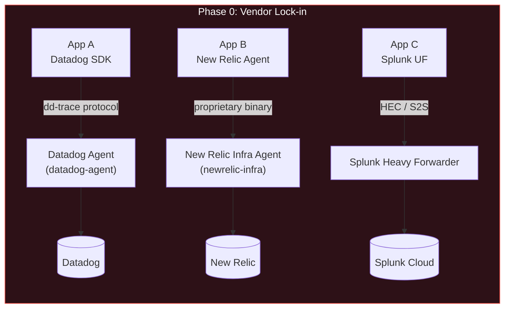
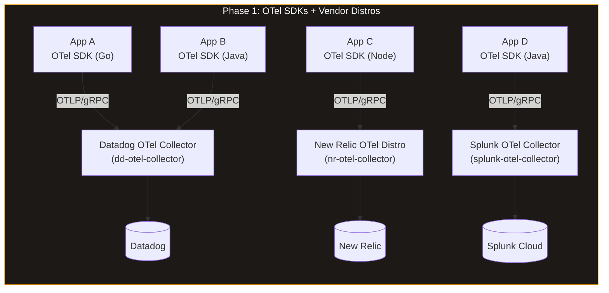
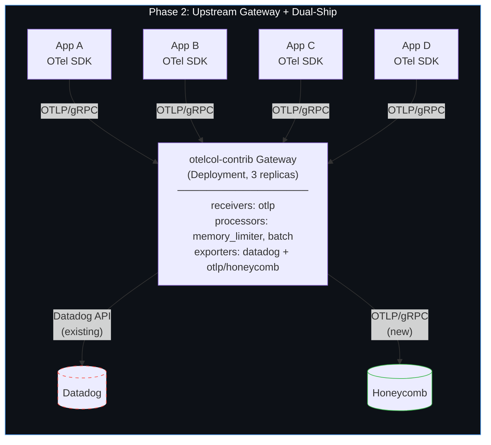
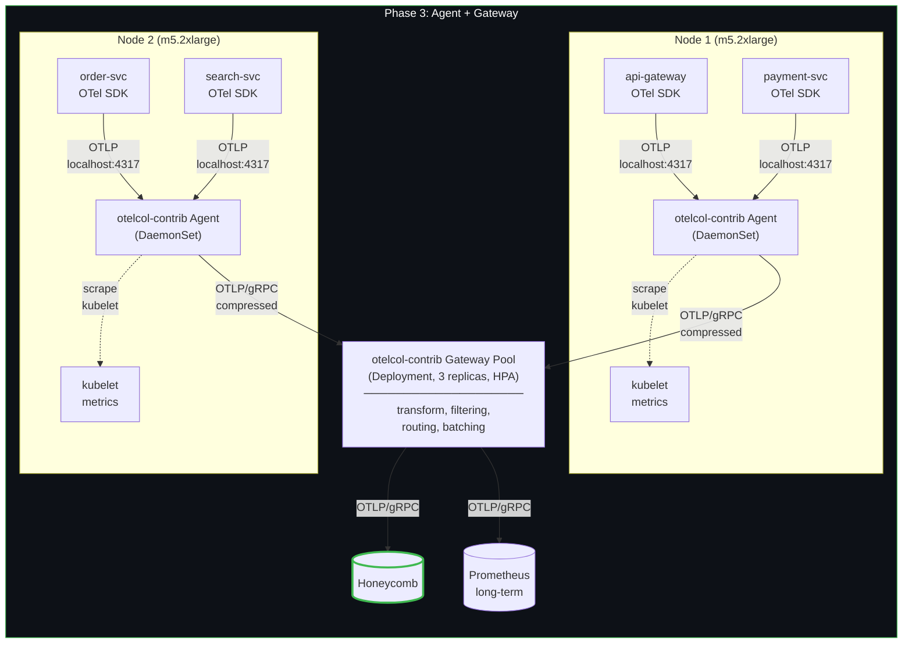
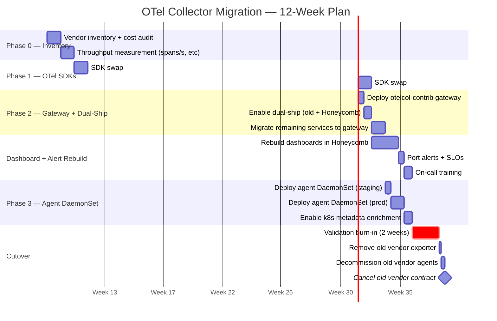
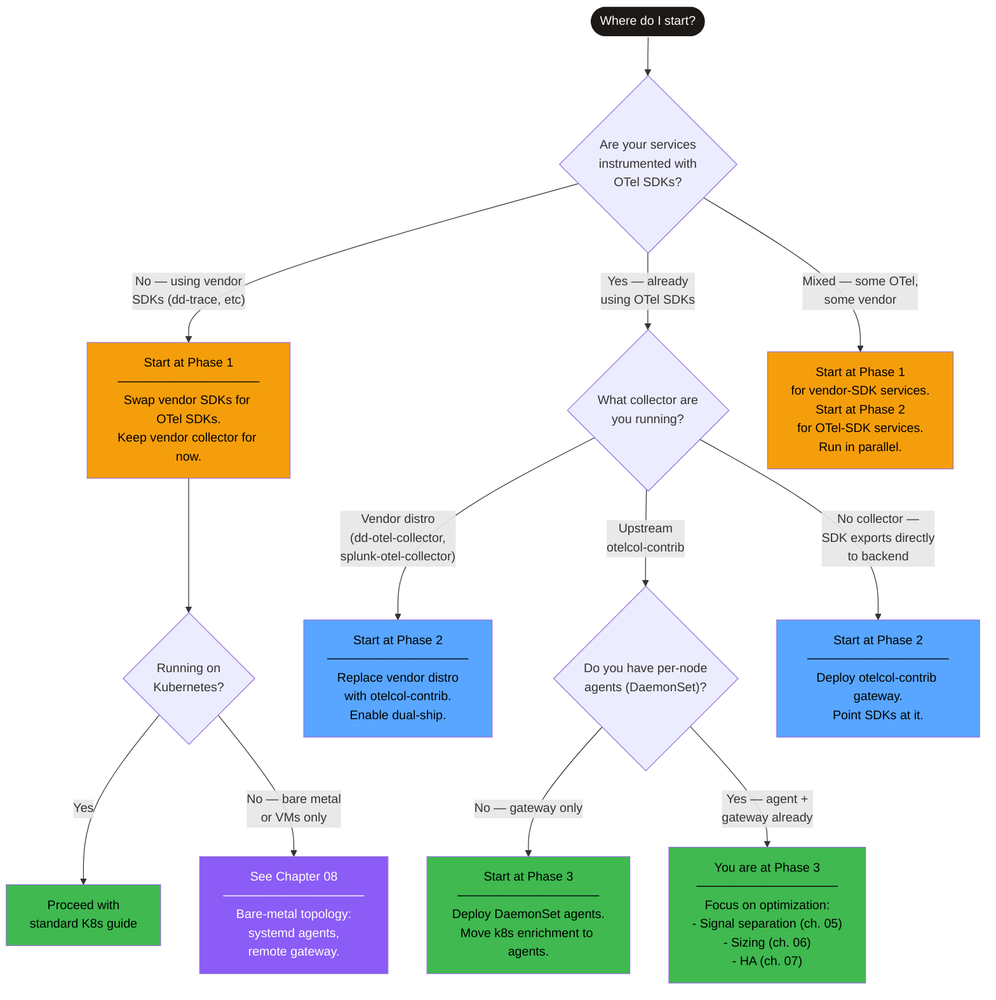

# Chapter 1: Migration Phases

> **Audience**: SREs and platform engineers migrating from Datadog, New Relic, or Splunk
> to Honeycomb using upstream OTel Collector.
>
> **Prerequisite**: You have production services shipping telemetry to at least one vendor.
>
> **Goal**: Move from vendor lock-in to a vendor-neutral OTel pipeline in 12 weeks,
> without losing observability coverage during the transition.

---

## 1. Phase 0 — Vendor Lock-in (Current State Assessment)

Before you change anything, document what you have. Every migration failure the author
has seen traces back to someone skipping inventory. You cannot plan capacity for the
new pipeline if you do not know the volume of the old one.

### Architecture



Every box in this diagram is proprietary. The SDKs speak proprietary protocols to
proprietary agents, which ship to proprietary backends. Changing any component means
changing the one next to it. That is the definition of lock-in.

### Vendor Inventory Checklist

For **every service** in production, collect:

| Field | What to record | How to get it |
|---|---|---|
| Service name | Canonical name from deploy manifest | `kubectl get deployments` or service catalog |
| Current SDK | e.g. `dd-trace-go 1.60`, `newrelic-python 8.x` | `go.mod`, `requirements.txt`, `package.json` |
| Agent/Collector | e.g. `datadog-agent 7.52`, `splunk-otel-collector 0.96` | `helm list`, DaemonSet image tag |
| Protocol to agent | e.g. `dd-trace`, `OTLP`, `HEC`, `StatsD` | Agent config, SDK config env vars |
| Backend | e.g. Datadog, New Relic, Splunk Cloud | Obvious, but document the specific org/account |
| Traces throughput | Spans/second per service | Vendor UI or agent metrics endpoint |
| Metrics throughput | Active time series | Vendor UI → custom metrics page |
| Logs throughput | Log lines/second or MB/day | Agent metrics or vendor ingest dashboard |
| Monthly cost | USD per signal type | Vendor billing page |

### Sample Inventory

This is a real-ish inventory for a mid-size platform (~80 services). Yours will look
different, but the shape is the same.

| Service | SDK | Agent | Protocol | Backend | Spans/s | Metric Series | Logs lines/s | Monthly Cost |
|---|---|---|---|---|---|---|---|---|
| api-gateway | dd-trace-go 1.60 | datadog-agent 7.52 | dd-trace | Datadog | 12,000 | 8,200 | 3,400 | $4,200 |
| payment-svc | dd-trace-java 1.31 | datadog-agent 7.52 | dd-trace | Datadog | 8,500 | 5,100 | 1,800 | $2,800 |
| user-svc | newrelic-node 11.x | nr-infra 1.48 | NR protocol | New Relic | 4,200 | 3,400 | 900 | $1,600 |
| search-svc | splunk-otel-java 1.30 | splunk-otel-coll 0.96 | OTLP | Splunk | 6,000 | 4,800 | 2,200 | $3,100 |
| order-svc | dd-trace-python 2.8 | datadog-agent 7.52 | dd-trace | Datadog | 3,800 | 2,900 | 1,100 | $1,400 |
| **Totals** | | | | | **34,500** | **24,400** | **9,400** | **$13,100** |

These numbers matter. When you size the OTel Collector gateway in Phase 2, you need to
know that you are handling ~35k spans/sec aggregate, not "some traces." Chapter 06
covers sizing math in detail; the inventory is the input.

### What to do with this inventory

1. **Sort by cost descending.** The most expensive services are your highest-ROI migration targets.
2. **Identify services already on OTel SDKs.** Splunk's distro ships OTel SDKs by default. If `search-svc` above is already using `opentelemetry-java`, you can skip Phase 1 for that service.
3. **Flag services on end-of-life SDKs.** If a vendor SDK is deprecated, the migration becomes urgent rather than strategic.
4. **Note multi-vendor services.** A service shipping traces to Datadog and logs to Splunk needs both exporters in the collector pipeline later.

---

## 2. Phase 1 — OTel SDK Adoption + Vendor Distros

### Goal

Swap vendor-proprietary SDKs for upstream OTel SDKs while keeping the existing vendor
collector infrastructure. You are changing the instrumentation layer only.

### Architecture



### Why vendor distros first

The vendor distro collectors (Datadog's `dd-otel-collector`, Splunk's
`splunk-otel-collector`, New Relic's distribution) accept OTLP input. They handle the
translation to the vendor's ingest API. This means:

- You validate OTel SDK instrumentation against a backend you already trust.
- Your existing dashboards, alerts, and SLOs keep working.
- If the OTel SDK introduces a regression, you see it in familiar tools.
- Rollback is straightforward: revert the SDK, keep the vendor agent.

This is a low-risk phase. You are decoupling the SDK layer from the vendor without
touching the collection or backend layers.

### OTel SDK Configuration

All OTel SDKs respect a common set of environment variables. Point them at the vendor
distro collector endpoint:

```yaml
# Kubernetes Deployment env vars — works for any OTel SDK language
env:
  # Core identity
  - name: OTEL_SERVICE_NAME
    value: "api-gateway"
  - name: OTEL_RESOURCE_ATTRIBUTES
    value: "deployment.environment=production,service.version=1.42.0"

  # Exporter config — send OTLP to the vendor distro collector
  - name: OTEL_EXPORTER_OTLP_ENDPOINT
    value: "http://datadog-otel-collector.monitoring:4317"
  - name: OTEL_EXPORTER_OTLP_PROTOCOL
    value: "grpc"

  # Traces: always-on sampling at SDK level, let collector decide
  - name: OTEL_TRACES_SAMPLER
    value: "always_on"

  # Metrics: 60s export interval (vendor distros typically expect 10-60s)
  - name: OTEL_METRIC_EXPORT_INTERVAL
    value: "60000"

  # Logs: route OTel log bridge output to the collector
  - name: OTEL_LOGS_EXPORTER
    value: "otlp"
```

If you are migrating from Datadog specifically, also unset any `DD_` environment
variables. Having both `DD_TRACE_AGENT_URL` and `OTEL_EXPORTER_OTLP_ENDPOINT` set will
cause the Datadog SDK to fight with the OTel SDK if both are linked:

```yaml
# Remove these when switching from dd-trace to OTel SDK
env:
  - name: DD_TRACE_AGENT_URL
    value: ""  # explicitly clear
  - name: DD_ENV
    value: ""
  - name: DD_SERVICE
    value: ""
  - name: DD_VERSION
    value: ""
```

### Vendor Distro Collector — Minimal Config (Datadog Example)

The vendor distro collector typically comes pre-configured, but here is the minimal
config to confirm OTLP ingestion is enabled:

```yaml
# dd-otel-collector config — confirms OTLP receiver is active
receivers:
  otlp:
    protocols:
      grpc:
        endpoint: "0.0.0.0:4317"
      http:
        endpoint: "0.0.0.0:4318"

exporters:
  datadog:
    api:
      key: "${DD_API_KEY}"
      site: "datadoghq.com"

service:
  pipelines:
    traces:
      receivers: [otlp]
      exporters: [datadog]
    metrics:
      receivers: [otlp]
      exporters: [datadog]
    logs:
      receivers: [otlp]
      exporters: [datadog]
```

### Risk: Vendor Distros Lag Upstream

Vendor distros are forks. They lag the upstream OTel Collector by weeks to months.
Concrete problems seen in production:

| Problem | Example | Impact |
|---|---|---|
| Missing processor | Datadog distro missing `transform` processor v0.96 features | Cannot use `truncate_all` on attribute values |
| Stale OTLP version | New Relic distro pinned to OTLP v0.19, upstream at v1.1 | Log body field changes break log parsing |
| Memory bug backport delay | Upstream fixes `batch` processor memory leak in v0.97, distro ships it in v0.101 | OOM kills under load for 4+ weeks |
| Vendor-specific defaults | Splunk distro sets `memory_limiter` to 512MB by default | Inadequate for >10k spans/sec workloads |

These problems are annoying but not blocking. Phase 1 is temporary. Budget 2-4 weeks
here, not 2-4 months.

### Rollout Strategy

Roll out OTel SDKs service-by-service, not all at once:

1. Pick your highest-volume, best-tested service first (not the lowest-risk one — you need to validate at realistic load).
2. Deploy the OTel SDK to staging. Verify traces appear in the vendor backend.
3. Deploy to one production canary. Compare span counts between the old SDK and the new SDK using the vendor's UI.
4. If span counts match within 5%, roll to full production for that service.
5. Move to the next service. Repeat.

**Do not** batch SDK migrations. Each language's OTel SDK has different maturity levels
and different gotchas. Go OTel SDK auto-instrumentation works differently from Java's
`-javaagent` approach. Treat each language as a separate migration.

---

## 3. Phase 2 — Upstream Gateway (Dual-Ship)

### Goal

Replace vendor distro collectors with a single upstream `otelcol-contrib` gateway.
During transition, dual-ship telemetry to both the old vendor and Honeycomb so you can
validate before cutting over.

### Architecture



The dashed border on Datadog indicates it is the legacy backend being phased out. Both
backends receive identical data during dual-ship.

### Why Dual-Ship

Cutting over from one backend to another without a comparison period is a gamble. You
need to prove:

1. The same traces arrive in Honeycomb as in Datadog (span counts match).
2. Derived metrics (error rates, p99 latencies) match.
3. Your new Honeycomb dashboards and SLOs actually work during an incident.

Dual-shipping gives you a 2-4 week window to validate all three before you decommission
the old vendor.

### Gateway Config — Dual Export (Datadog + Honeycomb)

```yaml
# otelcol-contrib gateway — dual-ship to Datadog and Honeycomb
receivers:
  otlp:
    protocols:
      grpc:
        endpoint: "0.0.0.0:4317"
        max_recv_msg_size_mib: 16
      http:
        endpoint: "0.0.0.0:4318"

processors:
  memory_limiter:
    check_interval: 1s
    limit_mib: 1536        # 75% of 2Gi pod memory limit
    spike_limit_mib: 384   # 25% of limit_mib for burst headroom

  batch:
    send_batch_size: 8192
    send_batch_max_size: 16384
    timeout: 2s

  resource:
    attributes:
      - key: collector.version
        value: "0.102.0"
        action: upsert

exporters:
  # Legacy vendor — keep until cutover
  datadog:
    api:
      key: "${DD_API_KEY}"
      site: "datadoghq.com"
    traces:
      span_name_as_resource_name: true
    metrics:
      histograms:
        mode: "distributions"

  # New backend — Honeycomb via native OTLP
  otlp/honeycomb:
    endpoint: "api.honeycomb.io:443"
    headers:
      "x-honeycomb-team": "${HONEYCOMB_API_KEY}"
    compression: zstd
    retry_on_failure:
      enabled: true
      initial_interval: 5s
      max_interval: 30s
      max_elapsed_time: 300s
    sending_queue:
      enabled: true
      num_consumers: 10
      queue_size: 5000

service:
  telemetry:
    metrics:
      level: detailed
      address: "0.0.0.0:8888"

  pipelines:
    traces:
      receivers: [otlp]
      processors: [memory_limiter, batch, resource]
      exporters: [datadog, otlp/honeycomb]

    metrics:
      receivers: [otlp]
      processors: [memory_limiter, batch, resource]
      exporters: [datadog, otlp/honeycomb]

    logs:
      receivers: [otlp]
      processors: [memory_limiter, batch, resource]
      exporters: [datadog, otlp/honeycomb]
```

Key points in this config:

- **Both exporters in every pipeline.** Every span, metric, and log line goes to both
  backends. This is intentional. You cannot validate what you do not compare.
- **`compression: zstd`** on the Honeycomb exporter. OTLP+zstd reduces wire size by
  ~70% vs uncompressed. Honeycomb supports it natively. Datadog exporter handles its
  own compression internally.
- **`sending_queue` with 5000 slots.** At 35k spans/sec with batch size 8192, you have
  ~4 batches/sec. A queue of 5000 gives you ~20 minutes of buffer if Honeycomb has an
  ingest hiccup. That is enough to survive most provider incidents.
- **`retry_on_failure` with 5-minute max.** After 5 minutes of continuous failure, the
  exporter drops data rather than OOM-ing the collector. This is the right tradeoff
  for dual-ship: you still have the old vendor as backup.

### Update SDK Endpoints

Point all OTel SDKs at the new gateway instead of the vendor distro:

```yaml
# Change from vendor distro to upstream gateway
env:
  - name: OTEL_EXPORTER_OTLP_ENDPOINT
    # Before: http://datadog-otel-collector.monitoring:4317
    value: "http://otelcol-gateway.monitoring:4317"
```

Roll this change service-by-service, same strategy as Phase 1.

### Validation: Do the Numbers Match?

Run these comparisons for 48 hours minimum during dual-ship:

| Metric | Datadog (old) | Honeycomb (new) | Acceptable Delta |
|---|---|---|---|
| Total span count / hour | Query Datadog APM | `COUNT` in Honeycomb | < 2% difference |
| Error rate (5xx spans / total spans) | Datadog APM → Error Tracking | `RATE_AVG(status_code >= 500)` | < 0.5% absolute |
| p99 latency per service | Datadog APM → Service page | `P99(duration_ms)` grouped by service.name | < 5% difference |
| Metric series count | Datadog Metrics Summary | Honeycomb Metrics page | Exact match |
| Log line count / hour | Datadog Log Management | Honeycomb Logs (if using) | < 2% difference |

**If span counts diverge by more than 2%**, check for:

- Collector `otelcol_exporter_send_failed_spans` metric on port 8888 — are either exporter's retries exhausted?
- Collector `otelcol_processor_batch_batch_send_size` — are batches being truncated?
- Datadog-specific: the `datadog` exporter may apply its own sampling that the `otlp/honeycomb` exporter does not. Check `traces.ignore_resources` in the Datadog exporter config.

### Risk: Double Costs

Dual-ship means double egress bandwidth and double backend ingest costs:

| Cost Component | Single-ship | Dual-ship | Delta |
|---|---|---|---|
| Egress bandwidth | 150 GB/day | 300 GB/day | +$45-135/day at $1-3/GB |
| Datadog ingest | $13,100/mo | $13,100/mo | $0 (unchanged) |
| Honeycomb ingest | $0 | ~$6,000/mo | +$6,000/mo (estimated for 35k spans/s) |
| **Total incremental cost** | | | **~$8,000-12,000/mo** |

This is real money. It is also temporary. Set a hard time-box:

> **Dual-ship window: 2-4 weeks maximum.** If you cannot validate in 4 weeks, the
> problem is not the pipeline — it is the dashboard/alert rebuild in Honeycomb.
> Extend only with explicit management approval and a calendar reminder.

---

## 4. Phase 3 — Agent + Gateway Topology

### Goal

Add per-node DaemonSet agents for local collection, Kubernetes metadata enrichment, and
host metrics. The gateway pool handles routing, transforms, and backend fanout.

This is the production-grade topology. It separates concerns:

- **Agents** handle what is node-local: host metrics, pod metadata, local buffering.
- **Gateways** handle what is cluster-global: routing, transforms, cross-service aggregation.

### Architecture



Note that by Phase 3, the old vendor backend is gone. If you still need it, you are
still in Phase 2.

### Agent DaemonSet Config

```yaml
# otelcol-contrib agent — runs on every node as DaemonSet
receivers:
  otlp:
    protocols:
      grpc:
        endpoint: "0.0.0.0:4317"
      http:
        endpoint: "0.0.0.0:4318"

  # Collect host metrics from the node
  hostmetrics:
    collection_interval: 30s
    scrapers:
      cpu:
      memory:
      disk:
      network:
      load:

  # Collect kubelet metrics for pod-level resource usage
  kubeletstats:
    collection_interval: 30s
    auth_type: "serviceAccount"
    endpoint: "https://${env:NODE_IP}:10250"
    insecure_skip_verify: true
    metric_groups:
      - pod
      - container
      - node

processors:
  memory_limiter:
    check_interval: 1s
    limit_mib: 384        # Agent is lightweight — 512Mi pod limit
    spike_limit_mib: 96

  batch:
    send_batch_size: 2048
    timeout: 1s           # Low latency — agents flush fast

  # Enrich with Kubernetes metadata
  k8sattributes:
    auth_type: "serviceAccount"
    passthrough: false
    extract:
      metadata:
        - k8s.namespace.name
        - k8s.deployment.name
        - k8s.pod.name
        - k8s.pod.uid
        - k8s.node.name
        - k8s.container.name
      labels:
        - tag_name: app.label.team
          key: team
          from: pod
        - tag_name: app.label.version
          key: app.kubernetes.io/version
          from: pod
    pod_association:
      - sources:
          - from: resource_attribute
            name: k8s.pod.ip

  resource:
    attributes:
      - key: collector.role
        value: "agent"
        action: upsert

exporters:
  otlp/gateway:
    endpoint: "otelcol-gateway.monitoring:4317"
    tls:
      insecure: true      # In-cluster traffic; use mTLS in prod if required
    compression: zstd
    retry_on_failure:
      enabled: true
      initial_interval: 1s
      max_interval: 10s
      max_elapsed_time: 60s
    sending_queue:
      enabled: true
      num_consumers: 4
      queue_size: 1000

service:
  telemetry:
    metrics:
      level: normal
      address: "0.0.0.0:8888"

  pipelines:
    traces:
      receivers: [otlp]
      processors: [memory_limiter, k8sattributes, resource, batch]
      exporters: [otlp/gateway]

    metrics:
      receivers: [otlp, hostmetrics, kubeletstats]
      processors: [memory_limiter, k8sattributes, resource, batch]
      exporters: [otlp/gateway]

    logs:
      receivers: [otlp]
      processors: [memory_limiter, k8sattributes, resource, batch]
      exporters: [otlp/gateway]
```

### Gateway Config (Phase 3)

```yaml
# otelcol-contrib gateway — centralized routing and processing
receivers:
  otlp:
    protocols:
      grpc:
        endpoint: "0.0.0.0:4317"
        max_recv_msg_size_mib: 16

processors:
  memory_limiter:
    check_interval: 1s
    limit_mib: 3072       # Gateway needs more room — 4Gi pod limit
    spike_limit_mib: 768

  batch:
    send_batch_size: 8192
    send_batch_max_size: 16384
    timeout: 2s

  # Example: drop health-check spans that add volume without value
  filter/drop-health:
    error_mode: ignore
    traces:
      span:
        - 'attributes["http.route"] == "/healthz"'
        - 'attributes["http.route"] == "/readyz"'

  # Example: transform to normalize attribute names across services
  transform/normalize:
    trace_statements:
      - context: span
        statements:
          - set(attributes["http.request.method"], attributes["http.method"])
            where attributes["http.method"] != nil
          - delete_key(attributes, "http.method")
            where attributes["http.request.method"] != nil

exporters:
  otlp/honeycomb:
    endpoint: "api.honeycomb.io:443"
    headers:
      "x-honeycomb-team": "${HONEYCOMB_API_KEY}"
    compression: zstd
    retry_on_failure:
      enabled: true
      initial_interval: 5s
      max_interval: 30s
      max_elapsed_time: 300s
    sending_queue:
      enabled: true
      num_consumers: 10
      queue_size: 5000

  # Optional: long-term metrics to Prometheus/Mimir
  prometheusremotewrite/longterm:
    endpoint: "http://mimir.monitoring:9009/api/v1/push"
    resource_to_telemetry_conversion:
      enabled: true

service:
  telemetry:
    metrics:
      level: detailed
      address: "0.0.0.0:8888"
    logs:
      level: info

  pipelines:
    traces:
      receivers: [otlp]
      processors: [memory_limiter, filter/drop-health, transform/normalize, batch]
      exporters: [otlp/honeycomb]

    metrics:
      receivers: [otlp]
      processors: [memory_limiter, batch]
      exporters: [otlp/honeycomb, prometheusremotewrite/longterm]

    logs:
      receivers: [otlp]
      processors: [memory_limiter, batch]
      exporters: [otlp/honeycomb]
```

### Agent vs Gateway — Division of Responsibility

| Concern | Agent (DaemonSet) | Gateway (Deployment) |
|---|---|---|
| OTLP ingestion from SDKs | Yes — localhost, no network hop | No — receives from agents |
| Host/node metrics | Yes — hostmetrics, kubeletstats | No |
| Kubernetes metadata enrichment | Yes — k8sattributes | No (already enriched) |
| Local buffering/retry | Yes — small queue (1000) | Yes — large queue (5000) |
| Filtering (drop noisy spans) | No — let gateway decide globally | Yes — filter processor |
| Centralized processing | No — limited to local data | Yes — cluster-wide transforms and routing |
| Backend routing/fanout | No — single export to gateway | Yes — multi-exporter |
| Heavy transforms | No — keep agent CPU light | Yes — transform processor |

---

## 5. Dual-Ship Deep Dive

### Pipeline Configuration for Dual-Ship

The dual-ship pattern uses multiple exporters in the same pipeline. OTel Collector
sends data to all exporters in a pipeline concurrently. If one exporter fails, the
other still receives data. This is the correct behavior — you do not want a Datadog
outage to block Honeycomb delivery.

```yaml
# Traces pipeline with dual-ship — both exporters get identical spans
service:
  pipelines:
    traces:
      receivers: [otlp]
      processors: [memory_limiter, batch]
      exporters: [datadog, otlp/honeycomb]
      #           ^^^^^^^  ^^^^^^^^^^^^^^^
      #           old       new
      #           remove this when cutting over
```

If you need different processing for different backends (e.g., Datadog requires
`span_name_as_resource_name` but Honeycomb does not), use the `connector` pattern
to fork the pipeline:

```yaml
# Advanced: separate processing per backend using connectors
receivers:
  otlp:
    protocols:
      grpc:
        endpoint: "0.0.0.0:4317"

connectors:
  forward/split:
    # forward connector copies data to multiple pipelines

processors:
  memory_limiter:
    check_interval: 1s
    limit_mib: 1536
    spike_limit_mib: 384

  batch/datadog:
    send_batch_size: 4096
    timeout: 5s

  batch/honeycomb:
    send_batch_size: 8192
    timeout: 2s

  # Datadog-specific: add resource name from span name
  transform/datadog-compat:
    trace_statements:
      - context: span
        statements:
          - set(attributes["resource.name"], name) where attributes["resource.name"] == nil

exporters:
  datadog:
    api:
      key: "${DD_API_KEY}"
      site: "datadoghq.com"

  otlp/honeycomb:
    endpoint: "api.honeycomb.io:443"
    headers:
      "x-honeycomb-team": "${HONEYCOMB_API_KEY}"
    compression: zstd

service:
  pipelines:
    # Ingestion pipeline — receives from SDKs, fans out via connector
    traces/ingest:
      receivers: [otlp]
      processors: [memory_limiter]
      exporters: [forward/split]

    # Datadog pipeline — vendor-specific processing
    traces/datadog:
      receivers: [forward/split]
      processors: [transform/datadog-compat, batch/datadog]
      exporters: [datadog]

    # Honeycomb pipeline — clean OTLP, no vendor quirks
    traces/honeycomb:
      receivers: [forward/split]
      processors: [batch/honeycomb]
      exporters: [otlp/honeycomb]
```

### Validation Queries

Run these on both backends during dual-ship. The exact query syntax differs per tool,
but here is what to compare:

**Span count per service (hourly)**
```
-- Honeycomb query
VISUALIZE: COUNT
WHERE: true
GROUP BY: service.name
TIME RANGE: last 1 hour
GRANULARITY: 1 hour
```

```
-- Datadog equivalent
Metric: trace.*.hits
Group by: service
Time range: past 1 hour
```

**Error rate per service**
```
-- Honeycomb query
VISUALIZE: RATE_AVG(status_code = "ERROR")
GROUP BY: service.name
TIME RANGE: last 1 hour
```

**p99 latency per service**
```
-- Honeycomb query
VISUALIZE: P99(duration_ms)
GROUP BY: service.name
TIME RANGE: last 1 hour
```

Track these in a shared spreadsheet or dashboard. Check daily. Do not automate the
comparison — the point is that a human reviews the data to build trust in the new
backend.

### Cutover Checklist

Do not cut over until every item is checked:

- [ ] **Span counts match** between old and new backend (< 2% delta for 7 consecutive days)
- [ ] **Error rates match** (< 0.5% absolute delta for 7 consecutive days)
- [ ] **p99 latencies match** (< 5% relative delta for 7 consecutive days)
- [ ] **Dashboards rebuilt** in Honeycomb covering all critical services
- [ ] **SLOs defined** in Honeycomb matching existing SLOs in old vendor
- [ ] **Alerts ported** to Honeycomb (on-call team has validated alert routing)
- [ ] **On-call team trained** on Honeycomb query interface (at least one incident triaged using Honeycomb)
- [ ] **Runbooks updated** with Honeycomb query links instead of old vendor links
- [ ] **2-week burn-in** completed after last checklist item above
- [ ] **Rollback plan documented**: re-add old exporter to pipeline, SDK endpoints unchanged

### Cutover Procedure

The cutover itself is a config change:

```yaml
# BEFORE cutover — dual-ship
service:
  pipelines:
    traces:
      receivers: [otlp]
      processors: [memory_limiter, batch]
      exporters: [datadog, otlp/honeycomb]

# AFTER cutover — single-ship to Honeycomb
service:
  pipelines:
    traces:
      receivers: [otlp]
      processors: [memory_limiter, batch]
      exporters: [otlp/honeycomb]
      # datadog exporter removed
```

Steps:

1. Remove the old vendor exporter from all pipelines in the gateway config.
2. Remove the old vendor exporter definition from the `exporters:` block.
3. Remove any vendor-specific processors (e.g., `transform/datadog-compat`).
4. Remove vendor API key secrets from the collector's environment.
5. Apply the config change: `kubectl rollout restart deployment/otelcol-gateway -n monitoring`
6. Verify `otelcol_exporter_send_failed_spans` is 0 on the remaining exporter.
7. Wait 24 hours. Confirm Honeycomb dashboards still look correct.
8. Decommission the old vendor agent DaemonSets/Deployments.
9. Cancel the old vendor contract (talk to your account rep about notice periods).

**Do not delete the old vendor exporter config.** Comment it out and keep it in version
control. If you need to roll back, uncommenting is faster than rewriting.

---

## 6. 12-Week Migration Timeline

This timeline is scoped for an organization with 50-200 services. Scale linearly:
fewer services compress the timeline, more services stretch it.



### Week-by-Week Breakdown

| Week | Phase | Key Activities | Exit Criteria |
|---|---|---|---|
| 1 | P0 | Inventory all services, SDKs, agents, throughput | Spreadsheet complete with all fields |
| 2 | P0 | Measure actual throughput per service, calculate total load | Aggregate spans/s, metric series, logs/s known |
| 3 | P1 | Swap OTel SDKs for top 10 services in staging | OTel traces appear in vendor backend from staging |
| 4 | P1 | Promote SDK swap to prod for top 10 services | Span counts match old SDK within 5% |
| 5 | P2 | Deploy `otelcol-contrib` gateway, enable dual-ship | Both backends receiving data |
| 6 | P2 | Migrate remaining services from vendor distro to gateway | All services routing through upstream gateway |
| 7 | Dashboard | Rebuild critical dashboards in Honeycomb | Top 10 service dashboards functional |
| 8 | Dashboard | Port alerts, define SLOs, train on-call team | At least one on-call rotation using Honeycomb |
| 9 | P3 | Deploy agent DaemonSet to staging, validate k8s metadata | k8s.pod.name, k8s.namespace.name present on all spans |
| 10 | P3 | Roll agent DaemonSet to prod, enable host metrics | hostmetrics visible in Honeycomb |
| 11 | Cutover | Burn-in: monitor both backends, triage one incident with Honeycomb | Zero discrepancies for 7+ days |
| 12 | Cutover | Remove old exporter, decommission agents, cancel contract | Single-backend on Honeycomb, old vendor decommissioned |

### Scaling the Timeline

| Org Size (services) | Estimated Duration | Notes |
|---|---|---|
| 1-20 | 4-6 weeks | Skip Phase 1 if services already on OTel SDKs |
| 20-50 | 6-8 weeks | Batch SDK swaps by language |
| 50-200 | 10-14 weeks | This timeline; parallelize dashboard rebuild |
| 200-500 | 16-24 weeks | Dedicated migration team, staggered dual-ship |
| 500+ | 24-40 weeks | Multi-cluster phased rollout, see chapter 10 |

---

## 7. Decision Tree — Where Do I Start?

Not every organization starts at Phase 0. Use this decision tree to skip phases you
have already completed.



### Quick Reference

| Your current state | Start at | Skip |
|---|---|---|
| Vendor SDKs + vendor agents | Phase 1 | Nothing |
| OTel SDKs + vendor distro collectors | Phase 2 | Phase 1 |
| OTel SDKs + upstream collector (gateway only) | Phase 3 | Phases 1-2 |
| OTel SDKs + upstream agent + gateway | Optimization | Phases 1-3 |
| Mixed SDKs across services | Phase 1 + Phase 2 in parallel | Nothing |
| Bare metal (no Kubernetes) | Phase 1 + Chapter 08 | Standard K8s guides |

---

## 8. What Can Go Wrong

Every phase has failure modes. This table lists the ones the author has seen in
production migrations, not theoretical risks.

### Phase 1 Failures

| Failure Mode | Symptoms | Root Cause | Remediation |
|---|---|---|---|
| Vendor distro OOM | Collector pods restarting every 10-30 min, `OOMKilled` in pod status | Vendor distro's default `memory_limiter` is too low for your throughput | Increase `memory_limiter.limit_mib` or skip to Phase 2 with upstream `otelcol-contrib` which gives you full control |
| Missing traces after SDK swap | Span counts drop 30-50% compared to old vendor SDK | OTel SDK default sampler is `parentbased_always_on`, but parent context propagation is broken (missing W3C headers between services) | Ensure all services in a call chain are migrated together, or configure the old vendor SDK to propagate W3C `traceparent` headers alongside its proprietary headers |
| Metric cardinality explosion | Vendor cost spikes, metric series count 5-10x higher | OTel SDK emits histograms with default bucket boundaries that map to many Datadog distributions | Set `OTEL_EXPORTER_OTLP_METRICS_TEMPORALITY_PREFERENCE=delta` for Datadog; tune histogram bucket boundaries |
| Log duplication | Log lines appearing 2x in vendor backend | Both the OTel SDK log bridge and the old vendor log agent are running simultaneously | Disable the old vendor log agent when enabling OTel SDK log exporter; do not run both |

### Phase 2 Failures

| Failure Mode | Symptoms | Root Cause | Remediation |
|---|---|---|---|
| Dual-ship doubles costs indefinitely | Finance flags a 2x observability bill that never decreases | No time-box was set, team got distracted rebuilding dashboards | Set a 4-week hard deadline at the start. Put a calendar event. Assign an owner for cutover. |
| Gateway becomes SPOF | All telemetry drops when gateway pod restarts | Running a single gateway replica with no PDB | Run 3+ replicas behind a `ClusterIP` service, set `PodDisruptionBudget` with `minAvailable: 2` |
| Exporter backpressure drops data | `otelcol_exporter_send_failed_spans` increasing, `otelcol_exporter_queue_size` at capacity | Honeycomb ingest rate limit hit, or network latency to Honeycomb higher than to local vendor agent | Increase `sending_queue.queue_size`, increase `sending_queue.num_consumers`, check if `compression: zstd` is enabled, contact Honeycomb to increase ingest rate limit |
| Config drift between old and new | Dashboards show different numbers, team loses trust | Datadog exporter applies implicit sampling or aggregation that `otlp/honeycomb` does not | Audit both exporter configs. Disable Datadog's `traces.compute_stats_by_span_kind` and other implicit behaviors. Match processing exactly. |
| Collector crashloop on bad config | Collector pods in `CrashLoopBackOff`, no telemetry flowing | YAML syntax error or unknown processor name after config change | Always `otelcol-contrib validate --config=config.yaml` in CI before deploying. Use a ConfigMap with a rollout canary. |

### Phase 3 Failures

| Failure Mode | Symptoms | Root Cause | Remediation |
|---|---|---|---|
| DaemonSet agent starved for CPU/memory | Agent pods throttled, `otelcol_processor_refused_spans` increasing, latency spikes on the node | DaemonSet resource requests too low for the number of pods on the node | See Chapter 06 for sizing math. Rule of thumb: 0.25 CPU and 512Mi memory per 5k spans/sec per node. Measure, do not guess. |
| k8sattributes processor cache OOM | Agent OOM with large k8s clusters (1000+ pods) | Default `k8sattributes` pod cache is unbounded in older collector versions | Set `k8sattributes.filter.node: ${env:KUBE_NODE_NAME}` to cache only pods on the local node. Reduces memory from O(cluster) to O(node). |
| Gateway HPA thrashing | Gateway replicas scaling up/down every 2 minutes, connection resets | HPA target metric (CPU) is too sensitive, batch processor causes bursty CPU | Use custom metrics for HPA: `otelcol_receiver_accepted_spans` rate instead of CPU. Set `scaleDown.stabilizationWindowSeconds: 300`. |
| Network policy blocks agent-to-gateway | `connection refused` in agent logs, no data reaching gateway | Kubernetes NetworkPolicy does not allow DaemonSet pods to reach gateway service on port 4317 | Add NetworkPolicy allowing egress from agent namespace to gateway namespace on TCP 4317 |

### Cross-Phase Failures

| Failure Mode | Symptoms | Root Cause | Remediation |
|---|---|---|---|
| Secret rotation breaks exporter | `401 Unauthorized` from backend, all data dropped | API key rotated in vault but collector not restarted | Use a sidecar or init container that watches the secret and triggers a config reload. Or use the `confighttp` extension with file-based auth that supports hot-reload. |
| Clock skew corrupts trace timing | Traces show spans with negative duration or parent spans ending before children | Node clocks not synchronized (NTP drift > 100ms) | Ensure `chrony` or `systemd-timesyncd` is running on all nodes. OTel Collector cannot fix clock skew — it is a host-level problem. |
| Collector version mismatch | Agent running v0.96, gateway running v0.102 — OTLP negotiation fails intermittently | Independent upgrade cycles for agent and gateway | Pin both to the same version. Upgrade together. Test the version pair in staging before prod. |

---

## Summary

| Phase | What Changes | What Stays | Duration | Risk Level |
|---|---|---|---|---|
| 0 | Nothing (assessment only) | Everything | 1-2 weeks | None |
| 1 | SDK layer (vendor → OTel) | Collector + backend | 2-4 weeks | Low |
| 2 | Collector layer (vendor distro → upstream) | Backend (dual-ship) | 2-4 weeks | Medium |
| 3 | Topology (add agents, gateway pool) | Backend (Honeycomb) | 2-4 weeks | Medium |
| Cutover | Remove old vendor | Honeycomb only | 1-2 weeks | Low (if validated) |

Each phase is independently deployable and independently reversible. If Phase 2 goes
sideways, roll back to Phase 1. If Phase 3 agents cause problems, remove the DaemonSet
and fall back to gateway-only. The phases are designed so that failure at any point
leaves you in a working state — just the previous phase's working state.

Next: [Chapter 02 — Collector Architecture Deep Dive](./02-collector-architecture.md)
