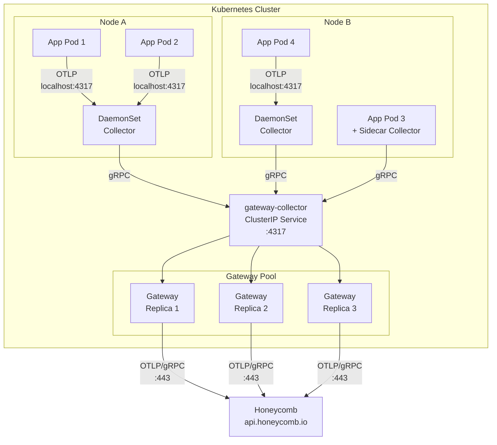
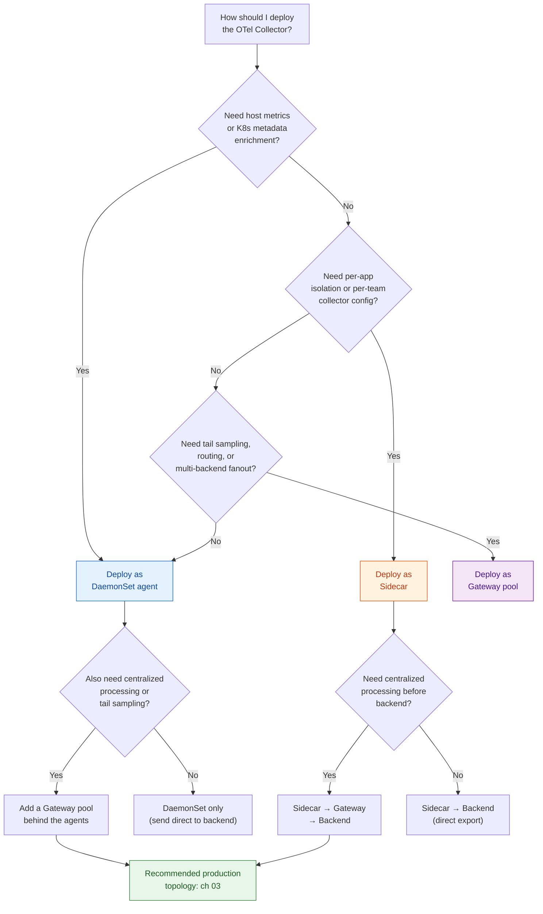
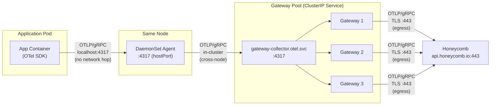
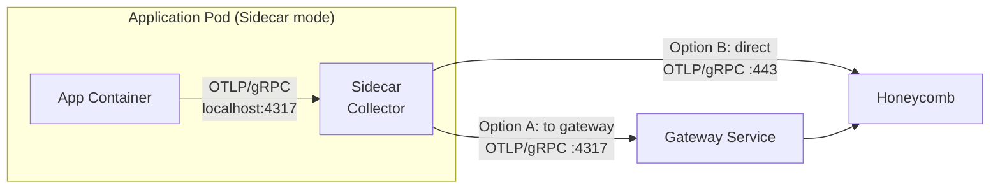

# Chapter 02 — Deployment Modes

Three ways to run the OTel Collector in Kubernetes. Each one trades off isolation, operational complexity, and resource cost differently. Most production clusters end up using two of the three simultaneously.

This chapter gives you the configs, the resource math, and the failure modes for each mode so you can make the decision with real numbers instead of vibes.

---

## Overview



Three modes, one sentence each:

| Mode | What it is | When you reach for it |
|------|-----------|----------------------|
| **DaemonSet** | One collector per node | Default choice. Host metrics, k8s metadata, local buffering. |
| **Sidecar** | One collector per pod | Per-app isolation in multi-tenant clusters. |
| **Gateway** | Standalone pool behind a Service | Centralized processing: tail sampling, routing, fanout. |

---

## DaemonSet (Agent)

One collector pod per node, scheduled via a Kubernetes DaemonSet. Every application pod on the node sends telemetry to the collector over localhost (via the downward API or a hostPort). This is the workhorse mode for the majority of production deployments.

### When to use

- You need host-level metrics (CPU, memory, disk, network per node).
- You need automatic Kubernetes metadata enrichment (`k8sattributes` processor).
- You want a single collector config that covers all workloads on the node.
- You want local buffering so telemetry survives brief gateway outages.
- This is your first collector deployment and you want the simplest operational model.

### Resource requirements by throughput tier

Size your DaemonSet pods based on the peak spans/sec across **all pods on a single node**, not cluster-wide throughput.

| Tier | Spans/sec/node | CPU request | Memory request | Memory limit | Notes |
|------|---------------|-------------|----------------|--------------|-------|
| Small | < 5K | 100m | 256Mi | 512Mi | Most clusters start here |
| Medium | 5K - 20K | 250m | 512Mi | 1Gi | Moderate microservice density |
| Large | 20K - 50K | 500m | 1Gi | 2Gi | High-throughput nodes |
| Very large | > 50K | 1000m | 2Gi | 4Gi | Consider sidecar for the hot pods, or split signals (ch 05) |

These numbers assume traces only. If you are collecting metrics and logs through the same DaemonSet, add 30-50% to memory and set a higher `memory_limiter` threshold. Chapter 06 has the formulas.

### Kubernetes manifest

```yaml
apiVersion: apps/v1
kind: DaemonSet
metadata:
  name: otel-agent
  namespace: otel
  labels:
    app.kubernetes.io/name: otel-agent
    app.kubernetes.io/component: agent
spec:
  selector:
    matchLabels:
      app.kubernetes.io/name: otel-agent
  template:
    metadata:
      labels:
        app.kubernetes.io/name: otel-agent
      annotations:
        prometheus.io/scrape: "true"
        prometheus.io/port: "8888"
    spec:
      serviceAccountName: otel-agent
      # Schedule on every node, including tainted ones
      tolerations:
        - operator: Exists
      containers:
        - name: otel-agent
          image: otel/opentelemetry-collector-contrib:0.120.0
          args:
            - --config=/etc/otelcol/config.yaml
          ports:
            - name: otlp-grpc
              containerPort: 4317
              hostPort: 4317
              protocol: TCP
            - name: otlp-http
              containerPort: 4318
              hostPort: 4318
              protocol: TCP
            - name: metrics
              containerPort: 8888
              protocol: TCP
          env:
            - name: K8S_NODE_NAME
              valueFrom:
                fieldRef:
                  fieldPath: spec.nodeName
            - name: K8S_POD_NAME
              valueFrom:
                fieldRef:
                  fieldPath: metadata.name
            - name: K8S_POD_NAMESPACE
              valueFrom:
                fieldRef:
                  fieldPath: metadata.namespace
            - name: GOMEMLIMIT
              # Set to ~80% of memory limit to let Go GC
              # work before the OOM killer fires
              value: "410MiB"
          resources:
            requests:
              cpu: 250m
              memory: 512Mi
            limits:
              # No CPU limit — throttling a collector causes
              # cascading backpressure. Use requests for scheduling.
              memory: 1Gi
          volumeMounts:
            - name: config
              mountPath: /etc/otelcol
              readOnly: true
            - name: hostfs
              mountPath: /hostfs
              readOnly: true
              mountPropagation: HostToContainer
            - name: varlogpods
              mountPath: /var/log/pods
              readOnly: true
          livenessProbe:
            httpGet:
              path: /
              port: 13133
            initialDelaySeconds: 15
            periodSeconds: 10
          readinessProbe:
            httpGet:
              path: /
              port: 13133
            initialDelaySeconds: 5
            periodSeconds: 5
      volumes:
        - name: config
          configMap:
            name: otel-agent-config
        - name: hostfs
          hostPath:
            path: /
        - name: varlogpods
          hostPath:
            path: /var/log/pods
```

Key decisions in this manifest:

- **`hostPort: 4317`** — apps send to `localhost:4317` via the Node's network namespace. Alternative: use a DaemonSet Service with `internalTrafficPolicy: Local` (Kubernetes 1.26+), which avoids hostPort but requires DNS resolution.
- **No CPU limit** — CPU throttling on a collector causes it to fall behind on ingestion, which triggers backpressure all the way back to the SDKs. Set a request for scheduling; skip the limit.
- **`GOMEMLIMIT`** — set to roughly 80% of the memory limit. This lets the Go garbage collector reclaim memory before the kernel OOM-kills the pod. Without this, you will see OOM kills under bursty load.
- **Tolerations with `Exists`** — the agent should run on every node, including those with taints for GPU workloads, system pools, or spot instances. Adjust if you have nodes that genuinely should not emit telemetry.

### Collector config

```yaml
# otel-agent-config — ConfigMap data
receivers:
  otlp:
    protocols:
      grpc:
        endpoint: 0.0.0.0:4317
      http:
        endpoint: 0.0.0.0:4318

  # Host metrics from the node (requires /hostfs mount)
  hostmetrics:
    collection_interval: 30s
    root_path: /hostfs
    scrapers:
      cpu: {}
      memory: {}
      disk: {}
      filesystem: {}
      network: {}
      load: {}

processors:
  # Memory limiter MUST be first in the pipeline.
  # It is the only thing that prevents OOM kills.
  memory_limiter:
    check_interval: 1s
    limit_mib: 800       # ~80% of container memory limit (1Gi)
    spike_limit_mib: 200  # Headroom for sudden bursts

  k8sattributes:
    auth_type: serviceAccount
    passthrough: false
    extract:
      metadata:
        - k8s.namespace.name
        - k8s.deployment.name
        - k8s.statefulset.name
        - k8s.daemonset.name
        - k8s.cronjob.name
        - k8s.job.name
        - k8s.pod.name
        - k8s.pod.uid
        - k8s.node.name
        - k8s.container.name
      labels:
        - tag_name: app
          key: app.kubernetes.io/name
          from: pod
        - tag_name: version
          key: app.kubernetes.io/version
          from: pod
    pod_association:
      - sources:
          - from: resource_attribute
            name: k8s.pod.ip
      - sources:
          - from: connection

  batch:
    send_batch_size: 1024
    send_batch_max_size: 2048
    timeout: 2s

  # Add resource attributes for the collector itself
  resource:
    attributes:
      - key: collector.mode
        value: agent
        action: upsert
      - key: k8s.node.name
        value: ${env:K8S_NODE_NAME}
        action: upsert

exporters:
  otlp:
    endpoint: gateway-collector.otel.svc.cluster.local:4317
    tls:
      insecure: true    # In-cluster. Use mTLS if your mesh requires it.
    retry_on_failure:
      enabled: true
      initial_interval: 5s
      max_interval: 30s
      max_elapsed_time: 120s
    sending_queue:
      enabled: true
      num_consumers: 10
      queue_size: 5000   # Buffer ~5K batches during gateway blips

extensions:
  health_check:
    endpoint: 0.0.0.0:13133

service:
  extensions: [health_check]
  pipelines:
    traces:
      receivers: [otlp]
      processors: [memory_limiter, k8sattributes, resource, batch]
      exporters: [otlp]
    metrics:
      receivers: [otlp, hostmetrics]
      processors: [memory_limiter, k8sattributes, resource, batch]
      exporters: [otlp]
    logs:
      receivers: [otlp]
      processors: [memory_limiter, k8sattributes, resource, batch]
      exporters: [otlp]
  telemetry:
    metrics:
      address: 0.0.0.0:8888
      level: detailed
```

### Tradeoffs

| | |
|---|---|
| **Pros** | Simple ops (one DaemonSet, one ConfigMap). One config covers all workloads on the node. Direct access to host metrics and container logs. Low total pod count (one per node, not one per app). Node-local communication means no cross-node network cost for ingestion. |
| **Cons** | Noisy neighbor: one pod emitting 100K spans/sec can exhaust the collector's memory and starve every other pod on the node. Single point of failure per node: if the DaemonSet pod dies, all telemetry from that node is black-holed until restart. Config changes affect every workload simultaneously — no per-app overrides without label-based routing. |

### What breaks

**Failure: DaemonSet pod OOM-killed.**

Symptom: sudden gap in telemetry for *all* services on one node. In Honeycomb, you see a clean drop to zero for `k8s.node.name = node-xyz`, not a gradual decline. Services on other nodes are unaffected.

Root cause chain:
1. A pod on the node starts emitting a burst of telemetry (deploy, retry storm, debug logging left on).
2. The `memory_limiter` processor hits its limit and starts refusing data.
3. If the burst exceeds the `spike_limit_mib` headroom, the collector's internal queues grow past the container memory limit.
4. The kernel OOM-kills the collector pod.
5. Kubernetes restarts it (typically 10-30 seconds). During that window, SDKs either buffer locally (if configured) or drop.

Fix:
- Increase `memory_limiter.spike_limit_mib` to handle larger bursts.
- Reduce `batch.send_batch_max_size` so the collector flushes more frequently.
- Increase the container memory limit and `GOMEMLIMIT` proportionally.
- Identify the noisy pod and either move it to a sidecar or add SDK-side sampling.
- As a last resort, set `memory_limiter.limit_mib` to a lower percentage so the collector starts dropping earlier, before the OOM threshold.

**Failure: DaemonSet pod not scheduled on a node.**

Symptom: zero telemetry from all pods on one specific node, but the node is healthy and pods are running. Often caused by a missing toleration (e.g., a new taint was added to a node group and the DaemonSet does not tolerate it), or by the DaemonSet being evicted by the kubelet under node pressure (if you set resource requests too high relative to node capacity).

Fix: check `kubectl get pods -n otel -o wide` to verify the agent is running on every node. Check `kubectl describe node <name>` for taints. Check events for eviction.

---

## Sidecar

One collector container per application pod, running alongside the app container in the same pod spec. The app sends telemetry to `localhost:4317` — no network hop, no hostPort, no cross-pod communication.

### When to use

- Multi-tenant clusters where each team owns and configures their own collector.
- Applications with extreme per-pod throughput that would overwhelm a shared DaemonSet.
- Strict isolation requirements: one app's telemetry blast radius must not affect any other app.
- Regulatory or compliance contexts where telemetry from different services must not traverse the same collector process.

### Resource requirements

Sidecars are small because they handle traffic from exactly one application.

| App throughput | CPU request | Memory request | Memory limit |
|---------------|-------------|----------------|--------------|
| Low (< 1K spans/sec) | 50m | 64Mi | 128Mi |
| Medium (1K - 10K spans/sec) | 100m | 128Mi | 256Mi |
| High (10K - 50K spans/sec) | 250m | 256Mi | 512Mi |
| Very high (> 50K spans/sec) | 500m | 512Mi | 1Gi |

Multiply these numbers by your pod count to get the cluster-wide overhead. A cluster with 500 application pods each running a sidecar at the "Medium" tier adds 50 CPU cores and 64Gi of memory in *requests* alone. That is not free.

### Pod spec (manual sidecar)

```yaml
apiVersion: v1
kind: Pod
metadata:
  name: my-app
  namespace: my-team
  labels:
    app.kubernetes.io/name: my-app
    app.kubernetes.io/version: "1.4.2"
spec:
  containers:
    # --- Application container ---
    - name: my-app
      image: my-registry/my-app:1.4.2
      ports:
        - containerPort: 8080
      env:
        # Point the OTel SDK at the sidecar on localhost
        - name: OTEL_EXPORTER_OTLP_ENDPOINT
          value: http://localhost:4317
        - name: OTEL_SERVICE_NAME
          value: my-app
        - name: OTEL_RESOURCE_ATTRIBUTES
          value: >-
            deployment.environment=production,
            service.version=1.4.2,
            team=checkout

    # --- OTel Collector sidecar ---
    - name: otel-sidecar
      image: otel/opentelemetry-collector-contrib:0.120.0
      args:
        - --config=/etc/otelcol/config.yaml
      ports:
        - name: otlp-grpc
          containerPort: 4317
          protocol: TCP
      env:
        - name: GOMEMLIMIT
          value: "200MiB"
      resources:
        requests:
          cpu: 100m
          memory: 128Mi
        limits:
          memory: 256Mi
      volumeMounts:
        - name: otel-sidecar-config
          mountPath: /etc/otelcol
          readOnly: true
      livenessProbe:
        httpGet:
          path: /
          port: 13133
        initialDelaySeconds: 10
        periodSeconds: 10
  volumes:
    - name: otel-sidecar-config
      configMap:
        name: my-app-otel-sidecar
```

### Collector config (sidecar)

```yaml
# Sidecar config — simpler than the agent.
# No k8sattributes needed: the app SDK sets its own
# resource attributes, and the sidecar handles one app only.
receivers:
  otlp:
    protocols:
      grpc:
        endpoint: 0.0.0.0:4317

processors:
  memory_limiter:
    check_interval: 1s
    limit_mib: 200
    spike_limit_mib: 50

  batch:
    send_batch_size: 512
    send_batch_max_size: 1024
    timeout: 2s

exporters:
  # Option A: send to the gateway pool for centralized processing
  otlp/gateway:
    endpoint: gateway-collector.otel.svc.cluster.local:4317
    tls:
      insecure: true
    sending_queue:
      enabled: true
      queue_size: 1000

  # Option B: send directly to Honeycomb (skip gateway)
  # Use this if the sidecar does not need tail sampling or routing.
  # otlp/honeycomb:
  #   endpoint: api.honeycomb.io:443
  #   headers:
  #     x-honeycomb-team: ${env:HONEYCOMB_API_KEY}

extensions:
  health_check:
    endpoint: 0.0.0.0:13133

service:
  extensions: [health_check]
  pipelines:
    traces:
      receivers: [otlp]
      processors: [memory_limiter, batch]
      exporters: [otlp/gateway]
    metrics:
      receivers: [otlp]
      processors: [memory_limiter, batch]
      exporters: [otlp/gateway]
  telemetry:
    metrics:
      level: basic
```

### OpenTelemetry Operator sidecar injection

If you are running the [OpenTelemetry Operator](https://github.com/open-telemetry/opentelemetry-operator), you can skip the manual sidecar definition. The Operator injects the sidecar container automatically when it sees the annotation.

First, create an `OpenTelemetryCollector` resource in sidecar mode:

```yaml
apiVersion: opentelemetry.io/v1beta1
kind: OpenTelemetryCollector
metadata:
  name: sidecar
  namespace: my-team
spec:
  mode: sidecar
  resources:
    limits:
      memory: 256Mi
    requests:
      cpu: 100m
      memory: 128Mi
  config:
    receivers:
      otlp:
        protocols:
          grpc:
            endpoint: 0.0.0.0:4317
    processors:
      memory_limiter:
        check_interval: 1s
        limit_mib: 200
        spike_limit_mib: 50
      batch:
        send_batch_size: 512
        timeout: 2s
    exporters:
      otlp:
        endpoint: gateway-collector.otel.svc.cluster.local:4317
        tls:
          insecure: true
    service:
      pipelines:
        traces:
          receivers: [otlp]
          processors: [memory_limiter, batch]
          exporters: [otlp]
```

Then annotate any pod (or Deployment template) that should get a sidecar:

```yaml
metadata:
  annotations:
    sidecar.opentelemetry.io/inject: "true"
```

The Operator's webhook mutates the pod spec at admission time, injecting the sidecar container with the config from the `OpenTelemetryCollector` resource. The app container gets `OTEL_EXPORTER_OTLP_ENDPOINT=http://localhost:4317` injected automatically.

**Gotcha**: the annotation triggers injection at pod *creation* time. Changing the `OpenTelemetryCollector` config does not update already-running sidecars. You must restart the pods (rolling restart of the Deployment) to pick up config changes.

### Tradeoffs

| | |
|---|---|
| **Pros** | Blast radius limited to one application. Per-app collector config — each team controls their own processing pipeline. Per-app resource accounting — the sidecar's CPU and memory are billed to the app's namespace and resource quota. No host metrics concern or RBAC for node-level access. Localhost communication is as fast as it gets. |
| **Cons** | Massive pod count overhead. 500 services means 500 sidecar containers, each consuming CPU and memory. Config drift: if each team manages their own sidecar config, you lose standardization. No host metrics — the sidecar has no access to the node filesystem. Complex upgrades: changing the collector version or config requires restarting every pod with a sidecar. At 500 services, that is 500+ pod restarts across many teams' Deployments. |

### What breaks

**Failure: sidecar OOM.**

Symptom: the sidecar container restarts (visible in `kubectl describe pod`), and the app container keeps running. During the restart window, the OTel SDK in the app buffers or drops spans depending on its retry config. Blast radius: one application only. This is the primary advantage of the sidecar model.

Fix: increase the sidecar memory limit for that specific app. Because each sidecar has its own resource spec, you can right-size without affecting anyone else.

**Failure: config rollout across 500 services.**

Symptom: you update the `OpenTelemetryCollector` resource (or the ConfigMap). Nothing happens. Existing sidecars keep running the old config. You realize you need to restart every pod to pick up the change.

Options:
1. **Rolling restart per Deployment**: `kubectl rollout restart deployment/<name>` for each one. At 500 services, script it. Budget 2-4 hours if done serially with careful monitoring.
2. **Wave-based rollout**: restart 10% of Deployments, monitor for errors, proceed. Slower but safer.
3. **Accept drift**: some teams will be on the old config for days until their next deploy. This is often the realistic outcome.

The operational cost of sidecar config changes is the single biggest reason most organizations limit sidecars to high-throughput or high-isolation workloads and use a DaemonSet for everything else.

---

## Gateway (Deployment / StatefulSet)

A standalone pool of collector instances behind a Kubernetes Service, typically deployed as a Deployment with an HPA. The gateway receives telemetry from DaemonSet agents, sidecars, or directly from applications. It performs centralized processing — tail sampling, routing, transforms, fanout to multiple backends — and exports to the final destination.

### When to use

- You need **tail sampling** (decisions that require seeing all spans in a trace, which means all spans must hit the same collector instance).
- You need **centralized routing** (send traces to Honeycomb, metrics to Prometheus, logs to Loki).
- You need **multi-backend fanout** (dual-ship to the legacy vendor and Honeycomb during migration).
- You want a single egress point for observability traffic (firewall rules, network policy, cost attribution).
- You want to decouple agent config from backend config — agents export to the gateway, and the gateway handles the backend-specific details.

### Resource requirements by throughput tier

Size the gateway pool based on **total cluster throughput**, not per-node.

| Tier | Spans/sec (total) | Replicas | CPU request (each) | Memory request (each) | Memory limit (each) | Notes |
|------|-------------------|----------|--------------------|-----------------------|---------------------|-------|
| Small | < 50K | 2 | 500m | 1Gi | 2Gi | Minimum for HA |
| Medium | 50K - 200K | 3-5 | 1000m | 2Gi | 4Gi | Most production clusters |
| Large | 200K - 1M | 5-10 | 2000m | 4Gi | 8Gi | Consider signal separation (ch 05) |
| Very large | > 1M | 10+ | 4000m | 8Gi | 16Gi | Tiered gateways (ch 04) |

Tail sampling is memory-hungry. If you enable `tailsamplingprocessor`, double the memory numbers above. It must hold complete traces in memory for the decision window (typically 30-60 seconds). Chapter 06 covers the memory math for tail sampling specifically.

### Kubernetes manifest

```yaml
apiVersion: apps/v1
kind: Deployment
metadata:
  name: gateway-collector
  namespace: otel
  labels:
    app.kubernetes.io/name: gateway-collector
    app.kubernetes.io/component: gateway
spec:
  replicas: 3
  selector:
    matchLabels:
      app.kubernetes.io/name: gateway-collector
  template:
    metadata:
      labels:
        app.kubernetes.io/name: gateway-collector
      annotations:
        prometheus.io/scrape: "true"
        prometheus.io/port: "8888"
    spec:
      serviceAccountName: gateway-collector
      # Spread across AZs — losing one AZ should not lose all gateways
      topologySpreadConstraints:
        - maxSkew: 1
          topologyKey: topology.kubernetes.io/zone
          whenUnsatisfiable: DoNotSchedule
          labelSelector:
            matchLabels:
              app.kubernetes.io/name: gateway-collector
      # Prefer different nodes within the same AZ
      affinity:
        podAntiAffinity:
          preferredDuringSchedulingIgnoredDuringExecution:
            - weight: 100
              podAffinityTerm:
                labelSelector:
                  matchLabels:
                    app.kubernetes.io/name: gateway-collector
                topologyKey: kubernetes.io/hostname
      # Give in-flight data time to flush before SIGKILL
      terminationGracePeriodSeconds: 60
      containers:
        - name: gateway
          image: otel/opentelemetry-collector-contrib:0.120.0
          args:
            - --config=/etc/otelcol/config.yaml
          ports:
            - name: otlp-grpc
              containerPort: 4317
              protocol: TCP
            - name: otlp-http
              containerPort: 4318
              protocol: TCP
            - name: metrics
              containerPort: 8888
              protocol: TCP
          env:
            - name: HONEYCOMB_API_KEY
              valueFrom:
                secretKeyRef:
                  name: honeycomb
                  key: api-key
            - name: GOMEMLIMIT
              value: "3200MiB"   # ~80% of 4Gi limit
          resources:
            requests:
              cpu: "1"
              memory: 2Gi
            limits:
              memory: 4Gi
          volumeMounts:
            - name: config
              mountPath: /etc/otelcol
              readOnly: true
          livenessProbe:
            httpGet:
              path: /
              port: 13133
            initialDelaySeconds: 15
            periodSeconds: 10
          readinessProbe:
            httpGet:
              path: /
              port: 13133
            initialDelaySeconds: 5
            periodSeconds: 5
      volumes:
        - name: config
          configMap:
            name: gateway-collector-config
---
apiVersion: v1
kind: Service
metadata:
  name: gateway-collector
  namespace: otel
spec:
  type: ClusterIP
  selector:
    app.kubernetes.io/name: gateway-collector
  ports:
    - name: otlp-grpc
      port: 4317
      targetPort: otlp-grpc
      protocol: TCP
    - name: otlp-http
      port: 4318
      targetPort: otlp-http
      protocol: TCP
---
apiVersion: policy/v1
kind: PodDisruptionBudget
metadata:
  name: gateway-collector
  namespace: otel
spec:
  minAvailable: 2
  selector:
    matchLabels:
      app.kubernetes.io/name: gateway-collector
---
apiVersion: autoscaling/v2
kind: HorizontalPodAutoscaler
metadata:
  name: gateway-collector
  namespace: otel
spec:
  scaleTargetRef:
    apiVersion: apps/v1
    kind: Deployment
    name: gateway-collector
  minReplicas: 3
  maxReplicas: 15
  metrics:
    # Scale on memory — the primary constraint for collectors
    - type: Resource
      resource:
        name: memory
        target:
          type: Utilization
          averageUtilization: 70
    # Also scale on CPU for compute-heavy processors
    - type: Resource
      resource:
        name: cpu
        target:
          type: Utilization
          averageUtilization: 70
  behavior:
    scaleUp:
      stabilizationWindowSeconds: 60
      policies:
        - type: Pods
          value: 2
          periodSeconds: 60
    scaleDown:
      stabilizationWindowSeconds: 300
      policies:
        - type: Pods
          value: 1
          periodSeconds: 120
```

Key decisions in this manifest:

- **`terminationGracePeriodSeconds: 60`** — when a gateway pod is terminated (scale-down, rolling update, node drain), it needs time to flush its in-flight batches and sending queues. 60 seconds is a reasonable starting point; increase it if your sending queue is large.
- **`topologySpreadConstraints` across AZs** — losing an entire AZ should leave you with enough gateway capacity to handle the load. With 3 replicas across 3 AZs, losing one AZ drops you to 2 replicas. The PDB ensures at least 2 are always available during voluntary disruptions.
- **HPA on memory** — the collector is more often memory-bound than CPU-bound. The 70% target gives headroom for burst absorption. The scale-down stabilization window (300s) prevents flapping during traffic dips.
- **No CPU limit** — same reasoning as the DaemonSet: CPU throttling on a gateway causes backpressure to propagate to every agent in the cluster.

### Collector config (gateway)

```yaml
receivers:
  otlp:
    protocols:
      grpc:
        endpoint: 0.0.0.0:4317
        # Increase max message size for large batches from agents
        max_recv_msg_size_mib: 16
      http:
        endpoint: 0.0.0.0:4318

processors:
  memory_limiter:
    check_interval: 1s
    limit_mib: 3200      # ~80% of 4Gi container limit
    spike_limit_mib: 800

  # Transform processor: normalize attributes, drop noise
  transform/traces:
    trace_statements:
      - context: span
        statements:
          # Truncate absurdly long attribute values that inflate cost
          - truncate_all(attributes, 4096)
          # Drop internal healthcheck spans to reduce noise
          - set(status.code, 0) where attributes["http.route"] == "/healthz"

  batch:
    send_batch_size: 2048
    send_batch_max_size: 4096
    timeout: 5s

exporters:
  otlp/honeycomb:
    endpoint: api.honeycomb.io:443
    headers:
      x-honeycomb-team: ${env:HONEYCOMB_API_KEY}
    retry_on_failure:
      enabled: true
      initial_interval: 5s
      max_interval: 30s
      max_elapsed_time: 300s
    sending_queue:
      enabled: true
      num_consumers: 20
      queue_size: 10000
    timeout: 30s

extensions:
  health_check:
    endpoint: 0.0.0.0:13133

service:
  extensions: [health_check]
  pipelines:
    traces:
      receivers: [otlp]
      processors: [memory_limiter, transform/traces, batch]
      exporters: [otlp/honeycomb]
    metrics:
      receivers: [otlp]
      processors: [memory_limiter, batch]
      exporters: [otlp/honeycomb]
    logs:
      receivers: [otlp]
      processors: [memory_limiter, batch]
      exporters: [otlp/honeycomb]
  telemetry:
    metrics:
      address: 0.0.0.0:8888
      level: detailed
```

### Tradeoffs

| | |
|---|---|
| **Pros** | Centralized config — one place to change processing rules for all telemetry. Scales horizontally with the HPA. Can perform cross-trace operations like tail sampling (requires `loadbalancingexporter` on the agent tier to route traces by trace ID — see ch 03). Single egress point simplifies network policy and firewall rules. Can fan out to multiple backends (dual-ship) without agents needing to know about each backend. |
| **Cons** | Additional network hop between agent and backend adds latency (~1-5ms in-cluster, negligible for observability). Single point of failure if the gateway pool is undersized or misconfigured — all agents queue up, then drop. Requires careful capacity planning: if the gateway pool cannot keep up with aggregate throughput, backpressure propagates to every agent and ultimately every SDK in the cluster. |

### What breaks

**Failure: all gateway replicas down simultaneously.**

Symptom: every DaemonSet agent's sending queue fills up. Agent logs show `sending queue is full` errors. Once the queue is exhausted, agents start dropping data. In Honeycomb, you see cluster-wide data loss — not per-node, not per-app, but everything.

Root cause: all gateway pods restarted at the same time (bad rolling update, node drain of all gateway nodes, OOM across the pool due to a burst).

Prevention:
- **PodDisruptionBudget** with `minAvailable: 2` prevents voluntary disruptions from killing more than one pod at a time.
- **topologySpreadConstraints** across AZs prevents a single AZ failure from taking all replicas.
- **HPA** scaled on memory ensures new replicas come up before existing ones are overwhelmed.
- **Agent sending queues** (`queue_size: 5000` in the agent config above) buffer data during brief gateway outages. At 1024 spans/batch, 5000 batches can buffer roughly 5 million spans. At 10K spans/sec per agent, that is about 8 minutes of buffer time.

**Failure: gateway cannot keep up with throughput (slow drain).**

Symptom: gateway memory climbs steadily. `otelcol_exporter_queue_size` metric approaches `otelcol_exporter_queue_capacity`. Eventually, the memory limiter kicks in and starts refusing data, or the pod OOMs. This happens gradually, not suddenly.

Fix:
- Check `otelcol_exporter_send_failed_spans` — if the backend is rejecting or slow, the gateway backs up. Fix the backend issue first.
- Scale up replicas (HPA should handle this if metrics are configured correctly).
- Increase `sending_queue.num_consumers` to push data out faster.
- Reduce batch `timeout` to flush smaller batches more frequently.
- If the bottleneck is a processor (tail sampling is expensive), profile with `pprof` and either reduce the decision window or move to tiered gateways (ch 04).

---

## Comparison Matrix

| Dimension | DaemonSet (Agent) | Sidecar | Gateway |
|-----------|-------------------|---------|---------|
| **Pod count** | 1 per node (typically 10-100) | 1 per app pod (potentially thousands) | Fixed pool (3-15 replicas) |
| **Resource overhead** | Low total, shared per node | High total (N x sidecar resources) | Moderate, concentrated |
| **Blast radius** | All pods on one node | One application pod | All telemetry (if pool is down) |
| **Config management** | One ConfigMap for all workloads | Per-app (risk of drift) | One ConfigMap for all telemetry |
| **Host metrics** | Yes (hostfs mount) | No | No (receives from agents) |
| **K8s metadata enrichment** | Yes (k8sattributes processor) | Not needed (app sets own metadata) | Possible but less efficient |
| **Tail sampling** | No (sees only local spans) | No (sees only one app's spans) | Yes (when combined with load-balancing exporter) |
| **Operational complexity** | Low | High (sidecar injection, per-app config, mass restarts) | Medium (capacity planning, HA, load balancing) |
| **Upgrade path** | Roll the DaemonSet (one pod per node restarts) | Restart every app pod | Roll the Deployment (N replicas restart) |
| **Failure detection** | Per-node gap in data | Per-app gap in data | Cluster-wide gap in data |
| **Network cost** | Localhost ingestion, cross-node to gateway | Localhost ingestion, cross-node to gateway or backend | Cross-node from agents, egress to backend |

**Recommendation**: start with **DaemonSet agents + a Gateway pool**. This covers 90% of production use cases. Add sidecars only when a specific workload needs per-app isolation or has throughput that would destabilize the DaemonSet on its node.

---

## Decision Flowchart



The most common production outcome is the bottom-left path: DaemonSet + Gateway. That topology is the subject of chapter 03.

---

## Network Topology





### Port conventions

| Port | Protocol | Use |
|------|----------|-----|
| **4317** | gRPC | OTLP/gRPC receiver. Preferred for inter-collector communication (multiplexing, flow control, lower overhead). |
| **4318** | HTTP | OTLP/HTTP receiver. Used when gRPC is not available (browser telemetry, Lambda functions, restrictive proxies). |
| **8888** | HTTP | Collector internal metrics (Prometheus exposition format). |
| **13133** | HTTP | Health check extension endpoint. |

**Why gRPC for inter-collector traffic**: gRPC uses HTTP/2, which multiplexes multiple streams over a single TCP connection. For collector-to-collector communication (agent to gateway), this means lower connection overhead, built-in flow control, and better performance under high throughput. HTTP/1.1 (OTLP/HTTP) creates a new request per batch, which adds overhead at high volumes.

The one exception: if you have a service mesh or proxy that does not support HTTP/2 pass-through (some older Envoy configs, some cloud load balancers), fall back to OTLP/HTTP on port 4318. Test with `grpcurl` before assuming gRPC works end-to-end.

---

## Hybrid Patterns

Most production clusters do not use a single deployment mode. They combine two or three based on workload needs.

### Pattern 1: DaemonSet + Gateway (most common)

```
All app pods → DaemonSet agent (per node) → Gateway pool → Honeycomb
```

This is the canonical production topology. The DaemonSet handles local ingestion, K8s metadata enrichment, and buffering. The gateway handles centralized processing and backend export. Chapter 03 covers this pattern in full detail with complete configs.

### Pattern 2: DaemonSet + Sidecar + Gateway

```
Most app pods   → DaemonSet agent (per node) → Gateway pool → Honeycomb
High-throughput → Sidecar (per pod)           → Gateway pool → Honeycomb
```

Use this when you have a small number of services (< 10) that generate disproportionate telemetry volume. Move those specific services to sidecars to isolate their blast radius from the DaemonSet. Everything still flows through the gateway for centralized processing.

Example: a payment service emitting 80K spans/sec on a node where all other pods combined emit 5K spans/sec. Rather than sizing the DaemonSet for 85K spans/sec on that node (and wasting resources on every other node), give the payment service a sidecar and size the DaemonSet for 5K.

### Pattern 3: Sidecar + Gateway (multi-tenant)

```
All app pods → Sidecar (per pod, team-owned config) → Gateway pool (platform-owned) → Honeycomb
```

Used in large multi-tenant clusters where application teams want full control over their collector pipeline (custom processors, sampling rules, attribute redaction) but the platform team wants centralized control over the backend export (API keys, rate limiting, routing).

The operational cost is high: every app pod has a sidecar, and config changes require pod restarts. Use this pattern only when organizational isolation requirements outweigh operational simplicity.

### Pattern 4: DaemonSet only (direct export)

```
All app pods → DaemonSet agent (per node) → Honeycomb (direct)
```

The simplest possible topology. No gateway. The DaemonSet agent exports directly to Honeycomb. Use this when you do not need tail sampling, routing, or multi-backend fanout, and you want to minimize infrastructure. The tradeoff: every DaemonSet pod needs the Honeycomb API key, and config changes to the exporter require rolling all agents.

This is a reasonable starting point for Phase 1 of a migration (ch 01). Add the gateway tier later when you need centralized processing.

---

**Next**: [Chapter 03 — Agent + Gateway Topology](03-agent-gateway-topology.md) covers the full DaemonSet + Gateway configuration, including load-balancing exporter setup for trace-aware routing and the complete data flow from SDK to backend.
