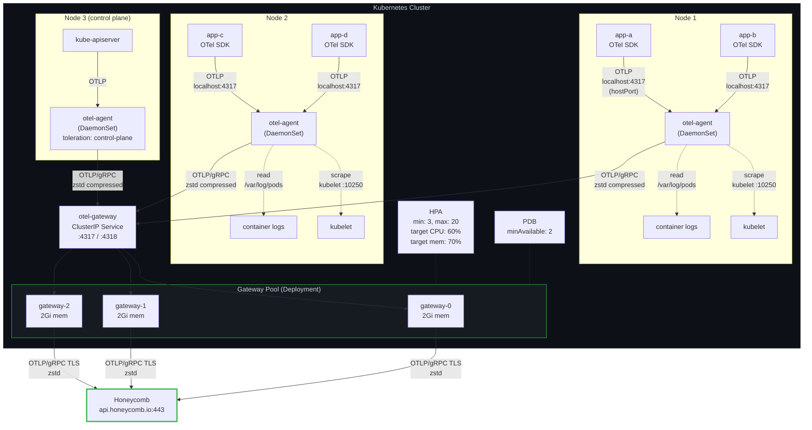
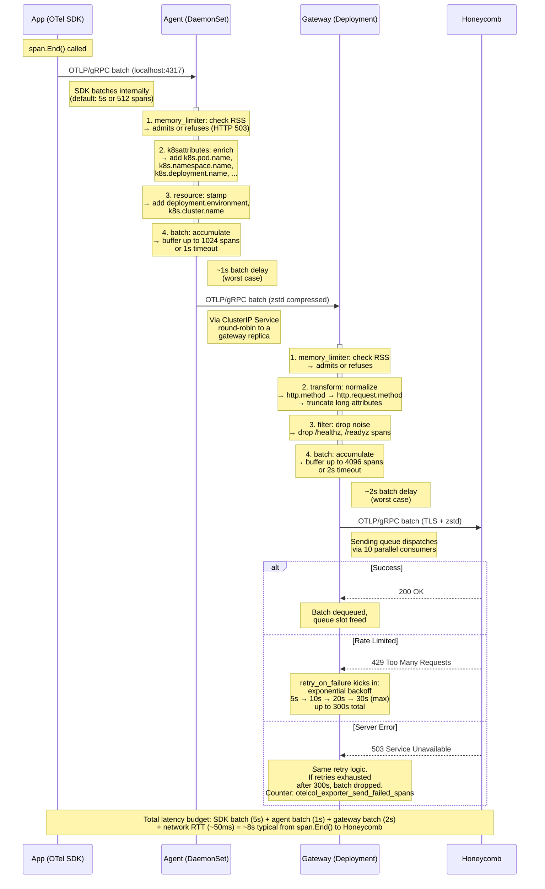

# Chapter 03 — Agent + Gateway Topology

> **Audience**: SREs and platform engineers deploying the canonical two-tier OTel Collector
> architecture on Kubernetes.
>
> **Prerequisite**: You have read [Chapter 02 (Deployment Modes)](02-deployment-modes.md) and
> decided that DaemonSet agents + a Gateway pool is the right topology. For most organizations,
> it is.
>
> **Goal**: Walk out of this chapter with production-ready Collector configs, Kubernetes manifests,
> and the sizing math for both tiers. Every YAML block in this chapter is a complete, deployable
> excerpt. Full configs are in `configs/`.

---

## 1. Architecture Overview



This is the canonical production topology because it cleanly separates two concerns that have
different scaling characteristics. **Agents** scale with node count (DaemonSet handles this
automatically) and handle everything node-local: OTLP ingestion over localhost, host metrics,
container log tailing, and Kubernetes metadata enrichment. **Gateways** scale with total cluster
throughput (HPA handles this) and handle everything cluster-global: transforms, filtering, batching
for efficient egress, and the backend-specific export to Honeycomb. Neither tier needs to know
about the other's internals. The agent exports generic OTLP to a ClusterIP Service; the gateway
consumes generic OTLP from that Service. If you replace one tier, the other does not change.

---

## 2. Agent Configuration (Complete)

This is the full, production-ready config for the DaemonSet agent. Every line is intentional.

```yaml
# Agent collector config — runs on every node via DaemonSet
# Full config: configs/agent-daemonset.yaml

receivers:
  # OTLP from application SDKs on this node
  otlp:
    protocols:
      grpc:
        endpoint: 0.0.0.0:4317
      http:
        endpoint: 0.0.0.0:4318

  # Node-level hardware metrics
  hostmetrics:
    collection_interval: 30s
    root_path: /hostfs
    scrapers:
      cpu: {}
      memory: {}
      disk: {}
      network: {}
      filesystem:
        exclude_mount_points:
          mount_points: [/dev/*, /proc/*, /sys/*, /run/*, /var/lib/docker/*, /snap/*]
          match_type: regexp
      process:
        include:
          match_type: regexp
          names: [".*"]  # Collect all; filter at gateway if needed
        mute_process_name_error: true

  # Pod and container resource metrics from the kubelet
  kubeletstats:
    collection_interval: 30s
    auth_type: serviceAccount
    endpoint: "https://${env:K8S_NODE_IP}:10250"
    insecure_skip_verify: true
    metric_groups:
      - pod
      - container
      - node

  # Container log collection
  filelog:
    include:
      - /var/log/pods/*/*/*.log
    exclude:
      # Do not collect the collector's own logs — creates a feedback loop
      - /var/log/pods/otel-system_otel-agent*/*/*.log
    start_at: end
    include_file_path: true
    include_file_name: false
    operators:
      # Parse CRI-O / containerd log format
      - type: router
        id: container-parser-router
        routes:
          - output: cri-parser
            expr: 'body matches "^\\d{4}-\\d{2}-\\d{2}T"'
      - type: regex_parser
        id: cri-parser
        regex: '^(?P<time>\d{4}-\d{2}-\d{2}T\d{2}:\d{2}:\d{2}\.\d+Z)\s(?P<stream>\w+)\s(?P<logtag>\w)\s(?P<log>.*)$'
        timestamp:
          parse_from: attributes.time
          layout: "%Y-%m-%dT%H:%M:%S.%LZ"
      # Extract k8s metadata from the file path
      - type: regex_parser
        id: extract-metadata-from-filepath
        regex: '^.*\/(?P<namespace>[^_]+)_(?P<pod_name>[^_]+)_(?P<uid>[^\/]+)\/(?P<container_name>[^\/]+)\/.*.log$'
        parse_from: attributes["log.file.path"]
      - type: move
        from: attributes.namespace
        to: resource["k8s.namespace.name"]
      - type: move
        from: attributes.pod_name
        to: resource["k8s.pod.name"]
      - type: move
        from: attributes.uid
        to: resource["k8s.pod.uid"]
      - type: move
        from: attributes.container_name
        to: resource["k8s.container.name"]
      - type: move
        from: attributes.log
        to: body

processors:
  # ──────────────────────────────────────────────────────────────
  # 1. memory_limiter — MUST be first in every pipeline.
  #
  # Why first: if this processor is not the first thing that
  # touches incoming data, upstream processors can allocate
  # unbounded memory before the limiter gets a chance to refuse.
  # The limiter is the circuit breaker. Put it at the front door.
  #
  # Formula:
  #   limit_mib     = container_memory_limit * 0.80
  #   spike_limit   = limit_mib * 0.25
  #
  # For a 512Mi container limit:
  #   limit_mib     = 512 * 0.80 = 410
  #   spike_limit   = 410 * 0.25 = 102 ≈ 100
  # ──────────────────────────────────────────────────────────────
  memory_limiter:
    check_interval: 1s
    limit_mib: 410
    spike_limit_mib: 100

  # ──────────────────────────────────────────────────────────────
  # 2. k8sattributes — enrich telemetry with pod metadata.
  #
  # Why second: runs after memory_limiter so we only enrich data
  # that has been admitted, and before batch so enriched data is
  # batched together for efficient export.
  #
  # pod_association by connection IP is the most reliable method
  # for DaemonSet agents — the source IP of the incoming
  # connection is the pod IP, since apps connect over localhost
  # via hostPort.
  # ──────────────────────────────────────────────────────────────
  k8sattributes:
    auth_type: serviceAccount
    passthrough: false
    filter:
      node_from_env_var: K8S_NODE_NAME
    extract:
      metadata:
        - k8s.namespace.name
        - k8s.pod.name
        - k8s.pod.uid
        - k8s.node.name
        - k8s.deployment.name
        - k8s.statefulset.name
        - k8s.daemonset.name
        - k8s.job.name
        - k8s.cronjob.name
        - k8s.container.name
      labels:
        - tag_name: app.kubernetes.io/name
          key: app.kubernetes.io/name
          from: pod
        - tag_name: app.kubernetes.io/version
          key: app.kubernetes.io/version
          from: pod
        - tag_name: app.kubernetes.io/component
          key: app.kubernetes.io/component
          from: pod
      annotations:
        - tag_name: $$1
          key_regex: "^opentelemetry\\.io/(.+)$"
          from: pod
    pod_association:
      - sources:
          - from: resource_attribute
            name: k8s.pod.ip
      - sources:
          - from: connection

  # ──────────────────────────────────────────────────────────────
  # 3. resource — add static attributes that identify the cluster
  #    and environment. These do not change per-request, so they
  #    belong on the resource, not on individual spans.
  # ──────────────────────────────────────────────────────────────
  resource:
    attributes:
      - key: deployment.environment
        value: "production"
        action: upsert
      - key: k8s.cluster.name
        value: "us-east-1-prod"
        action: upsert

  # ──────────────────────────────────────────────────────────────
  # 4. batch — accumulate data before sending to the gateway.
  #
  # Why last: batching is the final step before export. It
  # compresses multiple small payloads into fewer large ones,
  # reducing RPC overhead to the gateway.
  #
  # Agent batches are small (1024) with a short timeout (1s).
  # Agents should flush frequently to keep latency low — the
  # gateway will re-batch into larger payloads for Honeycomb.
  # Large agent batches waste memory and add unnecessary delay
  # for a hop that is in-cluster and nearly free.
  # ──────────────────────────────────────────────────────────────
  batch:
    send_batch_size: 1024
    send_batch_max_size: 2048
    timeout: 1s

exporters:
  otlp/gateway:
    endpoint: "otel-gateway.otel-system.svc.cluster.local:4317"
    tls:
      insecure: true    # In-cluster traffic. Use mTLS if your mesh requires it.
    compression: zstd
    sending_queue:
      enabled: true
      num_consumers: 4
      queue_size: 256
    retry_on_failure:
      enabled: true
      initial_interval: 1s
      max_interval: 10s
      max_elapsed_time: 60s

extensions:
  health_check:
    endpoint: 0.0.0.0:13133
  zpages:
    endpoint: 0.0.0.0:55679

service:
  extensions: [health_check, zpages]
  pipelines:
    traces:
      receivers: [otlp]
      processors: [memory_limiter, k8sattributes, resource, batch]
      exporters: [otlp/gateway]
    metrics:
      receivers: [otlp, hostmetrics, kubeletstats]
      processors: [memory_limiter, k8sattributes, resource, batch]
      exporters: [otlp/gateway]
    logs:
      receivers: [otlp, filelog]
      processors: [memory_limiter, k8sattributes, resource, batch]
      exporters: [otlp/gateway]
  telemetry:
    metrics:
      address: 0.0.0.0:8888
      level: normal
```

Key decisions in this config:

- **Processor order matters.** The pipeline is `memory_limiter -> k8sattributes -> resource -> batch`. The memory limiter must be first so it can refuse data before any downstream processor allocates memory for it. The batch processor must be last so it accumulates already-enriched data. Reversing the order (e.g., batch before k8sattributes) means the k8sattributes processor receives large batches and must look up metadata for the entire batch at once, which is both slower and uses more memory.
- **`filter.node_from_env_var: K8S_NODE_NAME`** on k8sattributes tells the processor to only watch pods on the local node. Without this, the processor caches metadata for every pod in the cluster, which consumes O(cluster) memory instead of O(node). On a 2,000-pod cluster, this is the difference between 15Mi and 200Mi of cache.
- **Agent `sending_queue.queue_size: 256`** is intentionally small. The agent is not the last line of defense — the gateway has a much larger queue (5,000). The agent queue only needs to survive brief gateway hiccups (rolling restarts, HPA scale-up). At 1,024 items/batch with a 1s timeout, 256 queue slots hold roughly 4 minutes of data at 1K spans/sec. That is enough. Larger queues waste memory on every node. See chapter 07 for the full backpressure model.
- **`compression: zstd`** on the exporter. Even for in-cluster traffic, zstd reduces wire size by ~65% with negligible CPU cost. At 10K spans/sec per agent, this saves roughly 30 MB/sec of network bandwidth per node. Over 100 nodes, that adds up.
- **Telemetry level `normal`** on agents vs `detailed` on gateways. Agents run on every node; emitting detailed internal metrics from 100 agents generates significant Prometheus scrape load. Keep agents at `normal` and use `detailed` only on the gateway where you have fewer instances.

Full config available at `configs/agent-daemonset.yaml`.

---

## 3. Gateway Configuration (Complete)

This is the full, production-ready config for the Gateway Deployment pool.

```yaml
# Gateway collector config — centralized processing and export
# Full config: configs/gateway-deployment.yaml

receivers:
  otlp:
    protocols:
      grpc:
        endpoint: 0.0.0.0:4317
        max_recv_msg_size_mib: 16
      http:
        endpoint: 0.0.0.0:4318

processors:
  # ──────────────────────────────────────────────────────────────
  # 1. memory_limiter — same rule as agent: first in the pipeline.
  #
  # Gateway has a 2Gi container limit. Formula:
  #   limit_mib   = 2048 * 0.80 = 1638
  #   spike_limit = 1638 * 0.25 = 409 ≈ 400
  # ──────────────────────────────────────────────────────────────
  memory_limiter:
    check_interval: 1s
    limit_mib: 1638
    spike_limit_mib: 400

  # ──────────────────────────────────────────────────────────────
  # 2. transform — normalize, enrich, clean up telemetry.
  #
  # The gateway is the right place for transforms because:
  # - Changes apply cluster-wide, not per-node.
  # - You update one config, not N agent configs.
  # - CPU cost is concentrated in the gateway pool where HPA
  #   can scale it, instead of spread across every node.
  # ──────────────────────────────────────────────────────────────
  transform:
    error_mode: ignore
    trace_statements:
      - context: span
        statements:
          # Normalize old HTTP semconv to stable semconv
          - set(attributes["http.request.method"], attributes["http.method"])
            where attributes["http.method"] != nil
          - delete_key(attributes, "http.method")
            where attributes["http.request.method"] != nil
          - set(attributes["url.path"], attributes["http.target"])
            where attributes["http.target"] != nil
          - delete_key(attributes, "http.target")
            where attributes["url.path"] != nil
          - set(attributes["http.response.status_code"], attributes["http.status_code"])
            where attributes["http.status_code"] != nil
          - delete_key(attributes, "http.status_code")
            where attributes["http.response.status_code"] != nil
          # Truncate absurdly long attribute values (>4KB) that inflate cost
          - truncate_all(attributes, 4096)
    log_statements:
      - context: log
        statements:
          # Truncate log bodies over 16KB — anything longer is a stack
          # trace that should be in an exception event, not a raw log
          - truncate_all(attributes, 4096)

  # ──────────────────────────────────────────────────────────────
  # 3. filter — drop telemetry that adds cost without value.
  #
  # Health checks are the classic example: every pod gets probed
  # every 10s, generating thousands of spans/hour that you will
  # never query. Drop them at the gateway so all agents benefit
  # without needing per-agent config changes.
  # ──────────────────────────────────────────────────────────────
  filter/drop-noise:
    error_mode: ignore
    traces:
      span:
        - 'attributes["url.path"] == "/healthz"'
        - 'attributes["url.path"] == "/readyz"'
        - 'attributes["url.path"] == "/livez"'
        - 'attributes["http.target"] == "/healthz"'
        - 'attributes["http.target"] == "/readyz"'
        - 'attributes["http.target"] == "/livez"'
    logs:
      log_record:
        # Drop kube-probe user-agent log lines
        - 'IsMatch(body, ".*kube-probe.*")'

  # ──────────────────────────────────────────────────────────────
  # 4. batch — larger batches than agent.
  #
  # The gateway accumulates data from many agents, so it can
  # build larger, more efficient batches for the Honeycomb API.
  # Larger batches = fewer HTTP/2 frames = lower overhead per
  # span at the backend. The 2s timeout is acceptable because
  # the agent already added ~1s of delay — the user will not
  # notice an additional 2s on observability data.
  # ──────────────────────────────────────────────────────────────
  batch:
    send_batch_size: 4096
    send_batch_max_size: 8192
    timeout: 2s

exporters:
  otlp/honeycomb:
    endpoint: "api.honeycomb.io:443"
    headers:
      "x-honeycomb-team": "${env:HONEYCOMB_API_KEY}"
    compression: zstd
    sending_queue:
      enabled: true
      queue_size: 5000
      num_consumers: 10
    retry_on_failure:
      enabled: true
      initial_interval: 5s
      max_interval: 30s
      max_elapsed_time: 300s

extensions:
  health_check:
    endpoint: 0.0.0.0:13133
  zpages:
    endpoint: 0.0.0.0:55679
  pprof:
    endpoint: 0.0.0.0:1777

service:
  extensions: [health_check, zpages, pprof]
  pipelines:
    traces:
      receivers: [otlp]
      processors: [memory_limiter, transform, filter/drop-noise, batch]
      exporters: [otlp/honeycomb]
    metrics:
      receivers: [otlp]
      processors: [memory_limiter, batch]
      exporters: [otlp/honeycomb]
    logs:
      receivers: [otlp]
      processors: [memory_limiter, filter/drop-noise, batch]
      exporters: [otlp/honeycomb]
  telemetry:
    metrics:
      address: 0.0.0.0:8888
      level: detailed
    logs:
      level: info
```

Key decisions in this config:

- **`sending_queue.queue_size: 5000` with `num_consumers: 10`.** At 35K spans/sec cluster-wide with a batch size of 4096, the gateway produces roughly 9 batches/sec. A queue of 5,000 slots holds roughly 9 minutes of data if Honeycomb stops accepting traffic entirely. That is enough to survive most provider incidents. The 10 consumers send batches in parallel, which is necessary because each `otlp` export RPC takes 50-200ms to Honeycomb depending on payload size and network latency. A single consumer would bottleneck at ~5-20 batches/sec. See chapter 06 for queue sizing formulas.
- **`retry_on_failure.max_elapsed_time: 300s`.** After 5 minutes of continuous failure for a single batch, the exporter drops it. This prevents a single stuck batch from blocking the queue indefinitely. The sending queue still holds newer batches, so the retry policy on individual items does not mean 5 minutes of total data loss — it means the oldest items age out first.
- **`pprof` extension on the gateway, not on agents.** The gateway is where you profile performance bottlenecks (transform processor CPU usage, batch allocations). Enabling pprof on every agent adds an unnecessary attack surface and port on every node.
- **No transform or filter on the metrics pipeline.** Metrics have different semantics (aggregation, temporality) and are typically lower volume than traces. Apply metrics transforms only when you have a specific need (e.g., dropping high-cardinality label values). Blindly filtering metrics can break dashboards.
- **`max_recv_msg_size_mib: 16`** on the gRPC receiver. The default is 4 MiB, which is too small when agents batch 1024-2048 spans per export. A single batch with rich attributes can exceed 4 MiB. 16 MiB handles even pathological cases without risk — the memory limiter is the real safeguard, not the message size.

Full config available at `configs/gateway-deployment.yaml`.

---

## 4. Span Lifecycle — Sequence Diagram

A single span's journey from application code to Honeycomb storage. This is the concrete version of the architecture diagram above, showing every processing step and where time is spent.



The total latency from `span.End()` to the data appearing in Honeycomb is typically 8-15 seconds. This is normal and expected for observability data. If you need lower latency (e.g., for real-time alerting), reduce the SDK export interval and the agent batch timeout, but understand that smaller batches mean more RPCs and higher CPU usage at both tiers.

---

## 5. Kubernetes Manifests

### Agent: RBAC

The agent needs RBAC permissions for two things: the `k8sattributes` processor (reads pod metadata from the API server) and the `kubeletstats` receiver (reads metrics from the kubelet).

```yaml
apiVersion: v1
kind: ServiceAccount
metadata:
  name: otel-agent
  namespace: otel-system
---
apiVersion: rbac.authorization.k8s.io/v1
kind: ClusterRole
metadata:
  name: otel-agent
rules:
  # k8sattributes processor needs these
  - apiGroups: [""]
    resources: ["pods", "namespaces", "nodes"]
    verbs: ["get", "watch", "list"]
  - apiGroups: ["apps"]
    resources: ["replicasets", "deployments", "statefulsets", "daemonsets"]
    verbs: ["get", "watch", "list"]
  - apiGroups: ["batch"]
    resources: ["jobs", "cronjobs"]
    verbs: ["get", "watch", "list"]
  # kubeletstats receiver needs node/stats
  - apiGroups: [""]
    resources: ["nodes/stats", "nodes/proxy"]
    verbs: ["get"]
---
apiVersion: rbac.authorization.k8s.io/v1
kind: ClusterRoleBinding
metadata:
  name: otel-agent
roleRef:
  apiGroup: rbac.authorization.k8s.io
  kind: ClusterRole
  name: otel-agent
subjects:
  - kind: ServiceAccount
    name: otel-agent
    namespace: otel-system
```

If you skip the RBAC setup, the `k8sattributes` processor will silently produce empty `k8s.*` attributes. You will not see an error in the collector logs — the processor falls back to a no-op when it cannot reach the API server. The only symptom is missing metadata in Honeycomb. This is one of the most common deployment mistakes (see section 8).

### Agent: DaemonSet

```yaml
apiVersion: apps/v1
kind: DaemonSet
metadata:
  name: otel-agent
  namespace: otel-system
  labels:
    app.kubernetes.io/name: otel-agent
    app.kubernetes.io/component: agent
spec:
  selector:
    matchLabels:
      app.kubernetes.io/name: otel-agent
  updateStrategy:
    type: RollingUpdate
    rollingUpdate:
      maxUnavailable: 1
  template:
    metadata:
      labels:
        app.kubernetes.io/name: otel-agent
        app.kubernetes.io/component: agent
      annotations:
        prometheus.io/scrape: "true"
        prometheus.io/port: "8888"
    spec:
      serviceAccountName: otel-agent
      # ────────────────────────────────────────────────────
      # Tolerations: schedule on EVERY node, including
      # control plane and tainted node pools.
      # If you have nodes that genuinely should not emit
      # telemetry, add a specific exclusion instead.
      # ────────────────────────────────────────────────────
      tolerations:
        - operator: Exists
      containers:
        - name: otel-agent
          image: otel/opentelemetry-collector-contrib:0.120.0
          args:
            - --config=/etc/otelcol/config.yaml
          ports:
            # ────────────────────────────────────────────
            # hostPort exposes 4317 on the node's IP.
            # Apps send to localhost:4317 via the
            # Downward API or OTEL_EXPORTER_OTLP_ENDPOINT.
            #
            # Why NOT hostNetwork:
            #   hostNetwork: true gives the pod the node's
            #   full network namespace. This means:
            #   - Port conflicts with anything else on 4317
            #   - The pod can see all node traffic (security)
            #   - NetworkPolicies do not apply
            #   - The pod's IP is the node IP, breaking
            #     k8sattributes pod_association by IP
            #
            #   hostPort is strictly better: it reserves
            #   only the ports you declare, the pod keeps
            #   its own network namespace, and pod_association
            #   works correctly.
            # ────────────────────────────────────────────
            - name: otlp-grpc
              containerPort: 4317
              hostPort: 4317
              protocol: TCP
            - name: otlp-http
              containerPort: 4318
              hostPort: 4318
              protocol: TCP
            - name: metrics
              containerPort: 8888
              protocol: TCP
            - name: healthcheck
              containerPort: 13133
              protocol: TCP
            - name: zpages
              containerPort: 55679
              protocol: TCP
          env:
            - name: K8S_NODE_NAME
              valueFrom:
                fieldRef:
                  fieldPath: spec.nodeName
            - name: K8S_NODE_IP
              valueFrom:
                fieldRef:
                  fieldPath: status.hostIP
            - name: K8S_POD_NAME
              valueFrom:
                fieldRef:
                  fieldPath: metadata.name
            - name: K8S_POD_NAMESPACE
              valueFrom:
                fieldRef:
                  fieldPath: metadata.namespace
            # ────────────────────────────────────────────
            # GOMEMLIMIT: tell the Go runtime's GC to
            # target this memory ceiling. Without this,
            # Go's GC uses a 2x growth heuristic and may
            # not collect until it hits the container limit,
            # causing OOM kills at ~50% actual live heap.
            #
            # Formula: GOMEMLIMIT = requests.memory * 0.80
            #          = 512Mi * 0.80 = 410Mi
            #
            # We use requests (not limits) because requests
            # reflect guaranteed memory; limits can be
            # overcommitted on the node.
            # ────────────────────────────────────────────
            - name: GOMEMLIMIT
              value: "410MiB"
          resources:
            requests:
              cpu: 250m
              memory: 512Mi
            limits:
              # ────────────────────────────────────────
              # No CPU limit. CPU throttling on a collector
              # causes ingestion to fall behind, which
              # triggers backpressure to the SDKs. The SDK
              # then buffers, consuming app memory. You have
              # traded a collector problem for an application
              # problem. Use CPU requests for scheduling;
              # do not set a CPU limit.
              #
              # If your cluster enforces LimitRange with
              # required CPU limits, set it to 2000m — high
              # enough to avoid throttling under burst.
              # ────────────────────────────────────────
              memory: 512Mi
          volumeMounts:
            - name: config
              mountPath: /etc/otelcol
              readOnly: true
            - name: hostfs
              mountPath: /hostfs
              readOnly: true
              mountPropagation: HostToContainer
            - name: varlogpods
              mountPath: /var/log/pods
              readOnly: true
          livenessProbe:
            httpGet:
              path: /
              port: 13133
            initialDelaySeconds: 15
            periodSeconds: 10
            timeoutSeconds: 5
          readinessProbe:
            httpGet:
              path: /
              port: 13133
            initialDelaySeconds: 5
            periodSeconds: 5
            timeoutSeconds: 3
      volumes:
        - name: config
          configMap:
            name: otel-agent-config
        - name: hostfs
          hostPath:
            path: /
        - name: varlogpods
          hostPath:
            path: /var/log/pods
```

### Agent: ConfigMap

```yaml
apiVersion: v1
kind: ConfigMap
metadata:
  name: otel-agent-config
  namespace: otel-system
data:
  config.yaml: |
    # Paste the full agent config from section 2 here.
    # Keeping it in a ConfigMap means you can update the
    # config without rebuilding the container image.
    # After updating: kubectl rollout restart daemonset/otel-agent -n otel-system
```

### Gateway: Deployment

```yaml
apiVersion: apps/v1
kind: Deployment
metadata:
  name: otel-gateway
  namespace: otel-system
  labels:
    app.kubernetes.io/name: otel-gateway
    app.kubernetes.io/component: gateway
spec:
  replicas: 3
  selector:
    matchLabels:
      app.kubernetes.io/name: otel-gateway
  template:
    metadata:
      labels:
        app.kubernetes.io/name: otel-gateway
        app.kubernetes.io/component: gateway
      annotations:
        prometheus.io/scrape: "true"
        prometheus.io/port: "8888"
    spec:
      serviceAccountName: otel-gateway
      # ────────────────────────────────────────────────────
      # Anti-affinity: prefer spreading gateway pods across
      # different nodes. This is "preferred" not "required"
      # so the scheduler can still place pods if nodes are
      # scarce — a gateway running on the same node as
      # another gateway is better than no gateway at all.
      # ────────────────────────────────────────────────────
      affinity:
        podAntiAffinity:
          preferredDuringSchedulingIgnoredDuringExecution:
            - weight: 100
              podAffinityTerm:
                labelSelector:
                  matchLabels:
                    app.kubernetes.io/name: otel-gateway
                topologyKey: kubernetes.io/hostname
      # ────────────────────────────────────────────────────
      # topologySpreadConstraints: balance across AZs.
      # With 3 replicas across 3 AZs, losing one AZ leaves
      # 2 replicas — still above the PDB minimum.
      # ────────────────────────────────────────────────────
      topologySpreadConstraints:
        - maxSkew: 1
          topologyKey: topology.kubernetes.io/zone
          whenUnsatisfiable: DoNotSchedule
          labelSelector:
            matchLabels:
              app.kubernetes.io/name: otel-gateway
      # ────────────────────────────────────────────────────
      # terminationGracePeriodSeconds: 60
      #
      # When a gateway pod is terminated, it needs time to:
      #   1. Drain its preStop hook (5s)
      #   2. Stop accepting new connections
      #   3. Flush in-flight batches from the batch processor
      #   4. Drain the sending_queue to Honeycomb
      #
      # 60s is enough for a queue_size of 5000 at 10
      # consumers pushing 4096-span batches with 2s timeout.
      # See section 6 for the formula.
      # ────────────────────────────────────────────────────
      terminationGracePeriodSeconds: 60
      containers:
        - name: otel-gateway
          image: otel/opentelemetry-collector-contrib:0.120.0
          args:
            - --config=/etc/otelcol/config.yaml
          ports:
            - name: otlp-grpc
              containerPort: 4317
              protocol: TCP
            - name: otlp-http
              containerPort: 4318
              protocol: TCP
            - name: metrics
              containerPort: 8888
              protocol: TCP
            - name: healthcheck
              containerPort: 13133
              protocol: TCP
            - name: zpages
              containerPort: 55679
              protocol: TCP
            - name: pprof
              containerPort: 1777
              protocol: TCP
          env:
            - name: HONEYCOMB_API_KEY
              valueFrom:
                secretKeyRef:
                  name: honeycomb-api-key
                  key: api-key
            # GOMEMLIMIT = requests.memory * 0.80
            #            = 2Gi * 0.80 = 1638Mi
            - name: GOMEMLIMIT
              value: "1638MiB"
          resources:
            requests:
              cpu: "1"
              memory: 2Gi
            limits:
              # No CPU limit — same reasoning as agent.
              memory: 2Gi
          volumeMounts:
            - name: config
              mountPath: /etc/otelcol
              readOnly: true
          # ────────────────────────────────────────────
          # preStop hook: sleep 5 seconds.
          #
          # Why: when a pod is terminated, K8s concurrently
          # sends SIGTERM and begins removing the pod from
          # the Service endpoints. But endpoint propagation
          # is asynchronous — kube-proxy, CoreDNS, and
          # any service mesh sidecar all need time to update.
          #
          # Without the sleep, the collector starts shutting
          # down while agents are still sending traffic to
          # its IP. Those in-flight requests get connection
          # resets. The 5s sleep lets the Service endpoints
          # update before the collector stops accepting.
          # ────────────────────────────────────────────
          lifecycle:
            preStop:
              exec:
                command: ["sleep", "5"]
          livenessProbe:
            httpGet:
              path: /
              port: 13133
            initialDelaySeconds: 15
            periodSeconds: 10
            timeoutSeconds: 5
          readinessProbe:
            httpGet:
              path: /
              port: 13133
            initialDelaySeconds: 5
            periodSeconds: 5
            timeoutSeconds: 3
      volumes:
        - name: config
          configMap:
            name: otel-gateway-config
```

### Gateway: Service

```yaml
apiVersion: v1
kind: Service
metadata:
  name: otel-gateway
  namespace: otel-system
  labels:
    app.kubernetes.io/name: otel-gateway
    app.kubernetes.io/component: gateway
spec:
  type: ClusterIP
  selector:
    app.kubernetes.io/name: otel-gateway
  ports:
    - name: otlp-grpc
      port: 4317
      targetPort: otlp-grpc
      protocol: TCP
    - name: otlp-http
      port: 4318
      targetPort: otlp-http
      protocol: TCP
```

### Gateway: PodDisruptionBudget

```yaml
apiVersion: policy/v1
kind: PodDisruptionBudget
metadata:
  name: otel-gateway
  namespace: otel-system
spec:
  minAvailable: 2
  selector:
    matchLabels:
      app.kubernetes.io/name: otel-gateway
```

With `minAvailable: 2` and 3 replicas, only 1 pod can be disrupted at a time during voluntary operations (node drain, rolling update, cluster upgrade). If you scale to 5+ replicas, consider switching to `maxUnavailable: 1` for the same effect with simpler math.

### Gateway: HorizontalPodAutoscaler

```yaml
apiVersion: autoscaling/v2
kind: HorizontalPodAutoscaler
metadata:
  name: otel-gateway
  namespace: otel-system
spec:
  scaleTargetRef:
    apiVersion: apps/v1
    kind: Deployment
    name: otel-gateway
  minReplicas: 3
  maxReplicas: 20
  metrics:
    - type: Resource
      resource:
        name: cpu
        target:
          type: Utilization
          averageUtilization: 60
    - type: Resource
      resource:
        name: memory
        target:
          type: Utilization
          averageUtilization: 70
  behavior:
    scaleUp:
      stabilizationWindowSeconds: 30
      policies:
        - type: Pods
          value: 3
          periodSeconds: 60
    scaleDown:
      stabilizationWindowSeconds: 300
      policies:
        - type: Pods
          value: 1
          periodSeconds: 120
```

**Better scaling signal: `otelcol_exporter_queue_size`**

CPU and memory are lagging indicators. By the time CPU utilization hits 60%, the gateway is already accumulating a backlog. A better signal is the exporter queue depth, which directly measures "how much work is waiting to be sent." If you have Prometheus Adapter or KEDA installed, use a custom metric:

```yaml
# Requires prometheus-adapter configured to expose
# otelcol_exporter_queue_size as a custom metric
metrics:
  - type: Pods
    pods:
      metric:
        name: otelcol_exporter_queue_size
      target:
        type: AverageValue
        averageValue: "2500"   # Scale up when queue is half-full (of 5000)
```

This is a superior scaling signal because it directly measures demand, not resource consumption. However, it requires the Prometheus Adapter (or KEDA) stack, which is additional infrastructure to maintain. Start with CPU/memory and upgrade to custom metrics when you have the monitoring stack in place. See chapter 06 for detailed guidance on custom metric scaling.

### Gateway: ConfigMap

```yaml
apiVersion: v1
kind: ConfigMap
metadata:
  name: otel-gateway-config
  namespace: otel-system
data:
  config.yaml: |
    # Paste the full gateway config from section 3 here.
```

---

## 6. Graceful Shutdown

When a gateway pod is terminated — whether from a scale-down, rolling update, node drain, or manual deletion — data in flight can be lost if the shutdown sequence is not handled correctly. Here is exactly what happens, step by step.

### The shutdown sequence

```
t=0s    Pod receives SIGTERM (K8s initiates termination)
        Simultaneously:
          - preStop hook starts (sleep 5)
          - K8s begins removing pod from Service endpoints

t=0-5s  preStop hook sleeping.
        Service endpoints propagating removal to kube-proxy / CoreDNS / mesh.
        Collector is STILL RUNNING and accepting traffic.
        Agents may still route requests here — that is fine, the collector handles them.

t=5s    preStop hook completes. SIGTERM is delivered to the collector process.
        Collector enters shutdown mode:
          1. Receivers stop accepting new connections.
          2. Existing in-flight RPCs are allowed to complete.
          3. Processors flush any buffered data (batch processor flushes its current batch).
          4. Exporters drain the sending_queue — push remaining batches to Honeycomb.

t=5-55s Collector is draining. Sending queue batches are exported.
        At 10 consumers, each handling a ~100ms RPC, the queue drains at
        roughly 100 batches/sec. A full 5000-slot queue drains in ~50s.

t=60s   terminationGracePeriodSeconds expires. If the process has not exited,
        K8s sends SIGKILL. Anything still in the queue is lost.
```

### What breaks

If `terminationGracePeriodSeconds` is too short, the collector is SIGKILL'ed before the sending queue drains. Every batch still in the queue is lost.

**Formula for minimum terminationGracePeriodSeconds:**

```
terminationGracePeriodSeconds >=
    preStop_sleep
  + (queue_size / (num_consumers * batches_per_second_per_consumer))
  + safety_margin

Where:
  preStop_sleep                       = 5s
  queue_size                          = 5000 (worst case: full queue)
  num_consumers                       = 10
  batches_per_second_per_consumer     = 10 (assuming ~100ms RTT to Honeycomb)
  safety_margin                       = 5s

= 5 + (5000 / (10 * 10)) + 5
= 5 + 50 + 5
= 60s
```

In practice, the queue is rarely full at shutdown time. But you should size for the worst case. If you increase `queue_size` to 10,000 or reduce `num_consumers`, recalculate and increase `terminationGracePeriodSeconds` accordingly.

**What you lose if SIGKILL fires:**

- Every batch in the sending queue that has not been acknowledged by Honeycomb.
- At 4096 spans/batch and (say) 2000 remaining queue slots, that is ~8.2 million spans. For a 35K spans/sec cluster, that is roughly 4 minutes of data.
- You will see this as a gap in Honeycomb, correlated with a `otel-gateway` pod restart in your cluster events.

### How to detect it

Monitor `otelcol_exporter_queue_size` on the gateway. During a graceful shutdown, it should decline to 0 before the pod exits. If the pod disappears from Prometheus scrape targets while `queue_size` is still > 0, the shutdown was not graceful. Alert on this condition. See chapter 09 for the specific Prometheus alerting rule.

---

## 7. Scaling Considerations

### Agent: scales with nodes

The DaemonSet controller handles agent scaling automatically. When a new node joins the cluster, a new agent pod is created. When a node is drained, the agent pod is evicted. There is nothing to configure.

The only scaling decision for agents is the resource request per pod, which determines how much telemetry a single node can handle. Use the throughput tiers from chapter 02:

| Per-node throughput | CPU request | Memory request | Memory limit |
|---|---|---|---|
| < 5K spans/sec | 100m | 256Mi | 512Mi |
| 5K - 20K spans/sec | 250m | 512Mi | 512Mi |
| 20K - 50K spans/sec | 500m | 1Gi | 1Gi |
| > 50K spans/sec | 1000m | 2Gi | 2Gi |

If different nodes have wildly different throughput profiles (e.g., GPU nodes with 2 pods vs API nodes with 40 pods), consider multiple DaemonSets with nodeSelector targeting each node pool, each with different resource requests.

### Gateway: HPA scaling signals

| Signal | Pros | Cons | When it fires |
|---|---|---|---|
| CPU utilization | Simple, built-in, no extra infra | Lagging indicator. By the time CPU is high, the queue is already backing up. Batch processor causes bursty CPU, making the metric noisy. | After backlog starts |
| Memory utilization | Better than CPU because memory_limiter masks usage. | The memory_limiter refuses data before memory reaches the limit, so utilization looks lower than actual demand. | After memory_limiter starts refusing |
| `otelcol_exporter_queue_size` (custom) | Directly measures demand. Leading indicator — queue grows before CPU or memory spike. | Requires Prometheus Adapter or KEDA. More infra to maintain. | Before resource pressure |
| `otelcol_receiver_accepted_spans` (custom) | Measures inbound throughput directly. | Does not account for processing speed — high inbound rate is only a problem if the gateway cannot keep up. | Preemptive, may overscale |

**Recommendation:** Start with CPU at 60% as the primary signal. It is simple, built-in, and works well enough for most clusters. When you observe the HPA reacting too slowly (i.e., you see queue growth before scale-up), add `otelcol_exporter_queue_size` as a custom metric. Chapter 06 covers the Prometheus Adapter configuration.

### Capacity planning table

Use this table to estimate gateway replica count. These numbers assume gateway pods with 2Gi memory limit, 1 CPU request, and the processor chain from section 3 (memory_limiter + transform + filter + batch). Adjust downward if your processors are heavier (e.g., tail sampling doubles memory cost).

| Cluster throughput | Spans/sec | Metric series | Log lines/sec | Gateway replicas | Total gateway memory |
|---|---|---|---|---|---|
| Small | 10K | 50K | 5K | 3 | 6Gi |
| Medium | 50K | 200K | 20K | 5 | 10Gi |
| Large | 200K | 500K | 50K | 10 | 20Gi |
| Very large | 500K | 1M | 100K | 15 | 30Gi |
| Extreme | 1M+ | 2M+ | 200K+ | 20+ | 40Gi+ |

At the "Extreme" tier, a single gateway pool becomes an operational risk. Consider tiered gateways (chapter 04) or signal separation (chapter 05) to split the load across independent pools.

**Back-of-envelope formula:**

```
replicas = ceil(total_spans_per_sec / 40,000)

40K spans/sec per 2Gi gateway replica is a conservative estimate that
accounts for transform + filter + batch processing overhead.
For metrics-heavy workloads, reduce to 30K.
For traces-only with minimal processing, increase to 60K.
```

This formula gives you a starting point. Validate with load testing using `telemetrygen`:

```bash
# Generate synthetic load to test gateway capacity
telemetrygen traces \
  --otlp-endpoint otel-gateway.otel-system.svc.cluster.local:4317 \
  --otlp-insecure \
  --rate 50000 \
  --duration 300s \
  --workers 10
```

Watch `otelcol_exporter_queue_size` and memory utilization during the test. If the queue grows to more than 50% of capacity, you need more replicas.

---

## 8. Common Pitfalls

Every entry in this table is a mistake the author has seen in a production deployment, not a theoretical concern.

| # | Mistake | What breaks | Symptom | Fix |
|---|---|---|---|---|
| 1 | `memory_limiter` is not the first processor | Upstream processors allocate unbounded memory before the limiter can refuse. | OOM kills on the collector, even though `memory_limiter` is configured. The Go heap graph shows allocation spikes from the batch or k8sattributes processor. | Move `memory_limiter` to position 1 in every pipeline's processor list. No exceptions. See chapter 06 for why this is a hard rule. |
| 2 | `GOMEMLIMIT` not set | Go's garbage collector uses a 2x growth heuristic by default. It will not collect until live heap is 100% of the last GC target. This means the process can OOM at ~50% of container limit because it waits too long to collect. | Pods OOM-killed when `memory_limiter` reports plenty of headroom. The `go_memstats_heap_inuse_bytes` metric shows the heap at 50-60% of the container limit right before the kill. | Set `GOMEMLIMIT` = `requests.memory * 0.80`. This forces the GC to run aggressively when approaching the limit. See chapter 06 for the interaction between `GOMEMLIMIT` and `memory_limiter`. |
| 3 | Using `hostNetwork: true` on the agent DaemonSet | Port 4317 conflicts with any other process on the node. NetworkPolicies do not apply. The pod IP equals the node IP, which breaks `k8sattributes` pod association (every connection looks like it comes from the node, not from a pod). Security: the pod sees all network traffic on the node. | Port binding failures (`address already in use`), missing k8s metadata on spans, or security audit findings. | Use `hostPort` instead. It reserves only the specific ports you declare, keeps the pod in its own network namespace, and preserves source IP for pod association. |
| 4 | No PDB on the gateway Deployment | During a cluster upgrade or node drain, all gateway replicas can be evicted simultaneously. | Cluster-wide telemetry blackout lasting 30-120 seconds while new pods schedule and start. Agent queues fill and begin dropping. The gap is visible in Honeycomb as a uniform cliff across all services. | Add a PDB with `minAvailable: 2` (or `maxUnavailable: 1` for larger pools). |
| 5 | Agent batch size too large (e.g., `send_batch_size: 8192`) | The agent holds 8192 spans in memory while accumulating the batch, plus the timeout delay before flushing. On a node with 5K spans/sec, a batch of 8192 with a 2s timeout means the agent is always holding 10-16K spans in memory. | Higher agent memory usage than expected. Increased latency from span creation to gateway arrival (data sits in the batch buffer). No benefit: the gateway re-batches anyway. | Use `send_batch_size: 1024` and `timeout: 1s` at the agent. Small, frequent batches to the in-cluster gateway. Let the gateway build the large batches for Honeycomb. |
| 6 | Gateway `sending_queue` too small (e.g., `queue_size: 100`) | When Honeycomb returns 429 (rate limit) or 503 (temporary outage), the retry logic needs queue space to hold retrying batches. A queue of 100 at 9 batches/sec is full in 11 seconds. | `otelcol_exporter_enqueue_failed_spans` increasing, data loss during brief Honeycomb hiccups that should have been absorbed. | Set `queue_size: 5000` (or larger) on the gateway exporter. This provides ~9 minutes of buffer. The tradeoff is memory: each queue slot holds one batch, and a batch of 4096 spans can be 1-4 MB. A queue of 5000 can theoretically consume up to 20 GB, but in practice it is much less because queue slots are reused. See chapter 07 for queue memory accounting. |
| 7 | Missing `k8sattributes` RBAC (ClusterRole / ClusterRoleBinding) | The k8sattributes processor cannot read pod metadata from the API server. It does not crash — it silently falls back to a no-op. | All `k8s.*` attributes are empty or missing in Honeycomb. Queries that filter by `k8s.namespace.name` or `k8s.deployment.name` return no results. No errors in the collector logs (this is the insidious part). | Apply the ClusterRole and ClusterRoleBinding from section 5. Verify with `kubectl auth can-i list pods --as=system:serviceaccount:otel-system:otel-agent`. |

---

## Summary

| Component | Scales with | Config location | Key sizing input |
|---|---|---|---|
| Agent (DaemonSet) | Node count (automatic) | `configs/agent-daemonset.yaml` | Peak spans/sec per node |
| Gateway (Deployment) | Cluster throughput (HPA) | `configs/gateway-deployment.yaml` | Total spans/sec cluster-wide |

The agent-gateway topology is the right starting point for most production Kubernetes clusters. It separates node-local concerns (metadata enrichment, host metrics, log collection) from cluster-global concerns (transforms, filtering, backend export) and scales each independently.

When you outgrow a single gateway pool — either because total throughput exceeds what 20 replicas can handle, or because different signal types need different processing characteristics — move to tiered gateways (chapter 04) or signal separation (chapter 05). When you need to tune the memory limiter, batch processor, or queue sizes beyond the defaults in this chapter, chapter 06 has the formulas. When you need to understand what happens under sustained backpressure and how to degrade gracefully, chapter 07 covers the full chain from SDK to backend.

Next: [Chapter 04 -- Tiered Gateways](04-tiered-gateways.md)
