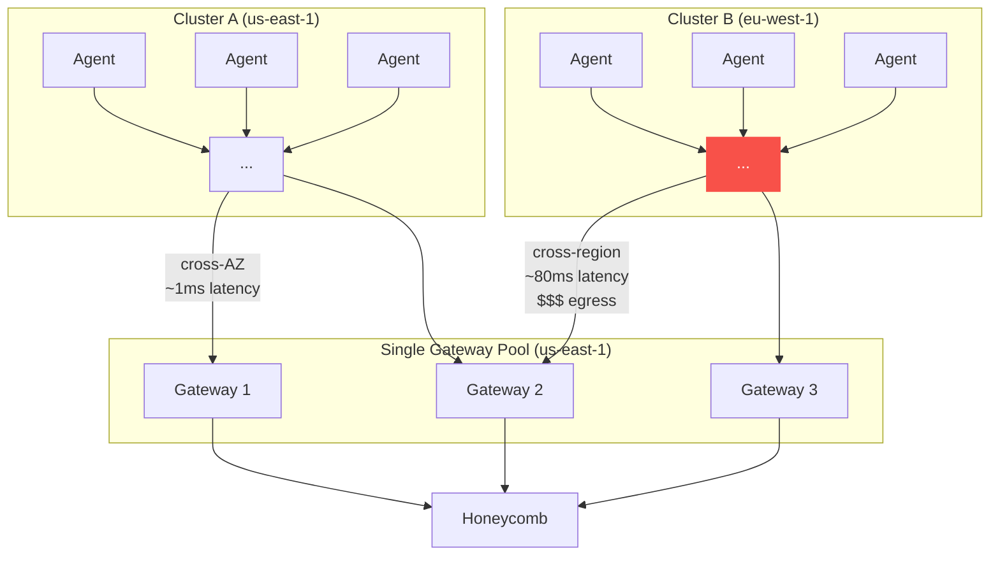
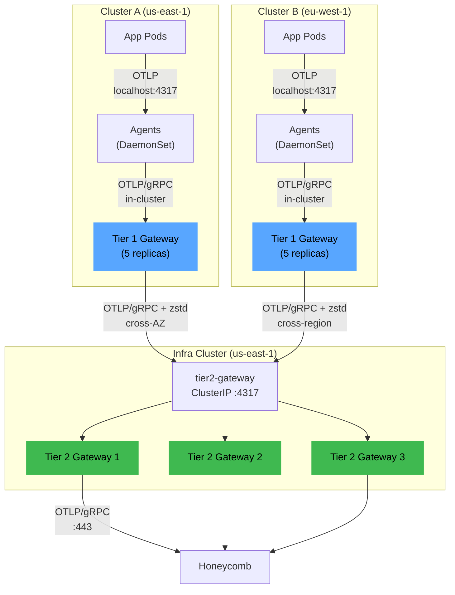
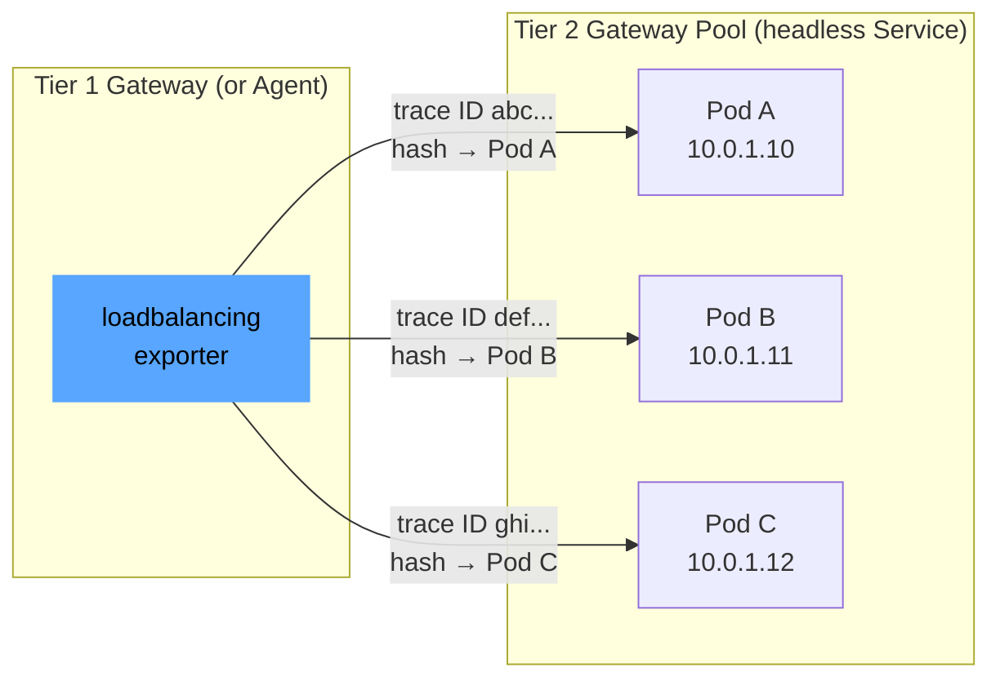
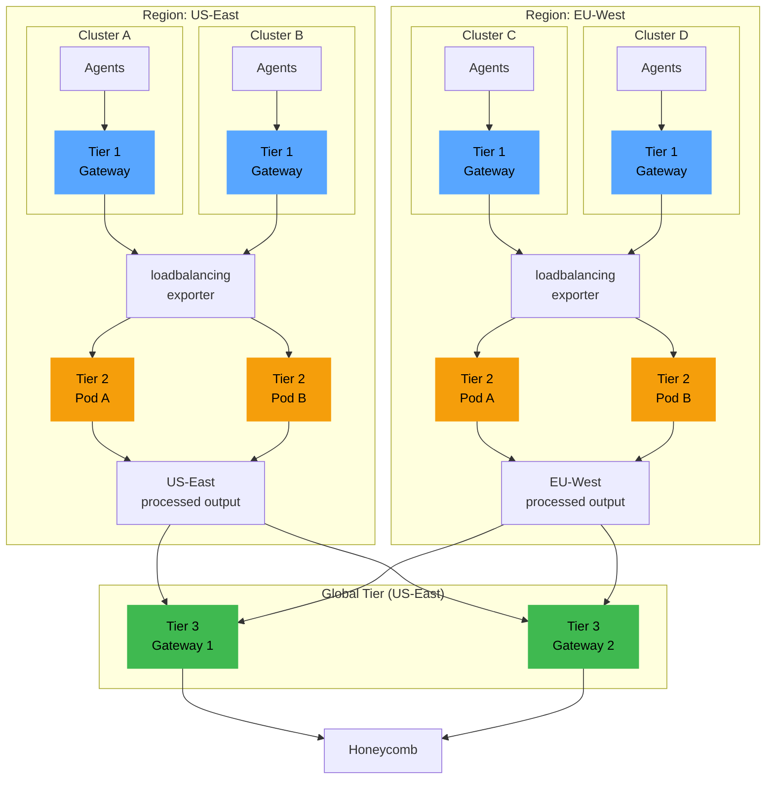
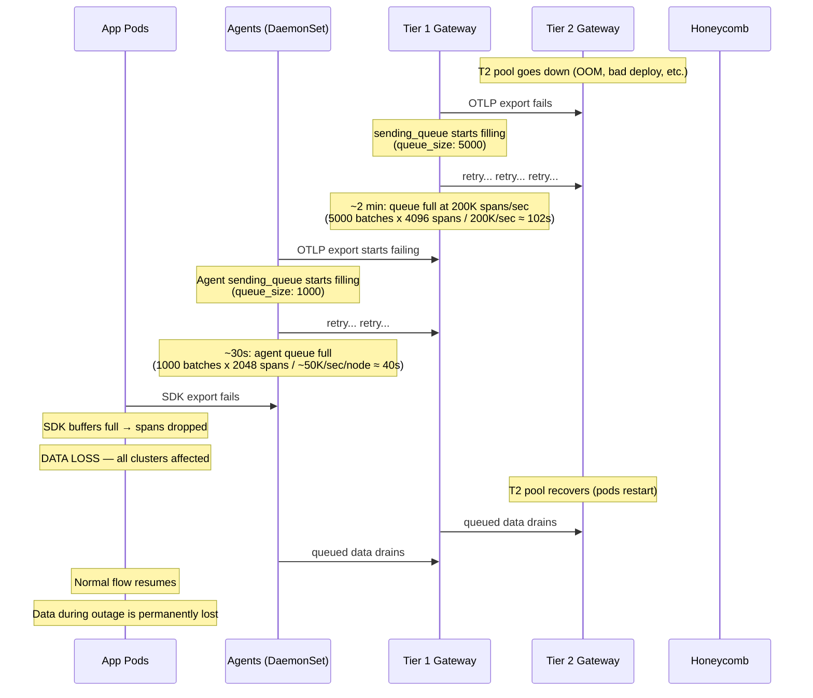

# Chapter 04 — Tiered Gateways

Multi-tier gateway architectures for organizations that have outgrown a single gateway pool. This chapter covers two-tier and three-tier topologies, multi-cluster routing, cross-cluster authentication, failure cascades, and sizing guidance.

If you are running a single Kubernetes cluster with under 500K spans/sec, you probably do not need any of this. The single-tier agent + gateway topology from chapter 03 will serve you well. Come back when it stops being enough.

---

## 1. When Single-Tier Isn't Enough

A single gateway pool works until it does not. These are the concrete signs that you have hit the ceiling:

| Signal | Why it forces a tier | Threshold |
|--------|---------------------|-----------|
| Aggregate throughput exceeds gateway pool capacity | A single pool at 10 replicas with 2Gi each handles ~500K spans/sec. Beyond that, you hit CPU limits on transform processing. | > 500K spans/sec aggregate |
| Multiple K8s clusters need unified processing | Each cluster's agents need a local gateway to avoid cross-cluster network hops. Routing decisions and centralized processing need a global view. | 2+ clusters |
| Regional compliance requirements | EU data must be processed in EU before any aggregation or export. A single global gateway pool violates data residency requirements. | GDPR, data sovereignty mandates |
| Different backend routing per cluster or environment | Production cluster routes to Honeycomb with full retention. Staging cluster routes to Honeycomb with 10% sampling. A single pool cannot serve both without complex routing logic in every pipeline. | Different sampling/routing per cluster |

### Single-tier bottleneck

This is what breaks when a single gateway pool serves multiple clusters directly:



Problems with this topology:

- **Cross-region latency**: Cluster B's agents send data across the Atlantic to the gateway pool. At 80ms RTT, gRPC streams are slower to establish and recover from errors.
- **Egress cost**: Cross-region data transfer costs $0.02-0.09/GB depending on the cloud provider. At 200K spans/sec from Cluster B (~50 GB/day uncompressed, ~15 GB/day with zstd), that is $300-1,350/month in egress alone.
- **Blast radius**: If the single gateway pool goes down, both clusters lose all telemetry simultaneously.
- **Compliance violation**: EU-origin data transits through us-east-1 before reaching the backend. Depending on your regulatory context, this may be a hard blocker.

---

## 2. Two-Tier Architecture

The two-tier model adds a cluster-local gateway pool (Tier 1) in front of a regional or central gateway pool (Tier 2). Each tier has a distinct job.

| Tier | Location | Responsibilities | Deployed as |
|------|----------|-----------------|-------------|
| **Tier 1** | Per cluster | K8s metadata enrichment overflow from agents, initial filtering (drop healthchecks, truncate attributes), batching, compression before cross-cluster export | Deployment in each cluster's `otel` namespace |
| **Tier 2** | Dedicated infra cluster or regional cluster | Cross-cluster aggregation, transform processing, routing to backends | Deployment in a central infrastructure cluster |

### Architecture



### Tier 1 gateway config (cluster-local)

This config handles filtering, batching, and forwarding. Heavy processing (transforms, routing) happens at Tier 2.

```yaml
# Tier 1 gateway — deployed per cluster
# Handles: filtering, attribute truncation, batching, forward to Tier 2
receivers:
  otlp:
    protocols:
      grpc:
        endpoint: 0.0.0.0:4317
        max_recv_msg_size_mib: 16

processors:
  memory_limiter:
    check_interval: 1s
    limit_mib: 1600       # 80% of 2Gi container limit
    spike_limit_mib: 400

  # Drop healthcheck and readiness probe spans at the edge
  # These never need to leave the cluster
  filter/drop-noise:
    error_mode: ignore
    traces:
      span:
        - 'attributes["http.route"] == "/healthz"'
        - 'attributes["http.route"] == "/readyz"'
        - 'attributes["http.route"] == "/livez"'
        - 'attributes["http.target"] == "/healthz"'

  # Truncate oversized attributes before they cross the wire
  transform/truncate:
    trace_statements:
      - context: span
        statements:
          - truncate_all(attributes, 4096)
    log_statements:
      - context: log
        statements:
          - truncate_all(attributes, 4096)

  # Tag with cluster identity so Tier 2 knows where data came from
  resource/cluster-identity:
    attributes:
      - key: k8s.cluster.name
        value: "cluster-a"         # Change per cluster
        action: upsert
      - key: collector.tier
        value: "tier-1"
        action: upsert

  batch:
    send_batch_size: 2048
    send_batch_max_size: 4096
    timeout: 2s

exporters:
  # Forward to Tier 2 regional gateway
  otlp/tier2:
    endpoint: tier2-gateway.infra-cluster.example.com:4317
    tls:
      insecure: false
      cert_file: /etc/otelcol/tls/client.crt
      key_file: /etc/otelcol/tls/client.key
      ca_file: /etc/otelcol/tls/ca.crt
    compression: zstd
    retry_on_failure:
      enabled: true
      initial_interval: 5s
      max_interval: 30s
      max_elapsed_time: 120s
    sending_queue:
      enabled: true
      num_consumers: 10
      queue_size: 5000           # Buffer during Tier 2 blips

extensions:
  health_check:
    endpoint: 0.0.0.0:13133

service:
  extensions: [health_check]
  pipelines:
    traces:
      receivers: [otlp]
      processors:
        - memory_limiter
        - filter/drop-noise
        - transform/truncate
        - resource/cluster-identity
        - batch
      exporters: [otlp/tier2]
    metrics:
      receivers: [otlp]
      processors:
        - memory_limiter
        - resource/cluster-identity
        - batch
      exporters: [otlp/tier2]
    logs:
      receivers: [otlp]
      processors:
        - memory_limiter
        - transform/truncate
        - resource/cluster-identity
        - batch
      exporters: [otlp/tier2]
  telemetry:
    metrics:
      address: 0.0.0.0:8888
      level: detailed
```

### Tier 2 gateway config (regional/central)

This config receives data from all Tier 1 gateways and performs the heavy processing: transforms, filtering, and backend export. It is the only tier that holds Honeycomb API keys.

```yaml
# Tier 2 gateway — deployed in the infrastructure cluster
# Handles: transforms, filtering, backend export
receivers:
  otlp:
    protocols:
      grpc:
        endpoint: 0.0.0.0:4317
        max_recv_msg_size_mib: 16
      http:
        endpoint: 0.0.0.0:4318

processors:
  memory_limiter:
    check_interval: 1s
    limit_mib: 1638       # 80% of 2Gi container limit
    spike_limit_mib: 400

  # Normalize semantic conventions across clusters
  # (different clusters may run different SDK versions)
  transform/normalize:
    trace_statements:
      - context: span
        statements:
          - set(attributes["http.request.method"], attributes["http.method"])
            where attributes["http.method"] != nil
          - delete_key(attributes, "http.method")
            where attributes["http.request.method"] != nil
          - set(attributes["url.full"], attributes["http.url"])
            where attributes["http.url"] != nil
          - delete_key(attributes, "http.url")
            where attributes["url.full"] != nil

  batch:
    send_batch_size: 4096
    send_batch_max_size: 8192
    timeout: 5s

exporters:
  otlp/honeycomb:
    endpoint: api.honeycomb.io:443
    headers:
      x-honeycomb-team: ${env:HONEYCOMB_API_KEY}
    compression: zstd
    retry_on_failure:
      enabled: true
      initial_interval: 5s
      max_interval: 30s
      max_elapsed_time: 300s
    sending_queue:
      enabled: true
      num_consumers: 20
      queue_size: 10000
    timeout: 30s

extensions:
  health_check:
    endpoint: 0.0.0.0:13133

service:
  extensions: [health_check]
  pipelines:
    traces:
      receivers: [otlp]
      processors:
        - memory_limiter
        - transform/normalize
        - batch
      exporters: [otlp/honeycomb]
    metrics:
      receivers: [otlp]
      processors:
        - memory_limiter
        - batch
      exporters: [otlp/honeycomb]
    logs:
      receivers: [otlp]
      processors:
        - memory_limiter
        - batch
      exporters: [otlp/honeycomb]
  telemetry:
    metrics:
      address: 0.0.0.0:8888
      level: detailed
```

> **A note on tail sampling**: The `tail_sampling` processor exists in the OTel Collector and can make per-trace keep/drop decisions based on error status, latency, etc. However, it is **not recommended for production** at this time due to stability concerns and complex scaling requirements — all spans for a given trace must arrive at the same collector instance, which requires the `loadbalancing` exporter and careful management of scaling events. For sampling, prefer **head-based sampling at the SDK level** using the `parentbased_traceidratio` sampler (e.g., `OTEL_TRACES_SAMPLER=parentbased_traceidratio` with `OTEL_TRACES_SAMPLER_ARG=0.1` for 10% sampling). This is simpler, more reliable, and does not require trace-aware routing infrastructure.

---

## 3. The `loadbalancing` Exporter

The `loadbalancing` exporter routes spans to specific backend pods using consistent hashing on a key (typically trace ID). This ensures all spans for a given trace reach the same gateway instance — useful for any processing that benefits from seeing complete traces.

> **Note**: The primary use case for trace-aware routing was tail sampling, which is **not recommended for production** at this time (see the note in section 2). Without tail sampling, a standard `ClusterIP` Service with round-robin load balancing is sufficient for most Tier 2 deployments. The `loadbalancing` exporter adds operational complexity (headless Services, DNS resolution management, scaling event handling) that is not justified unless you have a specific need for trace-affinity routing. This section is included for reference and as a future consideration if/when tail sampling stabilizes.

### How it works

1. The exporter resolves a set of backend pod IPs via DNS (using a headless Service).
2. It hashes each span's trace ID using consistent hashing.
3. The hash maps to a specific backend pod IP.
4. All spans with the same trace ID go to the same pod.



### `loadbalancing` exporter config

```yaml
exporters:
  loadbalancing:
    routing_key: traceID
    protocol:
      otlp:
        tls:
          insecure: false
          cert_file: /etc/otelcol/tls/client.crt
          key_file: /etc/otelcol/tls/client.key
          ca_file: /etc/otelcol/tls/ca.crt
        compression: zstd
        timeout: 10s
    resolver:
      dns:
        # Must point to a headless Service (clusterIP: None)
        # The exporter resolves this to individual pod IPs
        hostname: tier2-gateway-headless.otel.svc.cluster.local
        port: 4317
        interval: 5s     # How often to re-resolve DNS
```

### Headless Service manifest

The `loadbalancing` exporter needs to discover individual pod IPs, not a virtual ClusterIP. A headless Service (`clusterIP: None`) returns A records for each pod instead of a single virtual IP.

```yaml
apiVersion: v1
kind: Service
metadata:
  name: tier2-gateway-headless
  namespace: otel
spec:
  clusterIP: None              # Headless — returns pod IPs directly
  selector:
    app.kubernetes.io/name: tier2-gateway
  ports:
    - name: otlp-grpc
      port: 4317
      targetPort: 4317
      protocol: TCP
```

You also need a regular ClusterIP Service for health checks, metrics scraping, and standard traffic:

```yaml
apiVersion: v1
kind: Service
metadata:
  name: tier2-gateway
  namespace: otel
spec:
  type: ClusterIP
  selector:
    app.kubernetes.io/name: tier2-gateway
  ports:
    - name: otlp-grpc
      port: 4317
      targetPort: 4317
      protocol: TCP
    - name: otlp-http
      port: 4318
      targetPort: 4318
      protocol: TCP
```

### Tradeoff: scaling events cause routing disruption

When the Tier 2 pool scales up or down, the consistent hash ring changes. During the DNS propagation interval (default 5s, configurable via `resolver.dns.interval`), some spans for in-flight traces will route to a different pod than their siblings.

**Mitigation**:

- Set `resolver.dns.interval: 5s` (the minimum practical value — lower causes excessive DNS queries).
- Scale the Tier 2 pool conservatively: use the HPA `scaleDown.stabilizationWindowSeconds: 300` to avoid flapping, and `scaleUp.policies` that add at most 2 pods per minute.

**For most deployments, a standard ClusterIP Service is sufficient.** Only use the `loadbalancing` exporter if you have a concrete requirement for trace-affinity routing.

---

## 4. Three-Tier Architecture

For multi-region deployments with regulatory constraints or throughput exceeding 2M spans/sec, a third tier provides global aggregation.

| Tier | Location | Responsibilities |
|------|----------|-----------------|
| **Tier 1** | Per cluster | Filtering, attribute enrichment, batching, cluster tagging |
| **Tier 2** | Per region | Regional compliance processing, transforms, filtering |
| **Tier 3** | Global (single region) | Unified export to Honeycomb, cross-region aggregation, multi-backend fanout |

### Architecture



### When to use three tiers

- **Regulatory requirement**: EU-origin telemetry must be processed (filtered, PII-scrubbed) within the EU before any data leaves the region. Tier 2 in EU-West satisfies this — processed data leaving Tier 2 has already been filtered to compliance.
- **Throughput > 2M spans/sec aggregate**: two tiers cannot handle the load without an unreasonable number of Tier 2 replicas.
- **Multi-region backend routing**: some telemetry goes to Honeycomb US, some to Honeycomb EU. Tier 3 handles the routing decision.

### Cost of the third tier

Three tiers is significant operational complexity:

- Three sets of configs to maintain, version, and deploy.
- Three sets of monitoring and alerting (chapter 09 covers Collector self-monitoring).
- Failure in any tier cascades to the tiers above it.
- Cross-region network costs between Tier 2 and Tier 3.

**Most organizations should stop at two tiers.** Only add the third when you have a concrete regulatory or scale requirement that two tiers cannot satisfy. If your primary motivation is "it feels like we might need it," you do not need it yet.

---

## 5. Multi-Cluster Routing

When multiple clusters feed into shared gateway tiers, you often need different processing per cluster. The `routing` connector splits traffic by resource attributes, sending each cluster's data through a dedicated processing pipeline.

### Use case

- Production cluster: keep 100% of traces.
- Staging cluster: head-sample at 10% via SDK, or use `probabilistic_sampler` processor.
- Dev cluster: head-sample at 1% via SDK (minimal retention for debugging).

### Routing connector config

The recommended approach for per-cluster sampling is to use **head sampling at the SDK level** (set `OTEL_TRACES_SAMPLER=parentbased_traceidratio` with different `OTEL_TRACES_SAMPLER_ARG` values per environment) or the `probabilistic_sampler` processor at the gateway. This avoids the complexity of tail sampling while still providing per-cluster volume control.

```yaml
# Tier 2 gateway with per-cluster routing and probabilistic sampling
receivers:
  otlp:
    protocols:
      grpc:
        endpoint: 0.0.0.0:4317

connectors:
  routing:
    table:
      - statement: route()
        condition: 'resource.attributes["k8s.cluster.name"] == "production"'
        pipelines: [traces/production]
      - statement: route()
        condition: 'resource.attributes["k8s.cluster.name"] == "staging"'
        pipelines: [traces/staging]
      - statement: route()
        condition: 'resource.attributes["k8s.cluster.name"] == "dev"'
        pipelines: [traces/dev]
    default_pipelines: [traces/production]

processors:
  memory_limiter:
    check_interval: 1s
    limit_mib: 1638
    spike_limit_mib: 400

  # Production: keep all traces (sampling done at SDK level if needed)
  batch/production:
    send_batch_size: 4096
    timeout: 5s

  # Staging: probabilistic 10% sample at the gateway
  probabilistic_sampler/staging:
    sampling_percentage: 10

  batch/staging:
    send_batch_size: 2048
    timeout: 5s

  # Dev: probabilistic 1% sample at the gateway
  probabilistic_sampler/dev:
    sampling_percentage: 1

  batch/dev:
    send_batch_size: 1024
    timeout: 5s

exporters:
  otlp/honeycomb:
    endpoint: api.honeycomb.io:443
    headers:
      x-honeycomb-team: ${env:HONEYCOMB_API_KEY}
    compression: zstd
    sending_queue:
      enabled: true
      queue_size: 10000

service:
  pipelines:
    # Ingestion pipeline — all clusters enter here
    traces/ingest:
      receivers: [otlp]
      processors: [memory_limiter]
      exporters: [routing]

    # Per-cluster processing pipelines
    traces/production:
      receivers: [routing]
      processors: [batch/production]
      exporters: [otlp/honeycomb]

    traces/staging:
      receivers: [routing]
      processors: [probabilistic_sampler/staging, batch/staging]
      exporters: [otlp/honeycomb]

    traces/dev:
      receivers: [routing]
      processors: [probabilistic_sampler/dev, batch/dev]
      exporters: [otlp/honeycomb]
```

> **Note on probabilistic vs. tail sampling**: The `probabilistic_sampler` processor is a head sampler — it makes per-span decisions without seeing the complete trace. This means it cannot selectively keep error or slow traces while sampling normal traffic. If you need error-aware sampling, implement it at the SDK level: configure the SDK to always record error spans (using a custom sampler or the `parentbased_always_on` sampler with SDK-side filtering) and use head sampling for baseline traffic.

### Routing fan-out

```mermaid
graph LR
    INGEST["traces/ingest<br/>receivers: otlp<br/>processors: memory_limiter"] --> ROUTER["routing<br/>connector"]

    ROUTER -->|'k8s.cluster.name<br/>== "production"'| PROD["traces/production<br/>100% (no sampling)"]
    ROUTER -->|'k8s.cluster.name<br/>== "staging"'| STAGING["traces/staging<br/>probabilistic: 10%"]
    ROUTER -->|'k8s.cluster.name<br/>== "dev"'| DEV["traces/dev<br/>probabilistic: 1%"]

    PROD --> HC["otlp/honeycomb"]
    STAGING --> HC
    DEV --> HC

    style ROUTER fill:#f59e0b,stroke:#f59e0b,color:#000
    style PROD fill:#3fb950,stroke:#3fb950,color:#000
    style STAGING fill:#58a6ff,stroke:#58a6ff,color:#000
    style DEV fill:#8b5cf6,stroke:#8b5cf6,color:#fff
```

**Important**: the `routing` connector requires the `k8s.cluster.name` resource attribute to be set before data reaches this tier. That is why the Tier 1 config in section 2 includes the `resource/cluster-identity` processor. If the attribute is missing, data falls through to `default_pipelines`.

For signal separation patterns (dedicated Collector pools per signal type), see chapter 05.

---

## 6. Cross-Cluster Authentication

When Tier 1 gateways in one cluster export to Tier 2 gateways in another cluster, the traffic crosses a trust boundary. You need mutual TLS (mTLS) to authenticate both ends of the connection.

### TLS config: exporter side (Tier 1, client)

```yaml
exporters:
  otlp/tier2:
    endpoint: tier2-gateway.infra-cluster.example.com:4317
    tls:
      insecure: false
      # Client certificate — proves Tier 1's identity to Tier 2
      cert_file: /etc/otelcol/tls/client.crt
      key_file: /etc/otelcol/tls/client.key
      # CA certificate — verifies Tier 2's server certificate
      ca_file: /etc/otelcol/tls/ca.crt
```

### TLS config: receiver side (Tier 2, server)

```yaml
receivers:
  otlp:
    protocols:
      grpc:
        endpoint: 0.0.0.0:4317
        tls:
          # Server certificate — proves Tier 2's identity to Tier 1
          cert_file: /etc/otelcol/tls/server.crt
          key_file: /etc/otelcol/tls/server.key
          # Client CA — verifies Tier 1's client certificate
          # Only Tier 1 gateways with certs signed by this CA can connect
          client_ca_file: /etc/otelcol/tls/client-ca.crt
```

### K8s Secrets for certificate management

```yaml
# Secret for Tier 1 (client certs)
apiVersion: v1
kind: Secret
metadata:
  name: otel-tier1-tls
  namespace: otel
type: kubernetes.io/tls
data:
  tls.crt: <base64-encoded client certificate>
  tls.key: <base64-encoded client private key>
  ca.crt: <base64-encoded CA certificate>
---
# Mount in the Tier 1 gateway Deployment
# ...
          volumeMounts:
            - name: tls-certs
              mountPath: /etc/otelcol/tls
              readOnly: true
      volumes:
        - name: tls-certs
          secret:
            secretName: otel-tier1-tls
            items:
              - key: tls.crt
                path: client.crt
              - key: tls.key
                path: client.key
              - key: ca.crt
                path: ca.crt
```

```yaml
# Secret for Tier 2 (server certs + client CA)
apiVersion: v1
kind: Secret
metadata:
  name: otel-tier2-tls
  namespace: otel
type: kubernetes.io/tls
data:
  tls.crt: <base64-encoded server certificate>
  tls.key: <base64-encoded server private key>
  client-ca.crt: <base64-encoded client CA certificate>
```

### Certificate rotation

Certificates expire. Plan for rotation:

1. **cert-manager** with a shared CA Issuer across clusters is the most common approach. It auto-renews certificates and stores them as K8s Secrets. The Collector picks up new certs on the next TLS handshake (gRPC connections are long-lived, so you may need to restart the Collector or set `max_connection_age` on the receiver).
2. **Vault PKI** with short-lived certificates (24-hour TTL) and an init container or sidecar that refreshes them.
3. **Manual rotation** with a runbook and a calendar reminder. Works for small deployments; does not scale past 5 clusters.

### Alternative: service mesh

If you are already running Istio or Linkerd, the mesh handles mTLS transparently. The Collector does not need any TLS config — the sidecar proxy encrypts and authenticates traffic between pods across clusters (assuming multi-cluster mesh federation is configured).

```yaml
# With a service mesh, the Collector config is simpler:
exporters:
  otlp/tier2:
    endpoint: tier2-gateway.otel.svc.cluster.local:4317
    tls:
      insecure: true    # Mesh handles encryption
```

**Tradeoff**: the mesh simplifies certificate management but adds a dependency. If the mesh control plane is down, inter-cluster Collector communication fails. You are trading one operational concern (cert management) for another (mesh availability). If you already have the mesh, use it. If you would need to deploy a mesh solely for Collector mTLS, manage the certs directly.

---

## 7. Failure Modes and Cascades

Tiered architectures add more points of failure. Each tier's failure propagates upstream because every upstream tier's queues fill when the downstream tier stops accepting data.

### Cascade diagram: Tier 2 pool goes down



### Failure scenario matrix

| # | Scenario | What happens | Time to data loss | Blast radius | Mitigation |
|---|----------|-------------|-------------------|--------------|------------|
| 1 | **Tier 2 pool down** | T1 queues fill (5000 batches x 4096 spans = 20.4M spans buffered). At 200K spans/sec inbound to T1, queue exhausts in ~102s. Then T1 rejects data from agents. Agent queues (1000 batches x 2048 spans = 2M spans) exhaust in ~40s at 50K spans/sec/node. Then agents drop. | ~2.5 min | All clusters | PDB on T2, multi-AZ spread, HPA on memory, circuit breaker (see below) |
| 2 | **Network partition between clusters** | Affected cluster's T1 cannot reach T2. That cluster's queues fill and drain locally. Other clusters are unaffected. | ~2 min for partitioned cluster | Single cluster | Multiple T2 endpoints (cross-region failover), queue sizing to bridge typical partition duration |
| 3 | **DNS resolution failure for `loadbalancing` exporter** | Exporter keeps routing to stale pod IPs. If pods were replaced (rolling update), traffic goes to non-existent IPs → connection failures. If pods were added, they receive no traffic → uneven load → existing pods may OOM. | Varies. Stale IPs: immediate failures. Missing new pods: gradual OOM over 5-15 min. | Tier 2 pool | Monitor DNS resolution latency, set `resolver.dns.interval: 5s`, alert on `otelcol_loadbalancer_num_backend_updates == 0` for > 30s |
| 4 | **Tier 1 pool down in one cluster** | Only that cluster's agents cannot forward. Agent queues fill, then drop. Other clusters unaffected. T2 sees reduced volume from the affected cluster. | ~30s (agent queue exhaustion) | Single cluster | PDB on T1, HPA, sufficient replicas |
| 5 | **Honeycomb ingest outage** | T2 sending_queue fills. T2 rejects from T1. Cascade propagates upstream through all tiers. | ~5 min (T2 queue_size 10000 x 8192 spans / 500K/sec ≈ 163s, plus upstream queue drain) | All clusters, all tiers | Generous T2 queue_size, alert on `otelcol_exporter_queue_size` approaching capacity, circuit breaker pattern |

### Queue sizing formula

To calculate how long your queues buffer before data loss:

```
buffer_time_seconds = queue_size * batch_size / throughput_per_second
```

Examples:

| Tier | queue_size | batch_size | throughput (spans/sec) | Buffer time |
|------|-----------|------------|----------------------|-------------|
| Agent | 1,000 | 2,048 | 50,000/node | 40s |
| Tier 1 | 5,000 | 4,096 | 200,000/cluster | 102s |
| Tier 2 | 10,000 | 8,192 | 500,000 aggregate | 163s |

If you need to survive a 5-minute Tier 2 outage without data loss, work backwards:

```
queue_size = (target_buffer_seconds * throughput_per_second) / batch_size
queue_size = (300 * 200,000) / 4,096 = 14,648 → round to 15,000
```

But larger queues consume more memory. Each queued batch at 4096 spans is roughly 2-4 MB (depending on attribute density). At 15,000 batches: 30-60 GB. That is not practical for a single pod. This is why queues are a stopgap, not a solution. Fix the downstream tier, do not try to buffer through a prolonged outage.

For detailed queue and memory tuning formulas, see chapter 06.

### Circuit breaker pattern

If Tier 2 is down and you would rather send degraded data (no transforms, no filtering) than lose data entirely, configure a fallback exporter on Tier 1 that sends directly to Honeycomb:

```yaml
# Tier 1 circuit breaker — fallback direct-to-Honeycomb export
exporters:
  otlp/tier2:
    endpoint: tier2-gateway.infra-cluster.example.com:4317
    tls:
      insecure: false
      cert_file: /etc/otelcol/tls/client.crt
      key_file: /etc/otelcol/tls/client.key
      ca_file: /etc/otelcol/tls/ca.crt
    compression: zstd
    sending_queue:
      enabled: true
      queue_size: 5000
    retry_on_failure:
      enabled: true
      max_elapsed_time: 120s    # Stop retrying after 2 min

  # Fallback: direct to Honeycomb, bypassing Tier 2
  # Data arrives un-transformed — but it arrives
  otlp/honeycomb-fallback:
    endpoint: api.honeycomb.io:443
    headers:
      x-honeycomb-team: ${env:HONEYCOMB_API_KEY}
    compression: zstd
    sending_queue:
      enabled: true
      queue_size: 5000

service:
  pipelines:
    traces:
      receivers: [otlp]
      processors: [memory_limiter, filter/drop-noise, batch]
      # Both exporters in the pipeline — data goes to both
      # When Tier 2 is healthy, you get duplicates in Honeycomb
      # (once via Tier 2, once via fallback). Deduplicate by trace ID.
      exporters: [otlp/tier2, otlp/honeycomb-fallback]
```

**Tradeoff**: this approach causes duplicate data in Honeycomb when Tier 2 is healthy (data arrives via both paths). You can mitigate this by:

1. Not using the circuit breaker pattern (accept data loss during Tier 2 outages — this is the simpler choice for most teams).
2. Using a `failover` exporter group (community contribution, not yet in stable upstream — check the `failoverconnector` status before relying on it).
3. Implementing external health-check-based config switching (complex, not recommended unless you have a dedicated platform team).

For most organizations, the right answer is: size Tier 2 for high availability (3+ replicas, PDB, multi-AZ), monitor it aggressively (chapter 09), and accept that a total Tier 2 outage means data loss until it recovers. The queue buffer gives you 2-3 minutes of protection, which covers the vast majority of transient failures.

---

## 8. Regional Gateway Configuration (Complete)

This is a complete, production-ready config for a Tier 2 regional gateway. Copy it, change the environment-specific values, and deploy.

```yaml
# configs/tiered-gateway-regional.yaml
# Tier 2 regional gateway — complete production config
#
# Deploy as: Deployment with 5+ replicas in the infrastructure cluster
# Memory limit: 2Gi per replica
# GOMEMLIMIT: 1638MiB (~80% of 2Gi)
#
# Receives from: Tier 1 gateways in all clusters
# Exports to: Honeycomb (OTLP/gRPC)

receivers:
  otlp:
    protocols:
      grpc:
        endpoint: 0.0.0.0:4317
        max_recv_msg_size_mib: 16
        keepalive:
          server_parameters:
            max_connection_age: 300s       # Force reconnect to rebalance
            max_connection_age_grace: 60s
      http:
        endpoint: 0.0.0.0:4318

processors:
  # First in the pipeline. Always.
  memory_limiter:
    check_interval: 1s
    limit_mib: 1638       # 80% of 2Gi container limit
    spike_limit_mib: 400  # ~25% of limit_mib

  # Normalize semantic conventions across clusters
  transform/normalize:
    trace_statements:
      - context: span
        statements:
          # Migrate old HTTP semantic conventions to new ones
          - set(attributes["http.request.method"], attributes["http.method"])
            where attributes["http.method"] != nil
          - delete_key(attributes, "http.method")
            where attributes["http.request.method"] != nil
          - set(attributes["url.full"], attributes["http.url"])
            where attributes["http.url"] != nil
          - delete_key(attributes, "http.url")
            where attributes["url.full"] != nil
          # Cap attribute value length — Honeycomb has a 64KB per-event limit
          - truncate_all(attributes, 8192)

  batch:
    send_batch_size: 4096
    send_batch_max_size: 8192
    timeout: 5s

exporters:
  otlp/honeycomb:
    endpoint: api.honeycomb.io:443
    headers:
      x-honeycomb-team: ${env:HONEYCOMB_API_KEY}
    compression: zstd
    retry_on_failure:
      enabled: true
      initial_interval: 5s
      max_interval: 30s
      max_elapsed_time: 300s
    sending_queue:
      enabled: true
      num_consumers: 20
      queue_size: 10000
    timeout: 30s

extensions:
  health_check:
    endpoint: 0.0.0.0:13133
  pprof:
    endpoint: 0.0.0.0:1777         # For profiling during incidents

service:
  extensions: [health_check, pprof]
  pipelines:
    traces:
      receivers: [otlp]
      processors:
        - memory_limiter           # First: prevent OOM
        - transform/normalize      # Second: normalize attributes
        - batch                    # Last: batch for efficient export
      exporters: [otlp/honeycomb]
    metrics:
      receivers: [otlp]
      processors:
        - memory_limiter
        - batch
      exporters: [otlp/honeycomb]
    logs:
      receivers: [otlp]
      processors:
        - memory_limiter
        - batch
      exporters: [otlp/honeycomb]
  telemetry:
    metrics:
      address: 0.0.0.0:8888
      level: detailed
    logs:
      level: info
      # Reduce log noise from healthy operation
      initial_fields:
        service: tier2-gateway
```

> **Note on sampling**: If you need to reduce trace volume, the recommended approach is head sampling at the SDK level (`OTEL_TRACES_SAMPLER=parentbased_traceidratio`). For gateway-level sampling, use the `probabilistic_sampler` processor. See the per-cluster routing example in section 5.

Full config at `configs/tiered-gateway-regional.yaml`.

---

## 9. Sizing for Tiered Architectures

### Replica count by throughput

| Total throughput | Architecture | Tier 1 (per cluster) | Tier 2 (regional) | Tier 3 (global) |
|-----------------|-------------|---------------------|-------------------|-----------------|
| 500K - 1M spans/sec | 2-tier | 5 replicas | 10 replicas | -- |
| 1M - 5M spans/sec | 2-tier | 10 replicas | 20 replicas | -- |
| 5M+ spans/sec | 3-tier | 10 replicas/cluster | 15 replicas/region | 10 replicas |

### Memory per replica by tier

| Tier | Memory | Notes |
|------|--------|-------|
| Tier 1 | 2Gi | Light processing: filter, truncate, batch |
| Tier 2 | 2Gi | Transforms, filtering, batch, export |
| Tier 3 | 2Gi | Batching and export; increase if doing heavy transforms |

### CPU per replica

| Tier | CPU request | Notes |
|------|------------|-------|
| Tier 1 | 500m - 1000m | Light processing: filter, truncate, batch |
| Tier 2 | 1000m - 2000m | Transform processing and export |
| Tier 3 | 1000m - 2000m | Batching and export; CPU depends on compression and serialization |

No CPU limits. Same reasoning as chapter 02: CPU throttling on a collector causes backpressure to cascade upstream.

### Total resource cost example

A 2M spans/sec deployment with two tiers, 3 clusters:

| Component | Replicas | CPU request (each) | Memory limit (each) | Total CPU | Total memory |
|-----------|----------|-------------------|---------------------|-----------|-------------|
| Tier 1 (Cluster A) | 10 | 1000m | 2Gi | 10 cores | 20Gi |
| Tier 1 (Cluster B) | 10 | 1000m | 2Gi | 10 cores | 20Gi |
| Tier 1 (Cluster C) | 10 | 1000m | 2Gi | 10 cores | 20Gi |
| Tier 2 (regional) | 20 | 2000m | 2Gi | 40 cores | 40Gi |
| **Total** | **50** | | | **70 cores** | **100Gi** |

At on-demand pricing (m5.2xlarge at ~$0.384/hr, 8 vCPU, 32 GiB), you need roughly 5 nodes for this pool. That is ~$1,400/month in compute. Spot instances cut this by 60-70% if your workload tolerates interruptions (gateway pods are stateless and restart cleanly).

Compare this to the cost of the telemetry data itself at the backend. At 2M spans/sec and 10% sampling, you are sending ~200K spans/sec to Honeycomb. That volume drives backend costs far higher than the infrastructure cost of the collectors. The collector infrastructure is not the expensive part of your observability pipeline.

### GOMEMLIMIT settings

Set `GOMEMLIMIT` to ~80% of the container memory limit at every tier:

| Memory limit | GOMEMLIMIT | Headroom for |
|-------------|-----------|-------------|
| 2Gi | 1600MiB | Go GC, kernel buffers, off-heap allocations |
| 4Gi | 3200MiB | Same, scaled up |
| 8Gi | 6400MiB | Same, scaled up |

Without `GOMEMLIMIT`, the Go runtime does not know about the container's memory constraint. It will allocate until the kernel OOM-kills the pod. With `GOMEMLIMIT`, the garbage collector runs more aggressively as the process approaches the soft limit, preventing most OOM kills.

For detailed tuning of batch sizes, queue depths, and memory limiter thresholds, see chapter 06.

---

## Summary

| Decision | Choose this | When |
|----------|------------|------|
| Single-tier (ch 03) | 1 cluster, < 500K spans/sec | Most organizations |
| Two-tier | Multiple clusters, 500K-5M spans/sec | Medium-to-large platform teams |
| Three-tier | Multi-region regulatory requirements, > 5M spans/sec | Large enterprises with compliance mandates |
| `routing` connector | Different processing per cluster or environment | Multi-cluster with different sampling policies |
| mTLS (manual) | Cross-cluster communication without a service mesh | No mesh, or mesh not trusted for this traffic |
| Service mesh mTLS | Cross-cluster communication with existing mesh | Mesh already deployed and operational |

**Start simple.** A single gateway pool handles more than most organizations think. Add tiers only when you hit a concrete wall — throughput that cannot be served, compliance that cannot be met, or blast radius that cannot be tolerated. Every tier you add is a tier you must monitor (chapter 09), tune (chapter 06), and debug at 3 AM.

---

**Next**: [Chapter 05 — Signal Separation](05-signal-separation.md) covers dedicated Collector pools per signal type (traces, metrics, logs) to isolate noisy signals and prevent one signal's volume spike from starving the others.
