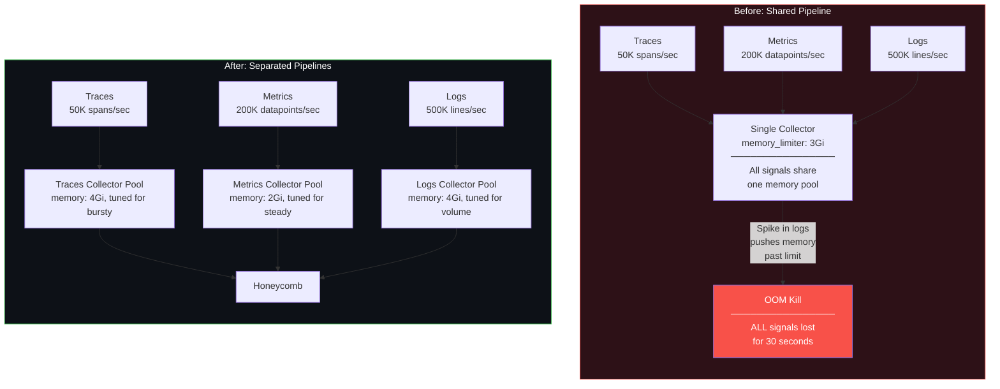
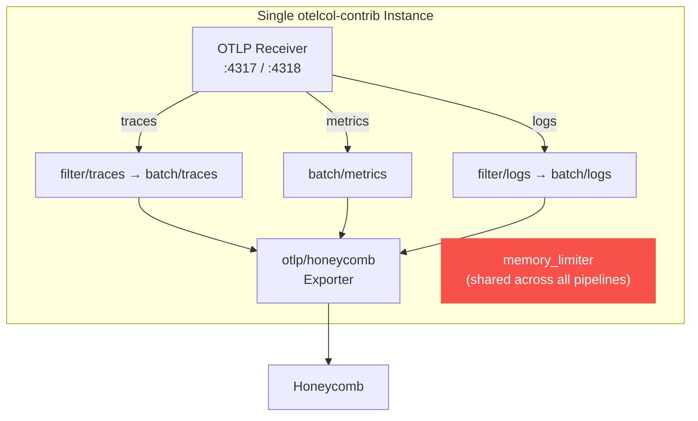
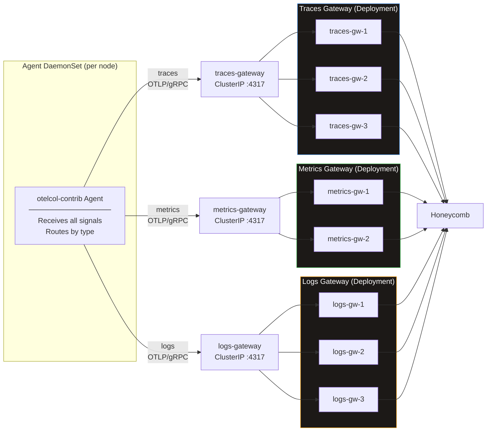
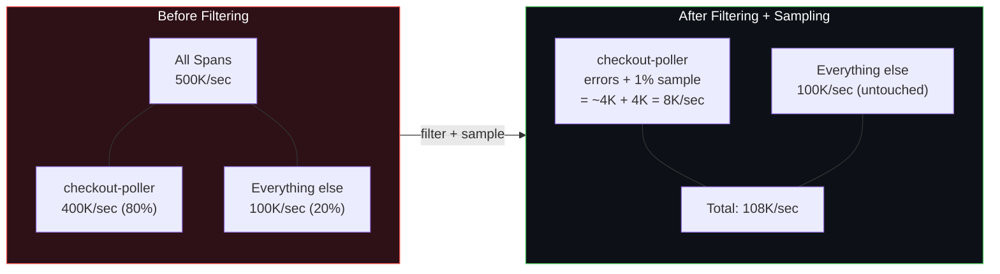
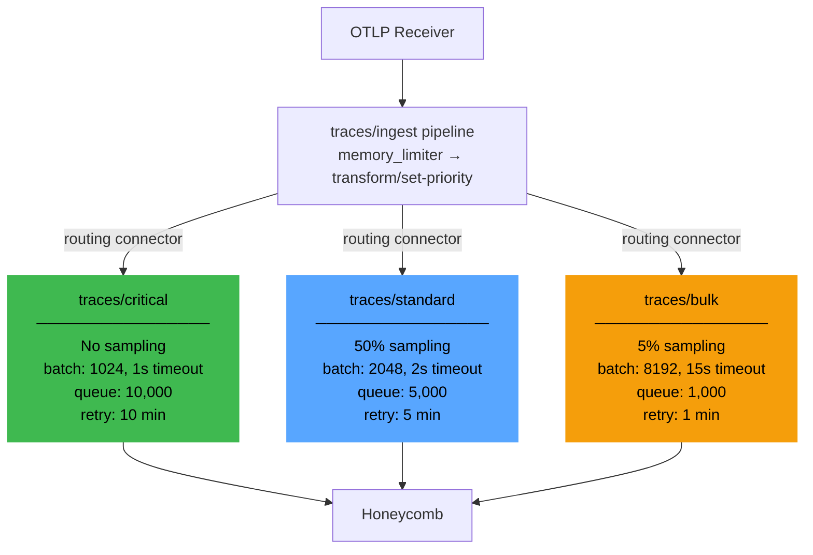

# Chapter 05 — Signal Separation

Traces, metrics, and logs have fundamentally different traffic profiles. When you push all three through a single collector pipeline, you are betting that no single signal will ever spike hard enough to destabilize the others. That bet loses eventually. This chapter covers how to split signals into separate processing paths so that a metrics scrape storm does not OOM the collector that is also handling your traces.

---

## 1. Why Separate Signals?

### The problem

A single OTel Collector instance handling all three signal types shares one memory space, one `memory_limiter`, one set of queues. When any one signal spikes, it consumes headroom that the other signals need.

The failure mode the author has seen most often: a Prometheus federation scrape runs every 15 seconds, each scrape pulls 500K metric datapoints, and the resulting batch processor queue growth pushes the collector past its memory limit. The `memory_limiter` kicks in and starts refusing data — including the traces from your revenue-critical checkout service that happened to arrive in the same second. The collector OOMs, restarts, and you lose 30 seconds of all telemetry.

### Signals are not alike

| Characteristic | Traces | Metrics | Logs |
|---------------|--------|---------|------|
| Traffic pattern | Bursty (follows request load) | Steady (scrape interval) | Extremely high volume, bursty |
| Payload size | Large (deep spans with many attributes) | Small (datapoint + labels) | Variable (raw text can be huge) |
| Relative volume | 1x baseline | 0.5-2x baseline | 10-100x baseline |
| Latency sensitivity | High (traces should flush quickly for timely debugging) | Low (a missed scrape is retried in 15-60s) | Low (seconds of delay acceptable) |
| Loss tolerance | Low for errors/SLO-tracked; moderate for bulk | Recoverable (next scrape fills the gap) | Moderate (structured events matter more than raw lines) |
| Processing cost | Moderate (transforms, filtering) | CPU-light | CPU-heavy (regex parsing, structuring) |

### Before vs. after



When logs spike and the logs collector OOMs, traces and metrics are completely unaffected. That is the point.

---

## 2. Multi-Pipeline Single Collector

The simplest form of signal separation: one collector instance with separate pipelines per signal type. No additional Deployments, no additional Services. You are splitting processing paths inside a single binary.

### Config

```yaml
# Single collector, separate pipelines per signal
receivers:
  otlp:
    protocols:
      grpc:
        endpoint: "0.0.0.0:4317"
      http:
        endpoint: "0.0.0.0:4318"

processors:
  # Shared memory limiter — this is the weakness of this approach
  memory_limiter:
    check_interval: 1s
    limit_mib: 3072
    spike_limit_mib: 768

  # Per-signal batch tuning
  batch/traces:
    send_batch_size: 2048
    send_batch_max_size: 4096
    timeout: 2s            # Traces: flush fast for timely debugging

  batch/metrics:
    send_batch_size: 4096
    send_batch_max_size: 8192
    timeout: 10s           # Metrics: larger batches, slower flush

  batch/logs:
    send_batch_size: 8192
    send_batch_max_size: 16384
    timeout: 15s           # Logs: largest batches, most patient

  # Traces: drop health check noise
  filter/traces:
    error_mode: ignore
    traces:
      span:
        - 'attributes["http.route"] == "/healthz"'
        - 'attributes["http.route"] == "/readyz"'

  # Logs: drop verbose debug lines
  filter/logs:
    error_mode: ignore
    logs:
      log_record:
        - 'severity_number < 9'  # Drop DEBUG and TRACE level

exporters:
  otlp/honeycomb:
    endpoint: "api.honeycomb.io:443"
    headers:
      "x-honeycomb-team": "${HONEYCOMB_API_KEY}"
    compression: zstd

service:
  pipelines:
    traces:
      receivers: [otlp]
      processors: [memory_limiter, filter/traces, batch/traces]
      exporters: [otlp/honeycomb]

    metrics:
      receivers: [otlp]
      processors: [memory_limiter, batch/metrics]
      exporters: [otlp/honeycomb]

    logs:
      receivers: [otlp]
      processors: [memory_limiter, filter/logs, batch/logs]
      exporters: [otlp/honeycomb]
```

### Architecture



### Tradeoffs

| | |
|---|---|
| **Pros** | Simple deployment: one Deployment, one ConfigMap, one Service. Per-signal batch tuning is still possible. Per-signal filtering reduces volume independently. Single binary to upgrade and monitor. |
| **Cons** | The `memory_limiter` is shared. A log surge consumes memory that traces need. If the collector OOMs, all three signals go down simultaneously. Cannot scale signals independently — scaling for log volume also scales traces, wasting resources. |

### When to use

- Total throughput under 100K events/sec across all signals.
- Signal volumes are reasonably balanced (no single signal is 10x the others).
- You want the operational simplicity of one Deployment and are willing to accept correlated failures.
- This is a stepping stone: start here, move to dedicated pools when you hit scaling limits.

---

## 3. Dedicated Pools Per Signal

The production-grade approach: separate Deployment and Service per signal type. The agent routes each signal to its dedicated gateway. Each gateway is sized, tuned, and scaled independently.

### Agent config (signal routing)

The agent receives all signals over a single OTLP endpoint and fans them out to three different gateway Services:

```yaml
# Agent DaemonSet — routes signals to dedicated gateways
receivers:
  otlp:
    protocols:
      grpc:
        endpoint: "0.0.0.0:4317"
      http:
        endpoint: "0.0.0.0:4318"

  hostmetrics:
    collection_interval: 30s
    root_path: /hostfs
    scrapers:
      cpu: {}
      memory: {}
      disk: {}
      network: {}
      load: {}

processors:
  memory_limiter:
    check_interval: 1s
    limit_mib: 384
    spike_limit_mib: 96

  k8sattributes:
    auth_type: serviceAccount
    passthrough: false
    extract:
      metadata:
        - k8s.namespace.name
        - k8s.deployment.name
        - k8s.pod.name
        - k8s.node.name

  batch/traces:
    send_batch_size: 1024
    timeout: 1s

  batch/metrics:
    send_batch_size: 2048
    timeout: 5s

  batch/logs:
    send_batch_size: 2048
    timeout: 5s

exporters:
  otlp/traces-gateway:
    endpoint: "traces-gateway.otel.svc.cluster.local:4317"
    tls:
      insecure: true
    compression: zstd
    sending_queue:
      enabled: true
      queue_size: 2000

  otlp/metrics-gateway:
    endpoint: "metrics-gateway.otel.svc.cluster.local:4317"
    tls:
      insecure: true
    compression: zstd
    sending_queue:
      enabled: true
      queue_size: 1000

  otlp/logs-gateway:
    endpoint: "logs-gateway.otel.svc.cluster.local:4317"
    tls:
      insecure: true
    compression: zstd
    sending_queue:
      enabled: true
      queue_size: 3000

service:
  pipelines:
    traces:
      receivers: [otlp]
      processors: [memory_limiter, k8sattributes, batch/traces]
      exporters: [otlp/traces-gateway]

    metrics:
      receivers: [otlp, hostmetrics]
      processors: [memory_limiter, k8sattributes, batch/metrics]
      exporters: [otlp/metrics-gateway]

    logs:
      receivers: [otlp]
      processors: [memory_limiter, k8sattributes, batch/logs]
      exporters: [otlp/logs-gateway]
```

### Traces gateway config

Optimized for bursty, latency-sensitive trace data. Traces should flush fast for timely debugging.

```yaml
# Traces gateway — optimized for bursty, latency-sensitive data
receivers:
  otlp:
    protocols:
      grpc:
        endpoint: "0.0.0.0:4317"
        max_recv_msg_size_mib: 16

processors:
  memory_limiter:
    check_interval: 1s
    limit_mib: 3072       # 75% of 4Gi pod limit
    spike_limit_mib: 768

  filter/drop-noise:
    error_mode: ignore
    traces:
      span:
        - 'attributes["http.route"] == "/healthz"'
        - 'attributes["http.route"] == "/readyz"'

  batch:
    send_batch_size: 2048
    send_batch_max_size: 4096
    timeout: 2s            # Fast flush — traces are latency-sensitive

exporters:
  otlp/honeycomb:
    endpoint: "api.honeycomb.io:443"
    headers:
      "x-honeycomb-team": "${HONEYCOMB_API_KEY}"
    compression: zstd
    sending_queue:
      enabled: true
      num_consumers: 10
      queue_size: 5000
    retry_on_failure:
      enabled: true
      initial_interval: 5s
      max_interval: 30s
      max_elapsed_time: 300s

service:
  telemetry:
    metrics:
      level: detailed
      address: "0.0.0.0:8888"
  pipelines:
    traces:
      receivers: [otlp]
      processors: [memory_limiter, filter/drop-noise, batch]
      exporters: [otlp/honeycomb]
```

### Metrics gateway config

Optimized for steady, predictable metric streams. Larger batch timeout because metrics are loss-tolerant — a missed scrape is filled in by the next one.

```yaml
# Metrics gateway — optimized for steady, predictable streams
receivers:
  otlp:
    protocols:
      grpc:
        endpoint: "0.0.0.0:4317"

processors:
  memory_limiter:
    check_interval: 1s
    limit_mib: 1536       # 75% of 2Gi pod limit
    spike_limit_mib: 384

  batch:
    send_batch_size: 4096
    send_batch_max_size: 8192
    timeout: 10s           # Patient — metrics are steady and loss-tolerant

  # Drop high-cardinality metric labels that inflate cost
  transform/drop-high-cardinality:
    metric_statements:
      - context: datapoint
        statements:
          - delete_key(attributes, "k8s.pod.uid")
          - delete_key(attributes, "container_id")

exporters:
  otlp/honeycomb:
    endpoint: "api.honeycomb.io:443"
    headers:
      "x-honeycomb-team": "${HONEYCOMB_API_KEY}"
    compression: zstd
    sending_queue:
      enabled: true
      num_consumers: 5
      queue_size: 3000
    retry_on_failure:
      enabled: true
      initial_interval: 5s
      max_interval: 60s
      max_elapsed_time: 600s  # Longer retry — metrics can wait

service:
  telemetry:
    metrics:
      level: detailed
      address: "0.0.0.0:8888"
  pipelines:
    metrics:
      receivers: [otlp]
      processors: [memory_limiter, transform/drop-high-cardinality, batch]
      exporters: [otlp/honeycomb]
```

### Logs gateway config

Optimized for extreme volume. Largest batches, longest timeouts, most aggressive filtering. Logs are where you get the biggest bang from volume reduction.

```yaml
# Logs gateway — optimized for extreme volume
receivers:
  otlp:
    protocols:
      grpc:
        endpoint: "0.0.0.0:4317"
        max_recv_msg_size_mib: 32  # Logs can be large

processors:
  memory_limiter:
    check_interval: 1s
    limit_mib: 3072       # 75% of 4Gi pod limit
    spike_limit_mib: 768

  # Aggressive filtering — this is where most volume savings come from
  filter/drop-noise:
    error_mode: ignore
    logs:
      log_record:
        - 'severity_number < 9'                          # Drop DEBUG/TRACE
        - 'IsMatch(body, "^Health check passed")'        # Drop health check logs
        - 'IsMatch(body, "^GET /healthz ")'              # Drop health endpoint access logs

  # Truncate absurdly long log bodies
  transform/truncate:
    log_statements:
      - context: log
        statements:
          - truncate_all(attributes, 4096)
          - limit(attributes, 64)

  batch:
    send_batch_size: 8192
    send_batch_max_size: 16384
    timeout: 15s           # Most patient — logs tolerate delay

exporters:
  otlp/honeycomb:
    endpoint: "api.honeycomb.io:443"
    headers:
      "x-honeycomb-team": "${HONEYCOMB_API_KEY}"
    compression: zstd
    sending_queue:
      enabled: true
      num_consumers: 10
      queue_size: 8000     # Large queue — logs are high volume
    retry_on_failure:
      enabled: true
      initial_interval: 5s
      max_interval: 60s
      max_elapsed_time: 600s

service:
  telemetry:
    metrics:
      level: detailed
      address: "0.0.0.0:8888"
  pipelines:
    logs:
      receivers: [otlp]
      processors: [memory_limiter, filter/drop-noise, transform/truncate, batch]
      exporters: [otlp/honeycomb]
```

### Architecture



### Tradeoffs

| | |
|---|---|
| **Pros** | Blast radius isolation: a log OOM does not affect traces. Independent scaling: scale logs pool for volume spikes without over-provisioning traces. Per-signal tuning: different batch sizes, different queue depths, different retry policies. Independent upgrades: roll the metrics gateway without touching the traces pipeline. |
| **Cons** | 3x the Deployments, 3x the ConfigMaps, 3x the Services, 3x the HPAs, 3x the PDBs. More network hops if agent-to-gateway DNS resolution is slow. Monitoring complexity increases: three pools to watch instead of one. Agent config is more complex (three exporters instead of one). |

Full configs at `configs/signal-split-traces.yaml` and `configs/signal-split-metrics-logs.yaml`.

---

## 4. Noisy Service Filtering

### The problem

Not all services are created equal. In most production environments, one or two services generate 80% of the total span volume. Left unchecked, these noisy services dominate your pipeline capacity and your Honeycomb bill.

Example: `checkout-poller` runs a health check loop every 100ms across 50 endpoints. It generates 400K spans/sec. Your entire rest of production generates 100K spans/sec. One service is 80% of your trace volume, and 99.9% of its spans are identical, healthy polls that no one will ever query.

### Solution 1: Filter at the agent

Drop known-noisy spans before they ever leave the node. This is the most aggressive option and the most cost-effective.

```yaml
processors:
  # Drop noisy spans at the agent level
  filter/drop-noisy:
    error_mode: ignore
    traces:
      span:
        # Drop internal polling spans from checkout-poller
        - 'resource.attributes["service.name"] == "checkout-poller" and attributes["http.route"] == "/internal-poll"'
        # Drop high-frequency keepalive spans from cache-warmer
        - 'resource.attributes["service.name"] == "cache-warmer" and attributes["http.route"] == "/warm"'
```

**Tradeoff**: these spans are gone. Permanently. If `checkout-poller` starts failing on its internal poll route and you filtered it, you have no trace data to debug it. Make sure the filtered spans are truly redundant before enabling this. Keep 100% of error spans — filter only on the combination of service name AND route AND success status.

A safer version that preserves errors:

```yaml
processors:
  filter/drop-noisy-safe:
    error_mode: ignore
    traces:
      span:
        # Drop only SUCCESSFUL internal polls — keep errors
        - >-
          resource.attributes["service.name"] == "checkout-poller"
          and attributes["http.route"] == "/internal-poll"
          and status.code != 2
```

### Solution 2: Route noisy services to a separate pipeline

Instead of dropping, route noisy services to a "bulk" pipeline with aggressive sampling. This preserves some data for debugging while dramatically reducing volume.

```yaml
# Routing connector: splits traces by service.name
connectors:
  routing:
    default_pipelines: [traces/standard]
    error_mode: ignore
    table:
      - statement: route()
          where resource.attributes["service.name"] == "checkout-poller"
        pipelines: [traces/bulk]
      - statement: route()
          where resource.attributes["service.name"] == "cache-warmer"
        pipelines: [traces/bulk]

processors:
  memory_limiter:
    check_interval: 1s
    limit_mib: 3072
    spike_limit_mib: 768

  batch/standard:
    send_batch_size: 2048
    timeout: 2s

  batch/bulk:
    send_batch_size: 8192
    timeout: 10s

  # Aggressive head sampling for bulk services
  probabilistic_sampler/bulk:
    sampling_percentage: 1   # Keep 1% of bulk spans

exporters:
  otlp/honeycomb:
    endpoint: "api.honeycomb.io:443"
    headers:
      "x-honeycomb-team": "${HONEYCOMB_API_KEY}"
    compression: zstd

service:
  pipelines:
    # Ingest pipeline: receives all spans, routes by service
    traces/ingest:
      receivers: [otlp]
      processors: [memory_limiter]
      exporters: [routing]

    # Standard pipeline: full fidelity
    traces/standard:
      receivers: [routing]
      processors: [batch/standard]
      exporters: [otlp/honeycomb]

    # Bulk pipeline: heavy sampling
    traces/bulk:
      receivers: [routing]
      processors: [probabilistic_sampler/bulk, batch/bulk]
      exporters: [otlp/honeycomb]
```

### Solution 3: SDK-level head sampling for noisy services

Configure noisy services to use head sampling at the SDK level. Set `OTEL_TRACES_SAMPLER=parentbased_traceidratio` with a low `OTEL_TRACES_SAMPLER_ARG` (e.g., `0.01` for 1%) on the noisy service. This reduces volume at the source — the cheapest possible place to sample. Combine with a custom sampler that always records error spans to preserve debuggability.

> **Note**: The `tail_sampling` processor exists and can make keep/drop decisions based on error status and latency, but it is not recommended for production due to stability and scaling concerns. Head sampling at the SDK level or `probabilistic_sampler` at the gateway are more reliable alternatives.

### Volume math



**The math**: `checkout-poller` generates 400K spans/sec. Of those, roughly 1% are errors or slow (4K/sec). After filtering health checks and sampling normal requests at 1%, you get 4K errors + 4K sampled = 8K spans/sec from that service. Combined with 100K critical spans untouched, total throughput drops from 500K to 108K spans/sec — a **78% reduction**.

---

## 5. Priority Tiers

Not all telemetry has equal value. During normal operations this does not matter. During a memory pressure event, it matters enormously. Priority tiers let you define which data gets dropped first when the collector is under stress.

### Three tiers

| Tier | Label | Examples | Sampling | Backpressure behavior |
|------|-------|----------|----------|-----------------------|
| **Critical** (Tier 1) | `telemetry.priority: critical` | Payment service, checkout flow, SLO-tracked endpoints, all error traces | Never sample, never drop | Last to shed load. If this is dropping, everything is dropping. |
| **Standard** (Tier 2) | `telemetry.priority: standard` | Most production services, API endpoints, background workers | Moderate sampling acceptable (10-50%) | Drops after bulk is exhausted. |
| **Bulk** (Tier 3) | `telemetry.priority: bulk` | Batch jobs, dev/staging environments, internal tools, health checks | Aggressive sampling (1-5%) | First to shed. Smallest queue, fills and drops first. |

### Setting the priority attribute

Option A: set it at the SDK level in the application's `OTEL_RESOURCE_ATTRIBUTES`:

```yaml
env:
  - name: OTEL_RESOURCE_ATTRIBUTES
    value: "service.name=payment-svc,telemetry.priority=critical"
```

Option B: set it at the gateway using the `transform` processor, based on service name matching:

```yaml
processors:
  transform/set-priority:
    trace_statements:
      - context: resource
        statements:
          # Critical: revenue-impacting services
          - set(attributes["telemetry.priority"], "critical")
            where attributes["service.name"] == "payment-svc"
          - set(attributes["telemetry.priority"], "critical")
            where attributes["service.name"] == "checkout-svc"
          - set(attributes["telemetry.priority"], "critical")
            where attributes["service.name"] == "api-gateway"

          # Bulk: batch jobs and internal tools
          - set(attributes["telemetry.priority"], "bulk")
            where IsMatch(attributes["service.name"], ".*-cron")
          - set(attributes["telemetry.priority"], "bulk")
            where IsMatch(attributes["service.name"], ".*-batch")
          - set(attributes["telemetry.priority"], "bulk")
            where attributes["deployment.environment"] == "staging"

          # Standard: everything else (default)
          - set(attributes["telemetry.priority"], "standard")
            where attributes["telemetry.priority"] == nil

    metric_statements:
      - context: resource
        statements:
          - set(attributes["telemetry.priority"], "critical")
            where attributes["service.name"] == "payment-svc"
          - set(attributes["telemetry.priority"], "critical")
            where attributes["service.name"] == "checkout-svc"
          - set(attributes["telemetry.priority"], "bulk")
            where IsMatch(attributes["service.name"], ".*-cron")
          - set(attributes["telemetry.priority"], "standard")
            where attributes["telemetry.priority"] == nil

    log_statements:
      - context: resource
        statements:
          - set(attributes["telemetry.priority"], "critical")
            where attributes["service.name"] == "payment-svc"
          - set(attributes["telemetry.priority"], "critical")
            where attributes["service.name"] == "checkout-svc"
          - set(attributes["telemetry.priority"], "bulk")
            where IsMatch(attributes["service.name"], ".*-cron")
          - set(attributes["telemetry.priority"], "standard")
            where attributes["telemetry.priority"] == nil
```

### Routing by priority

Use the `routing` connector to fan out into priority-specific pipelines, each with different queue sizes and sampling rates:

```yaml
connectors:
  routing/priority:
    default_pipelines: [traces/standard]
    error_mode: ignore
    table:
      - statement: route()
          where resource.attributes["telemetry.priority"] == "critical"
        pipelines: [traces/critical]
      - statement: route()
          where resource.attributes["telemetry.priority"] == "bulk"
        pipelines: [traces/bulk]

processors:
  memory_limiter:
    check_interval: 1s
    limit_mib: 3072
    spike_limit_mib: 768

  transform/set-priority:
    # ... (as above)

  batch/critical:
    send_batch_size: 1024
    timeout: 1s            # Flush fast, never delay critical data

  batch/standard:
    send_batch_size: 2048
    timeout: 2s

  batch/bulk:
    send_batch_size: 8192
    timeout: 15s           # Can wait

  probabilistic_sampler/standard:
    sampling_percentage: 50

  probabilistic_sampler/bulk:
    sampling_percentage: 5

exporters:
  # Critical: large queue, many consumers, aggressive retry
  otlp/honeycomb-critical:
    endpoint: "api.honeycomb.io:443"
    headers:
      "x-honeycomb-team": "${HONEYCOMB_API_KEY}"
    compression: zstd
    sending_queue:
      enabled: true
      num_consumers: 20
      queue_size: 10000    # Never drop critical data
    retry_on_failure:
      enabled: true
      initial_interval: 1s
      max_interval: 30s
      max_elapsed_time: 600s  # Retry for 10 minutes

  # Standard: moderate queue
  otlp/honeycomb-standard:
    endpoint: "api.honeycomb.io:443"
    headers:
      "x-honeycomb-team": "${HONEYCOMB_API_KEY}"
    compression: zstd
    sending_queue:
      enabled: true
      num_consumers: 10
      queue_size: 5000
    retry_on_failure:
      enabled: true
      initial_interval: 5s
      max_interval: 30s
      max_elapsed_time: 300s

  # Bulk: small queue — first to fill, first to drop
  otlp/honeycomb-bulk:
    endpoint: "api.honeycomb.io:443"
    headers:
      "x-honeycomb-team": "${HONEYCOMB_API_KEY}"
    compression: zstd
    sending_queue:
      enabled: true
      num_consumers: 5
      queue_size: 1000     # Small on purpose — drops first
    retry_on_failure:
      enabled: true
      initial_interval: 5s
      max_interval: 30s
      max_elapsed_time: 60s   # Give up fast

service:
  pipelines:
    # Ingest: set priority, then route
    traces/ingest:
      receivers: [otlp]
      processors: [memory_limiter, transform/set-priority]
      exporters: [routing/priority]

    # Critical: no sampling, large queue, fast flush
    traces/critical:
      receivers: [routing/priority]
      processors: [batch/critical]
      exporters: [otlp/honeycomb-critical]

    # Standard: moderate sampling, moderate queue
    traces/standard:
      receivers: [routing/priority]
      processors: [probabilistic_sampler/standard, batch/standard]
      exporters: [otlp/honeycomb-standard]

    # Bulk: heavy sampling, small queue (drops first under pressure)
    traces/bulk:
      receivers: [routing/priority]
      processors: [probabilistic_sampler/bulk, batch/bulk]
      exporters: [otlp/honeycomb-bulk]
```

### Architecture



### Priority-based backpressure

When memory pressure hits, queues fill in this order:

1. **Bulk queue fills first** (queue_size: 1000). The bulk exporter starts dropping data. Bulk services lose telemetry. This is acceptable — these are batch jobs and dev environments.
2. **Standard queue fills next** (queue_size: 5000). Standard services start losing data. You are now in a degraded state and should be investigating.
3. **Critical queue fills last** (queue_size: 10000). If critical data is dropping, the collector is severely overwhelmed and you need to scale up, reduce volume, or both.

This ordering is achieved purely through queue sizing. There is no built-in priority queue mechanism in the OTel Collector today. The smaller the queue, the sooner it fills, the sooner data drops. It is a crude but effective mechanism.

For true priority-based load shedding, you need separate collector instances per tier — essentially combining signal separation (section 3) with priority tiers. Chapter 07 covers the backpressure mechanics in detail.

---

## 6. Per-Signal Pool Sizing

When running dedicated pools, size each one according to the signal's characteristics. These are starting-point recommendations based on production deployments. Measure and adjust.

| Signal | Throughput | Replicas | CPU (each) | Memory (each) | Notes |
|--------|-----------|----------|------------|---------------|-------|
| **Traces** | 50K spans/sec | 3 | 1 CPU | 2Gi | Baseline for most clusters |
| **Traces** | 200K spans/sec | 5 | 2 CPU | 4Gi | Increase if running heavy transforms |
| **Traces** | 500K spans/sec | 10 | 2 CPU | 8Gi | Consider tiered gateways (ch 04) |
| **Metrics** | 100K datapoints/sec | 2 | 500m | 1Gi | Metrics are lightweight |
| **Metrics** | 500K datapoints/sec | 3 | 1 CPU | 2Gi | Watch for cardinality explosion |
| **Logs** | 50K lines/sec | 3 | 1 CPU | 2Gi | CPU-bound if doing regex parsing |
| **Logs** | 200K lines/sec | 5 | 2 CPU | 4Gi | Consider filtering before the gateway |
| **Logs** | 1M lines/sec | 10 | 4 CPU | 8Gi | You almost certainly need to filter more aggressively |

Key sizing notes:

- **Traces are the most resource-intensive signal** to process due to their bursty nature, large payloads, and the transforms typically applied (attribute normalization, filtering).
- **Logs are CPU-heavy** when parsing. If your logs gateway runs `filelog` receiver with regex-based parsing, or the `transform` processor with complex OTTL statements, CPU becomes the bottleneck before memory. Profile with `pprof` to confirm.
- **Metrics are the cheapest signal** to process. They are small, steady, and require minimal processing. If your metrics pool is using significant resources, check for cardinality problems (high-cardinality labels like `pod_uid` or `request_id` on metrics).

Set `GOMEMLIMIT` to 80% of the memory limit for each pool. Set `memory_limiter.limit_mib` to 75% of the memory limit. See chapter 06 for the full sizing formulas.

---

## 7. Volume Reduction Strategies

Before splitting signals into separate pools, reduce the volume at the source. Every event you drop at the agent is an event that never hits the gateway, never crosses the network, and never costs you ingest fees. The cheapest event is the one you never send.

### Agent config with all four reduction strategies

```yaml
# Agent config — volume reduction before the gateway
receivers:
  otlp:
    protocols:
      grpc:
        endpoint: "0.0.0.0:4317"

processors:
  memory_limiter:
    check_interval: 1s
    limit_mib: 384
    spike_limit_mib: 96

  # Strategy 1: Drop debug/verbose spans
  filter/drop-debug-spans:
    error_mode: ignore
    traces:
      span:
        - 'attributes["http.route"] == "/healthz"'
        - 'attributes["http.route"] == "/readyz"'
        - 'attributes["http.route"] == "/metrics"'
        - 'attributes["rpc.method"] == "Ping"'

  # Strategy 2: Head sample bulk services at the agent
  probabilistic_sampler/bulk:
    sampling_percentage: 10
    # Only affects spans without a sampling decision already made
    # This is head sampling — trace completeness is NOT guaranteed

  # Strategy 3: Filter logs aggressively
  filter/drop-noise-logs:
    error_mode: ignore
    logs:
      log_record:
        - 'severity_number < 9'                          # Drop DEBUG/TRACE
        - 'IsMatch(body, "^Health check")'               # Health check noise
        - 'IsMatch(body, "^GET /healthz ")'              # Access log noise
        - 'IsMatch(body, "^Connection pool stats")'      # Verbose connection logging

  # Strategy 4: Drop high-cardinality metric attributes
  transform/reduce-metric-cardinality:
    metric_statements:
      - context: datapoint
        statements:
          - delete_key(attributes, "k8s.pod.uid")
          - delete_key(attributes, "container_id")
          - delete_key(attributes, "request_id")

  k8sattributes:
    auth_type: serviceAccount
    passthrough: false
    extract:
      metadata:
        - k8s.namespace.name
        - k8s.deployment.name
        - k8s.pod.name
        - k8s.node.name

  batch:
    send_batch_size: 1024
    timeout: 2s

exporters:
  otlp/gateway:
    endpoint: "gateway-collector.otel.svc.cluster.local:4317"
    tls:
      insecure: true
    compression: zstd

service:
  pipelines:
    traces:
      receivers: [otlp]
      processors:
        - memory_limiter
        - filter/drop-debug-spans
        - k8sattributes
        - batch
      exporters: [otlp/gateway]

    metrics:
      receivers: [otlp]
      processors:
        - memory_limiter
        - transform/reduce-metric-cardinality
        - k8sattributes
        - batch
      exporters: [otlp/gateway]

    logs:
      receivers: [otlp]
      processors:
        - memory_limiter
        - filter/drop-noise-logs
        - k8sattributes
        - batch
      exporters: [otlp/gateway]
```

Note: the `probabilistic_sampler` is not in the pipeline above because it would sample all traces indiscriminately. Use it only in a routing-based setup (section 4, Solution 2) where it is applied selectively to bulk services. Putting it in the main traces pipeline would sample your critical services too.

### The math

| Signal | Before (agent) | Reduction | After (agent) |
|--------|----------------|-----------|---------------|
| Traces | 500K spans/sec | Filter health checks (-30%), drop debug spans (-10%) | ~300K spans/sec |
| Metrics | 200K datapoints/sec | Drop high-cardinality attributes (no count change, -25% payload size) | 200K datapoints/sec, 150K effective |
| Logs | 1M lines/sec | Drop DEBUG level (-40%), drop health check logs (-30%), drop verbose connection logs (-10%) | ~200K lines/sec |
| **Total** | **1.7M events/sec** | | **~700K events/sec** |

After adding routing-based sampling for bulk services (section 4):

| Signal | After filtering | Bulk sampling | Final |
|--------|----------------|---------------|-------|
| Traces | 300K spans/sec | Sample bulk services at 1% (-200K) | ~100K spans/sec |
| Metrics | 200K datapoints/sec | No change (metrics are already efficient) | ~150K effective |
| Logs | 200K lines/sec | No additional sampling needed after filtering | ~200K lines/sec |
| **Total** | **700K events/sec** | | **~450K events/sec** |

**Before**: 1.7M events/sec hitting the gateway. **After**: 450K events/sec. That is a **74% reduction** before the data reaches the gateway tier. In real dollars: if your Honeycomb bill scales with ingest volume, you just cut it by roughly three quarters.

---

## 8. Anti-Patterns

### Do not: create a separate collector per microservice

This is sidecar sprawl disguised as signal separation. If you have 200 services and deploy a dedicated collector for each, you have 200 collector instances to configure, monitor, and upgrade. The blast radius is perfect — but the operational cost is catastrophic.

Signal separation means splitting by *signal type* (traces, metrics, logs) or *priority tier* (critical, standard, bulk), not by *service*. If a specific service needs its own collector due to extreme throughput or isolation requirements, use a sidecar (chapter 02). Do not build a general architecture around per-service collectors.

### Do not: separate signals at the agent only to merge them at the gateway

If your agent sends traces to `traces-gateway`, metrics to `metrics-gateway`, and logs to `logs-gateway`, but all three gateways are the same Deployment with the same config accepting all signal types — you have three DNS entries pointing at the same thing. The signal separation is an illusion. The gateway still shares memory across signals and will OOM from any single signal spike.

Signal separation must be end-to-end: separate agent exporters, separate gateway Deployments, separate gateway configs, separate HPAs.

### Do not: use Honeycomb datasets as a signal separation mechanism

Honeycomb datasets (or environments) are a backend organizational tool. Sending traces to dataset A and logs to dataset B does not give you any pipeline isolation. Both still flow through the same collector, the same exporter, the same network path. If the collector OOMs, both datasets lose data.

Signal separation is a *collector* concern, not a *backend* concern. Configure it in the pipeline, not in the exporter headers.

### Do not: filter so aggressively that you lose debuggability

Aggressive filtering saves money. Excessive filtering costs you during incidents. The rule:

- **Always keep 100% of error spans** (status.code = ERROR). No exceptions.
- **Always keep 100% of slow spans** (duration above your SLO threshold). These are your early warning system.
- **Always keep 100% of spans from SLO-tracked endpoints**, regardless of status.
- Sample or filter everything else as aggressively as you need.

If you cannot reconstruct a complete error trace because you filtered the parent span, you filtered too much. Test your filtering rules against a recent incident — can you still debug it with the filtered data?

---

## Summary

| Approach | When to use | Complexity | Isolation |
|----------|------------|------------|-----------|
| Multi-pipeline single collector | < 100K events/sec, balanced volumes | Low | None (shared memory) |
| Dedicated pools per signal | > 100K events/sec, or any signal dominates | High | Full (separate pods) |
| Noisy service filtering | One service is > 50% of volume | Medium | Partial (volume reduction) |
| Priority tiers | You need differentiated backpressure behavior | Medium-High | Logical (queue-based) |

The recommended progression:

1. Start with multi-pipeline single collector (section 2).
2. Add noisy service filtering (section 4) when one service dominates.
3. Add volume reduction strategies (section 7) at the agent.
4. Move to dedicated pools (section 3) when total volume exceeds what a single collector can handle or when correlated failures become unacceptable.
5. Add priority tiers (section 5) when you need differentiated degradation behavior under backpressure.

Next: [Chapter 06 — Tuning for Production](06-tuning-production.md) covers the specific `memory_limiter`, `batch`, and queue sizing formulas referenced throughout this chapter. [Chapter 07 — Backpressure Handling](07-backpressure.md) covers how priority tiers interact with end-to-end backpressure.
