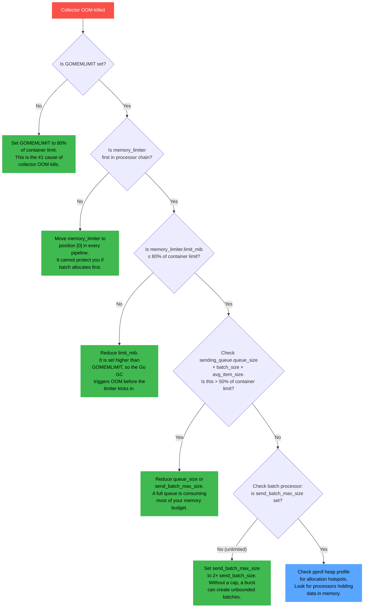

# Chapter 06 — Tuning for Production

This is the chapter you will bookmark. Every tuning parameter in the OTel Collector has a number, and every number has a formula behind it. This chapter gives you those formulas with worked examples so you can derive the right values for your throughput, not copy someone else's defaults and hope they fit.

The goal is simple: the collector should process the maximum throughput your workload demands without OOM-killing, without dropping data during normal operations, and without falling over during a 5-minute backend outage. Every knob in this chapter serves one of those three goals.

---

## 1. The Memory Model

The OTel Collector is a single Go binary. All receivers, processors, and exporters share one heap. Understanding where memory is allocated is the prerequisite to controlling it.

### Where memory lives

```mermaid
graph LR
    subgraph RECEIVER["Receiver (allocation)"]
        direction TB
        R1["OTLP/gRPC listener<br/>deserializes protobuf<br/>into pdata structs"]
        R2["Memory allocated:<br/>proportional to<br/>ingest rate × payload size"]
    end

    subgraph PROCESSOR["Processors (in-flight)"]
        direction TB
        P1["memory_limiter<br/>(checks, no alloc)"]
        P2["batch processor<br/>holds items until<br/>batch is full or<br/>timeout fires"]
        P3["Other processors<br/>(transform, filter,<br/>routing)"]
        P4["Memory allocated:<br/>batch_size × item_size<br/>× pipeline_count"]
    end

    subgraph EXPORTER["Exporter (queued)"]
        direction TB
        E1["sending_queue<br/>holds batches<br/>waiting to send"]
        E2["retry buffer<br/>holds failed batches<br/>for retry"]
        E3["Memory allocated:<br/>queue_size × batch_size<br/>× item_size"]
    end

    RECEIVER -->|"pdata structs<br/>passed by reference"| PROCESSOR
    PROCESSOR -->|"completed batches<br/>enqueued"| EXPORTER
    EXPORTER -->|"gRPC/HTTP<br/>to backend"| BACKEND["Backend<br/>(Honeycomb)"]

    style RECEIVER fill:#1c1917,stroke:#58a6ff,color:#fff
    style PROCESSOR fill:#1c1917,stroke:#3fb950,color:#fff
    style EXPORTER fill:#1c1917,stroke:#f59e0b,color:#fff
```



- **Receivers** allocate memory when deserializing incoming data. Each inbound request creates `pdata` structs on the heap. At high ingest rates, the receiver is a constant source of allocation pressure.
- **Processors** hold data in-flight. The `batch` processor is the biggest memory consumer here — it accumulates items until a batch is full or a timeout fires. The `memory_limiter` itself uses negligible memory; it just checks the runtime stats and refuses data when the threshold is crossed.
- **Exporters** queue completed batches for sending. The `sending_queue` is the single largest potential memory consumer in the entire pipeline. A full queue at default settings can consume tens of gigabytes.

### The three memory controls

You have three independent controls. All three must be set correctly. Getting two out of three right still results in OOM kills.

| Control | Where it lives | What it does |
|---------|---------------|-------------|
| **Container memory limit** | K8s manifest (`resources.limits.memory`) | Hard ceiling. Kernel OOM-kills the process if it exceeds this. |
| **GOMEMLIMIT** | Environment variable on the collector pod | Tells the Go garbage collector to get aggressive before reaching this threshold. Without it, Go GC targets 2x live heap, which can exceed the container limit. |
| **memory_limiter processor** | Collector config YAML | Application-level circuit breaker. When heap usage exceeds the configured limit, the processor returns errors to receivers, which apply backpressure upstream. |

### The formula stack

Start with the container memory limit and derive everything else from it.

```
container_memory_limit  = 2Gi                              (set in K8s manifest)
GOMEMLIMIT              = container_memory_limit × 0.80    = 1638 MiB
memory_limiter.limit_mib = container_memory_limit × 0.80   = 1638
memory_limiter.spike_limit_mib = limit_mib × 0.25          = 409
memory_limiter.check_interval  = 1s                         (default, reduce for bursty)
```

Worked examples for common container sizes:

| Container Limit | GOMEMLIMIT | limit_mib | spike_limit_mib | check_interval |
|----------------|------------|-----------|-----------------|----------------|
| 512Mi | 410Mi | 410 | 102 | 1s |
| 1Gi | 819Mi | 819 | 204 | 1s |
| 2Gi | 1638Mi | 1638 | 409 | 1s |
| 4Gi | 3276Mi | 3276 | 819 | 1s |
| 8Gi | 6553Mi | 6553 | 1638 | 1s |

### Why these numbers

The 20% headroom between the container limit and `GOMEMLIMIT`/`memory_limiter` exists to absorb three things:

1. **Go runtime overhead**: goroutine stacks (each goroutine starts at 8KB, can grow to 1MB), the GC's own bookkeeping, runtime metadata. At 500 goroutines with average 64KB stacks, that is 32MB.
2. **Transient allocations**: short-lived objects that exist between GC cycles. Under high allocation rates, the GC cannot free memory instantly — there is always a generation of objects in flight.
3. **Non-heap memory**: cgo allocations, mmap'd files (especially with persistent queues), OS-level buffers for network sockets. These are invisible to the Go GC and to `GOMEMLIMIT`.

At 2Gi container limit, 20% headroom gives you 409MB for all of the above. In practice, 100-200MB is typical for a moderately loaded collector, so 409MB provides a 2x safety margin. If you are running processors that use cgo (some compression libraries, certain receiver implementations), increase headroom to 30%.

### What breaks: GOMEMLIMIT not set

If `GOMEMLIMIT` is not set, the Go garbage collector uses its default target: 100% of the live heap before triggering GC. In practice, this means:

1. The GC allows the heap to grow to 2x the live set before collecting.
2. At 60% of the container limit, the heap doubles past the container limit during a GC cycle.
3. The kernel OOM-kills the collector.
4. **Symptom**: OOM kills at seemingly low utilization. Your monitoring shows the collector was using "only 60% of memory" right before it died. The missing 40% was the GC trying to double the heap.

Setting `GOMEMLIMIT` tells the GC: "start collecting aggressively when heap approaches this value." The GC will increase its frequency and reduce its target growth ratio to stay under the limit. This eliminates the heap-doubling problem.

### Config: memory_limiter

```yaml
processors:
  memory_limiter:
    # How often to check memory usage.
    # 1s is fine for most workloads. Reduce to 250ms for very bursty
    # traffic where memory can spike faster than 1s.
    check_interval: 1s

    # Soft limit: when RSS exceeds this, the processor returns errors
    # to receivers. Receivers then apply backpressure to upstream clients.
    # Formula: container_memory_limit × 0.80
    # 2Gi × 0.80 = 1638 MiB
    limit_mib: 1638

    # Expected spike size: the processor starts refusing data when
    # (current RSS + spike_limit_mib) > limit_mib, giving headroom
    # for in-flight data to drain.
    # Formula: limit_mib × 0.25
    # 1638 × 0.25 = 409 MiB
    spike_limit_mib: 409
```

The `memory_limiter` **must be first** in the processor chain. If it comes after the batch processor, the batch processor has already allocated memory for the incoming data before the limiter gets a chance to refuse it. The limiter checks on entry, not on exit.

```yaml
service:
  pipelines:
    traces:
      receivers: [otlp]
      processors: [memory_limiter, batch]    # memory_limiter FIRST
      exporters: [otlp/honeycomb]
```

### OOM troubleshooting flowchart



---

## 2. Batch Processor Tuning

The batch processor accumulates spans, metric datapoints, or log records and sends them in groups. Without batching, every span would be its own gRPC call — thousands of round trips per second, each with TLS overhead, HTTP/2 framing, and protobuf encoding. Batching amortizes that cost across thousands of items per call.

### The three parameters

| Parameter | Default | What it controls |
|-----------|---------|-----------------|
| `send_batch_size` | 8192 | Target number of items per batch. When the batch accumulates this many items, it is sent immediately. |
| `send_batch_max_size` | 0 (unlimited) | Hard cap on batch size. If a single incoming request contains more items than this, the batch processor splits it. **0 means no cap — dangerous for memory.** |
| `timeout` | 200ms | Maximum time to wait for a batch to fill. If `send_batch_size` items have not accumulated within this duration, the batch is sent as-is. |

### Agent batch sizing

Agents run on every node as a DaemonSet. They are memory-constrained (typically 256-512Mi) and must flush data quickly to the gateway. Small batches, short timeouts.

```yaml
# Agent batch config — optimize for low memory, fast flush
processors:
  batch:
    # Small batch: agents are memory-constrained.
    # 1024 spans × ~2-4KB per span = ~2-4MB per batch in memory.
    send_batch_size: 1024

    # Hard cap: prevents a burst from creating an enormous batch.
    # Without this, a sudden burst of 50K spans could create a 50K-item
    # batch, consuming ~100-200MB in a 512Mi container.
    send_batch_max_size: 2048

    # Short timeout: flush within 1 second even if the batch is not full.
    # Agents should not hold data — get it to the gateway quickly.
    timeout: 1s
```

**Memory cost**: at steady state, the agent holds one batch in the accumulation buffer and zero to a few batches in the sending queue. At 1024 items × 3KB average = ~3MB per batch. With one batch accumulating and two in the queue, the batch processor uses ~9MB. This is well within a 512Mi agent's budget.

### Gateway batch sizing

Gateways have more memory (1-8Gi) and benefit from larger batches. Larger batches mean fewer API calls to the backend, better compression ratios (more data per compression frame), and lower per-request overhead.

```yaml
# Gateway batch config — optimize for throughput and API efficiency
processors:
  batch:
    # Large batch: gateways have memory budget for it.
    # 4096 spans × ~2-4KB per span = ~8-16MB per batch in memory.
    send_batch_size: 4096

    # Hard cap at 2× target. Prevents unbounded growth from bursts.
    send_batch_max_size: 8192

    # Longer timeout: wait up to 2s for a full batch. This increases
    # data latency by up to 2s, but reduces API calls significantly.
    timeout: 2s
```

**Memory cost**: at steady state with 50K spans/sec throughput, the gateway creates ~12 batches/sec (50000 / 4096 = 12.2). Each batch is ~8-16MB. With `num_consumers: 10` on the exporter, up to 10 batches are in-flight simultaneously. Memory for batching = 10 × 12MB = ~120MB. Add the accumulation buffer (one batch = 12MB) and you are at ~132MB for the batch processor alone.

### The batch math

Two conditions trigger a batch send: item count reaching `send_batch_size`, or `timeout` elapsing. Whichever fires first wins.

**Batches per second** (throughput-limited, high throughput):

```
batches_per_sec = throughput_items_per_sec / send_batch_size
```

Example: 50K spans/sec with batch size 4096:
```
50000 / 4096 = 12.2 batches/sec
```

The timeout never fires because the batch fills before 2s elapses. Each batch fills in:
```
fill_time = send_batch_size / throughput = 4096 / 50000 = 0.082s (82ms)
```

**Batches per second** (timeout-limited, low throughput):

```
batches_per_sec = 1 / timeout_seconds
```

Example: 500 spans/sec with batch size 4096, timeout 2s:
```
fill_time = 4096 / 500 = 8.2s — exceeds timeout
batches_per_sec = 1 / 2 = 0.5 batches/sec (one every 2 seconds)
average_batch_size = throughput × timeout = 500 × 2 = 1000 items
```

**Memory for batching** (worst case):

```
batch_memory = (num_consumers + 1) × send_batch_max_size × avg_item_size
```

The `+1` accounts for the batch currently accumulating. The `num_consumers` count is the maximum number of batches being sent concurrently.

Example (gateway, 10 consumers, 8192 max batch, 3KB avg span):
```
(10 + 1) × 8192 × 3KB = 270MB
```

This is the memory the batch processor can consume when all consumers are busy and a new batch is accumulating. Plan for this in your memory budget.

### What breaks

| Condition | Symptom | Fix |
|-----------|---------|-----|
| Batch too large + high throughput | Memory pressure. Each batch holds data in memory until sent. 10 in-flight batches of 8192 items at 4KB each = 320MB. | Reduce `send_batch_size` or `send_batch_max_size`. |
| Batch too small + high throughput | CPU pressure from serialization overhead. Too many HTTP/gRPC calls. Backend rate limiting (429s). | Increase `send_batch_size`. Fewer, larger requests are more efficient. |
| Timeout too long | Data latency increases. Spans sit in the batch waiting for more items. | Reduce `timeout`. For traces, 1-2s max. For metrics, 5-10s is fine. |
| `send_batch_max_size: 0` (default) | A burst creates a single enormous batch. A Prometheus scrape returning 100K metrics at once creates a 100K-item batch, consuming 300MB+ in a single allocation. | Always set `send_batch_max_size` to a bounded value. 2x `send_batch_size` is a safe default. |

---

## 3. Queue and Retry Tuning

The sending queue is your buffer between the collector and the backend. When the backend is slow, returning 429s, or down for maintenance, the queue absorbs the backlog. When the queue fills, data is dropped. Getting the queue size right is the difference between surviving a 2-minute backend hiccup and losing data.

### Sending queue config

```yaml
exporters:
  otlp/honeycomb:
    endpoint: "api.honeycomb.io:443"
    headers:
      "x-honeycomb-team": "${HONEYCOMB_API_KEY}"
    compression: zstd

    sending_queue:
      # Always enabled in production. Without a queue, a single slow
      # export blocks the entire pipeline.
      enabled: true

      # Number of concurrent export goroutines. Each consumer picks
      # a batch from the queue and sends it. More consumers = more
      # parallel exports = faster drain when the backend recovers.
      # Default: 10. Increase for high-throughput gateways.
      num_consumers: 10

      # Number of batches that can be queued. NOT individual items —
      # this is the number of complete batches from the batch processor.
      # Default: 1000.
      queue_size: 5000

    retry_on_failure:
      # Always enabled in production. Without retries, a single 503
      # from the backend permanently drops the batch.
      enabled: true

      # First retry after 5 seconds.
      initial_interval: 5s

      # Exponential backoff caps at 30 seconds between retries.
      max_interval: 30s

      # After 5 minutes of retrying, give up and drop the batch.
      # This prevents stale data from accumulating indefinitely.
      max_elapsed_time: 300s

      # Backoff multiplier: 5s → 7.5s → 11.25s → 16.9s → 25.3s → 30s (cap)
      multiplier: 1.5
```

### The queue math

**Queue buffer time**: how long the queue can absorb data if the backend stops accepting.

```
buffer_seconds = queue_size × send_batch_size / throughput_per_second
```

Example: queue_size 5000, batch size 4096, throughput 200K spans/sec:
```
5000 × 4096 / 200000 = 102.4 seconds
```

This queue can buffer ~102 seconds of data if the backend goes completely dark. For most backend maintenance windows and transient outages, that is sufficient.

**Queue buffer time at different throughputs** (queue_size = 5000, batch_size = 4096):

| Throughput | Buffer time | Enough for a 2-min outage? |
|-----------|-------------|---------------------------|
| 10K/sec | 2048s (34 min) | Yes, with room to spare |
| 50K/sec | 409s (6.8 min) | Yes |
| 200K/sec | 102s (1.7 min) | Barely — increase queue_size to 7500 for 2.5 min |
| 500K/sec | 41s | No — increase queue_size to 15000 or add replicas |
| 1M/sec | 20s | No — need persistent queues or accept data loss |

**Memory cost of a full queue** (worst case):

```
queue_memory = queue_size × send_batch_max_size × avg_item_size
```

Example: 5000 batches × 8192 items × 3KB per item:
```
5000 × 8192 × 3KB = 120 GB
```

That number is not a typo. A full queue with unbounded batch sizes can theoretically consume 120GB. This is why you **must** set `send_batch_max_size`. In practice, three things prevent this worst case:

1. **The queue rarely fills completely.** It fills only during sustained backend outages. Most outages are seconds, not minutes.
2. **Average items are smaller than worst case.** The 3KB estimate is conservative for spans. Metric datapoints are 200-500 bytes. Log records vary wildly.
3. **`send_batch_max_size` limits the maximum batch.** With `send_batch_max_size: 8192`, each queued batch is capped.

A more realistic calculation with `send_batch_max_size` set and realistic item sizes:

```
Spans:   5000 × 4096 × 2KB  = 40 GB  (still large — that is why memory_limiter exists)
Metrics: 5000 × 4096 × 300B = 6 GB
Logs:    5000 × 4096 × 1KB  = 20 GB
```

The `memory_limiter` processor is what prevents the queue from actually consuming this much. When heap usage approaches the limit, the `memory_limiter` stops accepting new data, which stops new batches from entering the queue. The queue drains (as exports succeed or retries expire), and memory decreases. The formulas above represent the theoretical maximum, not the operating state.

**Size defensively**: set `queue_size` for the buffer time you need, not for the memory you have. The `memory_limiter` will prevent OOM. A queue that is too small drops data silently during brief outages — a worse outcome than temporary memory pressure.

### Retry behavior

The retry policy uses exponential backoff with jitter. Here is the progression for the config above:

| Retry # | Interval (with multiplier) | Cumulative time |
|---------|---------------------------|-----------------|
| 1 | 5.0s | 5.0s |
| 2 | 7.5s | 12.5s |
| 3 | 11.3s | 23.8s |
| 4 | 16.9s | 40.6s |
| 5 | 25.3s | 65.9s |
| 6 | 30.0s (capped) | 95.9s |
| 7 | 30.0s | 125.9s |
| 8 | 30.0s | 155.9s |
| 9 | 30.0s | 185.9s |
| 10 | 30.0s | 215.9s |
| 11 | 30.0s | 245.9s |
| 12 | 30.0s | 275.9s |
| 13 | 30.0s | 305.9s > 300s → batch dropped |

Each batch retries for up to 5 minutes (300s `max_elapsed_time`) before being permanently dropped. During those 5 minutes, the batch occupies a queue slot. Once dropped, the slot is freed.

### What breaks

| Condition | Symptom | Fix |
|-----------|---------|-----|
| Queue too small | Data drops during brief backend outages. You see `otelcol_exporter_send_failed_spans` increasing and `otelcol_exporter_queue_capacity` at 100% for only a few seconds. Honeycomb returns 429s during maintenance, and 30 seconds of data is gone. | Increase `queue_size`. Use the buffer time formula to calculate the minimum for your target outage duration. |
| Queue too large | Memory pressure when the queue fills during extended outages. The `memory_limiter` kicks in and refuses new data across all pipelines, not just the one with the full queue. | Reduce `queue_size` or increase container memory. Consider persistent queues for very large buffer requirements. |
| `max_elapsed_time` too long | Stale data accumulates. Each retrying batch holds memory. If `max_elapsed_time` is 30 minutes and throughput is 200K/sec, the retry buffer can grow to hundreds of GB before batches expire. | Keep `max_elapsed_time` between 2-10 minutes. 5 minutes is a good default. If the backend is down for longer than that, you have bigger problems. |
| `max_elapsed_time` too short | Batches are dropped before the backend recovers from transient issues. A 30-second retry window does not survive a rolling deployment of the Honeycomb ingest tier. | Increase to at least 120s (2 minutes). Match it to your backend's expected recovery time. |
| `num_consumers` too high | Thundering herd: when the backend recovers from an outage, all consumers fire simultaneously. If you have 50 consumers per collector and 10 collector replicas, the backend sees 500 simultaneous connections. This can re-trigger rate limiting. | Keep `num_consumers` between 5-20 per exporter. For high throughput, scale replicas instead of consumers per replica. |
| `num_consumers` too low | Queue drains slowly after a backend recovery. At 2 consumers and 5000 queued batches, it takes 5000/2 × avg_export_time to drain. At 100ms per export, that is 250 seconds to drain. New data arrives faster than the queue drains, and the queue stays full. | Increase `num_consumers` to 10+. The queue drain rate must exceed the ingest rate. |

---

## 4. Persistent Queues

In-memory queues lose their contents when the collector restarts. A rolling deployment, an OOM kill, a node eviction — all of them drop every batch in the queue. For gateways handling critical data where no-data-loss is a requirement, persistent queues write to disk.

### How it works

The persistent queue uses a write-ahead log (WAL) backed by a local filesystem directory. Each batch is written to disk before being acknowledged to the pipeline. On restart, the collector reads unprocessed batches from the WAL and resumes sending.

### Config

```yaml
extensions:
  file_storage/queue:
    # Directory where the WAL is written.
    # Must be on a fast local disk — not a network filesystem.
    directory: /var/lib/otelcol/queue

    # Timeout for filesystem operations.
    timeout: 10s

    # fsync after every write. Slower but crash-safe.
    # Set to false for better throughput at the risk of losing
    # the last few batches on a hard crash (power loss, kernel panic).
    fsync: true

exporters:
  otlp/honeycomb:
    endpoint: "api.honeycomb.io:443"
    headers:
      "x-honeycomb-team": "${HONEYCOMB_API_KEY}"
    compression: zstd

    sending_queue:
      enabled: true
      num_consumers: 10
      queue_size: 5000

      # Enable persistent storage. References the extension above.
      storage: file_storage/queue

    retry_on_failure:
      enabled: true
      initial_interval: 5s
      max_interval: 30s
      max_elapsed_time: 300s

service:
  extensions: [file_storage/queue]
  pipelines:
    traces:
      receivers: [otlp]
      processors: [memory_limiter, batch]
      exporters: [otlp/honeycomb]
```

### Kubernetes volume mount

The WAL directory needs a persistent volume or an `emptyDir` with adequate size. An `emptyDir` survives pod restarts on the same node but not node evictions. A PVC survives both but ties the pod to a specific node (unless you use a network-attached volume, which defeats the purpose of fast local disk).

```yaml
# In the gateway Deployment spec
spec:
  containers:
    - name: otelcol
      volumeMounts:
        - name: queue-storage
          mountPath: /var/lib/otelcol/queue
  volumes:
    - name: queue-storage
      emptyDir:
        # Size limit: queue_size × send_batch_max_size × avg_item_size
        # 5000 × 8192 × 3KB ≈ 120Gi worst case, but realistically
        # the queue never fills completely. 20Gi provides ~1000 batches
        # at 4096 items × 3KB = 12MB each.
        sizeLimit: 20Gi
```

### Disk sizing

```
disk_per_batch   = send_batch_max_size × avg_item_size_on_disk
disk_total       = queue_size × disk_per_batch
```

On-disk items include serialization overhead (protobuf encoding + WAL framing). Expect ~1.5x the in-memory size.

Example (4096 items × 3KB × 1.5 overhead = 18MB per batch):
```
5000 batches × 18MB = 90GB worst case
```

For realistic queue utilization (queue rarely above 20% during normal operations):
```
5000 × 0.20 × 18MB = 18GB steady-state maximum
```

Provision 20-50Gi depending on your risk tolerance.

### Tradeoffs

| | |
|---|---|
| **Pros** | Survives collector restarts: rolling deployments, OOM kills, node drains. No data loss during brief backend outages combined with collector restarts. |
| **Cons** | Disk I/O overhead: ~10-20% throughput reduction compared to in-memory queues. Requires fast local disk (SSD). HDD-backed persistent queues bottleneck at high throughput. Disk space requirements can be significant. Added operational complexity (volume mounts, disk monitoring, cleanup). |

### When to use

- **Gateways handling critical data** where the cost of losing telemetry exceeds the cost of disk I/O overhead. Payment traces, SLO data, audit logs.
- **Low-to-medium throughput gateways** (under 100K items/sec) where disk I/O is not a bottleneck.
- **Environments with frequent collector restarts**: aggressive HPA scaling, spot instances, frequent config changes.

### When NOT to use

- **Agents (DaemonSet)**. Agent data is regenerated: the next scrape interval produces new metrics, the next request produces new traces. Persisting agent queues adds disk I/O to every node for data that will be recreated in seconds.
- **Very high throughput paths** (500K+ items/sec). Disk I/O becomes the bottleneck. A single SSD tops out at 500-1000 MB/s sequential write. At 500K items/sec × 3KB = 1.5 GB/sec, you saturate the disk.
- **Ephemeral environments** (dev, staging). The data is not worth the operational overhead of managing persistent volumes.

---

## 5. Sizing Reference Table

These are per-replica numbers for gateways and per-node numbers for agents. They are starting points derived from the formulas in sections 1-3. Measure your actual throughput and item sizes, then adjust.

### Gateway sizing

| Tier | Spans/sec | Container Memory | GOMEMLIMIT | memory_limiter limit_mib | spike_limit_mib | Batch Size | Batch Max Size | Batch Timeout | Queue Size | num_consumers | Replicas |
|------|-----------|-----------------|------------|--------------------------|-----------------|------------|---------------|---------------|------------|---------------|----------|
| Small | < 10K | 512Mi | 410Mi | 410 | 102 | 1024 | 2048 | 2s | 512 | 5 | 2 |
| Medium | 10-50K | 1Gi | 819Mi | 819 | 204 | 2048 | 4096 | 2s | 1000 | 10 | 3 |
| Large | 50-200K | 2Gi | 1638Mi | 1638 | 409 | 4096 | 8192 | 2s | 2500 | 10 | 5 |
| Very Large | 200K-1M | 4Gi | 3276Mi | 3276 | 819 | 8192 | 16384 | 2s | 5000 | 20 | 10 |
| XL | > 1M | 8Gi | 6553Mi | 6553 | 1638 | 8192 | 16384 | 2s | 10000 | 20 | 20+ |

**How to read this table**: the "Spans/sec" column is the per-replica throughput. Total cluster throughput = Spans/sec × Replicas. A Large tier with 5 replicas handles up to 1M spans/sec aggregate (200K × 5).

### Agent sizing (DaemonSet, per-node)

| Node workload | Container Memory | GOMEMLIMIT | memory_limiter limit_mib | spike_limit_mib | Batch Size | Batch Max Size | Batch Timeout | Queue Size |
|--------------|-----------------|------------|--------------------------|-----------------|------------|---------------|---------------|------------|
| Light (< 5K spans/sec) | 256Mi | 205Mi | 205 | 51 | 512 | 1024 | 1s | 256 |
| Medium (5-20K spans/sec) | 512Mi | 410Mi | 410 | 102 | 1024 | 2048 | 1s | 512 |
| Heavy (20-50K spans/sec) | 1Gi | 819Mi | 819 | 204 | 2048 | 4096 | 1s | 1000 |
| Very Heavy (> 50K spans/sec) | 2Gi | 1638Mi | 1638 | 409 | 2048 | 4096 | 1s | 2000 |

Notes:

- **Agent queues are smaller** because agents should flush to the gateway quickly. If the gateway pool is down, the agent queue buys a brief buffer, but the agent is not the place to absorb a multi-minute outage. That is the gateway's job.
- **Agent batch timeout is always 1s** (or less). Agents should not hold data. The gateway pool aggregates and creates larger batches for the backend.
- **"Very Heavy" nodes** (50K+ spans/sec per node) typically indicate a noisy service that should be filtered at the agent or moved to a sidecar (see chapter 02). Investigate before scaling the agent.

### Metrics and logs adjustments

The tables above assume traces (spans). Metrics and logs have different item sizes, which changes memory cost:

| Signal | Avg item size | Adjustment |
|--------|--------------|------------|
| Traces (spans) | 2-4 KB | Baseline (tables above) |
| Metrics (datapoints) | 200-500 bytes | Can use 2x larger batch sizes and queue sizes at the same memory cost |
| Logs (records) | 500 bytes - 5 KB | Highly variable. Start with trace sizing, adjust based on actual log body sizes |

For a metrics-only gateway at 200K datapoints/sec, the "Medium" tier (1Gi) is sufficient because metric datapoints are 5-10x smaller than spans.

---

## 6. CPU Tuning

Memory is the usual bottleneck, but CPU matters too. The collector spends CPU cycles on serialization, compression, processor logic, and TLS.

### Where CPU goes

| Consumer | Relative cost | Notes |
|----------|--------------|-------|
| Protobuf serialization/deserialization | High | Every inbound and outbound request is serialized. Cost scales linearly with throughput. |
| Compression (zstd) | High | Compressing outbound data to the backend. zstd is CPU-intensive but achieves 3-5x compression. |
| Compression (gzip) | Medium | Less CPU than zstd, but worse compression ratio. |
| Transform processor | Medium | OTTL statement evaluation per item. Complex regex in OTTL is expensive. |
| Routing/connector logic | Low-Medium | Routing decisions and connector evaluation. |
| Filter processor | Low | Simple attribute checks. Negligible CPU. |
| Batch processor | Low | Accumulation is cheap. The cost is in the serialization that happens on export. |
| TLS handshakes | Low (amortized) | Expensive per handshake, but gRPC reuses connections. Only matters during connection storms. |

### CPU limits: do not set them

This is counterintuitive, but removing CPU limits in Kubernetes is generally the right choice for the collector. Here is why:

1. **CPU throttling is invisible**. When a pod hits its CPU limit, the kernel's CFS scheduler throttles it. The pod is not killed — it just runs slower. There is no OOM-equivalent signal. The collector appears healthy but processes data slowly, queues fill up, and eventually data drops.
2. **The collector has natural backpressure**. If CPU is saturated, export latency increases, queues fill, `memory_limiter` triggers, and the receiver refuses data. The system degrades gracefully without CPU limits.
3. **CPU usage is bursty**. A protobuf deserialization burst from a large incoming request can spike CPU for 100ms. A CPU limit of 2 cores throttles this burst, adding latency to every request in that window.

**Do set CPU requests** for scheduling. The request tells the K8s scheduler how much CPU to reserve on the node. Without a request, your collector pods get best-effort scheduling and can be evicted first under node pressure.

```yaml
resources:
  requests:
    cpu: "1"          # Reserve 1 core for scheduling
    memory: "2Gi"
  limits:
    # cpu: not set    # No CPU limit — avoid throttling
    memory: "2Gi"     # Memory limit is mandatory (OOM protection)
```

### GOMAXPROCS

The Go runtime sets `GOMAXPROCS` (the number of OS threads the Go scheduler uses) based on the number of CPUs visible to the process. In a container, this is the number of CPUs on the host node, not the pod's CPU request or limit.

A pod with `cpu: 1` request on a 64-core node gets `GOMAXPROCS=64`. The Go scheduler creates 64 OS threads, all competing for 1 core of CPU time. This causes excessive context switching and worse performance than `GOMAXPROCS=1`.

**Fix**: set `GOMAXPROCS` to match your CPU request.

Option A: environment variable:

```yaml
env:
  - name: GOMAXPROCS
    value: "2"       # Match your cpu request (round up if fractional)
```

Option B: use the `automaxprocs` library. The upstream `otelcol-contrib` does not include this by default. If you build a custom collector with `ocb`, add the `go.uber.org/automaxprocs` import to your `main.go`. It reads the cgroup CPU quota and sets `GOMAXPROCS` automatically.

### Compression tradeoffs

| Compression | CPU cost | Compression ratio | Best for |
|-------------|----------|-------------------|----------|
| `zstd` | High | 3-5x | Agent-to-gateway, gateway-to-backend. Best ratio. Worth the CPU in almost all cases. |
| `gzip` | Medium | 2-3x | CPU-constrained environments where zstd is too expensive. Worse ratio but lower CPU. |
| `none` | None | 1x (no compression) | Agent-to-gateway on the same cluster over a fast network. Saves CPU at the cost of 3-5x more bandwidth. Only viable if network is not a bottleneck. |

```yaml
# Agent exporter — zstd to gateway (recommended default)
exporters:
  otlp/gateway:
    endpoint: "gateway.otel.svc.cluster.local:4317"
    tls:
      insecure: true     # Within-cluster, TLS terminated at service mesh or not needed
    compression: zstd

# Gateway exporter — zstd to Honeycomb (always)
exporters:
  otlp/honeycomb:
    endpoint: "api.honeycomb.io:443"
    headers:
      "x-honeycomb-team": "${HONEYCOMB_API_KEY}"
    compression: zstd    # Always compress to the backend. You are paying for egress.

# Agent exporter — no compression (same-cluster, CPU-constrained agent)
exporters:
  otlp/gateway-uncompressed:
    endpoint: "gateway.otel.svc.cluster.local:4317"
    tls:
      insecure: true
    compression: none    # Saves ~15% CPU on the agent. Adds ~3-5x network traffic.
```

**The math on compression**: at 50K spans/sec × 3KB average = 150MB/sec uncompressed. With zstd at 4x ratio, that drops to ~37.5MB/sec. In a cluster with 10Gbps pod networking, the uncompressed 150MB/sec (1.2Gbps) is fine. Over the internet to Honeycomb, the compressed 37.5MB/sec (300Mbps) matters for egress cost. At $0.09/GB, uncompressed egress is $0.09 × 150 × 3600 × 24 / 1024 = ~$1,139/day. Compressed: ~$285/day. Compression pays for itself.

---

## 7. Network Tuning

### gRPC keepalive

Load balancers (AWS ALB, GCP GCLB, Nginx, Envoy) and cloud provider NAT gateways will silently drop idle TCP connections after a timeout (typically 60-350 seconds). The gRPC client does not discover this until the next send, which then fails and triggers a reconnect. During that reconnect, batches queue up.

Configure keepalive pings to keep connections alive through load balancers:

```yaml
exporters:
  otlp/honeycomb:
    endpoint: "api.honeycomb.io:443"
    headers:
      "x-honeycomb-team": "${HONEYCOMB_API_KEY}"
    compression: zstd

    # gRPC keepalive: send pings to detect dead connections and
    # prevent load balancers from dropping idle connections.
    keepalive:
      # Send a keepalive ping every 30 seconds on idle connections.
      # Must be less than your load balancer's idle timeout.
      # AWS ALB default: 60s. GCP: 600s. Set this to half.
      time: 30s

      # Wait 10 seconds for a ping response before considering
      # the connection dead and reconnecting.
      timeout: 10s

      # Send keepalive pings even if there are no active RPCs.
      # Without this, an idle connection (no exports for 60s) gets
      # silently dropped by the load balancer.
      permit_without_stream: true
```

### Max message size

The default gRPC max receive message size is 4MB. A large batch of spans or a single protobuf message with many log records can exceed this. When it does, the receiver silently drops the message and the exporter sees a `ResourceExhausted` error.

```yaml
receivers:
  otlp:
    protocols:
      grpc:
        endpoint: "0.0.0.0:4317"

        # Increase max receive message size from 4MB default.
        # A batch of 8192 spans at 3KB each = 24MB.
        # A batch of 16384 log records with large bodies = 50MB+.
        # Set this higher than your largest expected batch.
        max_recv_msg_size_mib: 64

      http:
        endpoint: "0.0.0.0:4318"

        # HTTP receiver: max request body size.
        # Same logic as gRPC — match to your largest expected batch.
        max_request_body_size: 67108864  # 64 MiB in bytes
```

**When to change this**: if you see `rpc error: code = ResourceExhausted desc = grpc: received message larger than max` in the exporter logs of the upstream collector (agent sending to gateway), increase `max_recv_msg_size_mib` on the gateway's receiver. The default 4MB is too small for any batch size above ~1300 spans.

### Connection pooling

The OTel Collector maintains a single gRPC connection per exporter by default. HTTP/2 multiplexes many streams over this single TCP connection, which is efficient up to a point. Under very high throughput, a single connection can become a bottleneck due to:

- **TCP flow control**: one connection shares one TCP window.
- **Head-of-line blocking**: a slow stream on the connection blocks other streams.
- **Single-core TLS processing**: one connection means one TLS session, processed on one core.

For agent-to-gateway traffic, this is rarely a problem because the gateway Service distributes connections across replicas. Each agent gets one connection to one gateway replica (via the ClusterIP Service).

For gateway-to-Honeycomb traffic at very high throughput (500K+ spans/sec per replica), you may need multiple connections. The approach is to configure multiple exporter instances, each targeting the same endpoint, and use the `loadbalancing` exporter or multiple named exporters with a fanout:

```yaml
# For high throughput: multiple connections to the same backend
# Each exporter instance maintains its own gRPC connection.
exporters:
  otlp/honeycomb-1:
    endpoint: "api.honeycomb.io:443"
    headers:
      "x-honeycomb-team": "${HONEYCOMB_API_KEY}"
    compression: zstd
    sending_queue:
      enabled: true
      queue_size: 2500
      num_consumers: 10

  otlp/honeycomb-2:
    endpoint: "api.honeycomb.io:443"
    headers:
      "x-honeycomb-team": "${HONEYCOMB_API_KEY}"
    compression: zstd
    sending_queue:
      enabled: true
      queue_size: 2500
      num_consumers: 10

service:
  pipelines:
    traces:
      receivers: [otlp]
      processors: [memory_limiter, batch]
      # Fan out to both exporters. Each batch goes to BOTH exporters.
      # WARNING: this sends duplicate data. Use only with a load-balancing
      # strategy or a connector that routes subsets to each exporter.
      exporters: [otlp/honeycomb-1, otlp/honeycomb-2]
```

In most cases, the better approach is to add more collector replicas rather than more connections per replica. Horizontal scaling distributes both CPU and network load.

### gRPC on the receiver side

For gateways receiving data from many agents, tune the receiver's gRPC server settings:

```yaml
receivers:
  otlp:
    protocols:
      grpc:
        endpoint: "0.0.0.0:4317"
        max_recv_msg_size_mib: 64
        max_concurrent_streams: 200

        # Keepalive enforcement: prevent clients from pinging too aggressively.
        # If 500 agents each ping every 10s, that is 50 pings/sec — non-trivial.
        keepalive:
          server_parameters:
            max_connection_idle: 300s
            max_connection_age: 600s
            max_connection_age_grace: 60s
            time: 60s
            timeout: 20s
          enforcement_policy:
            min_time: 30s
            permit_without_stream: true
```

---

## 8. Putting It All Together

A complete, annotated gateway config for the **Large** tier (50-200K spans/sec per replica, 5 replicas, ~500K-1M aggregate).

Every value has a comment showing the formula that derived it. Cross-reference: see [Chapter 07 — Backpressure Handling](07-backpressure.md) for what happens when these limits are hit.

```yaml
# =============================================================================
# Gateway Collector — Large Tier (50-200K spans/sec per replica)
# =============================================================================
# Container: 2Gi memory limit, 2 CPU request (no CPU limit)
# Replicas: 5 (total capacity: ~1M spans/sec)
# GOMEMLIMIT: 1638Mi (2Gi × 0.80)
# GOMAXPROCS: 2 (matches CPU request)
# =============================================================================

extensions:
  health_check:
    endpoint: "0.0.0.0:13133"

  # Persistent queue storage (optional — enable for critical data paths)
  # file_storage/queue:
  #   directory: /var/lib/otelcol/queue
  #   timeout: 10s

receivers:
  otlp:
    protocols:
      grpc:
        endpoint: "0.0.0.0:4317"

        # Default 4MB is too small for batches of 8192 spans.
        # 8192 × 3KB = 24MB. Set to 64MB for headroom.
        max_recv_msg_size_mib: 64

        keepalive:
          server_parameters:
            max_connection_idle: 300s      # Close idle agent connections after 5 min
            max_connection_age: 600s       # Force reconnect every 10 min for LB rebalancing
            max_connection_age_grace: 60s  # Grace period for in-flight RPCs
            time: 60s                      # Server-side keepalive ping interval
            timeout: 20s                   # Keepalive ping timeout
          enforcement_policy:
            min_time: 30s                  # Reject clients pinging faster than 30s
            permit_without_stream: true

      http:
        endpoint: "0.0.0.0:4318"

processors:
  # ── Memory limiter ─────────────────────────────────────────────────
  # MUST be first in every pipeline.
  # Formula: container_limit × 0.80 = 2Gi × 0.80 = 1638 MiB
  memory_limiter:
    check_interval: 1s                     # 1s is fine for sustained throughput
    limit_mib: 1638                        # 2048 MiB × 0.80
    spike_limit_mib: 409                   # 1638 × 0.25

  # ── Batch processor ────────────────────────────────────────────────
  # At 200K spans/sec with batch size 4096:
  #   batches/sec = 200000 / 4096 = 48.8
  #   fill_time per batch = 4096 / 200000 = 0.020s (20ms)
  #   timeout never fires at this throughput
  #
  # Memory for batching:
  #   (num_consumers + 1) × send_batch_max_size × avg_item_size
  #   (10 + 1) × 8192 × 3KB = 270MB
  batch:
    send_batch_size: 4096                  # Target batch size
    send_batch_max_size: 8192              # Hard cap: 2× target
    timeout: 2s                            # For low-throughput periods

exporters:
  otlp/honeycomb:
    endpoint: "api.honeycomb.io:443"
    headers:
      "x-honeycomb-team": "${HONEYCOMB_API_KEY}"

    # Compression: zstd for best ratio. At 200K spans/sec × 3KB = 600MB/sec
    # uncompressed. With zstd 4x ratio: 150MB/sec. Saves ~$3,500/day in egress.
    compression: zstd

    # ── Keepalive ──────────────────────────────────────────────────
    keepalive:
      time: 30s                            # Ping every 30s (< LB idle timeout)
      timeout: 10s                         # 10s to detect dead connection
      permit_without_stream: true          # Ping even when idle

    # ── Sending queue ──────────────────────────────────────────────
    # Buffer time = queue_size × send_batch_size / throughput
    #             = 2500 × 4096 / 200000 = 51.2 seconds
    #
    # For 2 minutes of buffer: queue_size = 120 × 200000 / 4096 = 5859
    # Using 2500 here — increase if you need longer outage tolerance.
    sending_queue:
      enabled: true                        # Always in production
      num_consumers: 10                    # 10 concurrent exports
      queue_size: 2500                     # 51s buffer at 200K/sec

      # Uncomment for persistent queues:
      # storage: file_storage/queue

    # ── Retry policy ───────────────────────────────────────────────
    # Backoff: 5s → 7.5s → 11.3s → 16.9s → 25.3s → 30s (cap)
    # Total retry window: 300s (5 minutes)
    # After 5 min, batch is dropped. See chapter 07 for what happens next.
    retry_on_failure:
      enabled: true                        # Always in production
      initial_interval: 5s
      max_interval: 30s
      max_elapsed_time: 300s               # 5 min then drop
      multiplier: 1.5

service:
  extensions: [health_check]

  telemetry:
    metrics:
      level: detailed                      # Expose all internal metrics
      address: "0.0.0.0:8888"             # Prometheus scrape target
    logs:
      level: info                          # Set to debug only when troubleshooting

  pipelines:
    traces:
      receivers: [otlp]
      processors: [memory_limiter, batch]  # memory_limiter FIRST
      exporters: [otlp/honeycomb]

    metrics:
      receivers: [otlp]
      processors: [memory_limiter, batch]
      exporters: [otlp/honeycomb]

    logs:
      receivers: [otlp]
      processors: [memory_limiter, batch]
      exporters: [otlp/honeycomb]
```

### Kubernetes manifest (matching the config above)

```yaml
apiVersion: apps/v1
kind: Deployment
metadata:
  name: otel-gateway
  namespace: otel
spec:
  replicas: 5
  selector:
    matchLabels:
      app: otel-gateway
  template:
    metadata:
      labels:
        app: otel-gateway
      annotations:
        prometheus.io/scrape: "true"
        prometheus.io/port: "8888"
    spec:
      containers:
        - name: otelcol
          image: otel/opentelemetry-collector-contrib:0.116.0
          args: ["--config=/etc/otelcol/config.yaml"]
          env:
            # ── Go runtime tuning ──────────────────────────────────
            # GOMEMLIMIT: 80% of container memory limit
            # 2Gi = 2048 MiB. 2048 × 0.80 = 1638 MiB.
            # Suffix: MiB (Go accepts this directly).
            - name: GOMEMLIMIT
              value: "1638MiB"

            # GOMAXPROCS: match CPU request to avoid scheduler thrash
            # on high-core-count nodes.
            - name: GOMAXPROCS
              value: "2"

            # Honeycomb API key from secret
            - name: HONEYCOMB_API_KEY
              valueFrom:
                secretKeyRef:
                  name: honeycomb
                  key: api-key

          ports:
            - containerPort: 4317
              name: otlp-grpc
            - containerPort: 4318
              name: otlp-http
            - containerPort: 8888
              name: metrics
            - containerPort: 13133
              name: health

          resources:
            requests:
              cpu: "2"                     # Reserve 2 cores for scheduling
              memory: "2Gi"               # Match GOMEMLIMIT derivation base
            limits:
              # No CPU limit: avoid CFS throttling.
              # The collector has natural backpressure — let it burst.
              memory: "2Gi"               # Hard ceiling, kernel OOM kills above this

          livenessProbe:
            httpGet:
              path: /
              port: health
            initialDelaySeconds: 15
            periodSeconds: 10
          readinessProbe:
            httpGet:
              path: /
              port: health
            initialDelaySeconds: 5
            periodSeconds: 5

          volumeMounts:
            - name: config
              mountPath: /etc/otelcol

      volumes:
        - name: config
          configMap:
            name: otel-gateway-config
```

### Summary of derived values

| Parameter | Value | Formula |
|-----------|-------|---------|
| Container memory | 2Gi | Sizing table: Large tier |
| GOMEMLIMIT | 1638MiB | 2048 × 0.80 |
| GOMAXPROCS | 2 | = CPU request |
| memory_limiter.limit_mib | 1638 | 2048 × 0.80 |
| memory_limiter.spike_limit_mib | 409 | 1638 × 0.25 |
| batch.send_batch_size | 4096 | Sizing table: Large tier |
| batch.send_batch_max_size | 8192 | 2 × send_batch_size |
| batch.timeout | 2s | Low-throughput fallback |
| sending_queue.queue_size | 2500 | Buffer for ~51s at 200K/sec |
| sending_queue.num_consumers | 10 | Default, sufficient for 200K/sec |
| retry.max_elapsed_time | 300s | 5 min retry window |
| max_recv_msg_size_mib | 64 | > send_batch_max_size × avg_item_size |
| compression | zstd | Best ratio for egress to Honeycomb |

Every number traces back to a formula. If your throughput, item sizes, or outage tolerance differ from the Large tier assumptions, re-derive from the formulas in sections 1-4. Do not copy these numbers without checking the math against your workload.

---

Next: [Chapter 07 — Backpressure Handling](07-backpressure.md) covers what happens when the limits configured in this chapter are hit — how backpressure propagates from the backend through the gateway to the agent to the SDK, and what data you lose first.
