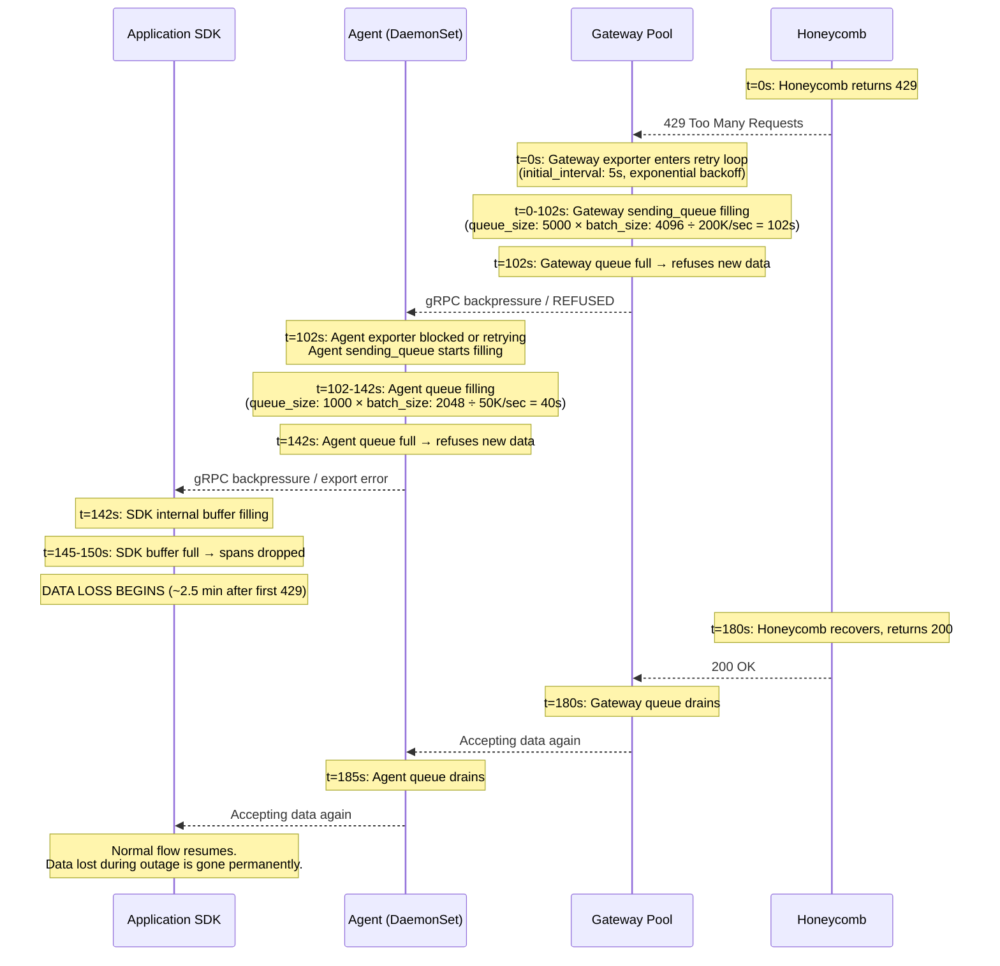
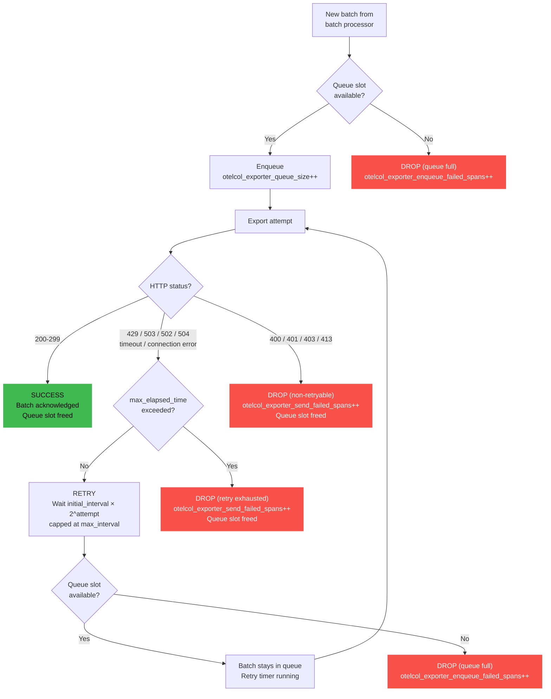
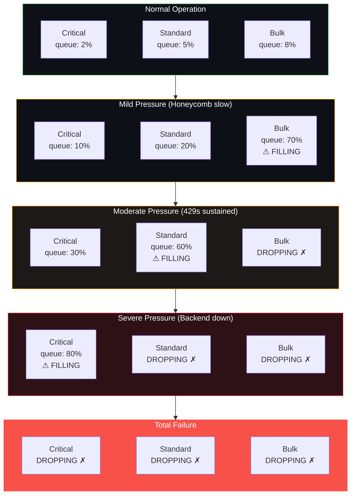
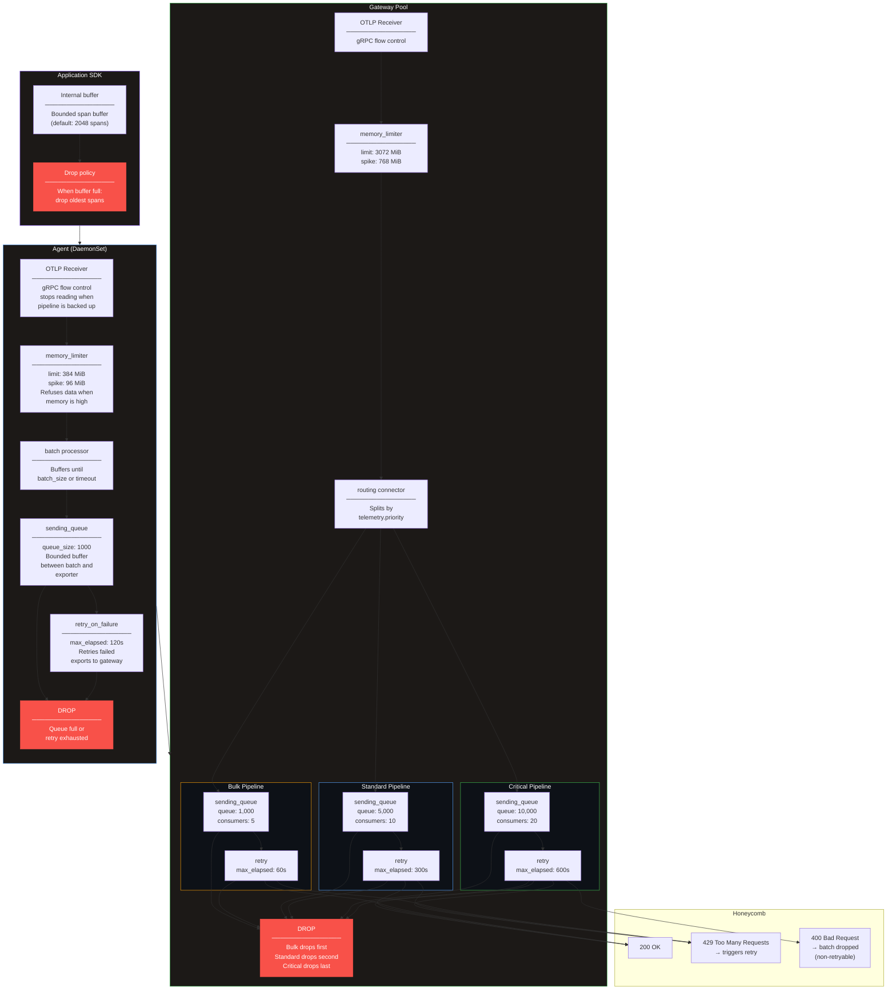

# Chapter 07 — Backpressure Handling

Every system has a throughput ceiling. When you hit it, something has to give: either the system slows down gracefully, or it breaks catastrophically. Backpressure is the mechanism that turns catastrophic failure into graceful degradation. This chapter covers how backpressure propagates through an OTel Collector pipeline, what configuration controls each stage, and how to build a system that sheds load deliberately instead of crashing randomly.

---

## 1. What Is Backpressure?

Backpressure is a feedback signal: when a downstream component cannot keep up with the rate of incoming data, it signals upstream to slow down. The alternative — accepting data faster than you can process it — ends in memory exhaustion and a crash.

In the OTel Collector context, backpressure propagates backwards through every layer of the pipeline. The trigger is usually the backend (Honeycomb returning 429 Too Many Requests), but it can start at any layer that saturates.

### Propagation timeline



The key insight: you have roughly **2.5 minutes** from the first 429 to the first dropped span, with the default queue sizes from chapter 06. Every queue you add extends this buffer. Every queue you undersize shortens it.

---

## 2. gRPC Flow Control

If your agents export to the gateway over OTLP/gRPC (the recommended path from chapter 03), you get a layer of backpressure for free from the HTTP/2 protocol.

### How it works

gRPC runs over HTTP/2, which has built-in flow control using WINDOW_UPDATE frames. Each stream and each connection has a flow control window — a byte budget that the sender must not exceed before the receiver acknowledges receipt.

1. The gateway's OTLP receiver reads incoming gRPC data into its processing pipeline.
2. When the pipeline slows down (because the exporter is blocked on a full queue or a retry loop), the receiver stops reading from the gRPC connection.
3. The HTTP/2 flow control window fills up because the receiver is not acknowledging bytes.
4. The agent's exporter blocks on `Send()` — it cannot write more data until the window opens.
5. The agent's batch processor backs up because the exporter is not draining batches.
6. The agent's sending_queue fills because batches are not being consumed.
7. Once the agent's queue is full, new incoming data is dropped.

This is automatic. There is no configuration for it. But you need to understand it to debug throughput problems.

### Symptoms

| Metric | Where | What it means |
|--------|-------|---------------|
| `otelcol_exporter_send_failed_spans` increases | Agent | The agent's exporter cannot reach the gateway or the gateway is refusing data |
| `otelcol_receiver_refused_spans` increases | Gateway | The gateway's receiver is explicitly refusing data (memory_limiter activated) |
| `otelcol_exporter_queue_size` rising | Agent | The agent's exporter queue is filling because exports are slow or failing |
| `otelcol_exporter_queue_latency` increasing | Agent | Batches are sitting in the queue longer before being sent — a leading indicator |

### What gRPC backpressure does NOT do

gRPC flow control does not give you infinite buffering. It gives you a few seconds of implicit buffering (the flow control window is typically 64KB-16MB per connection). Once the window fills, the agent blocks. If the agent's own internal processing path has no queue, the agent drops data almost immediately. The `sending_queue` on the agent's exporter is what gives you real buffer depth.

**Do not rely on gRPC flow control as your primary backpressure mechanism.** It is a safety net, not a strategy. Configure explicit queues and retry policies.

---

## 3. HTTP Status Code Handling

When the gateway's exporter sends a batch to Honeycomb, the response status code determines what happens next. Not all failures are the same. Some are retryable. Some are not. Treating a 400 like a 429 will fill your retry queue with permanently-failing batches.

### Status code behavior

| Status Code | Meaning | Retried? | What the collector does | Recommended action |
|-------------|---------|----------|------------------------|-------------------|
| **200-299** | Success | -- | Batch acknowledged, removed from queue | None. This is the happy path. |
| **429** | Too Many Requests | Yes | Enters retry loop with exponential backoff. Respects `Retry-After` header if present. | Capacity problem. Scale the backend tier, reduce send rate, or increase `num_consumers` to spread load. |
| **503** | Service Unavailable | Yes | Same as 429. Enters retry loop. | Transient backend issue. Wait it out. If sustained, the backend is down. |
| **502/504** | Bad Gateway / Gateway Timeout | Yes | Treated as retryable server error. | Proxy or load balancer issue between collector and backend. Check network path. |
| **400** | Bad Request | **No** | Batch is **dropped**. Not retried. | Data is malformed. Check your transform processors for invalid attribute mutations. Check for non-UTF8 strings in attribute values. |
| **401** | Unauthorized | **No** | Batch is **dropped**. | API key is wrong, expired, or missing. Check `HONEYCOMB_API_KEY` env var. |
| **403** | Forbidden | **No** | Batch is **dropped**. | API key lacks ingest permissions, or you are hitting a rate limit that returns 403. |
| **413** | Payload Too Large | **No** | Batch is **dropped**. | Reduce `send_batch_max_size` in the batch processor. Honeycomb's per-request limit is 5MB compressed. |

### What breaks

**If you see 400s**: you have a configuration problem, not a capacity problem. Something in your pipeline is producing invalid data. Common causes:

- A `transform` processor is setting an attribute to a value Honeycomb cannot parse.
- An attribute key contains non-UTF8 bytes (often from binary data leaking into span attributes).
- A span or log body exceeds the backend's per-field size limit.

Retrying a 400 will never succeed. The batch will sit in the retry loop, consume a queue slot, eventually hit `max_elapsed_time`, and get dropped anyway. Meanwhile, it blocked a slot that could have been used for valid data.

**If you see 429s**: you have a capacity problem, not a configuration problem. The backend is telling you to slow down. This is normal during traffic spikes. Your retry loop and queue buffer are designed for exactly this situation. If 429s are sustained (not transient), you need to either reduce ingest volume (more aggressive sampling) or increase backend capacity.

**The critical distinction**: 400-class errors and 429/503 errors need completely different responses. Set up separate alerts for each. Do not combine them into a single "export failure" metric.

---

## 4. The Queue -> Retry -> Drop Chain

This is the core mechanism that determines whether data survives a backend outage. Every span follows this path.

### Step by step

1. **Export attempt**: the exporter sends a batch to Honeycomb.
2. **Failure**: the export fails (429, 503, timeout, connection error).
3. **Retry loop starts**: the batch enters the retry loop.
   - First retry after `initial_interval` (default: 5s).
   - Each subsequent retry doubles the wait, up to `max_interval` (default: 30s).
   - Retry sequence: 5s, 10s, 20s, 30s, 30s, 30s, ...
4. **While retrying**: the batch occupies one slot in the `sending_queue`. New batches from the batch processor queue behind it.
5. **Queue fills**: if enough batches are retrying or waiting, the `sending_queue` reaches `queue_size`. New incoming batches are **dropped** because there is no room.
   - Metric: `otelcol_exporter_enqueue_failed_spans` increments. **This is your data loss metric.**
6. **Retry gives up**: if a retrying batch exceeds `max_elapsed_time` (default: 300s), it is dropped.
   - Metric: `otelcol_exporter_send_failed_spans` increments.
7. **Success**: if a retry succeeds, the batch is removed from the queue, freeing a slot.

### Decision flowchart



### The config that controls this chain

```yaml
exporters:
  otlp/honeycomb:
    endpoint: "api.honeycomb.io:443"
    headers:
      "x-honeycomb-team": "${HONEYCOMB_API_KEY}"
    compression: zstd

    # --- Retry policy ---
    # Controls how long the exporter retries a single failed batch.
    retry_on_failure:
      enabled: true
      initial_interval: 5s        # First retry after 5 seconds
      max_interval: 30s           # Cap backoff at 30 seconds
      max_elapsed_time: 300s      # Give up after 5 minutes total
      # Multiplier is fixed at 1.5 with jitter (not configurable)

    # --- Queue ---
    # Controls how many batches can wait while exports are slow.
    sending_queue:
      enabled: true
      num_consumers: 10           # Parallel export goroutines
      queue_size: 5000            # Max batches in queue

    timeout: 30s                  # Per-export HTTP timeout
```

### The math

At 100K spans/sec inbound to the gateway, with the config above:

```
Batches produced per second = throughput / batch_size = 100,000 / 4,096 ≈ 24.4 batches/sec

Queue capacity in spans   = queue_size × batch_size = 5,000 × 4,096 = 20,480,000 spans
Queue capacity in seconds = queue capacity in spans / throughput = 20,480,000 / 100,000 = 204.8 seconds

Result: ~3.4 minutes of buffer before data loss begins.
```

| Throughput | queue_size | batch_size | Buffer time | Buffer (spans) |
|-----------|-----------|------------|-------------|----------------|
| 50K/sec | 5,000 | 4,096 | 6.8 min | 20.4M |
| 100K/sec | 5,000 | 4,096 | 3.4 min | 20.4M |
| 200K/sec | 5,000 | 4,096 | 1.7 min | 20.4M |
| 500K/sec | 5,000 | 4,096 | 40 sec | 20.4M |
| 100K/sec | 10,000 | 4,096 | 6.8 min | 40.9M |
| 100K/sec | 20,000 | 4,096 | 13.6 min | 81.9M |

**If Honeycomb is down for longer than your buffer time, you start losing data.** This is a fundamental constraint. You can increase `queue_size` to buy more buffer time, but each queued batch consumes memory. At 4,096 spans per batch and ~3KB per span, each batch is ~12MB. A queue of 5,000 batches could theoretically consume 60GB of memory. In practice, the `memory_limiter` will activate long before that — which is exactly what it should do (see chapter 06).

---

## 5. Persistent Queues for Durability

In-memory queues are fast, but they vanish when the pod restarts. If the gateway OOMs during a backpressure event, you lose the queue contents on top of the spans that were already being dropped. Persistent queues write batches to disk, surviving restarts.

### Config

```yaml
extensions:
  file_storage/queue:
    directory: /var/lib/otelcol/queue
    timeout: 10s
    compaction:
      on_start: true              # Compact storage on startup to recover space
      on_rebound: true            # Compact after recovery from backpressure
      rebound_needed_threshold_mib: 100
      rebound_trigger_threshold_mib: 10

exporters:
  otlp/honeycomb:
    endpoint: "api.honeycomb.io:443"
    headers:
      "x-honeycomb-team": "${HONEYCOMB_API_KEY}"
    compression: zstd
    retry_on_failure:
      enabled: true
      initial_interval: 5s
      max_interval: 30s
      max_elapsed_time: 300s
    sending_queue:
      enabled: true
      num_consumers: 10
      queue_size: 5000
      storage: file_storage/queue  # <-- This makes the queue persistent

service:
  extensions: [file_storage/queue]
  pipelines:
    traces:
      receivers: [otlp]
      processors: [memory_limiter, batch]
      exporters: [otlp/honeycomb]
```

### Disk sizing

The maximum disk consumption depends on `queue_size`, batch size, and average span size:

```
max_disk_bytes = queue_size × batch_size × avg_span_size_bytes
```

| queue_size | batch_size | avg_span_size | Max disk usage |
|-----------|------------|---------------|----------------|
| 5,000 | 4,096 | 1 KB | ~20 GB |
| 5,000 | 4,096 | 3 KB | ~60 GB |
| 10,000 | 4,096 | 3 KB | ~120 GB |
| 5,000 | 8,192 | 3 KB | ~120 GB |

These are theoretical maximums. In practice, the queue rarely fills completely, and compression (if the storage backend supports it) reduces the actual footprint. But you must provision for the worst case.

### Kubernetes PersistentVolumeClaim

```yaml
apiVersion: v1
kind: PersistentVolumeClaim
metadata:
  name: otel-gateway-queue
  namespace: otel
spec:
  accessModes:
    - ReadWriteOnce
  storageClassName: gp3            # AWS EBS gp3 — adjust for your cloud
  resources:
    requests:
      storage: 100Gi               # Provision for worst-case queue fill
---
# In the gateway Deployment spec:
# ...
      containers:
        - name: otelcol
          volumeMounts:
            - name: queue-storage
              mountPath: /var/lib/otelcol/queue
      volumes:
        - name: queue-storage
          persistentVolumeClaim:
            claimName: otel-gateway-queue
```

**Important**: `ReadWriteOnce` means the PVC can only be mounted by one pod. If your gateway is a Deployment with multiple replicas, each replica needs its own PVC. Use a StatefulSet instead:

```yaml
apiVersion: apps/v1
kind: StatefulSet
metadata:
  name: otel-gateway
  namespace: otel
spec:
  replicas: 3
  serviceName: otel-gateway-headless
  selector:
    matchLabels:
      app.kubernetes.io/name: otel-gateway
  volumeClaimTemplates:
    - metadata:
        name: queue-storage
      spec:
        accessModes: ["ReadWriteOnce"]
        storageClassName: gp3
        resources:
          requests:
            storage: 100Gi
  template:
    metadata:
      labels:
        app.kubernetes.io/name: otel-gateway
    spec:
      containers:
        - name: otelcol
          image: otel/opentelemetry-collector-contrib:latest
          volumeMounts:
            - name: queue-storage
              mountPath: /var/lib/otelcol/queue
```

### Tradeoffs

| | |
|---|---|
| **Pros** | Survives pod restarts — queued data is not lost on OOM kill or rolling update. Extends effective buffer time without consuming RAM. Enables longer `max_elapsed_time` because retrying batches do not consume memory. |
| **Cons** | 10-20% throughput reduction due to disk I/O latency (write-ahead log for every enqueue). Requires PersistentVolumes in K8s, which means either a StatefulSet or per-replica PVCs. Disk I/O can become a bottleneck if the storage backend is slow (network-attached EBS at baseline IOPS). Recovery on startup takes time — the collector must replay the queue from disk before accepting new data. |

### When to use

- **Use persistent queues on**: the gateway tier exporting to Honeycomb (the critical path). This is where data loss has the highest impact, and where backend outages are most likely to cause extended queue buildup.
- **Do not use persistent queues on**: agents exporting to the gateway. The gateway is cluster-local, retries are fast, and the latency penalty of disk I/O on every DaemonSet pod is not worth the marginal durability gain. If the gateway is down long enough to exhaust agent queues, persistent queues on agents just delay the inevitable.
- **Do not use persistent queues on**: high-throughput bulk pipelines where data loss is acceptable. The disk I/O overhead reduces peak throughput exactly when you need it most.

---

## 6. Priority-Based Shedding

When you must drop data, drop the least important data first. This is not a theoretical exercise — during sustained backend pressure, you will lose data. The question is whether you lose checkout traces and batch job spans equally, or whether you lose batch job spans first and checkout traces last.

Chapter 05, section 5 introduced priority tiers (critical, standard, bulk). This section covers the backpressure behavior of those tiers in detail.

### Architecture: differentiated queue and retry configs

```yaml
# Gateway with priority-based shedding
# Cross-reference: chapter 05 section 5 for routing setup

connectors:
  routing/priority:
    default_pipelines: [traces/standard]
    error_mode: ignore
    table:
      - statement: route()
          where resource.attributes["telemetry.priority"] == "critical"
        pipelines: [traces/critical]
      - statement: route()
          where resource.attributes["telemetry.priority"] == "bulk"
        pipelines: [traces/bulk]

processors:
  memory_limiter:
    check_interval: 1s
    limit_mib: 3072
    spike_limit_mib: 768

  transform/set-priority:
    trace_statements:
      - context: resource
        statements:
          - set(attributes["telemetry.priority"], "critical")
            where attributes["service.name"] == "payment-svc"
          - set(attributes["telemetry.priority"], "critical")
            where attributes["service.name"] == "checkout-svc"
          - set(attributes["telemetry.priority"], "bulk")
            where IsMatch(attributes["service.name"], ".*-cron")
          - set(attributes["telemetry.priority"], "bulk")
            where attributes["deployment.environment"] == "staging"
          - set(attributes["telemetry.priority"], "standard")
            where attributes["telemetry.priority"] == nil

  batch/critical:
    send_batch_size: 1024
    send_batch_max_size: 2048
    timeout: 1s              # Flush fast — never delay critical data

  batch/standard:
    send_batch_size: 2048
    send_batch_max_size: 4096
    timeout: 2s

  batch/bulk:
    send_batch_size: 8192
    send_batch_max_size: 16384
    timeout: 15s             # Can wait — bulk is patient

exporters:
  # Critical: largest queue, most consumers, longest retry
  # This pipeline drops LAST.
  otlp/honeycomb-critical:
    endpoint: "api.honeycomb.io:443"
    headers:
      "x-honeycomb-team": "${HONEYCOMB_API_KEY}"
    compression: zstd
    sending_queue:
      enabled: true
      num_consumers: 20
      queue_size: 10000        # 10K batches × 2048 spans = 20.4M spans buffered
    retry_on_failure:
      enabled: true
      initial_interval: 1s    # Retry quickly
      max_interval: 30s
      max_elapsed_time: 600s  # Retry for 10 minutes before giving up

  # Standard: moderate queue, moderate retry
  otlp/honeycomb-standard:
    endpoint: "api.honeycomb.io:443"
    headers:
      "x-honeycomb-team": "${HONEYCOMB_API_KEY}"
    compression: zstd
    sending_queue:
      enabled: true
      num_consumers: 10
      queue_size: 5000         # 5K batches × 4096 spans = 20.4M spans buffered
    retry_on_failure:
      enabled: true
      initial_interval: 5s
      max_interval: 30s
      max_elapsed_time: 300s   # Retry for 5 minutes

  # Bulk: smallest queue, fewest consumers, shortest retry
  # This pipeline drops FIRST.
  otlp/honeycomb-bulk:
    endpoint: "api.honeycomb.io:443"
    headers:
      "x-honeycomb-team": "${HONEYCOMB_API_KEY}"
    compression: zstd
    sending_queue:
      enabled: true
      num_consumers: 5
      queue_size: 1000         # 1K batches × 16384 spans = 16.3M spans buffered
    retry_on_failure:
      enabled: true
      initial_interval: 5s
      max_interval: 30s
      max_elapsed_time: 60s    # Give up after 1 minute

service:
  pipelines:
    # Ingest: classify priority, then route
    traces/ingest:
      receivers: [otlp]
      processors: [memory_limiter, transform/set-priority]
      exporters: [routing/priority]

    # Critical: no sampling, large queue, fast flush
    traces/critical:
      receivers: [routing/priority]
      processors: [batch/critical]
      exporters: [otlp/honeycomb-critical]

    # Standard: moderate queue
    traces/standard:
      receivers: [routing/priority]
      processors: [batch/standard]
      exporters: [otlp/honeycomb-standard]

    # Bulk: small queue, drops first under pressure
    traces/bulk:
      receivers: [routing/priority]
      processors: [batch/bulk]
      exporters: [otlp/honeycomb-bulk]
```

### Degradation behavior under increasing load



### The degradation ladder

| Level | Condition | What drops | What flows | Action required |
|-------|-----------|-----------|-----------|-----------------|
| **1. Normal** | All exporters healthy | Nothing | Everything | None |
| **2. Mild pressure** | Backend slow, 429s intermittent | Nothing yet — bulk queue filling | Everything, with higher latency | Investigate. Check Honeycomb status page. |
| **3. Moderate pressure** | Sustained 429s, bulk queue full | Bulk data (batch jobs, staging, internal tools) | Critical + Standard | Alert fires. Consider reducing ingest volume. |
| **4. Severe pressure** | Prolonged outage, standard queue full | Bulk + Standard data | Critical only | Page the on-call. Scale down non-critical producers if possible. |
| **5. Total failure** | Extended outage, all queues full | All data | Nothing | All hands. Backend is down or collector is misconfigured. |

The queue sizing creates a natural ordering: bulk (1,000 slots) fills before standard (5,000 slots) fills before critical (10,000 slots). At 100K spans/sec evenly distributed across tiers:

- Bulk fills in: 1,000 × 16,384 / 33,333 ≈ **490 seconds (~8 min)**
- Standard fills in: 5,000 × 4,096 / 33,333 ≈ **614 seconds (~10 min)**
- Critical fills in: 10,000 × 2,048 / 33,333 ≈ **614 seconds (~10 min)**

The actual fill times depend on how traffic is distributed across tiers. If 60% of traffic is bulk, bulk queues fill much faster. Measure your actual distribution and adjust queue sizes accordingly.

---

## 7. Load Testing with `telemetrygen`

Do not wait for a production incident to discover that your backpressure configuration is wrong. Simulate it.

### Install

```bash
go install github.com/open-telemetry/opentelemetry-collector-contrib/cmd/telemetrygen@latest
```

Or use the container image:

```bash
docker pull ghcr.io/open-telemetry/opentelemetry-collector-contrib/telemetrygen:latest
```

### Test scenarios

**Scenario 1: Sustained throughput — does the pipeline keep up?**

```bash
# Generate 100K spans/sec for 5 minutes
telemetrygen traces \
  --otlp-insecure \
  --rate 100000 \
  --duration 5m \
  --otlp-endpoint gateway.otel.svc.cluster.local:4317
```

Watch: `otelcol_exporter_queue_size` should stay flat. If it rises, the exporter cannot keep up with inbound volume.

**Scenario 2: Large spans — stress memory**

```bash
# Generate 50K spans/sec with 50 attributes each (fat spans)
telemetrygen traces \
  --otlp-insecure \
  --rate 50000 \
  --span-attributes 50 \
  --duration 5m \
  --otlp-endpoint gateway.otel.svc.cluster.local:4317
```

Watch: container memory usage vs limit. The `memory_limiter` should activate before the container OOMs.

**Scenario 3: Queue fill and drain — test backpressure end-to-end**

```bash
# Generate 200K spans/sec for 30 minutes
# At this rate, most gateway configs will eventually fill the queue
telemetrygen traces \
  --otlp-insecure \
  --rate 200000 \
  --duration 30m \
  --otlp-endpoint gateway.otel.svc.cluster.local:4317
```

Watch: `otelcol_exporter_queue_size` should rise, then fall as the exporter drains. If `otelcol_exporter_enqueue_failed_spans` increments, the queue filled and data was dropped.

**Scenario 4: Simulate backend outage — block the exporter**

This requires a proxy that can inject 429s. A minimal approach using `nginx`:

```nginx
# nginx.conf — returns 429 for all OTLP requests
server {
    listen 4317 http2;
    location / {
        return 429;
    }
}
```

Point your gateway's exporter at this nginx instance for the duration of the test. Watch queue fill, retry behavior, and data loss metrics.

### Metrics to watch during load tests

| Metric | What it tells you | Healthy value during test |
|--------|------------------|-------------------------|
| `otelcol_exporter_queue_size` | Current queue depth | Rises and falls; does not hit `queue_size` |
| `otelcol_exporter_enqueue_failed_spans` | Spans dropped due to full queue | 0 (any non-zero value means data loss) |
| `otelcol_exporter_send_failed_spans` | Spans dropped after retry exhaustion | 0 during normal load; expected during outage simulation |
| `otelcol_processor_batch_batch_send_size` | Actual batch sizes being exported | Close to `send_batch_size` |
| `otelcol_processor_batch_timeout_trigger_send` | Batches sent because of timeout, not size | Low (means batches fill before timeout fires) |
| `otelcol_receiver_refused_spans` | Spans refused by receiver (memory_limiter) | 0 (non-zero means memory pressure) |
| Container memory (from cAdvisor) | Actual memory usage vs limit | Below `memory_limiter.limit_mib` |
| Pod restart count | OOM kills | 0 |

### Acceptance checklist

Your backpressure handling is working if, during a 30-minute load test at 2x your expected peak:

- [ ] Queue fills and drains cleanly without data loss during sustained load
- [ ] `memory_limiter` activates before the container approaches its memory limit
- [ ] No pod restarts (no OOM kills) during the entire test
- [ ] When you simulate a backend outage, data loss is limited to the bulk tier first
- [ ] When the backend recovers, queued data drains and normal flow resumes within 60 seconds
- [ ] `otelcol_exporter_enqueue_failed_spans` remains 0 during normal (non-outage) load

If any of these fail, adjust your configuration before going to production. The specific tuning knobs are in chapter 06.

---

## 8. Backpressure Alerting

You need to know about backpressure before your users do. These five Prometheus alerting rules cover the critical failure modes.

### Alert 1: Queue approaching capacity

```yaml
# Queue is > 80% full — you have minutes before data loss
- alert: OtelCollectorQueueNearFull
  expr: |
    otelcol_exporter_queue_size
    /
    otelcol_exporter_queue_capacity
    > 0.8
  for: 2m
  labels:
    severity: warning
  annotations:
    summary: "OTel Collector queue at {{ $value | humanizePercentage }} capacity"
    description: >
      Exporter queue on {{ $labels.pod }} is above 80% full.
      At current drain rate, data loss will begin in approximately
      {{ with printf `otelcol_exporter_queue_capacity{pod="%s"} - otelcol_exporter_queue_size{pod="%s"}` $labels.pod $labels.pod | query }}
        {{ . | first | value }} batches of headroom remaining.
      {{ end }}
      Check backend health and exporter error rate.
    runbook: "https://runbooks.internal/otel/queue-near-full"
```

### Alert 2: Data is being dropped

```yaml
# Data loss is actively occurring — this is the most critical alert
- alert: OtelCollectorDataDropped
  expr: |
    rate(otelcol_exporter_enqueue_failed_spans[5m]) > 0
  for: 5m
  labels:
    severity: critical
  annotations:
    summary: "OTel Collector is dropping spans on {{ $labels.pod }}"
    description: >
      The exporter queue on {{ $labels.pod }} is full and spans are being dropped.
      Current drop rate: {{ $value | humanize }} spans/sec.
      Immediate action required: check backend health, scale the gateway, or
      reduce ingest volume.
    runbook: "https://runbooks.internal/otel/data-dropped"
```

### Alert 3: Memory limiter is active

```yaml
# Memory limiter has activated — collector is under memory pressure
- alert: OtelCollectorMemoryLimiterActive
  expr: |
    rate(otelcol_processor_refused_spans{processor="memory_limiter"}[5m]) > 0
  for: 2m
  labels:
    severity: warning
  annotations:
    summary: "OTel Collector memory limiter active on {{ $labels.pod }}"
    description: >
      The memory_limiter on {{ $labels.pod }} is refusing data.
      Refusal rate: {{ $value | humanize }} spans/sec.
      This means the collector is approaching its memory limit and is
      proactively shedding load to avoid OOM. Check for traffic spikes
      or undersized memory limits.
    runbook: "https://runbooks.internal/otel/memory-limiter-active"
```

### Alert 4: Export failures

```yaml
# Backend exports are failing at a sustained rate
- alert: OtelCollectorExportFailures
  expr: |
    rate(otelcol_exporter_send_failed_spans[5m]) > 100
  for: 5m
  labels:
    severity: critical
  annotations:
    summary: "OTel Collector export failures on {{ $labels.pod }}"
    description: >
      Exporter on {{ $labels.pod }} is failing to send spans at
      {{ $value | humanize }}/sec. This indicates the backend (Honeycomb)
      is unreachable, returning errors, or rate limiting. Check:
      1. Honeycomb status page
      2. API key validity
      3. Network connectivity from the collector pod
      4. otelcol logs for specific HTTP status codes
    runbook: "https://runbooks.internal/otel/export-failures"
```

### Alert 5: Sustained retry rate

```yaml
# High retry rate indicates backend is struggling
- alert: OtelCollectorHighRetryRate
  expr: |
    rate(otelcol_exporter_send_failed_spans[5m])
    /
    (rate(otelcol_exporter_sent_spans[5m]) + rate(otelcol_exporter_send_failed_spans[5m]))
    > 0.1
  for: 10m
  labels:
    severity: warning
  annotations:
    summary: "OTel Collector retry rate > 10% on {{ $labels.pod }}"
    description: >
      More than 10% of export attempts on {{ $labels.pod }} are failing and
      being retried. The backend is under pressure. Current failure ratio:
      {{ $value | humanizePercentage }}.
      This is a leading indicator — if it persists, queues will fill and
      data loss will follow.
    runbook: "https://runbooks.internal/otel/high-retry-rate"
```

### All five alerts together

```yaml
# prometheus-rules.yaml
apiVersion: monitoring.coreos.com/v1
kind: PrometheusRule
metadata:
  name: otel-collector-backpressure
  namespace: otel
spec:
  groups:
    - name: otel-collector-backpressure
      interval: 30s
      rules:
        - alert: OtelCollectorQueueNearFull
          expr: |
            otelcol_exporter_queue_size
            /
            otelcol_exporter_queue_capacity
            > 0.8
          for: 2m
          labels:
            severity: warning
          annotations:
            summary: "OTel Collector queue at {{ $value | humanizePercentage }} capacity on {{ $labels.pod }}"
            runbook: "https://runbooks.internal/otel/queue-near-full"

        - alert: OtelCollectorDataDropped
          expr: |
            rate(otelcol_exporter_enqueue_failed_spans[5m]) > 0
          for: 5m
          labels:
            severity: critical
          annotations:
            summary: "OTel Collector is dropping spans on {{ $labels.pod }}"
            runbook: "https://runbooks.internal/otel/data-dropped"

        - alert: OtelCollectorMemoryLimiterActive
          expr: |
            rate(otelcol_processor_refused_spans{processor="memory_limiter"}[5m]) > 0
          for: 2m
          labels:
            severity: warning
          annotations:
            summary: "Memory limiter active on {{ $labels.pod }}"
            runbook: "https://runbooks.internal/otel/memory-limiter-active"

        - alert: OtelCollectorExportFailures
          expr: |
            rate(otelcol_exporter_send_failed_spans[5m]) > 100
          for: 5m
          labels:
            severity: critical
          annotations:
            summary: "Export failures on {{ $labels.pod }}: {{ $value | humanize }}/sec"
            runbook: "https://runbooks.internal/otel/export-failures"

        - alert: OtelCollectorHighRetryRate
          expr: |
            rate(otelcol_exporter_send_failed_spans[5m])
            /
            (rate(otelcol_exporter_sent_spans[5m]) + rate(otelcol_exporter_send_failed_spans[5m]))
            > 0.1
          for: 10m
          labels:
            severity: warning
          annotations:
            summary: "Retry rate > 10% on {{ $labels.pod }}"
            runbook: "https://runbooks.internal/otel/high-retry-rate"
```

For the complete collector monitoring setup, including self-scrape configuration, dashboard templates, and health check extensions, see [Chapter 09 — Monitoring the Collector](09-monitoring-the-collector.md).

---

## 9. Graceful Degradation Architecture

Every layer in the pipeline — SDK, agent, gateway, backend — can become a bottleneck. The goal is not to prevent bottlenecks (you cannot) but to ensure that each layer degrades independently. An agent should never OOM because the gateway is slow. A gateway should never OOM because Honeycomb is slow.

### The "never cascade" rule

**Every component must be configured to drop data locally rather than propagate pressure to the point of OOM.**

This means:

- Every exporter has a `sending_queue` with a bounded `queue_size`.
- Every pipeline has a `memory_limiter` as the first processor.
- Every container has a `GOMEMLIMIT` set to 80% of its memory limit.
- No component relies on an upstream component to protect it from overload. Each component protects itself.

### Full architecture: all backpressure mechanisms layered



### Per-layer configuration summary

| Layer | Backpressure mechanism | What it protects | Config reference |
|-------|----------------------|-----------------|-----------------|
| **SDK** | Bounded internal buffer (typically 2048 spans), drop-oldest policy | The application process from unbounded memory growth | SDK-specific (e.g., `OTEL_BSP_MAX_QUEUE_SIZE` for batch span processor) |
| **Agent receiver** | gRPC HTTP/2 flow control | The agent from being overwhelmed by SDK export rate | Automatic (no config) |
| **Agent memory_limiter** | Refuses data when process memory exceeds threshold | The agent pod from OOM | `memory_limiter.limit_mib`, `memory_limiter.spike_limit_mib` |
| **Agent sending_queue** | Bounded queue between pipeline and exporter | The agent from accumulating unbounded batches when gateway is slow | `sending_queue.queue_size` on the agent's exporter |
| **Agent retry** | Exponential backoff with time limit | The agent from retrying forever on a dead gateway | `retry_on_failure.max_elapsed_time` on the agent's exporter |
| **Gateway receiver** | gRPC HTTP/2 flow control | The gateway from being overwhelmed by agent export rate | Automatic (no config) |
| **Gateway memory_limiter** | Refuses data when process memory exceeds threshold | The gateway pod from OOM | `memory_limiter.limit_mib`, `memory_limiter.spike_limit_mib` |
| **Gateway sending_queue** | Bounded queues, sized per priority tier | The gateway from accumulating unbounded batches when Honeycomb is slow | `sending_queue.queue_size` per exporter |
| **Gateway retry** | Exponential backoff, differentiated by priority | The gateway from retrying bulk data as aggressively as critical data | `retry_on_failure.max_elapsed_time` per exporter |
| **Gateway persistent queue** | Disk-backed queue (optional) | Queued data from being lost on pod restart | `sending_queue.storage` referencing `file_storage` extension |
| **Backend (Honeycomb)** | 429 response with Retry-After | Honeycomb's ingest infrastructure from overload | Not configurable by you (backend-managed) |

### The independence principle

Each row in the table above operates independently. If you remove any one layer, the others still function. This is the key architectural property:

- If the SDK has no backpressure: the agent's `memory_limiter` still protects the agent pod.
- If the agent has no queue: the gateway's `memory_limiter` still protects the gateway pod.
- If the gateway has no retry: the backend's 429 response still prevents the backend from crashing.
- If the backend never returns 429: the gateway's queue still bounds memory usage.

No single component is the "one place" where backpressure is handled. Every component handles its own. This redundancy is intentional. The failure mode of relying on a single layer is that when that layer fails, everything behind it cascades to OOM.

---

## Summary

| Mechanism | What it does | Where to configure | Key metric |
|-----------|-------------|-------------------|-----------|
| gRPC flow control | Implicit backpressure via HTTP/2 windows | Automatic (no config) | `otelcol_exporter_send_failed_spans` on sender |
| HTTP status handling | Determines retry vs. drop per batch | Inherent in exporter (not configurable) | `otelcol_exporter_send_failed_spans` by status code |
| Retry policy | Exponential backoff for failed exports | `retry_on_failure.*` on each exporter | `otelcol_exporter_send_failed_spans` |
| Sending queue | Bounded buffer for in-flight batches | `sending_queue.*` on each exporter | `otelcol_exporter_queue_size`, `otelcol_exporter_enqueue_failed_spans` |
| Persistent queue | Disk-backed queue surviving restarts | `sending_queue.storage` + `file_storage` extension | Same as sending queue, plus disk usage |
| Priority shedding | Drop bulk before standard before critical | Separate pipelines with differentiated queue sizes | `otelcol_exporter_enqueue_failed_spans` per pipeline |
| Memory limiter | Refuse data before OOM | `memory_limiter.*` (first processor in every pipeline) | `otelcol_processor_refused_spans` |
| Alerting | Detect backpressure before users notice | PrometheusRule manifests (section 8) | All of the above |

The recommended implementation order:

1. **Configure `memory_limiter` on every pipeline** (chapter 06). This is non-negotiable. Without it, every other mechanism is irrelevant because the pod will OOM before they activate.
2. **Configure `sending_queue` and `retry_on_failure` on every exporter** (section 4). This gives you buffer time during transient backend issues.
3. **Set up alerting** (section 8). You need to know when backpressure is happening.
4. **Add priority-based shedding** (section 6) when you have traffic that is clearly less important and can be dropped first.
5. **Add persistent queues** (section 5) on the gateway-to-Honeycomb path when you need to survive pod restarts during backpressure events.
6. **Load test** (section 7) to validate the entire chain before production traffic hits it.

Next: [Chapter 08 — Bare Metal and VMs](08-bare-metal-and-vms.md) covers non-Kubernetes deployments. [Chapter 09 — Monitoring the Collector](09-monitoring-the-collector.md) covers the complete self-monitoring setup referenced throughout this chapter's alerting section.
