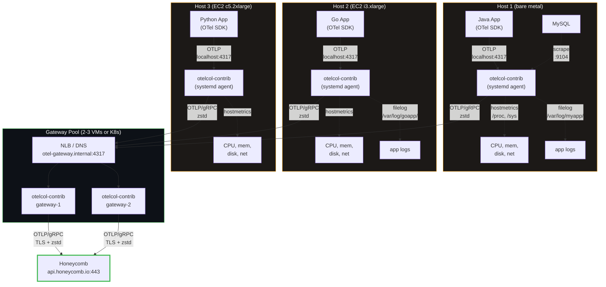
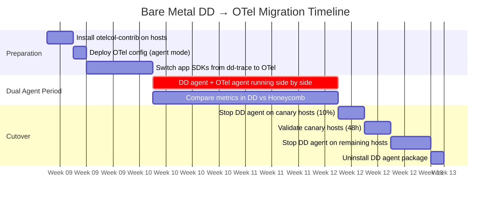
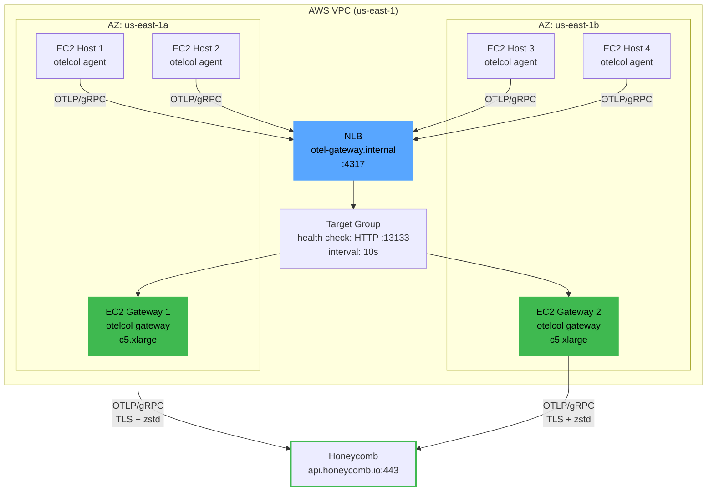

# Chapter 08 — Bare Metal and VMs

> **Audience**: SREs and platform engineers deploying the OTel Collector on non-Kubernetes
> infrastructure: bare metal servers, EC2 instances, GCE VMs, Azure VMs.
>
> **Prerequisite**: You have read [Chapter 01 (Migration Phases)](01-migration-phases.md) for the
> overall migration strategy and [Chapter 03 (Agent + Gateway Topology)](03-agent-gateway-topology.md)
> for the canonical two-tier architecture. This chapter adapts that architecture to hosts where there
> is no DaemonSet controller, no kube-proxy, and no k8sattributes processor.
>
> **Goal**: Walk out of this chapter with production-ready systemd units, collector configs, fleet
> deployment strategies, and the operational patterns for running OTel Collectors on bare metal and
> VMs at scale.

---

## 1. When You're Not on Kubernetes

Many organizations run a mix: some services on Kubernetes, some on bare metal in a colo, some on
EC2 instances managed by Terraform. The OTel Collector runs the same binary everywhere. The
`otelcol-contrib` binary does not know or care whether it is inside a container or running as a
systemd service on a Debian host. Only the deployment mechanism changes.

### Key differences from Kubernetes

| Concern | Kubernetes | Bare metal / VMs |
|---------|-----------|-----------------|
| Per-host agent scheduling | DaemonSet handles it automatically | You manage it: package install, config management, or AMI baking |
| Service metadata enrichment | `k8sattributes` processor reads pod labels from the API server | `resourcedetection` processor reads cloud metadata (instance ID, region) from IMDS or system hostname |
| Gateway discovery | ClusterIP Service with kube-proxy load balancing | DNS record, NLB/ALB endpoint, or static IP list |
| Memory limits | Container memory limit + OOM killer | cgroup v2 `MemoryMax` via systemd + OOM killer |
| Config rollout | `kubectl rollout restart daemonset` | Ansible playbook, SSM Run Command, or fleet-wide `systemctl restart` |
| Health checks | Kubernetes liveness/readiness probes | External monitoring (Nagios, Prometheus blackbox, CloudWatch) hitting the `health_check` extension |
| Log collection | `filelog` reading `/var/log/pods/` with CRI format | `filelog` reading application log files with app-specific formats |

### Architecture



The topology is identical to the Kubernetes agent + gateway model. The agent runs on every host,
collects local telemetry (OTLP from apps, host metrics, file-based logs), and forwards everything
to a central gateway pool. The gateway handles transforms, filtering, batching, and export to
Honeycomb. The only difference is the deployment mechanism: systemd instead of DaemonSet, NLB
instead of ClusterIP Service, config management instead of ConfigMap.

---

## 2. Installing otelcol-contrib

### Package managers (recommended)

The OpenTelemetry project publishes official `.deb` and `.rpm` packages on every release. Pin to a
specific version. The collector has breaking changes between minor versions — running `latest` in
production will eventually break your pipeline without warning.

**Debian / Ubuntu:**

```bash
# Pin the version. Never use 'latest' in production.
OTELCOL_VERSION="0.120.0"

sudo apt-get update
sudo apt-get install -y wget

wget "https://github.com/open-telemetry/opentelemetry-collector-releases/releases/download/v${OTELCOL_VERSION}/otelcol-contrib_${OTELCOL_VERSION}_linux_amd64.deb"

sudo dpkg -i "otelcol-contrib_${OTELCOL_VERSION}_linux_amd64.deb"
```

**RHEL / CentOS / Amazon Linux:**

```bash
OTELCOL_VERSION="0.120.0"

sudo rpm -ivh "https://github.com/open-telemetry/opentelemetry-collector-releases/releases/download/v${OTELCOL_VERSION}/otelcol-contrib_${OTELCOL_VERSION}_linux_amd64.rpm"
```

### Direct binary download

For hosts where you cannot or do not want to use a package manager (Alpine, custom Linux, air-gapped
environments):

```bash
OTELCOL_VERSION="0.120.0"
ARCH="linux_amd64"  # or linux_arm64

wget "https://github.com/open-telemetry/opentelemetry-collector-releases/releases/download/v${OTELCOL_VERSION}/otelcol-contrib_${OTELCOL_VERSION}_${ARCH}.tar.gz"

tar xzf "otelcol-contrib_${OTELCOL_VERSION}_${ARCH}.tar.gz"
sudo mv otelcol-contrib /usr/local/bin/
sudo chmod 755 /usr/local/bin/otelcol-contrib

# Verify
otelcol-contrib --version
```

### Docker (for VM-based container runtimes)

If your VMs already run Docker or Podman but are not orchestrated by Kubernetes, you can run the
collector as a container:

```bash
docker run -d \
  --name otelcol \
  --restart=unless-stopped \
  --network=host \
  -v /etc/otelcol:/etc/otelcol:ro \
  -v /proc:/hostfs/proc:ro \
  -v /sys:/hostfs/sys:ro \
  -v /:/hostfs:ro \
  -v /var/log:/var/log:ro \
  -v /var/lib/otelcol:/var/lib/otelcol \
  -e HONEYCOMB_API_KEY="${HONEYCOMB_API_KEY}" \
  otel/opentelemetry-collector-contrib:0.120.0 \
  --config=/etc/otelcol/config.yaml
```

Key flags: `--network=host` so applications can reach the collector on `localhost:4317`, and the
`/hostfs` mounts so the `hostmetrics` receiver can read `/proc` and `/sys`.

### Version pinning

The OTel Collector project ships breaking changes in minor version bumps. Between v0.96 and v0.102,
the following broke in production:

| Version | Breaking change |
|---------|----------------|
| v0.97 | `batch` processor memory accounting changed, causing existing `memory_limiter` configs to OOM |
| v0.99 | `filelog` receiver offset tracking format changed; existing checkpoints were invalidated, causing log re-ingestion |
| v0.101 | `k8sattributes` metadata extraction renamed several fields |
| v0.104 | `transform` processor OTTL syntax for nested attributes changed |

Always pin to a specific version in your package manager, AMI, Ansible role, or Dockerfile. Test
version upgrades in staging for at least 48 hours before rolling to production. Keep the agent and
gateway on the same version to avoid OTLP negotiation mismatches (see chapter 01, section 8).

---

## 3. systemd Service Configuration

### Unit file

```ini
# /etc/systemd/system/otelcol-contrib.service
[Unit]
Description=OpenTelemetry Collector Contrib
Documentation=https://opentelemetry.io/docs/collector/
After=network-online.target
Wants=network-online.target

[Service]
Type=simple
User=otelcol
Group=otelcol

ExecStart=/usr/local/bin/otelcol-contrib --config=/etc/otelcol/config.yaml

Restart=on-failure
RestartSec=5s

# ──────────────────────────────────────────────────────────────
# Memory control via cgroup v2. This is the bare-metal equivalent
# of a Kubernetes container memory limit.
#
# MemoryMax is the hard ceiling. If the process exceeds this,
# the kernel OOM-kills it. Same as a K8s memory limit.
#
# MemoryHigh is the soft limit. When exceeded, the kernel
# throttles allocations and increases reclaim pressure. It
# gives the process a chance to reduce memory before hitting
# the hard wall.
#
# For a host with 8Gi RAM running the collector alongside
# applications, 1Gi is a reasonable allocation.
# ──────────────────────────────────────────────────────────────
MemoryMax=1G
MemoryHigh=896M

# ──────────────────────────────────────────────────────────────
# GOMEMLIMIT tells the Go runtime's GC to collect aggressively
# when approaching this ceiling. Without it, Go's GC uses a 2x
# growth heuristic and may not collect until it hits the
# MemoryMax, causing an OOM kill.
#
# Formula: GOMEMLIMIT = MemoryMax * 0.80 = 1G * 0.80 = 800MiB
#
# Same formula as Kubernetes — see chapter 03, section 2.
# ──────────────────────────────────────────────────────────────
Environment=GOMEMLIMIT=800MiB

# API key for Honeycomb (or load from EnvironmentFile)
EnvironmentFile=-/etc/otelcol/otelcol.env

# ──────────────────────────────────────────────────────────────
# Capabilities for hostmetrics receiver. The collector needs:
# - CAP_DAC_READ_SEARCH: read /proc/<pid>/io for disk I/O per process
# - CAP_SYS_PTRACE: read /proc/<pid>/status for process metrics
#
# This avoids running the collector as root while still allowing
# the hostmetrics receiver to read /proc for all processes.
# ──────────────────────────────────────────────────────────────
AmbientCapabilities=CAP_DAC_READ_SEARCH CAP_SYS_PTRACE
CapabilityBoundingSet=CAP_DAC_READ_SEARCH CAP_SYS_PTRACE
NoNewPrivileges=true

# Security hardening
ProtectSystem=full
ProtectHome=true
PrivateTmp=true

# Allow reading log files under /var/log
ReadOnlyPaths=/var/log

# Persistent state directory for filelog checkpoints and queue storage
StateDirectory=otelcol
WorkingDirectory=/var/lib/otelcol

[Install]
WantedBy=multi-user.target
```

### Create the service user

```bash
sudo useradd --system --no-create-home --shell /usr/sbin/nologin otelcol
```

### File permissions

The config file contains the Honeycomb API key (or a reference to the env file that does). Lock it
down:

```bash
sudo chown otelcol:otelcol /etc/otelcol/config.yaml
sudo chmod 0640 /etc/otelcol/config.yaml

# Environment file with secrets
sudo chown otelcol:otelcol /etc/otelcol/otelcol.env
sudo chmod 0600 /etc/otelcol/otelcol.env
```

The environment file:

```bash
# /etc/otelcol/otelcol.env
HONEYCOMB_API_KEY=hcaik_01j0000000000000000000000000000000000000000000000000
```

### Enable and start

```bash
sudo systemctl daemon-reload
sudo systemctl enable otelcol-contrib
sudo systemctl start otelcol-contrib

# Check status
sudo systemctl status otelcol-contrib

# View logs (journald)
sudo journalctl -u otelcol-contrib -f

# View last 100 lines of logs
sudo journalctl -u otelcol-contrib -n 100 --no-pager
```

### Log management

By default, the collector logs to stdout, which systemd captures via journald. For environments that
require file-based log rotation (e.g., centralized syslog or log aggregation that reads files):

```ini
# Add to [Service] section to redirect to a file
StandardOutput=append:/var/log/otelcol/otelcol.log
StandardError=append:/var/log/otelcol/otelcol.log
```

Pair with logrotate:

```
# /etc/logrotate.d/otelcol
/var/log/otelcol/otelcol.log {
    daily
    rotate 7
    compress
    delaycompress
    missingok
    notifempty
    postrotate
        systemctl reload otelcol-contrib 2>/dev/null || true
    endscript
}
```

---

## 4. Host Metrics Collection

The `hostmetrics` receiver reads directly from `/proc` and `/sys` on Linux. On bare metal, there is
no `/hostfs` mount indirection — the collector sees the real filesystem. This is the non-Kubernetes
equivalent of the DaemonSet agent's hostmetrics config from chapter 03.

### Full hostmetrics config

```yaml
receivers:
  hostmetrics:
    collection_interval: 30s
    scrapers:
      # ────────────────────────────────────────────────────
      # CPU: per-core and aggregate utilization.
      # On a 32-core bare metal host, this produces 32 time
      # series per metric (user, system, idle, etc.) plus
      # aggregates. ~200 series total.
      # ────────────────────────────────────────────────────
      cpu:
        metrics:
          system.cpu.utilization:
            enabled: true

      # ────────────────────────────────────────────────────
      # Memory: physical RAM usage with utilization ratio.
      # ────────────────────────────────────────────────────
      memory:
        metrics:
          system.memory.utilization:
            enabled: true

      # ────────────────────────────────────────────────────
      # Disk: per-device IOPS, bytes read/written, I/O time.
      # On a host with 12 NVMe drives, this is 12 devices x
      # ~10 metrics = ~120 series.
      # ────────────────────────────────────────────────────
      disk: {}

      # ────────────────────────────────────────────────────
      # Filesystem: per-mount usage and inode counts.
      # Exclude virtual/system filesystems to avoid noise.
      # ────────────────────────────────────────────────────
      filesystem:
        exclude_mount_points:
          mount_points:
            - /dev/*
            - /proc/*
            - /sys/*
            - /run/*
            - /snap/*
          match_type: regexp
        exclude_fs_types:
          fs_types:
            - autofs
            - binfmt_misc
            - bpf
            - cgroup2
            - configfs
            - debugfs
            - devpts
            - devtmpfs
            - fusectl
            - hugetlbfs
            - mqueue
            - nsfs
            - overlay
            - proc
            - procfs
            - pstore
            - rpc_pipefs
            - securityfs
            - selinuxfs
            - squashfs
            - sysfs
            - tmpfs
            - tracefs
          match_type: strict
        metrics:
          system.filesystem.utilization:
            enabled: true

      # ────────────────────────────────────────────────────
      # Network: per-interface bytes, packets, errors, drops.
      # On a host with bonded interfaces (bond0, eth0, eth1),
      # filter to the interfaces you care about.
      # ────────────────────────────────────────────────────
      network: {}

      # ────────────────────────────────────────────────────
      # Load: 1/5/15 minute load averages.
      # Three time series total. Cheap and universally useful.
      # ────────────────────────────────────────────────────
      load: {}

      # ────────────────────────────────────────────────────
      # Paging: swap usage and page fault rates.
      # If the host is swapping, you want to know immediately.
      # ────────────────────────────────────────────────────
      paging: {}

      # ────────────────────────────────────────────────────
      # Process: per-process CPU and memory.
      #
      # WARNING: this is the cardinality trap. On a host
      # running 300 processes, this generates 300 x ~15
      # metrics = ~4,500 time series PER SCRAPE. At 30s
      # intervals, that is a lot of data.
      #
      # Use include/exclude filters to limit to known
      # application processes. Do NOT scrape all processes
      # unless you have accepted the cardinality cost.
      # ────────────────────────────────────────────────────
      process:
        include:
          match_type: regexp
          names:
            - java
            - python3?
            - node
            - go-.*
            - nginx
            - mysqld
            - postgres
            - redis-server
        mute_process_name_error: true
        mute_process_exe_error: true
        mute_process_io_error: true
        metrics:
          process.cpu.utilization:
            enabled: true
          process.memory.utilization:
            enabled: true
```

### Tradeoff: process metrics cardinality

| Approach | Series per host | Debuggability | Cost |
|----------|----------------|---------------|------|
| All processes (`names: [".*"]`) | 3,000 - 10,000 | Full visibility, can find any runaway process | High — on 200 hosts, that is 600K-2M series |
| Filtered to known processes (config above) | 50 - 200 | See your apps and key infrastructure, miss unknown processes | Low — 10K-40K series across 200 hosts |
| Disabled entirely | 0 | Blind to per-process resource usage | Free |

**Recommendation**: start with filtered process metrics (the config above). If you find yourself
regularly needing to debug processes not in the filter, widen the pattern. If cardinality costs are a
concern, disable process metrics entirely and rely on `system.cpu.utilization` and
`system.memory.utilization` aggregates instead.

### Scrape interval

The default 30s collection interval is correct for most monitoring use cases. Consider 10s only if
you need high-resolution metrics for capacity planning or anomaly detection on latency-sensitive
infrastructure (e.g., bare metal databases). The tradeoff: 10s produces 3x the metric volume of 30s.
On 200 hosts with full hostmetrics, that is the difference between ~200K and ~600K active series.

---

## 5. Log Collection with the `filelog` Receiver

On Kubernetes, the DaemonSet agent reads container logs from `/var/log/pods/` in the CRI log format.
On bare metal, applications write logs to wherever they are configured to write — `/var/log/myapp/`,
`/opt/app/logs/`, or stdout captured by systemd. The `filelog` receiver handles all of these, but
you need to tell it where to look and how to parse.

### Basic filelog config

```yaml
receivers:
  filelog/app:
    include:
      - /var/log/myapp/*.log
      - /var/log/myapp/**/*.log    # Recurse into subdirectories
    exclude:
      - /var/log/myapp/debug-*.log  # Exclude verbose debug logs
    start_at: end
    include_file_name: true
    include_file_path: true
    # ──────────────────────────────────────────────────────
    # storage: persistent checkpoint tracking.
    #
    # Without this, the filelog receiver stores offsets in
    # memory. If the collector restarts, it re-reads from
    # start_at position.
    #
    # With file_storage, offsets persist to disk. On restart,
    # the receiver resumes from where it left off. This
    # prevents duplicate log ingestion after restarts.
    # ──────────────────────────────────────────────────────
    storage: file_storage
    operators:
      # JSON-structured logs (most modern applications)
      - type: json_parser
        id: json-parser
        if: 'body matches "^\\{"'
        timestamp:
          parse_from: attributes.timestamp
          layout: "%Y-%m-%dT%H:%M:%S.%LZ"
          layout_type: gotime
        severity:
          parse_from: attributes.level
          mapping:
            error: [error, err, ERROR, ERR]
            warn: [warn, warning, WARN, WARNING]
            info: [info, INFO]
            debug: [debug, DEBUG]

      # Plain text logs (fallback for unstructured output)
      - type: regex_parser
        id: syslog-parser
        if: 'body matches "^\\w{3}\\s+\\d{1,2}\\s"'
        regex: '^(?P<timestamp>\w{3}\s+\d{1,2}\s\d{2}:\d{2}:\d{2})\s(?P<hostname>\S+)\s(?P<process>\S+?)(\[(?P<pid>\d+)\])?:\s(?P<message>.*)$'
        timestamp:
          parse_from: attributes.timestamp
          layout: "%b %e %H:%M:%S"
          layout_type: gotime
        severity:
          parse_from: attributes.message
          mapping:
            error: ["error", "Error", "ERROR", "fatal", "Fatal", "FATAL"]
            warn: ["warn", "Warn", "WARN", "warning", "Warning"]

  filelog/syslog:
    include:
      - /var/log/syslog
      - /var/log/messages
      - /var/log/auth.log
    start_at: end
    include_file_name: true
    include_file_path: true
    storage: file_storage
    operators:
      - type: regex_parser
        regex: '^(?P<timestamp>\w{3}\s+\d{1,2}\s\d{2}:\d{2}:\d{2})\s(?P<hostname>\S+)\s(?P<process>\S+?)(\[(?P<pid>\d+)\])?:\s(?P<message>.*)$'
        timestamp:
          parse_from: attributes.timestamp
          layout: "%b %e %H:%M:%S"
          layout_type: gotime
```

### Multiline log handling (stack traces)

Stack traces span multiple lines. Without multiline config, each line of a Java stack trace becomes
a separate log record, which is useless for debugging.

```yaml
receivers:
  filelog/java-app:
    include:
      - /var/log/java-app/*.log
    start_at: end
    include_file_path: true
    storage: file_storage
    multiline:
      # Java stack trace: first line starts with a timestamp or log level,
      # continuation lines start with whitespace or "at " or "Caused by:"
      line_start_pattern: '^\d{4}-\d{2}-\d{2}[\sT]\d{2}:\d{2}:\d{2}'
    operators:
      - type: json_parser
        if: 'body matches "^\\{"'
        timestamp:
          parse_from: attributes.timestamp
          layout: "%Y-%m-%dT%H:%M:%S.%LZ"
          layout_type: gotime

  filelog/python-app:
    include:
      - /var/log/python-app/*.log
    start_at: end
    include_file_path: true
    storage: file_storage
    multiline:
      # Python traceback: lines start with "Traceback", "  File", or end
      # with the exception class. Group everything until the next log line.
      line_start_pattern: '^\d{4}-\d{2}-\d{2}\s\d{2}:\d{2}:\d{2}'
```

### Checkpoint and offset tracking

The `filelog` receiver tracks its read position in each file using a checkpoint mechanism. When
configured with `storage: file_storage`, these checkpoints persist to disk (under the directory
specified in the `file_storage` extension, typically `/var/lib/otelcol/`).

```yaml
extensions:
  file_storage:
    directory: /var/lib/otelcol/file_storage
    timeout: 10s
    compaction:
      on_start: true
      on_rebound: true
      directory: /var/lib/otelcol/file_storage
```

On restart, the receiver reads the checkpoint file and resumes from the last committed offset.

**What breaks**: if the checkpoint file is lost — host reimaged, `/var/lib/otelcol` wiped, or the
extension was not configured — the receiver falls back to `start_at` position. If `start_at: end`,
you lose logs emitted between the last checkpoint and the restart. If `start_at: beginning`, you
re-ingest every log line in every watched file, potentially sending millions of duplicate log events
to Honeycomb. Neither outcome is good.

**Recommendation**: always configure `file_storage` for persistent checkpoints. Back up
`/var/lib/otelcol/file_storage/` as part of your host imaging process if you care about
continuity.

### Log rotation handling

The `filelog` receiver handles standard log rotation (rename + create new file) automatically via
inode tracking. When `logrotate` renames `app.log` to `app.log.1` and creates a new `app.log`, the
receiver:

1. Continues reading the old file (tracked by inode) until it reaches EOF.
2. Detects the new file (new inode at the same path) and begins reading it.
3. Updates the checkpoint to track the new file.

**What breaks**: `copytruncate` rotation (copies the file, then truncates the original). The inode
does not change, so the receiver sees the file "shrink." It handles this by resetting its offset to
the beginning of the file, which can cause brief duplicate ingestion of log lines that were in the
truncation overlap. Prefer `create` mode over `copytruncate` in your logrotate config when possible.

---

## 6. Resource Detection for Cloud VMs

The `resourcedetection` processor automatically discovers host and cloud metadata and attaches it as
resource attributes on every telemetry item. This is the bare-metal equivalent of `k8sattributes` —
it answers the question "where did this data come from?" without requiring the application to set
these attributes manually.

### EC2

```yaml
processors:
  resourcedetection/ec2:
    detectors: [ec2, system]
    timeout: 5s
    override: false
    ec2:
      # Tags to pull from the instance's EC2 tags.
      # Requires ec2:DescribeTags permission on the instance role.
      tags:
        - ^Name$
        - ^Environment$
        - ^Team$
        - ^Service$
    system:
      hostname_sources: [dns, os]
      resource_attributes:
        host.id:
          enabled: true
        host.arch:
          enabled: true
        os.type:
          enabled: true
        os.description:
          enabled: true
```

**Attributes detected by the EC2 detector:**

| Attribute | Example value |
|-----------|--------------|
| `cloud.provider` | `aws` |
| `cloud.platform` | `aws_ec2` |
| `cloud.region` | `us-east-1` |
| `cloud.availability_zone` | `us-east-1a` |
| `cloud.account.id` | `123456789012` |
| `host.id` | `i-0abcdef1234567890` |
| `host.type` | `c5.2xlarge` |
| `host.image.id` | `ami-0abcdef1234567890` |
| `host.name` | `ip-10-0-1-42.ec2.internal` |

### GCP (GCE)

```yaml
processors:
  resourcedetection/gce:
    detectors: [gcp, system]
    timeout: 5s
    override: false
    system:
      hostname_sources: [dns, os]
```

**Attributes detected by the GCP detector:**

| Attribute | Example value |
|-----------|--------------|
| `cloud.provider` | `gcp` |
| `cloud.platform` | `gcp_compute_engine` |
| `cloud.region` | `us-central1` |
| `cloud.availability_zone` | `us-central1-a` |
| `cloud.account.id` | `my-gcp-project-123456` |
| `host.id` | `1234567890123456789` |
| `host.type` | `n2-standard-8` |
| `host.name` | `my-instance-1` |

### Azure VM

```yaml
processors:
  resourcedetection/azure:
    detectors: [azure, system]
    timeout: 5s
    override: false
    system:
      hostname_sources: [dns, os]
```

**Attributes detected by the Azure detector:**

| Attribute | Example value |
|-----------|--------------|
| `cloud.provider` | `azure` |
| `cloud.platform` | `azure_vm` |
| `cloud.region` | `eastus` |
| `host.id` | `12345678-1234-1234-1234-123456789abc` |
| `host.name` | `my-vm-01` |
| `azure.vm.size` | `Standard_D4s_v3` |
| `azure.resourcegroup.name` | `prod-rg` |
| `azure.vm.scaleset.name` | `my-vmss` (if applicable) |

### Detector order matters

List the cloud-specific detector first, then `system` as the fallback. The first detector to
successfully resolve `host.id` wins (when `override: false`). Cloud detectors provide the instance
ID (globally unique), which is more useful than the system hostname (potentially reused across
reimages).

```yaml
# Correct order: cloud-specific first, system fallback second
processors:
  resourcedetection:
    detectors: [ec2, system]   # EC2 sets host.id = i-xxx; system only fills gaps
    timeout: 5s
    override: false
```

### What breaks on non-cloud hosts

On bare metal in a colo (no IMDS endpoint), the `ec2`, `gcp`, and `azure` detectors all attempt an
HTTP request to the instance metadata service. These requests time out after the configured timeout
(default 2s per detector). If you list all three cloud detectors, that is 6 seconds of startup delay
on every collector restart.

```yaml
# For bare metal in a colo — only use the system detector
processors:
  resourcedetection:
    detectors: [system]
    timeout: 1s
    override: false
    system:
      hostname_sources: [dns, os]
```

For mixed fleets (some EC2, some colo), use the `${env:VAR}` pattern to set detectors per host:

```yaml
# Set OTEL_RESOURCE_DETECTORS="ec2,system" on EC2 hosts
# Set OTEL_RESOURCE_DETECTORS="system" on bare metal hosts
# Then reference in the config (requires a template or per-host config)
```

Or accept the timeout cost: list `ec2` first and `system` as fallback. On non-EC2 hosts, the EC2
detector times out in 1-2 seconds, and the system detector fills in the attributes. This is the
simpler operational approach — one config works everywhere, at the cost of slightly slower startup on
non-cloud hosts.

---

## 7. Datadog Agent Migration (Side-by-Side)

For teams replacing the Datadog Agent on bare metal hosts, this section maps Datadog Agent
functionality to OTel Collector equivalents.

### Feature mapping

| Datadog Agent Feature | Config Section | OTel Collector Equivalent | Notes |
|----------------------|----------------|--------------------------|-------|
| `process_config` | `process_config.enabled: true` | `hostmetrics` receiver, `process` scraper | OTel provides CPU/memory per process. DD also provides open file descriptors, network connections. |
| `logs_config` | `logs_config.container_collect_all: true` | `filelog` receiver | OTel requires explicit path patterns; DD auto-discovers container logs. On bare metal, both require explicit paths. |
| `apm_config` | `apm_config.enabled: true` | `otlp` receiver | Apps must switch from dd-trace SDK to OTel SDK. Traces are structurally different (dd-trace sends "services" + "traces"; OTel sends "resource spans"). |
| `network_config` (NPM) | `network_config.enabled: true` | **No direct equivalent** | Datadog's Network Performance Monitoring uses eBPF. There is no upstream OTel receiver for this. If you depend on NPM, you must keep the DD agent running for this signal or find an alternative (e.g., Cilium Hubble). |
| Integrations (MySQL) | `conf.d/mysql.yaml` | `mysql` receiver from otelcol-contrib | OTel's MySQL receiver collects the same metrics (queries/sec, connections, buffer pool). Config syntax differs. |
| Integrations (Redis) | `conf.d/redis.yaml` | `redis` receiver from otelcol-contrib | Same metrics (commands/sec, memory, connected clients). |
| Integrations (NGINX) | `conf.d/nginx.yaml` | `nginx` receiver from otelcol-contrib | Reads the NGINX stub_status page. |
| Live Processes | Real-time process list in DD UI | No direct equivalent | OTel hostmetrics gives you per-process metrics, but not a real-time interactive process table. |
| Runtime Metrics | DD SDK auto-emits runtime metrics | OTel SDK runtime metrics (language-specific) | Go: `runtime/metrics`. Java: JMX via `jmx` receiver or SDK. Python: `opentelemetry-instrumentation-system-metrics`. |

### Before (Datadog) vs. After (OTel) — typical bare metal host

**Datadog Agent config (`/etc/datadog-agent/datadog.yaml`):**

```yaml
# Datadog Agent — bare metal host running Java app + MySQL
api_key: "dd-api-key-here"
site: "datadoghq.com"
hostname: "prod-web-01"

apm_config:
  enabled: true
  apm_dd_url: "https://trace.agent.datadoghq.com"

process_config:
  enabled: true

logs_enabled: true
logs_config:
  container_collect_all: false

# conf.d/java-app.yaml
# logs:
#   - type: file
#     path: /var/log/java-app/*.log
#     service: payment-svc
#     source: java

# conf.d/mysql.d/conf.yaml
# init_config:
# instances:
#   - host: 127.0.0.1
#     port: 3306
#     username: datadog
#     password: "dd-mysql-pass"
```

**OTel Collector config (`/etc/otelcol/config.yaml`):**

```yaml
# OTel Collector — same host, same apps, replacing the DD agent
receivers:
  otlp:
    protocols:
      grpc:
        endpoint: 0.0.0.0:4317
      http:
        endpoint: 0.0.0.0:4318

  hostmetrics:
    collection_interval: 30s
    scrapers:
      cpu:
        metrics:
          system.cpu.utilization:
            enabled: true
      memory:
        metrics:
          system.memory.utilization:
            enabled: true
      disk: {}
      filesystem:
        exclude_mount_points:
          mount_points: [/dev/*, /proc/*, /sys/*, /run/*]
          match_type: regexp
      network: {}
      load: {}
      paging: {}
      process:
        include:
          match_type: regexp
          names: [java, mysqld]
        mute_process_name_error: true
        mute_process_io_error: true

  filelog/app:
    include:
      - /var/log/java-app/*.log
    start_at: end
    include_file_path: true
    storage: file_storage
    multiline:
      line_start_pattern: '^\d{4}-\d{2}-\d{2}'
    operators:
      - type: json_parser
        if: 'body matches "^\\{"'
        timestamp:
          parse_from: attributes.timestamp
          layout: "%Y-%m-%dT%H:%M:%S.%LZ"
          layout_type: gotime
        severity:
          parse_from: attributes.level

  mysql:
    endpoint: 127.0.0.1:3306
    username: otelcol
    password: ${env:MYSQL_PASSWORD}
    collection_interval: 30s
    metrics:
      mysql.commands:
        enabled: true
      mysql.connection.count:
        enabled: true
      mysql.buffer_pool.usage:
        enabled: true

processors:
  memory_limiter:
    check_interval: 1s
    limit_mib: 800
    spike_limit_mib: 200

  resourcedetection:
    detectors: [ec2, system]
    timeout: 5s
    override: false

  resource:
    attributes:
      - key: deployment.environment
        value: "production"
        action: upsert
      - key: team
        value: "payments"
        action: upsert

  batch:
    send_batch_size: 1024
    send_batch_max_size: 2048
    timeout: 2s

exporters:
  otlp/gateway:
    endpoint: "otel-gateway.internal:4317"
    tls:
      insecure: false
      ca_file: /etc/otelcol/ca.pem
    compression: zstd
    sending_queue:
      enabled: true
      num_consumers: 4
      queue_size: 256
    retry_on_failure:
      enabled: true
      initial_interval: 1s
      max_interval: 10s
      max_elapsed_time: 60s

extensions:
  health_check:
    endpoint: 0.0.0.0:13133
  file_storage:
    directory: /var/lib/otelcol/file_storage

service:
  extensions: [health_check, file_storage]
  pipelines:
    traces:
      receivers: [otlp]
      processors: [memory_limiter, resourcedetection, resource, batch]
      exporters: [otlp/gateway]
    metrics:
      receivers: [otlp, hostmetrics, mysql]
      processors: [memory_limiter, resourcedetection, resource, batch]
      exporters: [otlp/gateway]
    logs:
      receivers: [otlp, filelog/app]
      processors: [memory_limiter, resourcedetection, resource, batch]
      exporters: [otlp/gateway]
  telemetry:
    metrics:
      level: normal
      address: 0.0.0.0:8888
```

### Migration strategy

Run both agents side by side for two weeks. This is the same dual-ship strategy from chapter 01
(Phase 2), applied at the host level instead of the cluster level.



During the dual-agent period:

- Both agents consume host resources. Budget an extra 256Mi memory and 0.25 CPU for the second agent.
- If the host has limited resources, stagger the migration: stop the DD agent, start the OTel
  collector, and accept a brief gap. This is riskier but avoids the resource overhead.
- Compare key metrics (CPU usage per host, disk IOPS, network throughput) between the DD dashboard
  and Honeycomb. They should match within 5%.

---

## 8. EC2 Fleet Management

Managing the OTel Collector across hundreds of EC2 instances requires a fleet deployment strategy.
The binary is the same; the challenge is distribution, configuration, and upgrades at scale.

### Deployment options

| Method | Pros | Cons | Best for |
|--------|------|------|----------|
| **AWS Systems Manager (SSM)** | Agentless (SSM agent is pre-installed on Amazon Linux), centralized orchestration, compliance reporting | Requires IAM permissions, SSM document authoring, limited to AWS | AWS-native shops, existing SSM usage |
| **Ansible / Chef / Puppet** | Cross-cloud, well-understood, idempotent, testable in CI | Requires config management infrastructure, agent on each host (for Puppet/Chef) | Multi-cloud, existing CM tooling |
| **AMI baking** | Immutable infrastructure, fast instance launch, version-controlled | Requires AMI build pipeline, longer iteration cycle for config changes | Auto Scaling Groups, immutable infrastructure |
| **User data (cloud-init)** | Simple, no additional infrastructure, works at instance launch | Runs only once at launch (unless you add cron), no drift detection | Small fleets, proof of concept |

### SSM document for deploying collector config

```json
{
  "schemaVersion": "2.2",
  "description": "Deploy OTel Collector config to EC2 fleet",
  "parameters": {
    "CollectorVersion": {
      "type": "String",
      "default": "0.120.0",
      "description": "otelcol-contrib version to install"
    },
    "ConfigS3Bucket": {
      "type": "String",
      "description": "S3 bucket containing collector config"
    },
    "ConfigS3Key": {
      "type": "String",
      "default": "otelcol/config.yaml",
      "description": "S3 key for the config file"
    }
  },
  "mainSteps": [
    {
      "action": "aws:runShellScript",
      "name": "installCollector",
      "inputs": {
        "runCommand": [
          "#!/bin/bash",
          "set -euo pipefail",
          "",
          "VERSION='{{ CollectorVersion }}'",
          "CURRENT=$(otelcol-contrib --version 2>/dev/null | grep -oP '\\d+\\.\\d+\\.\\d+' || echo 'none')",
          "",
          "if [ \"$CURRENT\" = \"$VERSION\" ]; then",
          "  echo \"otelcol-contrib $VERSION already installed\"",
          "else",
          "  echo \"Installing otelcol-contrib $VERSION\"",
          "  rpm -ivh --replacepkgs \"https://github.com/open-telemetry/opentelemetry-collector-releases/releases/download/v${VERSION}/otelcol-contrib_${VERSION}_linux_amd64.rpm\"",
          "fi"
        ]
      }
    },
    {
      "action": "aws:runShellScript",
      "name": "deployConfig",
      "inputs": {
        "runCommand": [
          "#!/bin/bash",
          "set -euo pipefail",
          "",
          "aws s3 cp \"s3://{{ ConfigS3Bucket }}/{{ ConfigS3Key }}\" /etc/otelcol/config.yaml",
          "chown otelcol:otelcol /etc/otelcol/config.yaml",
          "chmod 0640 /etc/otelcol/config.yaml",
          "",
          "# Validate config before restarting",
          "otelcol-contrib validate --config=/etc/otelcol/config.yaml",
          "",
          "systemctl daemon-reload",
          "systemctl enable otelcol-contrib",
          "systemctl restart otelcol-contrib",
          "",
          "# Wait for health check",
          "sleep 5",
          "curl -sf http://localhost:13133/ || { echo 'Health check failed'; exit 1; }"
        ]
      }
    }
  ]
}
```

Run this across your fleet:

```bash
aws ssm send-command \
  --document-name "Deploy-OTel-Collector" \
  --targets "Key=tag:Environment,Values=production" \
  --parameters "CollectorVersion=0.120.0,ConfigS3Bucket=my-infra-configs,ConfigS3Key=otelcol/production/config.yaml" \
  --max-concurrency "10%" \
  --max-errors "5%"
```

Key points: `--max-concurrency "10%"` rolls the change to 10% of hosts at a time, and
`--max-errors "5%"` stops the rollout if more than 5% of hosts fail. This is the fleet equivalent of
a Kubernetes rolling update.

### Fleet config management

A single collector config rarely works for every host. Different hosts run different applications,
belong to different teams, and live in different environments. Three options for handling this:

**Option 1: Template the config (Ansible/Jinja2)**

```yaml
# templates/otelcol-config.yaml.j2
receivers:
  otlp:
    protocols:
      grpc:
        endpoint: 0.0.0.0:4317

processors:
  resource:
    attributes:
      - key: deployment.environment
        value: "{{ environment }}"
        action: upsert
      - key: team
        value: "{{ team }}"
        action: upsert
      - key: host.group
        value: "{{ host_group }}"
        action: upsert

exporters:
  otlp/gateway:
    endpoint: "{{ gateway_endpoint }}"
```

Pros: full flexibility, integrates with existing Ansible workflows. Cons: every config change
requires an Ansible run across the fleet.

**Option 2: Use `${env:VAR}` syntax with per-host env vars**

```yaml
# /etc/otelcol/config.yaml — same file on every host
processors:
  resource:
    attributes:
      - key: deployment.environment
        value: "${env:DEPLOY_ENV}"
        action: upsert
      - key: team
        value: "${env:TEAM}"
        action: upsert

exporters:
  otlp/gateway:
    endpoint: "${env:GATEWAY_ENDPOINT}"
```

```bash
# /etc/otelcol/otelcol.env — different on each host
HONEYCOMB_API_KEY=hcaik_01j000...
DEPLOY_ENV=production
TEAM=payments
GATEWAY_ENDPOINT=otel-gateway.internal:4317
```

Pros: one config file for the entire fleet, per-host customization via env vars. Cons: the env file
must be managed per host (still need Ansible/SSM to deploy it). Cannot do conditional logic (e.g.,
"if this host has MySQL, add the mysql receiver").

**Option 3: Multiple config files with `--config` flag**

The collector supports multiple `--config` flags. Later configs override earlier ones:

```bash
# systemd ExecStart line
ExecStart=/usr/local/bin/otelcol-contrib \
  --config=/etc/otelcol/base.yaml \
  --config=/etc/otelcol/host-overrides.yaml
```

`base.yaml` is identical on every host. `host-overrides.yaml` contains per-host additions (extra
receivers, team labels). This is the cleanest separation but requires managing which override files
exist on which hosts.

### Gateway discovery without Kubernetes Service

On Kubernetes, agents discover the gateway via a ClusterIP Service (`otel-gateway.otel-system.svc.cluster.local:4317`). Without Kubernetes, you need a different discovery mechanism.

| Method | Setup | Pros | Cons |
|--------|-------|------|------|
| **NLB (Network Load Balancer)** | Create an NLB with gateway instances as targets, use NLB DNS name as the endpoint | Health-checked, cross-AZ, handles instance replacement | Additional AWS cost (~$25/mo + data processing), TLS termination complexity for gRPC |
| **Route53 DNS record** | A record pointing to gateway instance IPs, with health checks | Simple, cheap (~$0.50/mo per health check), works with any cloud | TTL caching means stale records during gateway replacement; no connection-level load balancing |
| **Static IP list** | Hardcode gateway IPs in the agent config | Zero infrastructure dependency | Manual updates when gateways change; no health checking; painful at scale |
| **Consul / service discovery** | Register gateways in Consul, agents resolve via Consul DNS | Dynamic discovery, health checking, multi-datacenter | Requires running Consul infrastructure |

**Recommendation**: use an NLB for AWS deployments. The cost is trivial relative to the operational
simplicity. For multi-cloud or colo deployments, use DNS with health checks.

### EC2 fleet with NLB-fronted gateway pool



The NLB health check hits the `health_check` extension on port 13133. If a gateway instance becomes
unhealthy, the NLB stops routing traffic to it within 10-30 seconds (depending on health check
interval and threshold settings). Agents do not need to know about individual gateway IPs — they
connect to the NLB DNS name and get load-balanced automatically.

**NLB configuration for gRPC**: NLB operates at Layer 4 (TCP). gRPC works over TCP without issue.
However, gRPC uses HTTP/2 with long-lived connections, which means NLB's connection-level
load balancing may result in uneven distribution. If you observe one gateway receiving most of the
traffic, configure the agents to periodically re-resolve DNS:

```yaml
exporters:
  otlp/gateway:
    endpoint: "otel-gateway.internal:4317"
    # balancer_name forces the gRPC client to use round-robin
    # across resolved addresses instead of pick-first
    balancer_name: round_robin
```

---

## 9. Bare Metal Agent Configuration (Complete)

This is the full, production-ready config for a bare metal host agent. It combines everything from
sections 4-6 into a single, copy-pasteable file.

```yaml
# /etc/otelcol/config.yaml
# Bare metal / VM agent — complete production config
# Full reference: configs/bare-metal-agent.yaml

receivers:
  # ──────────────────────────────────────────────────────
  # OTLP from application SDKs on this host
  # ──────────────────────────────────────────────────────
  otlp:
    protocols:
      grpc:
        endpoint: 0.0.0.0:4317
      http:
        endpoint: 0.0.0.0:4318

  # ──────────────────────────────────────────────────────
  # Host-level hardware metrics
  # ──────────────────────────────────────────────────────
  hostmetrics:
    collection_interval: 30s
    scrapers:
      cpu:
        metrics:
          system.cpu.utilization:
            enabled: true
      memory:
        metrics:
          system.memory.utilization:
            enabled: true
      disk: {}
      filesystem:
        exclude_mount_points:
          mount_points: [/dev/*, /proc/*, /sys/*, /run/*, /snap/*]
          match_type: regexp
        exclude_fs_types:
          fs_types: [autofs, binfmt_misc, bpf, cgroup2, configfs, debugfs,
                     devpts, devtmpfs, fusectl, hugetlbfs, mqueue, nsfs,
                     overlay, proc, procfs, pstore, rpc_pipefs, securityfs,
                     selinuxfs, squashfs, sysfs, tmpfs, tracefs]
          match_type: strict
        metrics:
          system.filesystem.utilization:
            enabled: true
      network: {}
      load: {}
      paging: {}
      process:
        include:
          match_type: regexp
          names: [java, python3?, node, go-.*, nginx, mysqld, postgres, redis-server]
        mute_process_name_error: true
        mute_process_exe_error: true
        mute_process_io_error: true
        metrics:
          process.cpu.utilization:
            enabled: true
          process.memory.utilization:
            enabled: true

  # ──────────────────────────────────────────────────────
  # Application log collection
  # ──────────────────────────────────────────────────────
  filelog/app:
    include:
      - /var/log/myapp/*.log
      - /var/log/myapp/**/*.log
    exclude:
      - /var/log/myapp/debug-*.log
    start_at: end
    include_file_path: true
    include_file_name: true
    storage: file_storage
    multiline:
      line_start_pattern: '^\d{4}-\d{2}-\d{2}[\sT]\d{2}:\d{2}:\d{2}'
    operators:
      - type: json_parser
        id: json-parser
        if: 'body matches "^\\{"'
        timestamp:
          parse_from: attributes.timestamp
          layout: "%Y-%m-%dT%H:%M:%S.%LZ"
          layout_type: gotime
        severity:
          parse_from: attributes.level
          mapping:
            error: [error, err, ERROR, ERR]
            warn: [warn, warning, WARN, WARNING]
            info: [info, INFO]
            debug: [debug, DEBUG]

  # ──────────────────────────────────────────────────────
  # System logs (syslog)
  # ──────────────────────────────────────────────────────
  filelog/syslog:
    include:
      - /var/log/syslog
      - /var/log/messages
      - /var/log/auth.log
    start_at: end
    include_file_path: true
    storage: file_storage
    operators:
      - type: regex_parser
        regex: '^(?P<timestamp>\w{3}\s+\d{1,2}\s\d{2}:\d{2}:\d{2})\s(?P<hostname>\S+)\s(?P<process>\S+?)(\[(?P<pid>\d+)\])?:\s(?P<message>.*)$'
        timestamp:
          parse_from: attributes.timestamp
          layout: "%b %e %H:%M:%S"
          layout_type: gotime

processors:
  # ──────────────────────────────────────────────────────
  # 1. memory_limiter — MUST be first in every pipeline.
  #
  # Formula for systemd-managed collector:
  #   MemoryMax     = 1G (from systemd unit)
  #   limit_mib     = 1024 * 0.80 = 819
  #   spike_limit   = 819 * 0.25  = 204 ≈ 200
  # ──────────────────────────────────────────────────────
  memory_limiter:
    check_interval: 1s
    limit_mib: 819
    spike_limit_mib: 200

  # ──────────────────────────────────────────────────────
  # 2. resourcedetection — cloud + system metadata.
  #
  # Replaces k8sattributes on bare metal. Detects
  # instance ID, region, AZ, hostname, OS.
  # ──────────────────────────────────────────────────────
  resourcedetection:
    detectors: [ec2, system]
    timeout: 5s
    override: false
    ec2:
      tags:
        - ^Name$
        - ^Environment$
        - ^Team$
    system:
      hostname_sources: [dns, os]
      resource_attributes:
        host.id:
          enabled: true
        host.arch:
          enabled: true
        os.type:
          enabled: true

  # ──────────────────────────────────────────────────────
  # 3. resource — static attributes for this host.
  #
  # Set environment and team at the resource level so
  # every span, metric, and log from this host carries
  # these attributes without the application setting them.
  # ──────────────────────────────────────────────────────
  resource:
    attributes:
      - key: deployment.environment
        value: "${env:DEPLOY_ENV}"
        action: upsert
      - key: team
        value: "${env:TEAM}"
        action: upsert
      - key: collector.role
        value: "agent"
        action: upsert

  # ──────────────────────────────────────────────────────
  # 4. batch — small batches, fast flush.
  #
  # Same rationale as the K8s agent in chapter 03:
  # agents flush frequently, the gateway re-batches
  # into larger payloads for Honeycomb.
  # ──────────────────────────────────────────────────────
  batch:
    send_batch_size: 1024
    send_batch_max_size: 2048
    timeout: 2s

exporters:
  otlp/gateway:
    endpoint: "${env:GATEWAY_ENDPOINT}"
    tls:
      insecure: false
      ca_file: /etc/otelcol/ca.pem
    compression: zstd
    sending_queue:
      enabled: true
      num_consumers: 4
      queue_size: 256
      storage: file_storage
    retry_on_failure:
      enabled: true
      initial_interval: 1s
      max_interval: 10s
      max_elapsed_time: 60s

extensions:
  health_check:
    endpoint: 0.0.0.0:13133

  file_storage:
    directory: /var/lib/otelcol/file_storage
    timeout: 10s
    compaction:
      on_start: true
      on_rebound: true
      directory: /var/lib/otelcol/file_storage

service:
  extensions: [health_check, file_storage]
  pipelines:
    traces:
      receivers: [otlp]
      processors: [memory_limiter, resourcedetection, resource, batch]
      exporters: [otlp/gateway]

    metrics:
      receivers: [otlp, hostmetrics]
      processors: [memory_limiter, resourcedetection, resource, batch]
      exporters: [otlp/gateway]

    logs:
      receivers: [otlp, filelog/app, filelog/syslog]
      processors: [memory_limiter, resourcedetection, resource, batch]
      exporters: [otlp/gateway]

  telemetry:
    metrics:
      level: normal
      address: 0.0.0.0:8888
```

### Environment file for this host

```bash
# /etc/otelcol/otelcol.env
HONEYCOMB_API_KEY=hcaik_01j0000000000000000000000000000000000000000000000000
GATEWAY_ENDPOINT=otel-gateway.internal:4317
DEPLOY_ENV=production
TEAM=payments
```

Key decisions in this config:

- **`sending_queue.storage: file_storage`** on the exporter. This persists the sending queue to disk.
  If the collector restarts (systemd restart, host reboot), unsent batches survive on disk and are
  re-sent after startup. Without this, the in-memory queue is lost on restart. The tradeoff: disk
  I/O on every enqueue/dequeue, which adds ~1ms of latency per batch. Worth it for bare metal where
  restarts are less graceful than Kubernetes pod terminations.
- **`tls.ca_file`** on the exporter. Unlike in-cluster Kubernetes traffic where TLS is optional
  (the network is trusted), bare-metal-to-gateway traffic may cross networks. Enable TLS if the
  gateway is not on the same trusted network segment.
- **`telemetry.metrics.level: normal`** instead of `detailed`. Same reasoning as the K8s agent in
  chapter 03: agents run on every host, and detailed metrics from hundreds of agents generate
  significant scrape load.

Full config at `configs/bare-metal-agent.yaml`.

---

## 10. Monitoring Bare Metal Collectors

On Kubernetes, Prometheus scrapes the collector's `:8888/metrics` endpoint via pod annotations
(`prometheus.io/scrape: "true"`). On bare metal, there is no Prometheus operator, no service
discovery, no automatic scrape target registration. You must set up monitoring explicitly.

### Option 1: External Prometheus scraping all agents

If you already run a Prometheus server, add static or file-based service discovery targets for your
collector fleet:

```yaml
# prometheus.yml — scrape OTel Collector agents on bare metal
scrape_configs:
  - job_name: otelcol-agents
    scrape_interval: 30s
    # File-based SD: update this file when hosts are added/removed
    file_sd_configs:
      - files:
          - /etc/prometheus/targets/otelcol-agents.json
        refresh_interval: 5m

  - job_name: otelcol-gateways
    scrape_interval: 15s
    static_configs:
      - targets:
          - otel-gateway-1.internal:8888
          - otel-gateway-2.internal:8888
```

```json
// /etc/prometheus/targets/otelcol-agents.json
[
  {
    "targets": [
      "host-01.internal:8888",
      "host-02.internal:8888",
      "host-03.internal:8888"
    ],
    "labels": {
      "environment": "production",
      "collector_role": "agent"
    }
  }
]
```

This works but requires maintaining the target list. For dynamic fleets (Auto Scaling Groups),
use Prometheus EC2 service discovery:

```yaml
scrape_configs:
  - job_name: otelcol-agents
    scrape_interval: 30s
    ec2_sd_configs:
      - region: us-east-1
        port: 8888
        filters:
          - name: tag:otelcol
            values: ["agent"]
    relabel_configs:
      - source_labels: [__meta_ec2_tag_Name]
        target_label: instance_name
      - source_labels: [__meta_ec2_instance_id]
        target_label: instance_id
      - source_labels: [__meta_ec2_availability_zone]
        target_label: availability_zone
```

### Option 2: Self-monitoring pipeline (collector exports metrics about itself)

Each collector agent scrapes its own `:8888/metrics` endpoint and sends the metrics through an
internal pipeline to the gateway (and ultimately to Honeycomb). This is self-referential — the
collector is exporting telemetry about itself — but it eliminates the need for a separate Prometheus
server.

```yaml
# Add to the agent config from section 9
receivers:
  # ... existing receivers ...

  # Self-monitoring: scrape the collector's own metrics
  prometheus/self:
    config:
      scrape_configs:
        - job_name: otelcol-self
          scrape_interval: 30s
          static_configs:
            - targets: [localhost:8888]
              labels:
                collector_role: agent

processors:
  # ... existing processors ...

  # Filter self-metrics to only the ones that matter.
  # The collector emits ~200 metrics. You need ~20.
  filter/self-metrics:
    error_mode: ignore
    metrics:
      metric:
        - 'name == "otelcol_receiver_accepted_spans"'
        - 'name == "otelcol_receiver_refused_spans"'
        - 'name == "otelcol_exporter_sent_spans"'
        - 'name == "otelcol_exporter_send_failed_spans"'
        - 'name == "otelcol_exporter_queue_size"'
        - 'name == "otelcol_exporter_queue_capacity"'
        - 'name == "otelcol_processor_batch_batch_send_size"'
        - 'name == "otelcol_processor_refused_spans"'
        - 'name == "process_runtime_total_alloc_bytes"'
        - 'name == "process_runtime_heap_alloc_bytes"'
        - 'name == "otelcol_receiver_accepted_metric_points"'
        - 'name == "otelcol_receiver_refused_metric_points"'
        - 'name == "otelcol_exporter_sent_metric_points"'
        - 'name == "otelcol_exporter_send_failed_metric_points"'
        - 'name == "otelcol_receiver_accepted_log_records"'
        - 'name == "otelcol_receiver_refused_log_records"'
        - 'name == "otelcol_exporter_sent_log_records"'
        - 'name == "otelcol_exporter_send_failed_log_records"'
        - 'name == "up"'
      # The filter processor with metric name matching keeps only
      # the listed metrics and drops everything else.
      # Invert: keep only metrics NOT in this list would use
      # a different approach. Here we want an allowlist.

exporters:
  # ... existing exporters ...

service:
  pipelines:
    # ... existing pipelines ...

    # Self-monitoring pipeline
    metrics/self:
      receivers: [prometheus/self]
      processors: [memory_limiter, filter/self-metrics, resourcedetection, resource, batch]
      exporters: [otlp/gateway]
```

**Tradeoff**: the self-monitoring pipeline consumes resources on the collector itself. If the
collector is under memory pressure (the exact situation you want to monitor), the self-monitoring
pipeline adds to that pressure. This is a small risk in practice — the self-metrics pipeline
generates ~20 metric series at 30s intervals, which is negligible. But understand the circular
dependency.

### Option 3: Health check for basic liveness

The simplest monitoring option: use the `health_check` extension and an external monitoring system
(Nagios, CloudWatch, Datadog Synthetics, UptimeRobot) to probe it.

```bash
# Simple liveness check from any monitoring system
curl -sf http://host-01.internal:13133/ && echo "UP" || echo "DOWN"
```

This tells you whether the collector process is running but nothing about whether it is processing
data correctly. A collector can be "healthy" (responding on 13133) while silently dropping all data
because the exporter queue is full and retries are exhausted. Health checks are necessary but not
sufficient. Combine with either Option 1 or Option 2 for operational visibility.

### What to alert on

See chapter 09 for the complete alerting rule set. The critical metrics for bare metal collectors:

| Metric | Alert condition | Meaning |
|--------|----------------|---------|
| `otelcol_exporter_send_failed_spans` | Rate > 0 for 5 minutes | Gateway is unreachable or Honeycomb is rejecting data |
| `otelcol_exporter_queue_size` | > 80% of `queue_capacity` for 5 minutes | Exporter cannot keep up; data loss imminent |
| `otelcol_processor_refused_spans` | Rate > 0 for 2 minutes | `memory_limiter` is refusing data; collector under memory pressure |
| `process_runtime_heap_alloc_bytes` | > 80% of `GOMEMLIMIT` for 10 minutes | Go heap approaching limit; GC pressure increasing |
| `up` (from Prometheus scrape) | 0 for 2 minutes | Collector process is down or unreachable |
| systemd unit status | `active (running)` is false | Collector process crashed and systemd has not restarted it (or `Restart=on-failure` is not set) |

---

## Summary

| Component | Bare metal / VM equivalent | K8s equivalent | Key difference |
|-----------|---------------------------|----------------|----------------|
| Per-host agent | systemd service + otelcol-contrib binary | DaemonSet | You manage scheduling; systemd manages restarts |
| Host metadata enrichment | `resourcedetection` processor (ec2/gcp/azure + system) | `k8sattributes` processor | Cloud detectors read IMDS; system detector reads hostname/OS |
| Gateway discovery | NLB, DNS, or static IP | ClusterIP Service | NLB or DNS with health checks replaces kube-proxy |
| Memory limit | systemd `MemoryMax` + `GOMEMLIMIT` env var | Container memory limit + `GOMEMLIMIT` env var | Identical mechanism, different enforcement layer |
| Config management | Ansible, SSM, AMI baking, env files | ConfigMap + `kubectl rollout restart` | More fleet management tooling needed |
| Log collection | `filelog` receiver with app-specific paths and parsers | `filelog` receiver with CRI log format | No standard log format on bare metal; you write the parsers |
| Persistent state | `file_storage` extension under `/var/lib/otelcol/` | Usually ephemeral (emptyDir) or PVC | Bare metal state survives restarts by default (no pod eviction) |
| Monitoring | External Prometheus scrape or self-monitoring pipeline | Prometheus with pod annotations | No automatic service discovery; maintain target lists or use EC2 SD |

The OTel Collector binary does not change between Kubernetes and bare metal. The architecture does
not change — agents forward to gateways, gateways export to Honeycomb. What changes is the
operational plumbing around it: how you deploy, how you manage config, how you discover gateways,
and how you monitor the collectors themselves. If you already have config management tooling
(Ansible, Puppet, SSM), the collector is just another service to manage. If you do not, chapter 01's
migration phases still apply — start with a single host, validate, then roll to the fleet.

Next: [Chapter 09 — Monitoring the Collector](09-monitoring-the-collector.md) covers the internal
metrics, alerting rules, and troubleshooting flowcharts referenced in section 10 of this chapter.
