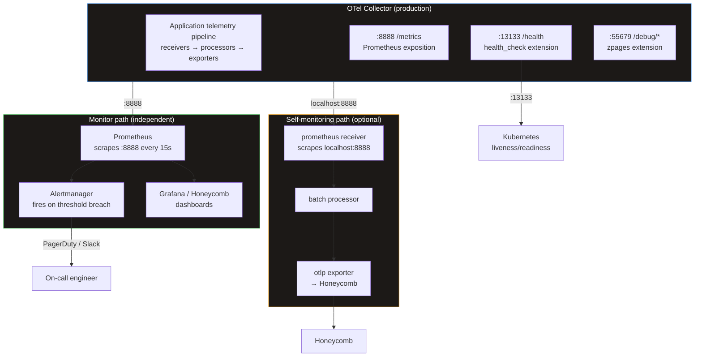
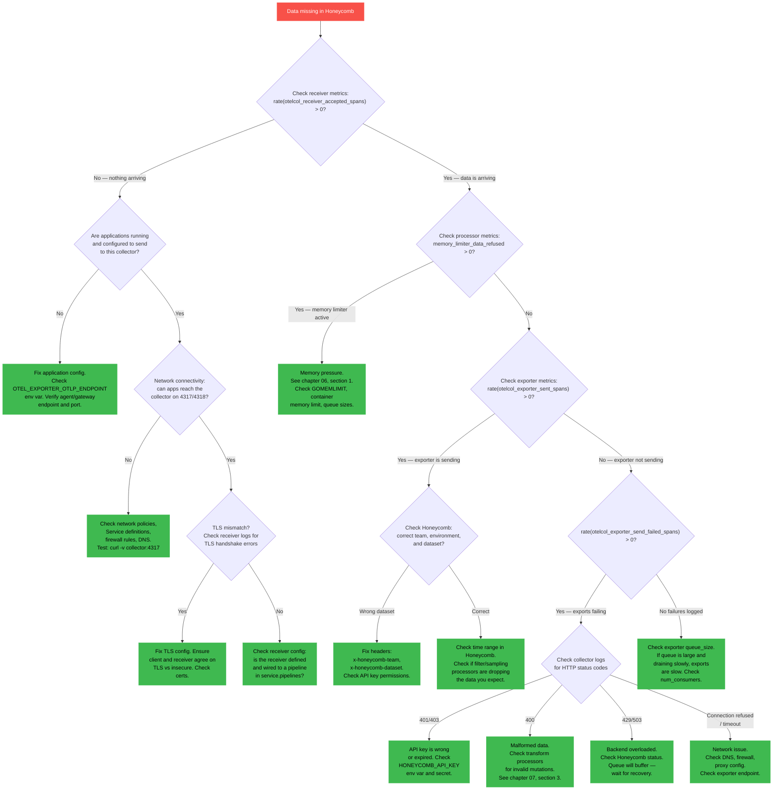
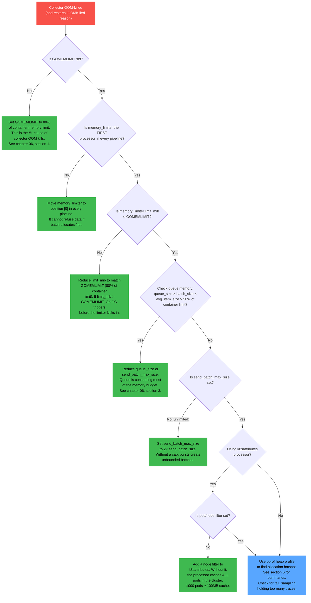
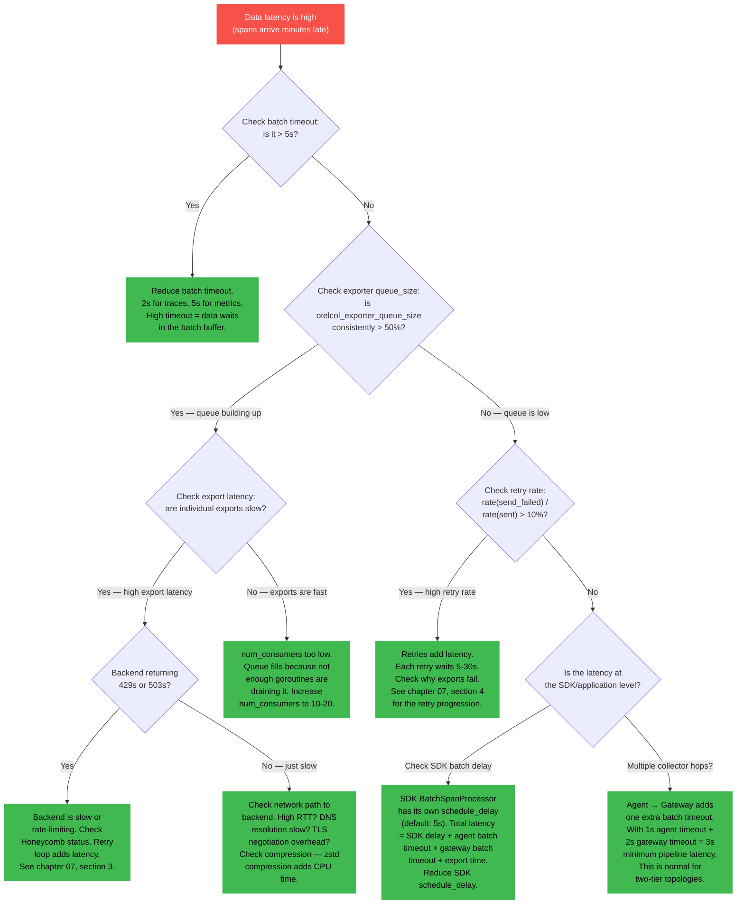

# Chapter 09 — Monitoring the Collector

> **Audience**: SREs and platform engineers running the OTel Collector in production.
>
> **Prerequisite**: You have read [Chapter 06 (Tuning for Production)](06-tuning-production.md) for
> memory, batch, and queue configuration, and [Chapter 07 (Backpressure Handling)](07-backpressure.md)
> for the failure modes these metrics expose. This chapter tells you how to observe, alert on, and
> debug those failure modes in practice.
>
> **Goal**: Walk out of this chapter with a complete self-monitoring pipeline, a full set of
> Prometheus alerting rules, dashboard queries, and three troubleshooting flowcharts you can hand
> to on-call engineers.

---

## 1. The Meta-Observability Problem

You need observability to monitor your observability pipeline. This is not a philosophical curiosity — it is an operational constraint with real consequences.

If the collector crashes, any monitoring that depends on the collector also goes dark. You lose visibility at the exact moment you need it most. This means you must monitor the collector through a path that does not depend on the collector itself.

### The architecture



### The three monitoring paths

| Path | How it works | Survives collector crash? | Use for |
|------|-------------|--------------------------|---------|
| **External scrape** (Prometheus) | Prometheus scrapes the collector's `:8888` endpoint | Yes — Prometheus detects `up == 0` | Alerting, dashboards, capacity planning |
| **Self-monitoring** (collector scrapes itself) | A `prometheus` receiver inside the collector scrapes `localhost:8888` and exports to Honeycomb | No — if the collector dies, self-reporting dies | Rich querying in Honeycomb, correlation with application telemetry |
| **Health check** (K8s probes) | K8s hits `:13133` for liveness/readiness | Yes — K8s restarts the pod | Automatic restart on failure |

**You need at minimum two of these three.** External scrape for alerting (because it survives crashes) and health checks for automatic recovery. Self-monitoring is a bonus for deep debugging.

---

## 2. Internal Metrics — The Essential Set

The collector exposes Prometheus-format metrics on port 8888 by default. These metrics are your primary window into pipeline health.

### Enabling internal telemetry

```yaml
service:
  telemetry:
    metrics:
      # Level: "detailed" exposes per-pipeline and per-component metrics.
      # "normal" (default) omits some histograms. Always use "detailed" in production.
      level: detailed

      # Bind address for the Prometheus metrics endpoint.
      # 0.0.0.0 exposes to the pod network (required for Prometheus to scrape).
      # localhost would only be accessible from within the container.
      address: "0.0.0.0:8888"

    logs:
      level: info
      # Set to "debug" only when actively troubleshooting. See section 9.
```

### Receiver metrics

These metrics tell you whether data is entering the pipeline.

| Metric | What it measures | Healthy value |
|--------|-----------------|---------------|
| `otelcol_receiver_accepted_spans` | Spans successfully received and passed to the pipeline | Rate > 0 (matches your expected ingest) |
| `otelcol_receiver_accepted_metric_points` | Metric datapoints successfully received | Rate > 0 |
| `otelcol_receiver_accepted_log_records` | Log records successfully received | Rate > 0 |
| `otelcol_receiver_refused_spans` | Spans refused by the receiver (backpressure from processors) | 0 in steady state |
| `otelcol_receiver_refused_metric_points` | Metric datapoints refused | 0 in steady state |
| `otelcol_receiver_refused_log_records` | Log records refused | 0 in steady state |

**Interpretation**:

- `rate(accepted)` = your ingest throughput. If this drops to 0, either applications stopped sending or the receiver is broken.
- `rate(refused) > 0` = the `memory_limiter` or a downstream processor is pushing back. Cross-reference [chapter 07, section 2](07-backpressure.md) for the propagation chain.
- `refused / accepted` = backpressure ratio. Should be 0 in steady state. Any sustained non-zero value means the pipeline cannot keep up.

### Processor metrics

These metrics tell you whether the batch processor and memory limiter are behaving correctly.

| Metric | What it measures | Healthy value |
|--------|-----------------|---------------|
| `otelcol_processor_batch_batch_send_size` | Histogram of batch sizes actually sent (item count) | Distribution centered near `send_batch_size` |
| `otelcol_processor_batch_batch_send_size_bytes` | Histogram of batch sizes in bytes | Depends on item size |
| `otelcol_processor_batch_timeout_trigger_send` | Counter of batches sent because timeout fired (not because batch was full) | Low at high throughput; high at low throughput |
| `otelcol_processor_batch_batch_size_trigger_send` | Counter of batches sent because batch reached `send_batch_size` | High at high throughput |
| `otelcol_processor_memory_limiter_data_refused` | Data points refused by memory_limiter (memory pressure) | 0 (WARNING if > 0) |
| `otelcol_processor_memory_limiter_data_dropped` | Data points dropped by memory_limiter (unrecoverable) | 0 (CRITICAL if > 0) |

**Interpretation**:

- If `timeout_trigger_send >> batch_size_trigger_send`, your throughput is too low to fill batches before the timeout fires. This is normal for low-volume pipelines. At high throughput, it means the batch processor is misconfigured — check `send_batch_size` relative to your throughput (see [chapter 06, section 2](06-tuning-production.md)).
- If `memory_limiter_data_refused > 0`, the collector is under memory pressure. The limiter is doing its job — preventing OOM — but data is being rejected. Either throughput spiked, memory limits are too low, or queues are too large. See [chapter 06, section 1](06-tuning-production.md) for the OOM troubleshooting flowchart.
- If `memory_limiter_data_dropped > 0`, data has been permanently lost due to memory pressure. This is the most severe processor metric.

### Exporter metrics

These metrics tell you whether data is leaving the pipeline and reaching the backend.

| Metric | What it measures | Healthy value |
|--------|-----------------|---------------|
| `otelcol_exporter_sent_spans` | Spans successfully exported to the backend | Rate matching `receiver_accepted` (minus any filtered/sampled) |
| `otelcol_exporter_sent_metric_points` | Metric datapoints successfully exported | Rate matching accepted |
| `otelcol_exporter_sent_log_records` | Log records successfully exported | Rate matching accepted |
| `otelcol_exporter_send_failed_spans` | Spans that failed to export after all retries | 0 (CRITICAL if sustained > 0) |
| `otelcol_exporter_send_failed_metric_points` | Failed metric datapoints | 0 |
| `otelcol_exporter_send_failed_log_records` | Failed log records | 0 |
| `otelcol_exporter_queue_size` | Current number of batches in the sending queue | Low and stable; rises during backpressure |
| `otelcol_exporter_queue_capacity` | Maximum queue capacity (= `queue_size` config) | Constant (matches your config) |
| `otelcol_exporter_enqueue_failed_spans` | Spans dropped because queue was full | 0 (CRITICAL: this is data loss) |
| `otelcol_exporter_enqueue_failed_metric_points` | Metric points dropped (queue full) | 0 |
| `otelcol_exporter_enqueue_failed_log_records` | Log records dropped (queue full) | 0 |

**Interpretation**:

- `queue_size / queue_capacity` = queue utilization. This is your primary scaling signal. If it stays above 50% during normal operation, your exporter cannot keep up — add replicas or increase `num_consumers`.
- `enqueue_failed > 0` means data loss is actively occurring. The queue is full, and incoming batches have nowhere to go. This is the single most critical metric. See [chapter 07, section 4](07-backpressure.md) for the queue-retry-drop chain.
- `send_failed > 0` means batches exhausted their retry budget (`max_elapsed_time`). The backend was unreachable for longer than your retry window. Check backend health, API key validity, and network connectivity.

### Pipeline health: the conservation equation

In a healthy pipeline, data is conserved: everything that enters eventually leaves (minus anything intentionally filtered or sampled).

```
data_in_flight = accepted - (sent + dropped + filtered)
```

If `data_in_flight` grows continuously, you have a leak — data is accumulating somewhere in the pipeline without being exported or explicitly dropped. Common causes: a processor that holds references indefinitely (tail_sampling with no decision timeout), or a queue that never drains because the exporter is silently misconfigured (wrong endpoint, expired API key returning non-retryable errors).

**Quick health checks**:

| Check | Formula | Expected | Problem if violated |
|-------|---------|----------|-------------------|
| Input = Output | `rate(accepted) ≈ rate(sent) + rate(filtered)` | Match within 5% | Data accumulating or leaking |
| No backpressure | `rate(refused) / rate(accepted)` | 0 | Pipeline saturated |
| No data loss | `rate(enqueue_failed) + rate(send_failed)` | 0 | Data being dropped |
| Queue healthy | `queue_size / queue_capacity` | < 0.3 | Exporter cannot keep up |

### Essential metrics reference table

| Metric | Component | What it means | Alert threshold | Severity |
|--------|-----------|--------------|-----------------|----------|
| `otelcol_receiver_refused_spans` | Receiver | Backpressure from pipeline | `rate > 0` for 2m | Warning |
| `otelcol_processor_memory_limiter_data_refused` | Processor | Memory pressure, data rejected | `rate > 0` for 2m | Warning |
| `otelcol_processor_memory_limiter_data_dropped` | Processor | Memory pressure, data lost | `rate > 0` for 1m | Critical |
| `otelcol_exporter_queue_size` / `queue_capacity` | Exporter | Queue utilization | > 0.8 for 10m | Warning |
| `otelcol_exporter_send_failed_spans` | Exporter | Export failures (retries exhausted) | `rate > 0` for 5m | Critical |
| `otelcol_exporter_enqueue_failed_spans` | Exporter | Queue full, data dropped | `rate > 0` for 5m | Critical |
| `otelcol_receiver_accepted_spans` | Receiver | Ingest throughput | `rate == 0` for 5m | Critical |

---

## 3. Self-Monitoring Pipeline

The collector can scrape its own metrics and export them to Honeycomb. This gives you the ability to query collector health alongside your application telemetry — all in one place.

### Config

```yaml
receivers:
  # Application data from your services
  otlp:
    protocols:
      grpc:
        endpoint: "0.0.0.0:4317"
      http:
        endpoint: "0.0.0.0:4318"

  # Self-monitoring: scrape the collector's own Prometheus metrics
  prometheus/self:
    config:
      scrape_configs:
        - job_name: "otel-collector-self"
          scrape_interval: 15s
          static_configs:
            - targets: ["localhost:8888"]

processors:
  memory_limiter:
    check_interval: 1s
    limit_mib: 1638
    spike_limit_mib: 409

  batch:
    send_batch_size: 4096
    send_batch_max_size: 8192
    timeout: 2s

  # Smaller batches for self-monitoring (low volume)
  batch/self:
    send_batch_size: 256
    timeout: 15s

exporters:
  otlp/honeycomb:
    endpoint: "api.honeycomb.io:443"
    headers:
      "x-honeycomb-team": "${HONEYCOMB_API_KEY}"
    compression: zstd
    sending_queue:
      enabled: true
      queue_size: 2500
      num_consumers: 10
    retry_on_failure:
      enabled: true
      initial_interval: 5s
      max_interval: 30s
      max_elapsed_time: 300s

  # Separate exporter for self-monitoring metrics.
  # Smaller queue — this is low-volume data.
  otlp/honeycomb-self:
    endpoint: "api.honeycomb.io:443"
    headers:
      "x-honeycomb-team": "${HONEYCOMB_API_KEY}"
    compression: zstd
    sending_queue:
      enabled: true
      queue_size: 100
      num_consumers: 2
    retry_on_failure:
      enabled: true
      initial_interval: 5s
      max_interval: 30s
      max_elapsed_time: 120s

service:
  telemetry:
    metrics:
      level: detailed
      address: "0.0.0.0:8888"

  pipelines:
    # Application telemetry — the primary pipeline
    traces:
      receivers: [otlp]
      processors: [memory_limiter, batch]
      exporters: [otlp/honeycomb]

    metrics:
      receivers: [otlp]
      processors: [memory_limiter, batch]
      exporters: [otlp/honeycomb]

    logs:
      receivers: [otlp]
      processors: [memory_limiter, batch]
      exporters: [otlp/honeycomb]

    # Self-monitoring — separate pipeline, separate exporter
    metrics/self:
      receivers: [prometheus/self]
      processors: [memory_limiter, batch/self]
      exporters: [otlp/honeycomb-self]
```

### Why a separate pipeline

The self-monitoring pipeline must be isolated from the application telemetry pipeline for two reasons:

1. **Failure isolation**. If the application pipeline backs up (queue full, exporter retrying), the self-monitoring pipeline continues to report. You can still see what is happening inside the collector even while it is under pressure.
2. **Different tuning**. Self-monitoring produces ~50-200 metric datapoints per scrape (every 15s). Application telemetry might be 200K spans/sec. These need different batch sizes, queue sizes, and retry budgets.

### Tradeoffs

| | |
|---|---|
| **Pros** | Query collector metrics in Honeycomb alongside application telemetry. Correlation: "did latency increase because the collector queue filled?" One pane of glass for everything. |
| **Cons** | Adds ~5-10% overhead (the prometheus receiver, an additional batch processor, an additional exporter). Creates a circular dependency: if the collector is sick enough that exports fail, self-reporting also fails. If Honeycomb is down, your monitoring of the collector in Honeycomb is also down. |

### Mitigations

- **Always run an external Prometheus scrape in addition to self-monitoring.** The external path survives collector sickness. Self-monitoring is a convenience for deep debugging, not your primary alerting source.
- **Use a separate collector instance for critical monitoring.** Run a lightweight "monitor" collector (minimal config: prometheus receiver + otlp exporter) that scrapes your production collectors. This monitor collector has its own failure domain.
- **Set up an external health check.** A simple HTTP probe from outside the cluster (uptime monitor, synthetic check) that hits `:13133`. This detects total collector failure when nothing else can.

---

## 4. Health Check Extension

The `health_check` extension exposes an HTTP endpoint that Kubernetes (or any external monitor) can probe for liveness and readiness.

### Config

```yaml
extensions:
  health_check:
    # Bind address. Use 0.0.0.0 to expose to the pod network.
    endpoint: "0.0.0.0:13133"

    # Path for the health endpoint. Default is "/".
    path: "/"

    # Response body when healthy.
    response_body: '{"status":"ok"}'

service:
  extensions: [health_check]
```

### Kubernetes probe config

```yaml
# In the container spec of your Deployment/DaemonSet
livenessProbe:
  httpGet:
    path: /
    port: 13133
  # The collector needs time to start up, especially with persistent
  # queues that replay from disk on boot.
  # 15s is safe for most configs. Increase to 30-60s if using
  # persistent queues with large WAL files.
  initialDelaySeconds: 15
  periodSeconds: 10
  timeoutSeconds: 5
  failureThreshold: 3         # 3 failures × 10s = 30s before restart

readinessProbe:
  httpGet:
    path: /
    port: 13133
  # Readiness can start checking sooner — it does not restart the pod,
  # it just removes it from the Service endpoints.
  initialDelaySeconds: 5
  periodSeconds: 5
  timeoutSeconds: 3
  failureThreshold: 3         # 3 failures × 5s = 15s before unready
```

### What breaks

**Problem: pod restart loop**

If `initialDelaySeconds` is too short and the collector has a large persistent queue to replay on startup, the liveness probe fires before the collector finishes initializing. Kubernetes kills the pod, which restarts, replays the queue again, gets killed again — a restart loop.

**Symptoms**: `CrashLoopBackOff` status, `restartCount` incrementing, logs showing `"starting file_storage recovery"` followed by a SIGTERM.

**Fix**: increase `initialDelaySeconds` to exceed your worst-case startup time. Measure startup time with a full persistent queue (load test, then kill the pod, then watch how long recovery takes).

**Problem: false positive restart**

The health check can report unhealthy if a downstream dependency (the backend) is unreachable. By default, the collector health check only reports the collector's own readiness, not backend connectivity. But if you configure custom health check responses that depend on exporter status, a transient backend outage can make the health check fail, triggering a K8s restart — which drops the in-memory queue and makes things worse.

**Fix**: keep the health check simple. It should answer "is the collector process running and accepting data?" — not "is the entire pipeline healthy end-to-end?" End-to-end health is what your Prometheus alerts are for.

---

## 5. zPages Extension

The `zpages` extension provides in-process debugging pages that show real-time pipeline status. Think of it as `top` for your collector.

### Config

```yaml
extensions:
  zpages:
    # Bind to localhost only. Do NOT expose this to the pod network.
    endpoint: "localhost:55679"

service:
  extensions: [health_check, zpages]
```

### Available pages

| Page | URL | What it shows |
|------|-----|---------------|
| ServiceZ | `/debug/servicez` | Service overview: uptime, build info, running config |
| PipelineZ | `/debug/pipelinez` | Pipeline topology: which receivers, processors, and exporters are in each pipeline, and their status |
| ExtensionZ | `/debug/extensionz` | Extension status: health_check, zpages, file_storage, etc. |
| TraceZ | `/debug/tracez` | Recent traces processed by the collector (sampled). Shows span names, durations, status codes |
| RPCz | `/debug/rpcz` | gRPC statistics: per-method call counts, latencies, error rates |

### How to use in production

**Do not expose zpages externally.** It contains operational details about your pipeline configuration, data samples, and internal state. Port-forward to access it:

```bash
# From your workstation
kubectl port-forward -n otel svc/otel-gateway 55679:55679

# Then open in a browser
open http://localhost:55679/debug/pipelinez
```

### When to use

- **Verifying pipeline topology**: after a config change, check `/debug/pipelinez` to confirm that receivers, processors, and exporters are wired correctly.
- **Debugging data flow**: `/debug/tracez` shows sampled spans that recently passed through the collector. Use this to verify that attributes are being set correctly, that filtering rules are working, or that routing connectors are sending data to the expected pipeline.
- **Checking gRPC health**: `/debug/rpcz` shows per-method statistics for the OTLP gRPC receiver. Use this to detect connection issues between agents and the gateway.
- **Incident debugging**: when something is wrong and you need to understand what the collector is doing right now, zpages gives you a real-time view without log parsing.

---

## 6. pprof Extension

The `pprof` extension exposes Go runtime profiling endpoints. This is the tool you use when you need to understand why the collector is consuming too much memory or CPU.

### Config

```yaml
extensions:
  pprof:
    # Bind to localhost only. Profiling data is sensitive.
    endpoint: "localhost:1777"

service:
  extensions: [health_check, zpages, pprof]
```

### Common profiling commands

**Heap profile** (memory allocation hotspots):

```bash
# Port-forward first
kubectl port-forward -n otel deploy/otel-gateway 1777:1777

# Capture and analyze heap profile
go tool pprof http://localhost:1777/debug/pprof/heap
```

Inside `pprof`, run `top` to see the largest memory consumers, or `web` to generate a flame graph.

**CPU profile** (what is using CPU):

```bash
# Capture 30 seconds of CPU profile
go tool pprof http://localhost:1777/debug/pprof/profile?seconds=30
```

This blocks for 30 seconds while sampling. Use `top` to see the hottest functions.

**Goroutine dump** (detecting goroutine leaks):

```bash
# See all goroutines and their stack traces
go tool pprof http://localhost:1777/debug/pprof/goroutine
```

A healthy collector typically runs 100-500 goroutines. If you see thousands, something is leaking — usually unclosed connections or receivers that create goroutines per request without bounding them.

**Allocs profile** (allocation rate, not current usage):

```bash
go tool pprof http://localhost:1777/debug/pprof/allocs
```

This shows cumulative allocations since startup. Useful for identifying which code paths create the most GC pressure, even if the allocations are short-lived and do not show up in the heap profile.

### When to enable

**Only enable pprof in production when debugging a specific issue.** The overhead is small (the endpoint itself is cheap; profiling only costs CPU while actively sampling) but the security risk is real — pprof endpoints can leak internal state. Do not leave it enabled by default.

A reasonable pattern: define pprof in your config but do not include it in the `extensions` list. When you need it, add it to `extensions` and restart the collector (or use a ConfigMap edit + rolling restart).

```yaml
# Always defined, only activated when needed
extensions:
  pprof:
    endpoint: "localhost:1777"

service:
  # Normal: pprof not listed
  extensions: [health_check, zpages]

  # Debugging: uncomment pprof
  # extensions: [health_check, zpages, pprof]
```

---

## 7. Alerting Rules

These eight Prometheus alerting rules cover every critical failure mode of the OTel Collector. They are designed to be deployed as a `PrometheusRule` custom resource (for Prometheus Operator) but the `expr` fields work with any Prometheus-compatible alerting system.

### Complete PrometheusRule manifest

```yaml
apiVersion: monitoring.coreos.com/v1
kind: PrometheusRule
metadata:
  name: otel-collector-monitoring
  namespace: otel
  labels:
    app.kubernetes.io/name: otel-collector
    role: alert-rules
spec:
  groups:
    - name: otel-collector.rules
      interval: 30s
      rules:

        # ── Alert 1: Collector Down ──────────────────────────────────
        # The Prometheus scrape target is unreachable.
        # If up == 0, the collector process is dead, the pod is gone,
        # or the network path to :8888 is broken.
        - alert: OtelCollectorDown
          expr: up{job=~"otel-collector.*"} == 0
          for: 2m
          labels:
            severity: critical
          annotations:
            summary: "OTel Collector {{ $labels.instance }} is down"
            description: >
              Prometheus cannot reach the collector metrics endpoint on
              {{ $labels.instance }}. The collector process is not running,
              the pod has been evicted, or network connectivity to port 8888
              is broken. Check pod status with kubectl get pods -n otel.
              Check events with kubectl describe pod.
            runbook: |
              1. kubectl get pods -n otel — is the pod running?
              2. kubectl describe pod <name> -n otel — check events for OOMKilled, CrashLoopBackOff
              3. kubectl logs <name> -n otel --previous — check logs from the crashed container
              4. If OOMKilled: review chapter 06 section 1 (memory model)
              5. If CrashLoopBackOff: check config syntax (otelcol-contrib validate --config=...)

        # ── Alert 2: Data Dropped (Queue Full) ──────────────────────
        # The exporter queue is full and incoming batches are being
        # discarded. This is active data loss.
        - alert: OtelCollectorDataDropped
          expr: |
            (
              rate(otelcol_exporter_enqueue_failed_spans[5m]) +
              rate(otelcol_exporter_enqueue_failed_metric_points[5m]) +
              rate(otelcol_exporter_enqueue_failed_log_records[5m])
            ) > 0
          for: 5m
          labels:
            severity: critical
          annotations:
            summary: "OTel Collector is dropping data on {{ $labels.pod }}"
            description: >
              The exporter queue on {{ $labels.pod }} is full. Incoming data
              is being discarded at {{ $value | humanize }} items/sec.
              This means the backend is unreachable or too slow, and the
              queue buffer (chapter 07, section 4) has been exhausted.
            runbook: |
              1. Check backend health (Honeycomb status page)
              2. Check otelcol_exporter_send_failed_* — are exports failing?
              3. Check otelcol_exporter_queue_size — is it at capacity?
              4. Immediate: scale gateway replicas to spread load
              5. Short-term: increase queue_size if memory allows (chapter 06, section 3)
              6. Long-term: add persistent queues (chapter 07, section 5)

        # ── Alert 3: Memory Limiter Active ───────────────────────────
        # The memory_limiter processor is refusing incoming data to
        # prevent OOM. Data is being rejected, not dropped (it can
        # be retried by the sender). But sustained activation means
        # the pipeline is overwhelmed.
        - alert: OtelCollectorMemoryLimiterActive
          expr: |
            rate(otelcol_processor_memory_limiter_data_refused[5m]) > 0
          for: 5m
          labels:
            severity: warning
          annotations:
            summary: "Memory limiter active on {{ $labels.pod }}"
            description: >
              The memory_limiter on {{ $labels.pod }} is refusing data at
              {{ $value | humanize }} items/sec. The collector is under
              memory pressure and proactively shedding load to avoid OOM.
              Check for traffic spikes, undersized memory limits, or
              oversized queues consuming the memory budget.
            runbook: |
              1. Check container memory usage vs limit
              2. Check GOMEMLIMIT is set to 80% of container limit
              3. Check memory_limiter is FIRST processor (chapter 06, section 1)
              4. Check queue_size * batch_size — is queue consuming too much memory?
              5. If traffic spike: wait for it to subside, or scale replicas
              6. If sustained: increase container memory limit and re-derive GOMEMLIMIT

        # ── Alert 4: Queue Filling ───────────────────────────────────
        # Queue utilization above 80% for 10 minutes. The exporter
        # cannot drain the queue fast enough. Data loss is imminent
        # if the trend continues.
        - alert: OtelCollectorQueueFilling
          expr: |
            otelcol_exporter_queue_size
            /
            otelcol_exporter_queue_capacity
            > 0.8
          for: 10m
          labels:
            severity: warning
          annotations:
            summary: "Exporter queue at {{ $value | humanizePercentage }} on {{ $labels.pod }}"
            description: >
              The sending queue for exporter {{ $labels.exporter }} on
              {{ $labels.pod }} has been above 80% capacity for 10 minutes.
              Remaining headroom: {{ printf "%.0f" (1.0 | subtract $value | multiply 100) }}%.
              If this continues, the queue will fill and data loss will begin.
            runbook: |
              1. Check otelcol_exporter_send_failed_* — is the backend returning errors?
              2. Check export latency — is the backend slow?
              3. If backend healthy: increase num_consumers to drain faster
              4. If backend slow: check Honeycomb status, check network
              5. If sustained: add replicas to reduce per-replica throughput

        # ── Alert 5: Export Failures ─────────────────────────────────
        # Batches are failing to export after exhausting retries.
        # This means data is being permanently lost after sitting
        # in the retry loop for max_elapsed_time.
        - alert: OtelCollectorExportFailures
          expr: |
            (
              rate(otelcol_exporter_send_failed_spans[5m]) +
              rate(otelcol_exporter_send_failed_metric_points[5m]) +
              rate(otelcol_exporter_send_failed_log_records[5m])
            ) > 0
          for: 5m
          labels:
            severity: critical
          annotations:
            summary: "Export failures on {{ $labels.pod }}: {{ $value | humanize }}/sec"
            description: >
              Exporter {{ $labels.exporter }} on {{ $labels.pod }} is
              permanently dropping data after retry exhaustion.
              Failure rate: {{ $value | humanize }} items/sec.
              Retries have been attempted for max_elapsed_time and failed.
            runbook: |
              1. Check collector logs for HTTP status codes
              2. 400/401/403: configuration error (bad API key, malformed data)
              3. 429/503: backend overloaded — this should clear when backend recovers
              4. Connection refused: check network connectivity, DNS resolution
              5. Timeout: check export timeout config, check backend latency

        # ── Alert 6: High Memory ─────────────────────────────────────
        # Container memory usage is approaching the limit.
        # The memory_limiter should activate before OOM, but this
        # alert gives you a heads-up to investigate.
        - alert: OtelCollectorHighMemory
          expr: |
            container_memory_working_set_bytes{container="otelcol"}
            /
            container_spec_memory_limit_bytes{container="otelcol"}
            > 0.85
          for: 10m
          labels:
            severity: warning
          annotations:
            summary: "Collector memory at {{ $value | humanizePercentage }} of limit on {{ $labels.pod }}"
            description: >
              The collector container on {{ $labels.pod }} is using more
              than 85% of its memory limit. If GOMEMLIMIT and
              memory_limiter are configured correctly (chapter 06),
              the collector should shed load before OOM. But sustained
              high memory is a sign that the workload has outgrown the
              container size.
            runbook: |
              1. Verify GOMEMLIMIT is set to 80% of container limit
              2. Verify memory_limiter.limit_mib matches GOMEMLIMIT
              3. Check pprof heap profile for allocation hotspots (section 6)
              4. Check queue sizes — reduce if consuming too much memory
              5. Consider increasing container memory limit and re-deriving all values

        # ── Alert 7: Receiver Refusing Data ──────────────────────────
        # The receiver is rejecting incoming data. This means
        # backpressure from the memory_limiter or a downstream
        # processor has propagated to the receiver level.
        - alert: OtelCollectorReceiverRefused
          expr: |
            (
              rate(otelcol_receiver_refused_spans[5m]) +
              rate(otelcol_receiver_refused_metric_points[5m]) +
              rate(otelcol_receiver_refused_log_records[5m])
            ) > 0
          for: 2m
          labels:
            severity: warning
          annotations:
            summary: "Receiver refusing data on {{ $labels.pod }}"
            description: >
              Receiver {{ $labels.receiver }} on {{ $labels.pod }} is
              refusing incoming data at {{ $value | humanize }} items/sec.
              This is downstream pressure propagating to the intake.
              Upstream clients (agents, SDKs) will see export errors
              and begin queuing or dropping data.
            runbook: |
              1. Check memory_limiter — is it the source of the refusal?
              2. Check exporter queue_size — is the queue full?
              3. Check backend health — is the exporter blocked?
              4. Cross-reference chapter 07 for backpressure propagation

        # ── Alert 8: No Data Flowing ─────────────────────────────────
        # The accepted rate has dropped to zero for all signal types.
        # Either the pipeline is broken, or all upstream sources
        # have stopped sending. Either way, you are flying blind.
        - alert: OtelCollectorNoData
          expr: |
            (
              rate(otelcol_receiver_accepted_spans[5m]) +
              rate(otelcol_receiver_accepted_metric_points[5m]) +
              rate(otelcol_receiver_accepted_log_records[5m])
            ) == 0
          for: 5m
          labels:
            severity: critical
          annotations:
            summary: "No data flowing through collector {{ $labels.pod }}"
            description: >
              The collector on {{ $labels.pod }} has received zero data
              across all signal types for 5 minutes. Either the receiver
              is broken (check port bindings, TLS config) or all upstream
              sources have stopped sending (deployment, network partition).
            runbook: |
              1. kubectl logs <pod> -n otel — check for receiver startup errors
              2. Check receiver port bindings (4317/4318) — is anything listening?
              3. Check network policies — are agents allowed to reach the gateway?
              4. Check upstream: are agents running? Are SDKs configured with the right endpoint?
              5. Test connectivity: kubectl exec -n otel <agent-pod> -- curl -v gateway:4317
```

### Alert summary

| # | Alert | Condition | Severity | What it means |
|---|-------|-----------|----------|---------------|
| 1 | `OtelCollectorDown` | `up == 0` for 2m | Critical | Collector process is not running |
| 2 | `OtelCollectorDataDropped` | `enqueue_failed > 0` for 5m | Critical | Active data loss (queue full) |
| 3 | `OtelCollectorMemoryLimiterActive` | `data_refused > 0` for 5m | Warning | Memory pressure, shedding load |
| 4 | `OtelCollectorQueueFilling` | `queue > 80%` for 10m | Warning | Exporter falling behind |
| 5 | `OtelCollectorExportFailures` | `send_failed > 0` for 5m | Critical | Backend unreachable, data lost |
| 6 | `OtelCollectorHighMemory` | Memory > 85% limit for 10m | Warning | Approaching OOM territory |
| 7 | `OtelCollectorReceiverRefused` | `refused > 0` for 2m | Warning | Backpressure at receiver level |
| 8 | `OtelCollectorNoData` | `accepted == 0` for 5m | Critical | Pipeline broken or upstream dead |

---

## 8. Troubleshooting Flowcharts

Three diagnostic flowcharts for the most common operational scenarios. Print these and tape them next to your monitor.

### Flowchart 1: "Data is missing in Honeycomb"



### Flowchart 2: "Collector is OOMing"



### Flowchart 3: "Data latency is high"

Data arrives in Honeycomb minutes late, instead of the expected few seconds.



---

## 9. Debug Logging

When metrics and flowcharts do not narrow down the problem, debug logging gives you the raw detail. But it comes at a cost.

### Enabling debug logs

```yaml
service:
  telemetry:
    logs:
      # WARNING: "debug" is extremely verbose. A collector processing 100K
      # spans/sec can produce 10+ MB/sec of debug logs. This will:
      # 1. Consume significant CPU (log serialization)
      # 2. Fill disk (or stdout buffer) rapidly
      # 3. Increase memory usage (log buffers)
      # 4. Potentially mask the problem you are debugging by changing
      #    the collector's behavior under load.
      #
      # Never leave debug logging on in production.
      level: debug

    metrics:
      level: detailed
      address: "0.0.0.0:8888"
```

### Better alternative: the debug exporter

Instead of turning on debug logging for the entire collector, add a `debug` exporter to a specific pipeline. This shows you what the data looks like at that point in the pipeline — after processors have run — without flooding your logs with internal runtime noise.

```yaml
exporters:
  # Your production exporter
  otlp/honeycomb:
    endpoint: "api.honeycomb.io:443"
    headers:
      "x-honeycomb-team": "${HONEYCOMB_API_KEY}"
    compression: zstd
    sending_queue:
      enabled: true
      queue_size: 2500
      num_consumers: 10
    retry_on_failure:
      enabled: true
      initial_interval: 5s
      max_interval: 30s
      max_elapsed_time: 300s

  # Debug exporter: prints data to stdout
  debug:
    # "detailed" shows full span/metric/log content including attributes.
    # "normal" shows summary (counts, trace IDs). "basic" shows minimal info.
    verbosity: detailed

    # Sampling: do not print every item. Print the first 5, then 1 in 200.
    # At 100K spans/sec, "sampling_thereafter: 200" prints ~500 spans/sec
    # instead of 100K. Still readable. Still diagnostic.
    sampling_initial: 5
    sampling_thereafter: 200

service:
  pipelines:
    traces:
      receivers: [otlp]
      processors: [memory_limiter, batch]
      # Fan out: send to Honeycomb AND debug output
      exporters: [otlp/honeycomb, debug]
```

### When to use each approach

| Approach | Use when | Output volume | Impact |
|----------|----------|---------------|--------|
| `logs.level: debug` | Debugging collector startup failures, extension initialization, config parsing | Very high (10+ MB/sec at load) | Significant CPU and I/O overhead |
| `debug` exporter with sampling | Inspecting data content: "are my attributes set correctly?", "is the filter dropping the right spans?" | Moderate (controlled by sampling) | Low — sampling limits volume |
| `debug` exporter without sampling | Inspecting every item in a low-volume pipeline | High | Only safe at < 1K items/sec |

### Procedure for debug logging

1. **Reduce traffic first.** If possible, route a subset of traffic to a debug collector instance rather than enabling debug on production.
2. **Set a time limit.** Enable debug logging, reproduce the issue, disable debug logging. Never walk away from a collector with debug logging on.
3. **Capture logs to a file**, not stdout. In Kubernetes, stdout goes to the container runtime log, which may have size limits (10MB by default for Docker). Pipe to a file with a known size limit:

```bash
# Exec into the pod and capture debug output
kubectl logs -n otel <pod-name> -f > /tmp/otel-debug-$(date +%s).log &

# Set a timer to remind yourself to turn it off
sleep 300 && echo "TURN OFF DEBUG LOGGING" | wall
```

---

## 10. Dashboards

Dashboards turn raw metrics into answers. These are the six panels you should build, with the PromQL queries that power them. Adapt the label matchers to your environment.

### Panel 1: Throughput — accepted vs. sent

Shows whether data flowing in matches data flowing out. Any sustained gap means data is accumulating or being dropped.

```promql
# Ingest rate (spans/sec) — what enters the pipeline
rate(otelcol_receiver_accepted_spans{job="otel-collector"}[5m])

# Export rate (spans/sec) — what leaves the pipeline
rate(otelcol_exporter_sent_spans{job="otel-collector"}[5m])

# Same for metrics
rate(otelcol_receiver_accepted_metric_points{job="otel-collector"}[5m])
rate(otelcol_exporter_sent_metric_points{job="otel-collector"}[5m])

# Same for logs
rate(otelcol_receiver_accepted_log_records{job="otel-collector"}[5m])
rate(otelcol_exporter_sent_log_records{job="otel-collector"}[5m])
```

**What to look for**: the two lines (accepted and sent) should track each other closely. A growing gap means the queue is filling. A permanent offset means a processor is filtering or sampling (expected if you configured it).

### Panel 2: Error rate

All failure modes as a percentage of accepted data. This is the single most important panel.

```promql
# Error rate as percentage of total accepted
(
  rate(otelcol_receiver_refused_spans[5m]) +
  rate(otelcol_exporter_send_failed_spans[5m]) +
  rate(otelcol_exporter_enqueue_failed_spans[5m]) +
  rate(otelcol_processor_memory_limiter_data_refused[5m])
)
/
rate(otelcol_receiver_accepted_spans[5m])
* 100
```

**What to look for**: 0% in steady state. Any non-zero value needs investigation. Break it down by failure type (refused, send_failed, enqueue_failed) to identify the source.

### Panel 3: Queue depth

Current queue utilization as a percentage of capacity. Your primary scaling signal.

```promql
# Queue utilization (0-1) per exporter
otelcol_exporter_queue_size{job="otel-collector"}
/
otelcol_exporter_queue_capacity{job="otel-collector"}

# Absolute queue size (for correlation)
otelcol_exporter_queue_size{job="otel-collector"}
```

**What to look for**: under 30% during normal operation. Spikes during backend slowdowns are expected — the queue is doing its job. Sustained above 50% means the exporter cannot keep up. Above 80% triggers the `OtelCollectorQueueFilling` alert.

### Panel 4: Memory

Container memory usage vs. limit, with the GOMEMLIMIT line overlaid.

```promql
# Current memory usage (working set)
container_memory_working_set_bytes{container="otelcol", namespace="otel"}

# Container memory limit
container_spec_memory_limit_bytes{container="otelcol", namespace="otel"}

# GOMEMLIMIT line (if you set it to 80% of limit)
container_spec_memory_limit_bytes{container="otelcol", namespace="otel"} * 0.80
```

**What to look for**: usage should stay below the GOMEMLIMIT line (80% of limit) during normal operation. The memory_limiter activates at this threshold. If usage regularly touches the GOMEMLIMIT line, the container is undersized for the workload.

### Panel 5: Export latency

How long individual exports take. High latency means the backend is slow or the network path is degraded.

```promql
# Export duration p50
histogram_quantile(0.50,
  rate(otelcol_exporter_send_latency_bucket{job="otel-collector"}[5m])
)

# Export duration p95
histogram_quantile(0.95,
  rate(otelcol_exporter_send_latency_bucket{job="otel-collector"}[5m])
)

# Export duration p99
histogram_quantile(0.99,
  rate(otelcol_exporter_send_latency_bucket{job="otel-collector"}[5m])
)
```

**What to look for**: p50 under 200ms for a well-connected backend. p99 under 1s. If p99 exceeds the batch timeout, exports are slower than batch production, and queues will fill. Sustained high latency combined with rising queue depth is the classic "backend is slow" pattern.

### Panel 6: Batch efficiency

How the batch processor is performing — are batches filling before the timeout fires?

```promql
# Batch size distribution (average)
rate(otelcol_processor_batch_batch_send_size_sum{job="otel-collector"}[5m])
/
rate(otelcol_processor_batch_batch_send_size_count{job="otel-collector"}[5m])

# Timeout-triggered sends (batches sent because timeout fired, not because batch was full)
rate(otelcol_processor_batch_timeout_trigger_send{job="otel-collector"}[5m])

# Size-triggered sends (batches sent because they reached send_batch_size)
rate(otelcol_processor_batch_batch_size_trigger_send{job="otel-collector"}[5m])

# Timeout ratio: what fraction of batches are timeout-triggered?
rate(otelcol_processor_batch_timeout_trigger_send{job="otel-collector"}[5m])
/
(
  rate(otelcol_processor_batch_timeout_trigger_send{job="otel-collector"}[5m]) +
  rate(otelcol_processor_batch_batch_size_trigger_send{job="otel-collector"}[5m])
)
```

**What to look for**: at high throughput, most batches should be size-triggered (timeout ratio near 0). If timeout ratio is near 1, throughput is too low to fill batches — your `send_batch_size` is too large for your volume, or `timeout` is too short. See [chapter 06, section 2](06-tuning-production.md) for the batch math.

### Dashboard summary

| Panel | Primary metric | Answers the question |
|-------|---------------|---------------------|
| Throughput | accepted vs. sent rates | Is data flowing through? |
| Error rate | (refused + failed + dropped) / accepted | Is data being lost? |
| Queue depth | queue_size / queue_capacity | Can the exporter keep up? |
| Memory | working_set vs. limit | Is the collector going to OOM? |
| Export latency | send_latency p50/p95/p99 | Is the backend healthy? |
| Batch efficiency | timeout-triggered / total sends | Is the batch processor tuned? |

---

## Summary

| Tool | Port | What it gives you | When to use |
|------|------|-------------------|-------------|
| **Internal metrics** | `:8888` | Prometheus metrics for all pipeline components | Always on. This is your primary monitoring data source. |
| **Health check** | `:13133` | HTTP liveness/readiness endpoint | Always on. K8s probes depend on it. |
| **zpages** | `:55679` | Real-time pipeline debugging UI | Always on (localhost only). Port-forward when needed. |
| **pprof** | `:1777` | Go runtime profiling (heap, CPU, goroutines) | Enable only when debugging a specific performance issue. |
| **Self-monitoring** | N/A | Collector metrics exported to Honeycomb | Optional. Use for deep debugging and correlation. |
| **Debug exporter** | N/A | Data content printed to stdout | Temporary. Use to inspect data at a specific pipeline stage. |
| **Debug logging** | N/A | Verbose internal runtime logs | Temporary. Last resort for startup and config issues. |

The monitoring implementation order:

1. **Enable internal metrics** (`service.telemetry.metrics`) on every collector. This is non-negotiable — without it, the collector is a black box.
2. **Add health check extension** and wire up K8s probes. This gives you automatic recovery from crashes.
3. **Set up external Prometheus scraping** of the `:8888` endpoint. This gives you alerting that survives collector failures.
4. **Deploy the alerting rules** from section 7. At minimum, deploy `OtelCollectorDown`, `OtelCollectorDataDropped`, and `OtelCollectorExportFailures`.
5. **Build dashboards** with the queries from section 10. Start with throughput and error rate. Add the rest as you have time.
6. **Add zpages** for debugging capability. Leave it running on localhost.
7. **Add self-monitoring** (section 3) when you want collector metrics in Honeycomb for correlation with application telemetry.
8. **Add pprof** to your config (but not to the active extension list) so it is ready to enable when you need it.

Next: [Chapter 10 — Vendor-Specific Runbooks](10-vendor-specific-runbooks.md) provides step-by-step migration playbooks for moving from Datadog, New Relic, Splunk, Prometheus, and Jaeger to the upstream OTel Collector.
