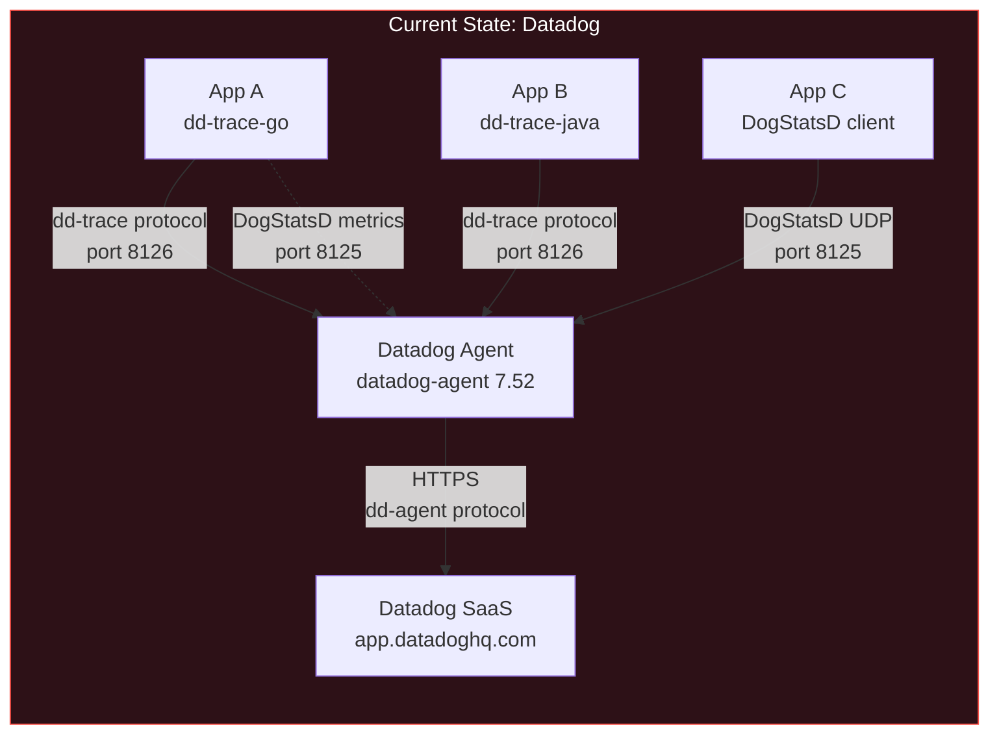
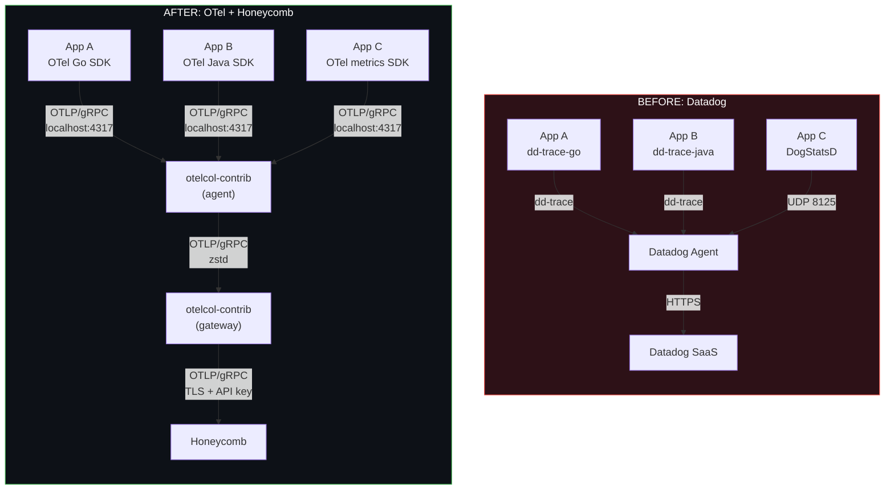
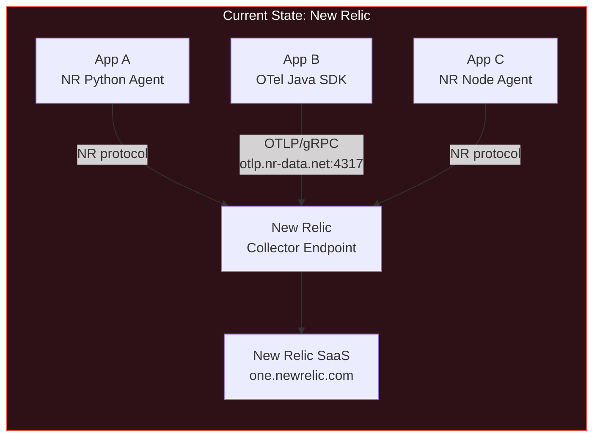
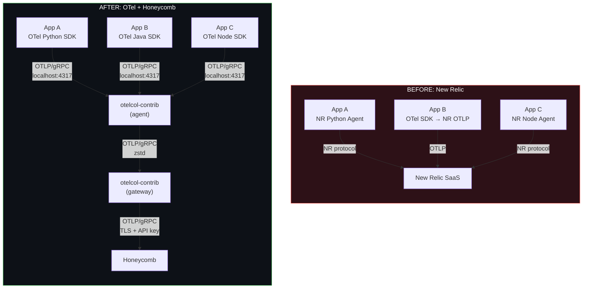
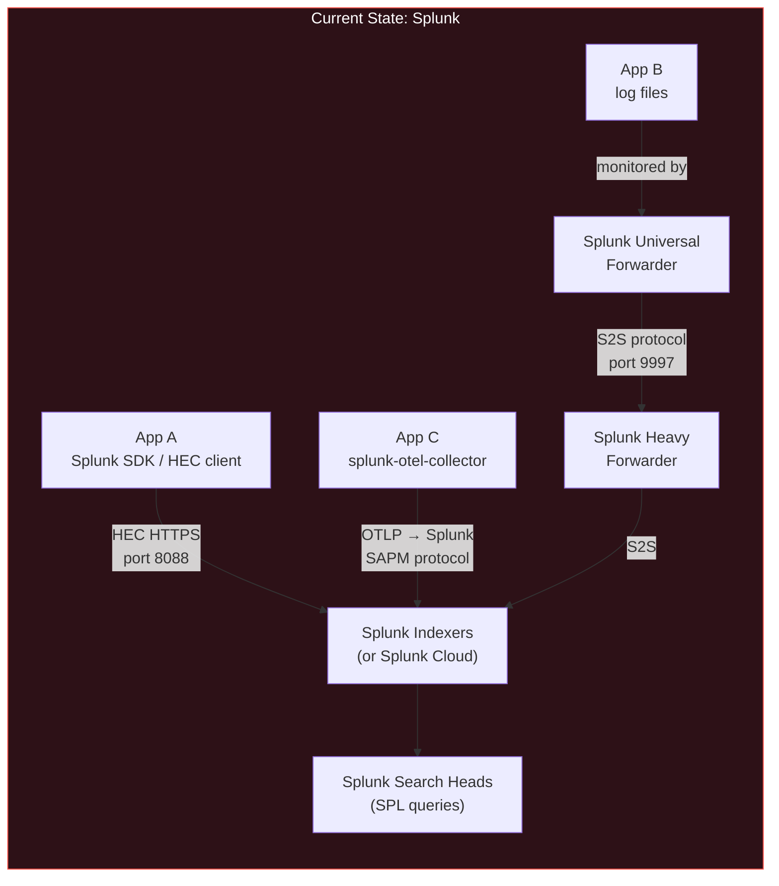
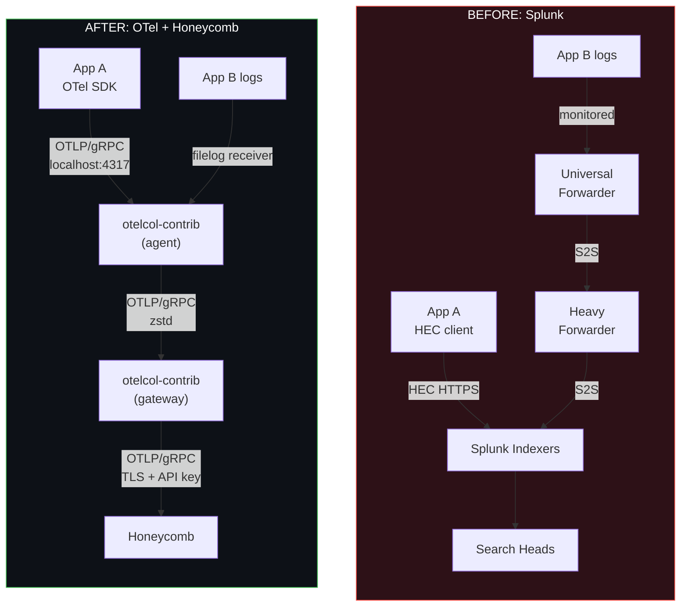
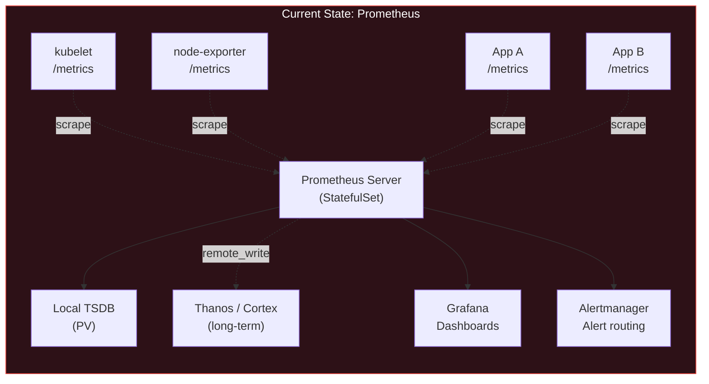
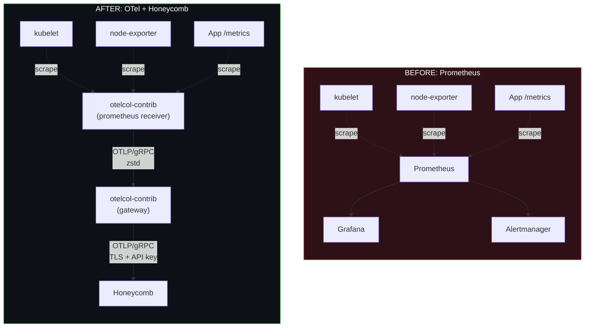
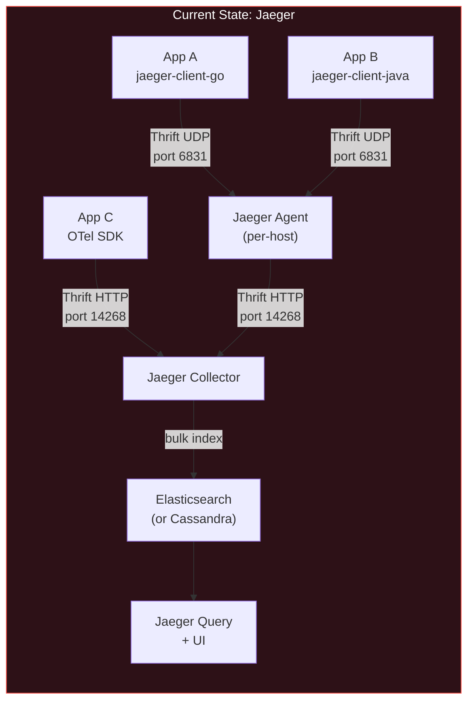
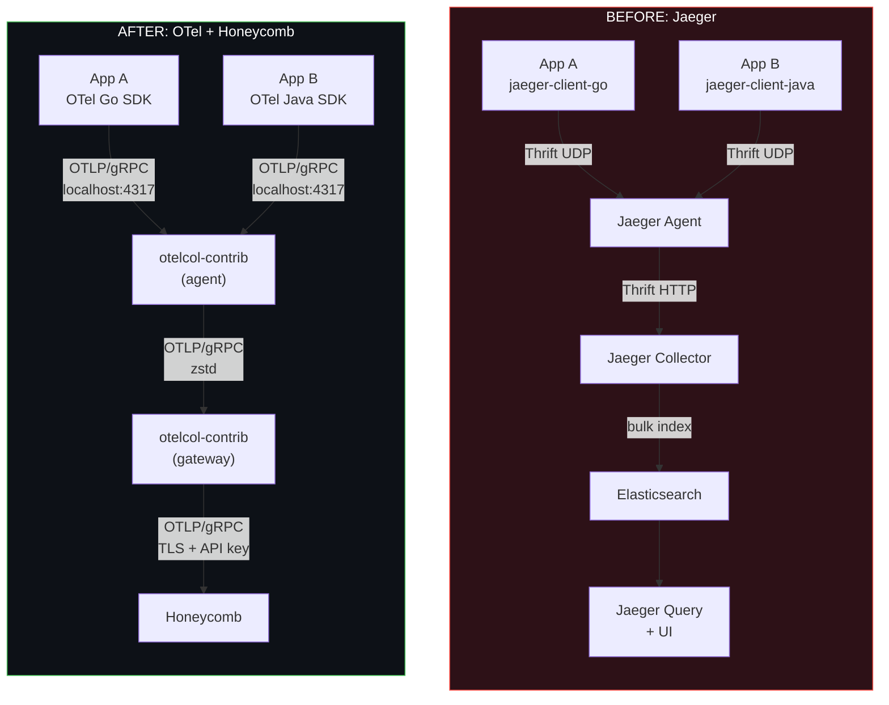

# Chapter 10 — Vendor-Specific Migration Runbooks

> **Audience**: SREs and platform engineers currently running Datadog, New Relic, Splunk,
> Prometheus, or Jaeger who need to migrate to the upstream OTel Collector exporting to Honeycomb.
>
> **Prerequisite**: You have read [Chapter 01 (Migration Phases)](01-migration-phases.md) for the
> overall dual-ship strategy and [Chapter 03 (Agent + Gateway Topology)](03-agent-gateway-topology.md)
> for the target architecture. This chapter provides the vendor-specific bridge configs that connect
> your current stack to that target architecture.
>
> **Goal**: Follow a single runbook end-to-end — from your current vendor to production OTel Collector
> exporting to Honeycomb — without reading any other vendor section.

---

## 1. How to Use This Chapter

This chapter is organized as five standalone runbooks. Jump to your vendor:

| # | Vendor | Section | Bridge Receiver | Difficulty |
|---|--------|---------|-----------------|------------|
| 2 | [Datadog](#2-datadog-migration-runbook) | Full runbook | `datadog` receiver | 4/5 |
| 3 | [New Relic](#3-new-relic-migration-runbook) | Full runbook | None needed (already OTLP) | 2/5 |
| 4 | [Splunk](#4-splunk-migration-runbook) | Full runbook | `splunk_hec` receiver | 4/5 |
| 5 | [Prometheus](#5-prometheus-migration-runbook) | Full runbook | `prometheus` receiver | 3/5 |
| 6 | [Jaeger](#6-jaeger-migration-runbook) | Full runbook | `jaeger` receiver | 2/5 |
| 7 | [Comparison Matrix](#7-migration-comparison-matrix) | Summary table | — | — |

Every runbook follows the same structure:

1. **Current State** — what your architecture looks like today
2. **Bridge Strategy** — how to accept your existing vendor protocol in the OTel Collector
3. **Dual-Ship Configuration** — send to both old and new backends simultaneously
4. **Cutover Steps** — ordered checklist from dual-ship to full migration
5. **What You Lose** — honest accounting of features with no direct equivalent
6. **Before/After Diagram** — the full architectural transformation

Each runbook is self-contained. An SRE should be able to follow a single runbook from start to
finish without reading any other vendor section. Where a concept is covered in depth in another
chapter (e.g., memory limiter tuning), the runbook links to it but includes enough inline config
to be actionable on its own.

---

## 2. Datadog Migration Runbook

### 2.1 Current State

A typical Datadog deployment looks like this: the Datadog Agent (`datadog-agent`) runs on every
host or Kubernetes node as a DaemonSet. Applications are instrumented with Datadog SDKs
(`dd-trace-go`, `dd-trace-py`, `dd-trace-java`, etc.) or, in some cases, OTel SDKs configured
to export to the DD Agent. The DD Agent collects traces, metrics (DogStatsD), logs, and host-level
data, then ships everything to Datadog's SaaS backend over HTTPS.



Key things to inventory before starting:

| Item | Where to find it |
|------|-----------------|
| DD Agent version | `datadog-agent version` or Helm chart `values.yaml` |
| SDK versions per service | `go.mod`, `requirements.txt`, `pom.xml`, `package.json` |
| Custom DD metrics (DogStatsD) | Search code for `statsd.increment`, `statsd.gauge`, `statsd.histogram` |
| DD APM features in use | Continuous Profiler, Error Tracking, App Analytics, Runtime Metrics |
| Monthly span volume | Datadog UI: APM > Setup & Configuration > Ingestion Control |
| Monthly custom metrics count | Datadog UI: Usage > Custom Metrics |
| Monthly log volume | Datadog UI: Usage > Logs |

### 2.2 Bridge Strategy: `datadog` Receiver

The `datadog` receiver in `otelcol-contrib` accepts the Datadog Agent protocol. It can receive:
- APM traces on the same port the DD Agent uses (default 8126)
- DogStatsD metrics on UDP port 8125

This lets you insert the OTel Collector between existing DD Agents and the Datadog backend without
changing any application code. The DD Agent thinks it is talking to another DD Agent or the Datadog
intake; the collector translates the DD protocol to OTLP internally.

**Collector config with `datadog` receiver:**

```yaml
receivers:
  datadog:
    endpoint: 0.0.0.0:8126       # Accept DD APM traces (HTTP)
    read_timeout: 60s
  # DogStatsD metrics — separate receiver
  statsd:
    endpoint: 0.0.0.0:8125       # Accept DogStatsD UDP
    aggregation_interval: 60s
    enable_metric_type: true
    is_monotonic_counter: true

processors:
  memory_limiter:
    limit_mib: 1638
    spike_limit_mib: 409
    check_interval: 1s
  batch:
    send_batch_size: 8192
    timeout: 200ms

exporters:
  otlp/honeycomb:
    endpoint: "api.honeycomb.io:443"
    headers:
      "x-honeycomb-team": "${env:HONEYCOMB_API_KEY}"
    compression: zstd

service:
  pipelines:
    traces:
      receivers: [datadog]
      processors: [memory_limiter, batch]
      exporters: [otlp/honeycomb]
    metrics:
      receivers: [statsd]
      processors: [memory_limiter, batch]
      exporters: [otlp/honeycomb]
```

**DD Agent config change** — point the DD Agent at your OTel Collector instead of Datadog's intake:

```yaml
# /etc/datadog-agent/datadog.yaml (or Helm values)
#
# Before:
#   apm_config:
#     enabled: true
#     apm_dd_url: https://trace.agent.datadoghq.com
#
# After:
apm_config:
  enabled: true
  apm_dd_url: http://otel-gateway.internal:8126   # OTel Collector

# For DogStatsD, redirect to the collector:
# Before: dogstatsd sends to Datadog directly via the agent
# After: if apps send DogStatsD directly, point them at the collector
# If DogStatsD goes through the DD Agent, configure the agent to forward:
additional_endpoints:
  "http://otel-gateway.internal:8126": []
```

If your applications send DogStatsD directly (not through the DD Agent), update the `DD_DOGSTATSD_URL`
environment variable or the statsd client configuration to point to the OTel Collector host on
port 8125.

**Tradeoff**: The `datadog` receiver translates DD format to OTLP. This translation is lossy for
DD-specific features. Continuous Profiling data, APM Security traces, Live Processes, and Network
Performance Monitoring data cannot pass through the OTLP translation. If you rely on these features,
you need a plan to replace or accept the gap before cutting over.

### 2.3 Dual-Ship Configuration

During migration, send to both Datadog (to keep existing dashboards and alerts running) and
Honeycomb (to validate the new pipeline). This uses the `datadog` exporter in `otelcol-contrib`
to forward data back to Datadog in its native format.

```yaml
receivers:
  datadog:
    endpoint: 0.0.0.0:8126
  statsd:
    endpoint: 0.0.0.0:8125
    aggregation_interval: 60s

processors:
  memory_limiter:
    limit_mib: 1638
    spike_limit_mib: 409
    check_interval: 1s
  batch/datadog:
    send_batch_size: 8192
    timeout: 200ms
  batch/honeycomb:
    send_batch_size: 8192
    timeout: 200ms

exporters:
  datadog:
    api:
      site: datadoghq.com
      key: "${env:DD_API_KEY}"
    traces:
      endpoint: "https://trace.agent.datadoghq.com"
      span_name_as_resource_name: true
    metrics:
      endpoint: "https://api.datadoghq.com"
  otlp/honeycomb:
    endpoint: "api.honeycomb.io:443"
    headers:
      "x-honeycomb-team": "${env:HONEYCOMB_API_KEY}"
    compression: zstd

service:
  pipelines:
    traces:
      receivers: [datadog]
      processors: [memory_limiter, batch/datadog]
      exporters: [datadog, otlp/honeycomb]
    metrics:
      receivers: [statsd]
      processors: [memory_limiter, batch/honeycomb]
      exporters: [datadog, otlp/honeycomb]
```

**Validation during dual-ship:**

Compare span counts between Datadog and Honeycomb. They should match within 2%.

| Metric | Where to check (Datadog) | Where to check (Honeycomb) |
|--------|--------------------------|---------------------------|
| Total spans/hour | APM > Ingestion Control > Ingested Spans | Query: `COUNT` grouped by `service.name`, 1h window |
| Unique services | APM > Service Catalog count | Query: `COUNT_DISTINCT(service.name)` |
| Error rate | APM > service > Error Rate | Query: `AVG(status_code = "ERROR")` per service |
| p99 latency | APM > service > Latency p99 | Query: `P99(duration_ms)` per service |

If the span counts diverge by more than 2%, check:
1. The `datadog` receiver's `otelcol_receiver_accepted_spans` metric — are all spans being received?
2. The `memory_limiter` processor's `otelcol_processor_refused_spans` — is backpressure dropping data?
3. The `batch` processor's `otelcol_processor_batch_batch_send_size` — are batches completing?

### 2.4 Cutover Steps

Work through these in order. Each step has a rollback: reverse the change and redeploy.

| Step | Action | Rollback |
|------|--------|----------|
| 1 | **Migrate app instrumentation from DD SDK to OTel SDK.** One service at a time. Replace `dd-trace-go` with `go.opentelemetry.io/otel`, etc. Configure OTel SDKs to export OTLP to the collector. | Revert code change, redeploy with DD SDK. |
| 2 | **Replace `datadog` receiver with `otlp` receiver.** Once all apps send OTLP, you no longer need the DD protocol bridge. | Re-add `datadog` receiver, revert apps to DD SDK. |
| 3 | **Remove `datadog` exporter from pipeline.** Honeycomb is now the sole backend. | Re-add `datadog` exporter, redeploy collector. |
| 4 | **Remove DD Agent from hosts/nodes.** Delete the DaemonSet, uninstall the package. | Reinstall DD Agent. |
| 5 | **Cancel Datadog contract.** Do this last, after at least 2 weeks of running solely on Honeycomb. | Re-activate account (Datadog retains data for the contract period). |

**Pre-cutover checklist:**

- [ ] All dashboards rebuilt in Honeycomb (or confirmed not needed)
- [ ] All alerts ported to Honeycomb triggers or SLOs
- [ ] On-call team trained on Honeycomb query interface
- [ ] DD-specific features replaced or gaps documented and accepted by stakeholders
- [ ] Runbooks updated to reference Honeycomb instead of Datadog
- [ ] At least 2 weeks of dual-ship validation with <2% span count divergence

### 2.5 What You Lose

Be honest about this table with your team. These are Datadog features with no direct OTLP-standard
or Honeycomb equivalent. For each, there is an alternative, but it may require additional tooling.

| Datadog Feature | OTel/Honeycomb Equivalent | Gap Severity |
|----------------|--------------------------|-------------|
| Continuous Profiler | Pyroscope, Grafana Profiles, or Parca. Requires separate deployment and instrumentation. | Medium — profiling is separate from tracing in the OTel ecosystem. |
| Network Performance Monitoring (NPM) | No direct equivalent. Consider eBPF-based tools: Cilium Hubble, Pixie, or Retina. | High — requires a separate tool entirely. |
| Real User Monitoring (RUM) | Honeycomb supports browser telemetry via OTel JS SDK with `@honeycombio/opentelemetry-web`. Coverage differs from DD RUM. | Medium — feature set is narrower. |
| Log Patterns / Analytics | Honeycomb queries on log events work differently. No automatic pattern detection. Use `GROUP BY` on parsed fields. | Low — different approach, not missing. |
| Watchdog (AI anomaly detection) | Build with Honeycomb SLOs + triggers + burn rate alerts. Manual configuration vs. DD's automatic detection. | Medium — requires manual setup. |
| CI Visibility | No direct equivalent. Use your CI platform's native observability or OTel-instrument CI pipelines. | Low — niche feature. |
| Synthetics (API/Browser tests) | Use Grafana Synthetic Monitoring, Checkly, or Pingdom. Separate tool. | Low — separate concern. |
| Security (ASM / CSM) | No OTel equivalent. Use Falco, Snyk, or dedicated security tooling. | High — completely separate domain. |

### 2.6 Before/After Architecture



---

## 3. New Relic Migration Runbook

### 3.1 Current State

New Relic deployments come in two flavors:

1. **New Relic language agents** (`newrelic-python`, `newrelic-node`, `newrelic-java`, etc.) sending
   data over New Relic's proprietary protocol to NR's collector endpoints.
2. **OTel SDKs** sending OTLP directly to New Relic's OTLP endpoint (`otlp.nr-data.net:4317`).

If you are already in flavor 2, this is the easiest vendor migration in this entire guide. New
Relic adopted OTLP natively, so the protocol is already standard — you just need to redirect it.



Inventory before starting:

| Item | Where to find it |
|------|-----------------|
| NR Agent type per service | Code dependencies: `newrelic` package in requirements/package.json |
| Services already on OTel SDK | Check for `opentelemetry` in dependencies and `OTEL_EXPORTER_OTLP_ENDPOINT` in env vars |
| NR API keys in use | `NEW_RELIC_LICENSE_KEY` env vars, NR UI: API Keys page |
| Monthly data ingest (GB) | NR UI: Administration > Plan & Usage > Data Ingest |
| Custom dashboards count | NR UI: Dashboards page |
| Alert policies count | NR UI: Alerts > Alert Policies |

### 3.2 Bridge Strategy: OTLP Dual-Ship

New Relic already supports OTLP natively. This means:

- **If using NR language agents**: swap to OTel SDKs first. This is the prerequisite. NR proprietary
  agents cannot send to a generic OTel Collector. Fortunately, New Relic's own migration guide
  documents this swap.
- **If already using OTel SDKs pointing directly to NR's OTLP endpoint**: insert an OTel Collector
  between the apps and New Relic. Change `OTEL_EXPORTER_OTLP_ENDPOINT` from `https://otlp.nr-data.net:4317`
  to `http://otel-collector.internal:4317`.

No special receiver is needed. The standard `otlp` receiver handles everything. This is the
cleanest migration path of any vendor in this guide.

### 3.3 Dual-Ship Configuration

Both exporters use OTLP. Both use API key headers. The configs are structurally identical — only
the endpoint and header name differ.

```yaml
receivers:
  otlp:
    protocols:
      grpc:
        endpoint: 0.0.0.0:4317
      http:
        endpoint: 0.0.0.0:4318

processors:
  memory_limiter:
    limit_mib: 1638
    spike_limit_mib: 409
    check_interval: 1s
  batch:
    send_batch_size: 8192
    timeout: 200ms

exporters:
  otlp/newrelic:
    endpoint: "otlp.nr-data.net:4317"
    headers:
      "api-key": "${env:NEW_RELIC_LICENSE_KEY}"
    compression: gzip
  otlp/honeycomb:
    endpoint: "api.honeycomb.io:443"
    headers:
      "x-honeycomb-team": "${env:HONEYCOMB_API_KEY}"
    compression: zstd

service:
  pipelines:
    traces:
      receivers: [otlp]
      processors: [memory_limiter, batch]
      exporters: [otlp/newrelic, otlp/honeycomb]
    metrics:
      receivers: [otlp]
      processors: [memory_limiter, batch]
      exporters: [otlp/newrelic, otlp/honeycomb]
    logs:
      receivers: [otlp]
      processors: [memory_limiter, batch]
      exporters: [otlp/newrelic, otlp/honeycomb]
```

Notice how all three signal pipelines (traces, metrics, logs) fan out to both backends. This is
the simplest dual-ship configuration possible. Both backends speak OTLP, so there is no format
translation, no lossy conversion, no special receiver.

**Validation during dual-ship:**

| Metric | Where to check (New Relic) | Where to check (Honeycomb) |
|--------|---------------------------|---------------------------|
| Total spans/hour | NRQL: `SELECT count(*) FROM Span SINCE 1 hour ago` | Query: `COUNT` on trace dataset, 1h window |
| Unique services | NRQL: `SELECT uniqueCount(service.name) FROM Span` | Query: `COUNT_DISTINCT(service.name)` |
| Error spans | NRQL: `SELECT count(*) FROM Span WHERE otel.status_code = 'ERROR'` | Query: `COUNT` where `status_code = ERROR` |
| Metric data points | NRQL: `SELECT count(*) FROM Metric SINCE 1 hour ago` | Check metrics dataset count |

Span counts between the two backends should match within 2%. If they diverge, the issue is almost
certainly in the exporter queue — check `otelcol_exporter_send_failed_spans` for each exporter.

### 3.4 Cutover Steps

| Step | Action | Rollback |
|------|--------|----------|
| 1 | **Deploy OTel Collector between apps and New Relic.** Set `OTEL_EXPORTER_OTLP_ENDPOINT` on apps to point to the collector. The `otlp/newrelic` exporter forwards to NR — nothing changes on the backend side. | Change `OTEL_EXPORTER_OTLP_ENDPOINT` back to `otlp.nr-data.net:4317`. |
| 2 | **Add Honeycomb exporter for dual-ship.** Add the `otlp/honeycomb` exporter to all pipelines. Both backends now receive identical data. | Remove `otlp/honeycomb` from pipeline, redeploy collector. |
| 3 | **Validate in Honeycomb for 1-2 weeks.** Build dashboards, test queries, train team. | No action needed — dual-ship continues. |
| 4 | **Remove New Relic exporter.** Remove `otlp/newrelic` from all pipelines. Honeycomb is now the sole backend. | Re-add `otlp/newrelic`, redeploy collector. |
| 5 | **Update SDK endpoints.** If any apps were still pointing directly to NR (bypassing the collector), update them. | Revert endpoint env vars. |
| 6 | **Decommission NR account.** Cancel after 2+ weeks of successful solo Honeycomb operation. | Re-activate NR account. |

**Pre-cutover checklist:**

- [ ] All NR language agents replaced with OTel SDKs
- [ ] All dashboards rebuilt in Honeycomb
- [ ] All alert policies ported to Honeycomb triggers/SLOs
- [ ] NRQL queries translated to Honeycomb query equivalents
- [ ] Team trained on Honeycomb UI
- [ ] At least 2 weeks of dual-ship validation

### 3.5 What You Lose

| New Relic Feature | OTel/Honeycomb Equivalent | Gap Severity |
|------------------|--------------------------|-------------|
| AI Ops (incident intelligence) | Honeycomb SLOs + triggers provide alerting. No automatic incident correlation. | Medium — manual correlation required. |
| Vulnerability Management | Use Snyk, Trivy, or Grype. Separate security tooling. | Low — separate concern. |
| Synthetics (scripted monitors) | Use Grafana Synthetic Monitoring, Checkly, or Pingdom. | Low — separate tool. |
| Browser Agent (RUM) | Honeycomb browser telemetry via `@honeycombio/opentelemetry-web`. Narrower feature set. | Medium — less automatic than NR Browser. |
| NRQL query language | Honeycomb's query builder is visual, not text-based. Different model: Honeycomb excels at high-cardinality exploration; NRQL excels at ad-hoc SQL-like queries. | Medium — learning curve, different strengths. |
| Logs in Context (auto-correlation) | OTel SDK auto-injects trace context into logs. Honeycomb correlates traces and logs via trace ID. Requires OTel SDK instrumentation. | Low — OTel handles this natively. |
| Change Tracking (deployments) | Use Honeycomb markers for deployment events. Requires CI/CD integration. | Low — straightforward replacement. |
| Infinite Tracing | Honeycomb ingests all spans by default (no sampling required at NR's end). Use tail sampling in the collector if volume control is needed. | None — Honeycomb's model is full-fidelity by design. |

### 3.6 Before/After Architecture



---

## 4. Splunk Migration Runbook

### 4.1 Current State

Splunk deployments vary more than any other vendor. You may have one or more of:

- **Splunk Universal Forwarders (UFs)** on each host, forwarding logs via Splunk's proprietary S2S
  (splunk-to-splunk) protocol to indexers.
- **Splunk Heavy Forwarders** doing parsing and routing in the middle tier.
- **Splunk OTel Collector** — Splunk's vendor fork of the upstream OTel Collector (`splunk-otel-collector`),
  which includes Splunk-specific receivers and exporters.
- **Apps/add-ons using HEC** (HTTP Event Collector) to push events directly to Splunk Cloud or
  Splunk Enterprise indexers.



Inventory before starting:

| Item | Where to find it |
|------|-----------------|
| Splunk deployment type | Splunk Cloud vs. Enterprise (self-hosted). This affects HEC endpoint URLs. |
| Universal Forwarder count | Count of UF deployments across hosts/nodes |
| HEC tokens in use | Splunk UI: Settings > Data Inputs > HTTP Event Collector |
| Indexes and sourcetypes | Splunk UI: Settings > Indexes; `| metadata type=sourcetypes` |
| Daily ingest volume (GB) | Splunk UI: Settings > Licensing or `index=_internal source=*license_usage.log` |
| SPL saved searches / alerts | Splunk UI: Settings > Searches, Reports, and Alerts |
| Splunk apps/add-ons installed | Splunk UI: Manage Apps |

### 4.2 Bridge Strategy: `splunk_hec` Receiver

The `splunk_hec` receiver in `otelcol-contrib` accepts Splunk HEC (HTTP Event Collector) format on
the same port (8088) and with the same token-based auth that Splunk uses. Any application or forwarder
that sends data via HEC can be pointed at the OTel Collector with no code changes.

**Collector config with `splunk_hec` receiver:**

```yaml
receivers:
  splunk_hec:
    endpoint: 0.0.0.0:8088
    access_token_passthrough: true   # Preserve HEC tokens for routing
    # TLS config — HEC clients often expect HTTPS
    # tls:
    #   cert_file: /etc/otelcol/tls/server.crt
    #   key_file: /etc/otelcol/tls/server.key

processors:
  memory_limiter:
    limit_mib: 1638
    spike_limit_mib: 409
    check_interval: 1s
  batch:
    send_batch_size: 8192
    timeout: 200ms
  # Transform Splunk HEC fields to OTel resource attributes
  transform/splunk_compat:
    log_statements:
      - context: log
        statements:
          - set(resource.attributes["splunk.sourcetype"], attributes["com.splunk.sourcetype"])
            where attributes["com.splunk.sourcetype"] != nil
          - set(resource.attributes["splunk.source"], attributes["com.splunk.source"])
            where attributes["com.splunk.source"] != nil
          - set(resource.attributes["splunk.index"], attributes["com.splunk.index"])
            where attributes["com.splunk.index"] != nil

exporters:
  otlp/honeycomb:
    endpoint: "api.honeycomb.io:443"
    headers:
      "x-honeycomb-team": "${env:HONEYCOMB_API_KEY}"
    compression: zstd

service:
  pipelines:
    logs:
      receivers: [splunk_hec]
      processors: [memory_limiter, transform/splunk_compat, batch]
      exporters: [otlp/honeycomb]
    metrics:
      receivers: [splunk_hec]
      processors: [memory_limiter, batch]
      exporters: [otlp/honeycomb]
```

**Note**: Splunk HEC is primarily for logs and metrics, not traces. If you have services sending
traces via Splunk's SAPM protocol or Splunk's OTel Collector distro, those services should be
migrated to send OTLP directly to the upstream OTel Collector using the standard `otlp` receiver.

**What about Universal Forwarders?** UFs use the S2S (splunk-to-splunk) protocol, not HEC. There is
no S2S receiver in the OTel Collector. For UFs, you have two options:
1. Reconfigure UFs to use HEC output instead of S2S (if your UF version supports it)
2. Replace UFs with the OTel Collector's `filelog` receiver (recommended — see Chapter 08)

### 4.3 Dual-Ship Configuration

Keep sending to Splunk during migration using the `splunk_hec` exporter while simultaneously
exporting to Honeycomb via OTLP.

```yaml
receivers:
  splunk_hec:
    endpoint: 0.0.0.0:8088
    access_token_passthrough: true

processors:
  memory_limiter:
    limit_mib: 1638
    spike_limit_mib: 409
    check_interval: 1s
  batch:
    send_batch_size: 8192
    timeout: 200ms
  transform/splunk_compat:
    log_statements:
      - context: log
        statements:
          - set(resource.attributes["splunk.sourcetype"], attributes["com.splunk.sourcetype"])
            where attributes["com.splunk.sourcetype"] != nil
          - set(resource.attributes["splunk.source"], attributes["com.splunk.source"])
            where attributes["com.splunk.source"] != nil
          - set(resource.attributes["splunk.index"], attributes["com.splunk.index"])
            where attributes["com.splunk.index"] != nil

exporters:
  splunk_hec/existing:
    token: "${env:SPLUNK_HEC_TOKEN}"
    endpoint: "https://splunk-hec.example.com:8088"
    source: "otel"
    sourcetype: "otel"
    index: "main"
    # Preserve original Splunk routing:
    splunk_app_name: "otel-collector"
    profiling_data_enabled: false
  otlp/honeycomb:
    endpoint: "api.honeycomb.io:443"
    headers:
      "x-honeycomb-team": "${env:HONEYCOMB_API_KEY}"
    compression: zstd

service:
  pipelines:
    logs:
      receivers: [splunk_hec]
      processors: [memory_limiter, transform/splunk_compat, batch]
      exporters: [splunk_hec/existing, otlp/honeycomb]
    metrics:
      receivers: [splunk_hec]
      processors: [memory_limiter, batch]
      exporters: [splunk_hec/existing, otlp/honeycomb]
```

**Validation during dual-ship:**

| Metric | Where to check (Splunk) | Where to check (Honeycomb) |
|--------|------------------------|---------------------------|
| Events/hour | `index=* | stats count` over 1h | Query: `COUNT` on log dataset, 1h window |
| Events by sourcetype | `index=* | stats count by sourcetype` | Query: `COUNT` grouped by `splunk.sourcetype` |
| Ingest volume (MB) | Licensing dashboard | Honeycomb Usage page |

### 4.4 Cutover Steps

| Step | Action | Rollback |
|------|--------|----------|
| 1 | **Deploy OTel Collector with `splunk_hec` receiver.** Place it behind the same load balancer or DNS name that Splunk indexers used for HEC. | Point HEC clients back to Splunk indexer endpoints. |
| 2 | **Point HEC clients at OTel Collector.** Update HEC endpoint URLs in applications and forwarders. | Revert HEC endpoint URLs. |
| 3 | **Add Honeycomb exporter for dual-ship.** Both Splunk and Honeycomb receive the same data. | Remove `otlp/honeycomb` from pipeline. |
| 4 | **Migrate apps from Splunk SDKs to OTel SDKs.** Replace `splunk-otel-*` dependencies with upstream `opentelemetry-*`. For traces, switch to OTLP. | Revert SDK dependencies. |
| 5 | **Replace Universal Forwarders with OTel Collector `filelog` receiver.** Deploy otelcol-contrib agents on each host using `filelog` receiver to collect logs directly. See [Chapter 08](08-bare-metal-and-vms.md) for `filelog` configs. | Reinstall UFs. |
| 6 | **Remove `splunk_hec` exporter from pipeline.** Honeycomb is now the sole backend. | Re-add `splunk_hec/existing` exporter. |
| 7 | **Decommission Splunk forwarders and indexers.** Remove UFs, Heavy Forwarders, and (if Splunk Enterprise) indexer infrastructure. | Rebuild Splunk infrastructure from backups/IaC. |

**Pre-cutover checklist:**

- [ ] SPL saved searches translated to Honeycomb queries
- [ ] Splunk dashboards rebuilt in Honeycomb
- [ ] Alert actions ported to Honeycomb triggers
- [ ] Team trained on Honeycomb query model (column-oriented vs. search-oriented)
- [ ] Splunk apps/add-ons functionality replaced or gaps documented
- [ ] Log parsing (props.conf/transforms.conf) replaced with OTel `transform` processor or `filelog` parser operators
- [ ] At least 2 weeks of dual-ship validation

### 4.5 What You Lose

| Splunk Feature | OTel/Honeycomb Equivalent | Gap Severity |
|---------------|--------------------------|-------------|
| SPL (Search Processing Language) | Honeycomb's query builder is column-oriented with `GROUP BY`, `WHERE`, `VISUALIZE`. Powerful for high-cardinality exploration, but fundamentally different from SPL's pipe-based search syntax. No regex-on-read, no `eval`, no `rex`. | High — significant learning curve. SPL experts will need retraining. |
| Splunk Dashboards (XML/SimpleXML) | Honeycomb Boards. Different layout model. No drilldown XML. | Medium — rebuild required. |
| Splunk Apps & Add-ons (Splunkbase) | No equivalent marketplace. Vendor-specific integrations (AWS, Azure, etc.) are replaced by OTel Collector receivers and processors. | Medium — varies by app. |
| Splunk SOAR (Security Orchestration) | No OTel equivalent. Use PagerDuty Process Automation, Tines, or Cortex XSOAR. | High — separate security tooling. |
| Data Models & Accelerated Reports | Honeycomb derived columns and SLOs. Different model for pre-computed data. | Medium — conceptual shift. |
| Splunk IT Service Intelligence (ITSI) | Honeycomb SLOs provide service-level objectives. No KPI-based service modeling. | Medium — simpler but less feature-rich. |
| `props.conf` / `transforms.conf` (log parsing) | OTel `filelog` receiver operators (`regex_parser`, `json_parser`, `csv_parser`) or `transform` processor OTTL statements. | Low — OTel parsing is equally capable but different syntax. |

**A note on the query model shift**: This is the hardest part of a Splunk migration. Splunk users
think in SPL — piped search commands, subsearches, lookups, `eval` expressions. Honeycomb thinks
in columns — `GROUP BY`, `WHERE`, `HEATMAP`, `P99`. The data model shift from "search for text
patterns in events" to "query structured columns in a dataset" is the biggest retraining effort
in this migration. Budget time for it. Run workshops. Have your Splunk power users pair with
someone who knows Honeycomb for the first two weeks.

### 4.6 Before/After Architecture



---

## 5. Prometheus Migration Runbook

### 5.1 Current State

Prometheus deployments are pull-based: Prometheus servers scrape HTTP `/metrics` endpoints on
targets at regular intervals, store the results in a local TSDB, and serve queries via PromQL.
Grafana dashboards visualize the data. Alertmanager handles alert routing.

Variations include Thanos or Cortex/Mimir for long-term storage and multi-cluster federation,
but the core pattern is the same: scrape, store, query.



Inventory before starting:

| Item | Where to find it |
|------|-----------------|
| Prometheus version | `prometheus --version` or Helm chart |
| Number of scrape targets | Prometheus UI: Status > Targets |
| Active time series | `prometheus_tsdb_head_series` metric |
| Scrape interval | `prometheus.yml` global config or per-job config |
| PromQL recording rules | `rules/` directory in Prometheus config |
| Alertmanager rules | `alerts/` directory or inline in Prometheus config |
| Grafana dashboards | Grafana UI: Dashboards page (count and list) |
| Remote write targets | `remote_write` section of `prometheus.yml` |
| Federation endpoints | Check if other Prometheus instances scrape `/federate` |

### 5.2 Bridge Strategy: `prometheus` Receiver

The `prometheus` receiver in `otelcol-contrib` runs a Prometheus scrape engine internally. You can
paste your existing `prometheus.yml` scrape configs directly into the collector config. The collector
scrapes the same targets on the same intervals, converts Prometheus metrics to OTLP metric format,
and pushes them downstream through the pipeline.

This is a drop-in replacement for the Prometheus server's scrape function.

**Collector config with `prometheus` receiver:**

```yaml
receivers:
  prometheus:
    config:
      # This is a standard prometheus.yml scrape config.
      # Paste your existing scrape configs here.
      scrape_configs:
        - job_name: "kubelet"
          scheme: https
          tls_config:
            ca_file: /var/run/secrets/kubernetes.io/serviceaccount/ca.crt
            insecure_skip_verify: true
          bearer_token_file: /var/run/secrets/kubernetes.io/serviceaccount/token
          kubernetes_sd_configs:
            - role: node
          relabel_configs:
            - action: labelmap
              regex: __meta_kubernetes_node_label_(.+)
          metrics_path: /metrics/cadvisor

        - job_name: "node-exporter"
          kubernetes_sd_configs:
            - role: endpoints
          relabel_configs:
            - source_labels: [__meta_kubernetes_endpoints_name]
              regex: node-exporter
              action: keep

        - job_name: "app-metrics"
          scrape_interval: 15s
          kubernetes_sd_configs:
            - role: pod
          relabel_configs:
            - source_labels: [__meta_kubernetes_pod_annotation_prometheus_io_scrape]
              action: keep
              regex: "true"
            - source_labels: [__meta_kubernetes_pod_annotation_prometheus_io_path]
              action: replace
              target_label: __metrics_path__
              regex: (.+)
            - source_labels: [__meta_kubernetes_pod_annotation_prometheus_io_port, __meta_kubernetes_pod_ip]
              action: replace
              target_label: __address__
              regex: (.+);(.+)
              replacement: "$2:$1"
          # Filter high-cardinality metrics at scrape time
          metric_relabel_configs:
            - source_labels: [__name__]
              regex: "go_gc_.*|process_virtual_memory_.*"
              action: drop

processors:
  memory_limiter:
    limit_mib: 1638
    spike_limit_mib: 409
    check_interval: 1s
  batch:
    send_batch_size: 8192
    timeout: 200ms

exporters:
  otlp/honeycomb:
    endpoint: "api.honeycomb.io:443"
    headers:
      "x-honeycomb-team": "${env:HONEYCOMB_API_KEY}"
    compression: zstd

service:
  pipelines:
    metrics:
      receivers: [prometheus]
      processors: [memory_limiter, batch]
      exporters: [otlp/honeycomb]
```

### 5.3 Dual-Ship Configuration

Keep sending to your existing Prometheus/Thanos stack using the `prometheusremotewrite` exporter
while simultaneously sending to Honeycomb.

```yaml
receivers:
  prometheus:
    config:
      scrape_configs:
        - job_name: "kubelet"
          scheme: https
          tls_config:
            ca_file: /var/run/secrets/kubernetes.io/serviceaccount/ca.crt
            insecure_skip_verify: true
          bearer_token_file: /var/run/secrets/kubernetes.io/serviceaccount/token
          kubernetes_sd_configs:
            - role: node
          metrics_path: /metrics/cadvisor

        - job_name: "node-exporter"
          kubernetes_sd_configs:
            - role: endpoints
          relabel_configs:
            - source_labels: [__meta_kubernetes_endpoints_name]
              regex: node-exporter
              action: keep

        - job_name: "app-metrics"
          scrape_interval: 15s
          kubernetes_sd_configs:
            - role: pod
          relabel_configs:
            - source_labels: [__meta_kubernetes_pod_annotation_prometheus_io_scrape]
              action: keep
              regex: "true"

processors:
  memory_limiter:
    limit_mib: 1638
    spike_limit_mib: 409
    check_interval: 1s
  batch:
    send_batch_size: 8192
    timeout: 200ms

exporters:
  prometheusremotewrite/existing:
    endpoint: "http://thanos-receive.monitoring:19291/api/v1/receive"
    # Or for standalone Prometheus with remote_write receiver:
    # endpoint: "http://prometheus.monitoring:9090/api/v1/write"
    resource_to_telemetry_conversion:
      enabled: true
  otlp/honeycomb:
    endpoint: "api.honeycomb.io:443"
    headers:
      "x-honeycomb-team": "${env:HONEYCOMB_API_KEY}"
    compression: zstd

service:
  pipelines:
    metrics:
      receivers: [prometheus]
      processors: [memory_limiter, batch]
      exporters: [prometheusremotewrite/existing, otlp/honeycomb]
```

**Note on metric format translation**: Prometheus metrics are converted to OTLP metric types by the
`prometheus` receiver. The mapping is:

| Prometheus Type | OTLP Type | Notes |
|----------------|-----------|-------|
| Counter | Sum (monotonic, cumulative) | `http_requests_total` becomes a cumulative Sum |
| Gauge | Gauge | Direct mapping |
| Histogram | ExponentialHistogram or Histogram | Prometheus native histograms map to ExponentialHistogram; classic histograms map to Histogram with explicit bounds |
| Summary | Summary | Direct mapping, but OTel discourages summaries |

Metric names are preserved as-is. `http_requests_total` in Prometheus remains `http_requests_total`
in OTLP. Prometheus labels become OTLP metric attributes. The `job` and `instance` labels become
resource attributes.

**Validation during dual-ship:**

| Metric | Where to check (Prometheus/Grafana) | Where to check (Honeycomb) |
|--------|-------------------------------------|---------------------------|
| Active time series | `prometheus_tsdb_head_series` | Honeycomb metrics cardinality page |
| Specific metric value | PromQL: `rate(http_requests_total[5m])` | Honeycomb: `RATE_AVG(http_requests_total)` grouped by equivalent labels |
| Scrape target count | Prometheus UI: Status > Targets | `otelcol_receiver_accepted_metric_points` on collector |

### 5.4 Cutover Steps

| Step | Action | Rollback |
|------|--------|----------|
| 1 | **Deploy OTel Collector with `prometheus` receiver using existing scrape configs.** Copy scrape configs from `prometheus.yml` into the collector config. | Remove collector, Prometheus continues scraping as before. |
| 2 | **Disable scraping on the Prometheus server.** The collector now owns scraping. Prometheus still serves as a query/storage backend via remote_write. | Re-enable scraping on Prometheus. |
| 3 | **Add Honeycomb exporter for dual-ship.** Both Prometheus and Honeycomb receive the same metrics. | Remove `otlp/honeycomb` from pipeline. |
| 4 | **Rebuild dashboards in Honeycomb.** Translate PromQL panels to Honeycomb queries. | Grafana dashboards remain available during migration. |
| 5 | **Migrate alerts from Alertmanager to Honeycomb triggers.** Translate PromQL alert expressions to Honeycomb trigger conditions. | Alertmanager rules remain active during migration. |
| 6 | **Remove `prometheusremotewrite` exporter.** Honeycomb is now the sole metrics backend. | Re-add remote_write exporter. |
| 7 | **Decommission Prometheus servers.** Or keep a minimal instance for short-term debugging/recording rules if needed. | Redeploy Prometheus from IaC. |

**Pre-cutover checklist:**

- [ ] All Grafana dashboards translated to Honeycomb Boards
- [ ] All Alertmanager rules ported to Honeycomb triggers
- [ ] Recording rules replaced with Honeycomb derived columns or accepted as unnecessary
- [ ] Team trained on Honeycomb metrics query interface
- [ ] High-cardinality metrics identified and filtered with `metric_relabel_configs`
- [ ] At least 2 weeks of dual-ship validation

### 5.5 Special Considerations

**Pull vs. Push**: Prometheus is pull-based (it scrapes targets). OTel is push-based (applications
push telemetry to the collector). The `prometheus` receiver bridges this gap — it runs a pull-based
scrape engine inside the push-based collector. This means:
- The collector must have network access to all scrape targets (same as Prometheus did)
- Service discovery (Kubernetes SD, Consul SD, etc.) must be configured on the collector
- If you later migrate apps to push metrics via OTel SDK, you can remove scrape configs and use the
  `otlp` receiver instead

**Metric name translation**: If your applications expose custom Prometheus metrics (e.g.,
`http_requests_total`, `order_processing_duration_seconds`), those names are preserved through the
`prometheus` receiver. They arrive in Honeycomb with the same names. No translation needed.

If you later adopt OTel semantic conventions, metric names will change (e.g.,
`http.server.request.duration` instead of `http_request_duration_seconds`). This is optional and
should happen gradually, one service at a time.

**Label to attribute mapping**: Prometheus labels become OTLP metric data point attributes. The
`job` label becomes `service.name` (by default). The `instance` label becomes `service.instance.id`.
Other labels pass through as-is.

**High cardinality from federation**: If you run Prometheus federation (one Prometheus scraping
another via `/federate`), this can generate enormous metric volumes when scraped by the collector.
Use `metric_relabel_configs` aggressively:

```yaml
# Drop high-churn metrics before they enter the pipeline
metric_relabel_configs:
  - source_labels: [__name__]
    regex: "etcd_debugging_.*|apiserver_admission_.*"
    action: drop
  # Drop metrics with more than ~500 unique label combinations
  - source_labels: [le]
    regex: ".+"
    action: drop    # Drop histogram bucket metrics if you only need summaries
```

### 5.6 Before/After Architecture



---

## 6. Jaeger Migration Runbook

### 6.1 Current State

Jaeger deployments consist of:

- **Jaeger Agents** — lightweight daemons on each host that receive spans from applications via
  UDP (Thrift compact) and forward them to the Jaeger Collector.
- **Jaeger Collectors** — receive spans from agents (or directly from apps) via Thrift HTTP or gRPC,
  validate them, and write to storage.
- **Jaeger Storage Backend** — Elasticsearch, Cassandra, or (less commonly) Kafka as an intermediate
  buffer.
- **Jaeger Query / UI** — serves the Jaeger web interface for trace visualization.

Applications are instrumented with Jaeger client libraries (`jaeger-client-go`, `jaeger-client-java`,
etc.) or, increasingly, with OTel SDKs configured to export in Jaeger format.



Inventory before starting:

| Item | Where to find it |
|------|-----------------|
| Jaeger version | `jaeger-collector --version` or Helm chart |
| Jaeger client SDK per service | Code dependencies: `jaeger-client-*` packages |
| Services already on OTel SDK | Check for `opentelemetry` in dependencies |
| Storage backend | Elasticsearch or Cassandra — check Jaeger Collector `--es.server-urls` or `--cassandra.servers` flags |
| Spans/second throughput | Jaeger Collector metric: `jaeger_collector_spans_received_total` rate |
| Storage size (GB) | Elasticsearch: `GET /_cat/indices/jaeger-span-*?v` |
| Retention policy | Elasticsearch ILM policy or Cassandra TTL |

### 6.2 Bridge Strategy: `jaeger` Receiver

The `jaeger` receiver in `otelcol-contrib` accepts all Jaeger protocols: Thrift compact (UDP),
Thrift binary (UDP), Thrift HTTP, and gRPC. It can serve as a drop-in replacement for the Jaeger
Collector — deploy it on the same ports, and existing Jaeger Agents and applications connect
without any config changes.

**Collector config with `jaeger` receiver:**

```yaml
receivers:
  jaeger:
    protocols:
      thrift_compact:
        endpoint: 0.0.0.0:6831    # Same port as Jaeger Agent receives from apps
      thrift_binary:
        endpoint: 0.0.0.0:6832
      thrift_http:
        endpoint: 0.0.0.0:14268   # Same port as Jaeger Collector HTTP
      grpc:
        endpoint: 0.0.0.0:14250   # Same port as Jaeger Collector gRPC

processors:
  memory_limiter:
    limit_mib: 1638
    spike_limit_mib: 409
    check_interval: 1s
  batch:
    send_batch_size: 8192
    timeout: 200ms

exporters:
  otlp/honeycomb:
    endpoint: "api.honeycomb.io:443"
    headers:
      "x-honeycomb-team": "${env:HONEYCOMB_API_KEY}"
    compression: zstd

service:
  pipelines:
    traces:
      receivers: [jaeger]
      processors: [memory_limiter, batch]
      exporters: [otlp/honeycomb]
```

### 6.3 Dual-Ship Configuration

Keep sending to the existing Jaeger backend during migration using the `jaeger` exporter, while
simultaneously sending to Honeycomb.

```yaml
receivers:
  jaeger:
    protocols:
      thrift_compact:
        endpoint: 0.0.0.0:6831
      thrift_http:
        endpoint: 0.0.0.0:14268
      grpc:
        endpoint: 0.0.0.0:14250

processors:
  memory_limiter:
    limit_mib: 1638
    spike_limit_mib: 409
    check_interval: 1s
  batch:
    send_batch_size: 8192
    timeout: 200ms

exporters:
  jaeger/existing:
    endpoint: "jaeger-collector.tracing:14250"    # Existing Jaeger Collector gRPC
    tls:
      insecure: true                               # Adjust for your TLS setup
  otlp/honeycomb:
    endpoint: "api.honeycomb.io:443"
    headers:
      "x-honeycomb-team": "${env:HONEYCOMB_API_KEY}"
    compression: zstd

service:
  pipelines:
    traces:
      receivers: [jaeger]
      processors: [memory_limiter, batch]
      exporters: [jaeger/existing, otlp/honeycomb]
```

**Validation during dual-ship:**

| Metric | Where to check (Jaeger) | Where to check (Honeycomb) |
|--------|------------------------|---------------------------|
| Spans/hour | Jaeger Collector metric: `rate(jaeger_collector_spans_received_total[1h])` | Query: `COUNT` on trace dataset, 1h window |
| Unique services | Jaeger UI: Services dropdown count | Query: `COUNT_DISTINCT(service.name)` |
| Trace completeness | Pick 10 trace IDs, verify all spans present in Jaeger UI | Same 10 trace IDs, verify all spans present in Honeycomb |
| Error spans | Jaeger UI: filter by `error=true` | Query: `COUNT` where `otel.status_code = ERROR` |

### 6.4 Cutover Steps

| Step | Action | Rollback |
|------|--------|----------|
| 1 | **Deploy OTel Collector with `jaeger` receiver on the same ports as Jaeger Collector.** Use the same Service/DNS name if possible so existing Jaeger Agents connect automatically. | Remove OTel Collector, restore Jaeger Collector. |
| 2 | **Update Jaeger Agent configs to point to OTel Collector.** If using DNS-based discovery, this may already be done by step 1. | Revert agent configs or DNS. |
| 3 | **Add Honeycomb exporter for dual-ship.** Both Jaeger backend and Honeycomb receive traces. | Remove `otlp/honeycomb` from pipeline. |
| 4 | **Validate traces in both Jaeger UI and Honeycomb.** Run for 1-2 weeks. | No action — dual-ship continues. |
| 5 | **Migrate apps from Jaeger SDK to OTel SDK.** The Jaeger project officially deprecated its client libraries in favor of OTel SDKs. Replace `jaeger-client-*` with `opentelemetry-*`. Configure OTel SDKs to export OTLP. | Revert to Jaeger client SDK. |
| 6 | **Switch from `jaeger` receiver to `otlp` receiver.** Once all apps send OTLP, the Jaeger protocol bridge is unnecessary. | Re-add `jaeger` receiver for any remaining Jaeger-protocol apps. |
| 7 | **Remove `jaeger/existing` exporter.** Honeycomb is now the sole backend. | Re-add `jaeger/existing` exporter. |
| 8 | **Decommission Jaeger backend.** Remove Jaeger Collectors, Agents, Query service, and the Elasticsearch/Cassandra storage. | Redeploy from IaC/Helm. |

**Pre-cutover checklist:**

- [ ] All Jaeger client libraries replaced with OTel SDKs
- [ ] All services confirmed sending OTLP to the collector
- [ ] Team trained on Honeycomb trace exploration (replaces Jaeger UI)
- [ ] Jaeger UI bookmarks/links updated to Honeycomb equivalents
- [ ] Storage backend (Elasticsearch/Cassandra) data retention plan documented (archive or delete)
- [ ] At least 2 weeks of dual-ship validation

### 6.5 Special Considerations

**Jaeger recommends OTel**: This is not a hostile migration. The Jaeger project officially recommends
migrating to OpenTelemetry. The Jaeger client libraries are deprecated and in maintenance mode. Jaeger
v2 is built on top of the OTel Collector — it literally IS the OTel Collector with Jaeger storage
backends. By migrating to the upstream OTel Collector, you are following Jaeger's own roadmap.

**Trace ID compatibility**: Jaeger uses 128-bit trace IDs, the same as OpenTelemetry. No conversion
or mapping is needed. Trace IDs generated by Jaeger clients are valid OTel trace IDs and vice versa.
This means you can migrate services one at a time and traces that span both Jaeger-instrumented and
OTel-instrumented services will connect correctly.

**Jaeger Agent elimination**: In the OTel model, the per-host OTel Collector agent replaces the
Jaeger Agent. Both serve the same purpose (local span collection and forwarding), but the OTel agent
handles all signals (traces, metrics, logs) instead of just traces. When you deploy the OTel agent
DaemonSet, you can remove the Jaeger Agent DaemonSet.

**Sampling migration**: If you use Jaeger's remote sampling (the Jaeger Collector serves sampling
strategies to clients), you need to replace this with either:
- OTel SDK-level sampling (head sampling via `TraceIdRatioBased` sampler)
- Collector-level tail sampling (via the `tailsampling` processor — see [Chapter 06](06-tuning-production.md))

### 6.6 What You Lose

| Jaeger Feature | OTel/Honeycomb Equivalent | Gap Severity |
|---------------|--------------------------|-------------|
| Jaeger UI (trace visualization) | Honeycomb trace waterfall view. More powerful (supports high-cardinality queries), different interface. | None — Honeycomb's trace view is a superset. |
| Jaeger dependency graph | Honeycomb service map (derived from trace data). | None — equivalent feature. |
| Jaeger remote sampling | OTel SDK head sampling or collector tail sampling processor. More flexible but requires different configuration. | Low — OTel sampling is more capable. |
| Direct Elasticsearch/Cassandra access | Honeycomb is SaaS — no direct storage access. Data queried via Honeycomb API. | Low — different access model. |
| Jaeger Spark dependencies job | Honeycomb computes service dependencies automatically from trace data. No batch job needed. | None — automatic in Honeycomb. |

The Jaeger migration has the fewest gaps of any vendor in this guide. This is because Jaeger and
OTel share lineage — OTel tracing was built by the same people who built Jaeger, and the data
models are nearly identical.

### 6.6 Before/After Architecture



---

## 7. Migration Comparison Matrix

This table summarizes all five vendor migrations side by side. Use it to estimate effort, identify
risks, and plan your timeline.

| | Datadog | New Relic | Splunk | Prometheus | Jaeger |
|---|---------|-----------|--------|------------|--------|
| **Bridge receiver** | `datadog` | None (already OTLP) | `splunk_hec` | `prometheus` | `jaeger` |
| **Bridge protocol** | DD Agent protocol (traces) + DogStatsD (metrics) | OTLP | HEC (HTTP Event Collector) | Prometheus scrape (pull-based) | Thrift compact/binary/HTTP + gRPC |
| **Difficulty** | 4/5 | 2/5 | 4/5 | 3/5 | 2/5 |
| **Dual-ship complexity** | High — DD exporter requires API key and site config; DD-specific field mapping | Low — both sides are OTLP; structurally identical exporters | High — HEC format translation; log parsing migration | Medium — remote_write exporter to keep feeding Prometheus/Thanos | Low — Jaeger exporter is well-tested; trace-only signal |
| **Estimated timeline** | 8-12 weeks | 4-6 weeks | 10-14 weeks | 6-8 weeks | 4-6 weeks |
| **Biggest risk** | Losing DD-specific features (profiler, NPM, security) that have no OTLP equivalent | Minimal — NR already embraced OTLP; mostly a backend swap | Query model shift from SPL to column-oriented queries; retraining Splunk power users | Dashboard and alert rebuild from PromQL/Grafana to Honeycomb; metric name mapping | Minimal — Jaeger officially recommends OTel; same data model |
| **SDK migration needed** | Yes — DD SDKs to OTel SDKs (unless already on OTel) | Only if using NR language agents (not needed if already on OTel) | Yes — Splunk SDKs to OTel SDKs | No (apps expose /metrics; scraping continues) | Yes — Jaeger client SDKs to OTel SDKs (officially recommended by Jaeger project) |
| **Signals affected** | Traces, metrics, logs | Traces, metrics, logs | Primarily logs and metrics; traces require separate migration | Metrics only | Traces only |
| **Feature gap severity** | High — several DD features have no equivalent | Low-Medium — most features have alternatives | High — SPL and Splunk ecosystem are deeply entrenched | Low — Prometheus is metrics-only; fewer features to replace | Very Low — Jaeger and OTel share lineage |

### Recommended migration order (multi-vendor environments)

If your organization uses multiple vendors (common in large enterprises after acquisitions), migrate
in this order:

1. **Jaeger first** — lowest risk, Jaeger officially recommends it, traces-only scope
2. **New Relic second** — already OTLP-native, straightforward backend swap
3. **Prometheus third** — metrics-only scope, but dashboard rebuild takes time
4. **Datadog or Splunk last** — highest complexity, most features to replace, largest retraining effort

This order minimizes risk early and builds team confidence with the OTel Collector before tackling
the hardest migrations.

---

## Summary

Every vendor migration follows the same pattern:

1. **Inventory** what you have (Chapter 01, Section 1)
2. **Bridge** with a protocol-specific receiver to accept existing traffic
3. **Dual-ship** to both old and new backends, validating data parity
4. **Cutover** by migrating SDKs, removing the bridge receiver, and dropping the old exporter
5. **Decommission** the old vendor after a stabilization period

The OTel Collector's pluggable receiver/exporter architecture makes this pattern work for every
vendor. The difficulty varies — from trivially easy (Jaeger, New Relic) to significant organizational
change management (Splunk, Datadog) — but the mechanics are the same.

The hardest part of any migration is never the config. It is the dashboards, the alerts, the
team muscle memory, and the vendor-specific features that have no standard equivalent. Budget more
time for those than for the collector config itself.
